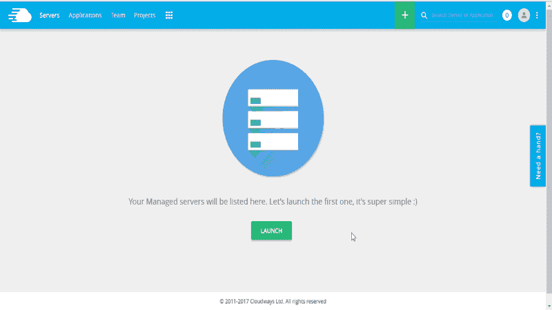
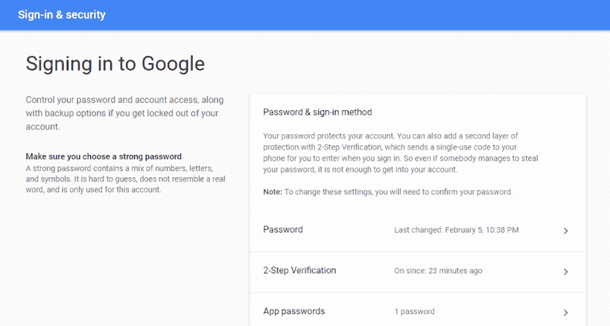
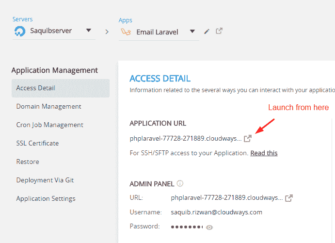
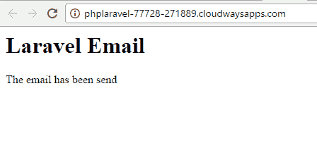
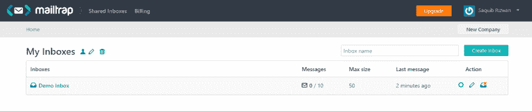
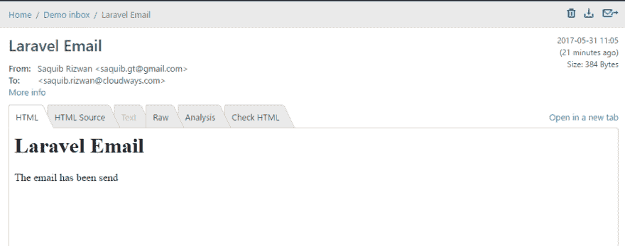
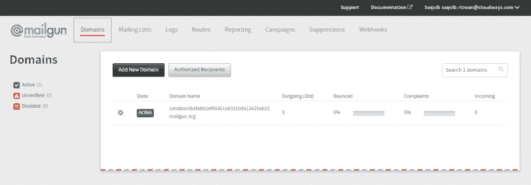
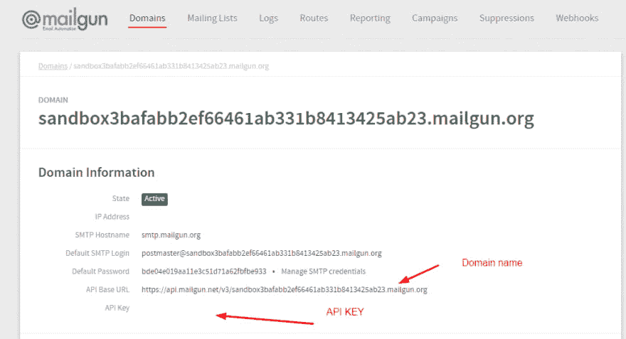
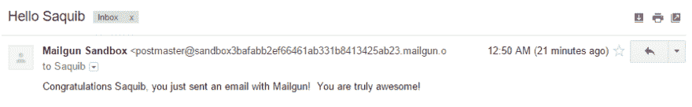

# 如何在 Laravel 使用不同的电子邮件服务提供商发送电子邮件

> 原文:[https://dev . to/rizwan _ saquib/how-to-send-email-using-different-email-service-providers-in-laravel-9a 1](https://dev.to/rizwan_saquib/how-to-send-email-using-different-email-service-providers-in-laravel-9a1)

Laravel 已经成为 PHP 项目开发的热门选择，因为它提供了许多以开发人员为中心的功能，如身份验证、队列、cron 作业、电子邮件等。

为了提供与电子邮件相关的功能，Laravel 提供了邮件功能，允许开发人员通过本地或基于云的服务发送电子邮件。

利用电子邮件功能的最高效和最有效的方式是使用电子邮件服务，而不是手动发送电子邮件。在这篇文章中，我将解释如何在 Laravel 中使用 Mailable 函数发送电子邮件。我还将详细解释如何设置第三方电子邮件服务提供商，以增强 Laravel 中的电子邮件功能。

如果你是 Laravel 新手，可以看看[Laravel 5.4](https://www.cloudways.com/blog/install-laravel-5-4-localhost/)入门，以及[路由](https://www.cloudways.com/blog/routing-in-laravel-5-4/)、[控制器](https://www.cloudways.com/blog/controllers-middleware-laravel-5-4/)、[模型和视图](https://www.cloudways.com/blog/models-views-laravel-5-4/)介绍。

## 安装 Laravel

我将从在 Cloudways 服务器上安装一个 Laravel 应用程序开始。这个过程的好处在于，只需点击几下鼠标，就可以在云服务器上部署一个实时应用程序。

[T2】](https://res.cloudinary.com/practicaldev/image/fetch/s---lI95a5W--/c_limit%2Cf_auto%2Cfl_progressive%2Cq_66%2Cw_880/http://www.cloudways.com/blog/wp-content/uploads/Laravel_landing-2.gif)

## 创建邮件

为了设置基本的 Laravel 邮件功能，我将使用 **php artisan 命令**。在终端中键入以下命令:

```
php artisan make:mail <name of mailable> 
```

<svg width="20px" height="20px" viewBox="0 0 24 24" class="highlight-action crayons-icon highlight-action--fullscreen-on"><title>Enter fullscreen mode</title></svg> <svg width="20px" height="20px" viewBox="0 0 24 24" class="highlight-action crayons-icon highlight-action--fullscreen-off"><title>Exit fullscreen mode</title></svg>

这将创建可邮寄的类。接下来，进入 **app/Mail** ，打开可邮寄文件。该类的默认代码如下:

```
<?php

namespace App\Mail;

use Illuminate\Bus\Queueable;

use Illuminate\Mail\Mailable;

use Illuminate\Queue\SerializesModels;

use Illuminate\Contracts\Queue\ShouldQueue;

class mailme extends Mailable

{

   use Queueable, SerializesModels;

   /**

    * Create a new message instance.

    *

    * @return void

    */

   public function __construct()

   {

       //

   }

   /**

    * Build the message.

    *

    * @return $this

    */

   public function build()

   {

       return $this->view('view.name');

   }

}

Now add the following code in the **build **function: 

 public function build()

   {

$address = 'saquibrizwan@xyz.com';

       $name = 'Saquib Rizwan';

       $subject = 'Laravel Email';

       return $this->view('emails.mailme')

       ->from($address, $name) 

       ->subject($subject);

 } 
```

<svg width="20px" height="20px" viewBox="0 0 24 24" class="highlight-action crayons-icon highlight-action--fullscreen-on"><title>Enter fullscreen mode</title></svg> <svg width="20px" height="20px" viewBox="0 0 24 24" class="highlight-action crayons-icon highlight-action--fullscreen-off"><title>Exit fullscreen mode</title></svg>

接下来，我将创建电子邮件模板。

## 创建邮件模板

现在转到**资源/视图**并创建一个名为**电子邮件**的新文件夹。该文件夹将包含电子邮件模板。在文件夹中，创建一个新文件【mailme.blade.php**和**并使用 HTML 标签创建电子邮件模板。

```
 <h1>Laravel Email</h1>

 <p>The email has been send</p> 
```

<svg width="20px" height="20px" viewBox="0 0 24 24" class="highlight-action crayons-icon highlight-action--fullscreen-on"><title>Enter fullscreen mode</title></svg> <svg width="20px" height="20px" viewBox="0 0 24 24" class="highlight-action crayons-icon highlight-action--fullscreen-off"><title>Exit fullscreen mode</title></svg>

## 配置路线

我现在将配置触发电子邮件的路由。转到 **routes/web.php** 并粘贴以下代码:

```
 <?php

use App\Mail\mailme;

Route::get('/', function () {

    Mail::to('saquib.rizwan@xyz.com')->send(new mailme); 

    return view('emails.mailme');

}); 
```

<svg width="20px" height="20px" viewBox="0 0 24 24" class="highlight-action crayons-icon highlight-action--fullscreen-on"><title>Enter fullscreen mode</title></svg> <svg width="20px" height="20px" viewBox="0 0 24 24" class="highlight-action crayons-icon highlight-action--fullscreen-off"><title>Exit fullscreen mode</title></svg>

既然路由已经准备好了，我将研究发送电子邮件的不同电子邮件服务提供商的配置。

## Gmail 的配置

首先，登录你的 Gmail 账户。在**下我的账号>登录&** **安全>登录**到 Google，启用**两步验证**，然后生成 **app 密码**，

[T2】](https://res.cloudinary.com/practicaldev/image/fetch/s--uEFIM2Ny--/c_limit%2Cf_auto%2Cfl_progressive%2Cq_auto%2Cw_880/https://www.cloudways.com/blog/wp-content/uploads/image4-16.png)

现在使用**中的 app 密码。具有以下配置的 env** 文件:

```
 MAIL_DRIVER=smtp

MAIL_HOST=smtp.gmail.com

MAIL_PORT=587

MAIL_USERNAME= your.email@gmail.com

MAIL_PASSWORD= your.generated.app.password

MAIL_ENCRYPTION=tls 
```

<svg width="20px" height="20px" viewBox="0 0 24 24" class="highlight-action crayons-icon highlight-action--fullscreen-on"><title>Enter fullscreen mode</title></svg> <svg width="20px" height="20px" viewBox="0 0 24 24" class="highlight-action crayons-icon highlight-action--fullscreen-off"><title>Exit fullscreen mode</title></svg>

现在转到 Cloudways 平台，在免费 staging domain 的帮助下启动您的应用程序。

[T2】](https://res.cloudinary.com/practicaldev/image/fetch/s--1WjiXNR8--/c_limit%2Cf_auto%2Cfl_progressive%2Cq_auto%2Cw_880/https://www.cloudways.com/blog/wp-content/uploads/image8-11.png)

并且，您的电子邮件将被发送到您添加到路线中的电子邮件地址。

[T2】](https://res.cloudinary.com/practicaldev/image/fetch/s--NXqhicCn--/c_limit%2Cf_auto%2Cfl_progressive%2Cq_auto%2Cw_880/https://www.cloudways.com/blog/wp-content/uploads/image9-9.png)

## 邮件陷阱的配置

首先进入 [Mailtrap.io](https://mailtrap.io/) 。注册并创建您的帐户。登录后，您将看到您的控制面板。

[T2】](https://res.cloudinary.com/practicaldev/image/fetch/s--BZ7aY98N--/c_limit%2Cf_auto%2Cfl_progressive%2Cq_auto%2Cw_880/https://www.cloudways.com/blog/wp-content/uploads/image1-17-e1496322037716.png)

点击收件箱，获取您的用户名和密码。

[T2】](https://res.cloudinary.com/practicaldev/image/fetch/s--mprnE-1i--/c_limit%2Cf_auto%2Cfl_progressive%2Cq_auto%2Cw_880/https://www.cloudways.com/blog/wp-content/uploads/image3-16.png)

现在在**中使用这些凭证。具有以下配置的 env** 文件:

```
 MAIL_DRIVER="smtp"

MAIL_HOST="mailtrap.io"

MAIL_PORT=2525

MAIL_USERNAME= your.mailtrap.user

MAIL_PASSWORD= your.mailtrap.pass

MAIL_ENCRYPTION=null 
```

<svg width="20px" height="20px" viewBox="0 0 24 24" class="highlight-action crayons-icon highlight-action--fullscreen-on"><title>Enter fullscreen mode</title></svg> <svg width="20px" height="20px" viewBox="0 0 24 24" class="highlight-action crayons-icon highlight-action--fullscreen-off"><title>Exit fullscreen mode</title></svg>

现在转到 Cloudways 平台并启动您的应用程序。您的电子邮件将被发送到您的邮箱收件箱。

[T2】](https://res.cloudinary.com/practicaldev/image/fetch/s--AXeeycpX--/c_limit%2Cf_auto%2Cfl_progressive%2Cq_auto%2Cw_880/https://www.cloudways.com/blog/wp-content/uploads/image7-10.png)

## 为电子枪配置

前往[Mailgun.com](https://www.mailgun.com/)，注册并创建您的帐户。登录后，您将被重定向到您的仪表板。

[T2】](https://res.cloudinary.com/practicaldev/image/fetch/s--ePmBRNAy--/c_limit%2Cf_auto%2Cfl_progressive%2Cq_auto%2Cw_880/https://www.cloudways.com/blog/wp-content/uploads/image2-18.png)

[T2】](https://res.cloudinary.com/practicaldev/image/fetch/s--Mihmpo6h--/c_limit%2Cf_auto%2Cfl_progressive%2Cq_auto%2Cw_880/https://www.cloudways.com/blog/wp-content/uploads/image5-12.png)

我将使用**中的域和 API 键。env** 文件并添加以下行:

```
MAIL_DRIVER="mailgun"

MAILGUN_DOMAIN=https://api.mailgun.net/v3/sandbox3bafabb2ef66461ab331b8413425ab23.mailgun.org

MAILGUN_SECRET= your_api_key 
```

<svg width="20px" height="20px" viewBox="0 0 24 24" class="highlight-action crayons-icon highlight-action--fullscreen-on"><title>Enter fullscreen mode</title></svg> <svg width="20px" height="20px" viewBox="0 0 24 24" class="highlight-action crayons-icon highlight-action--fullscreen-off"><title>Exit fullscreen mode</title></svg>

现在转到* * routes/web . PHP * *并添加以下代码:

```
 require '../vendor/autoload.php';

use Mailgun\Mailgun;

$mgClient = new Mailgun('your.api.key');

$domain = "sandbox3bafabb2ef66461ab331b8413425ab23.mailgun.org";

# Make the call to the client.

$result = $mgClient->sendMessage("$domain",

          array('from'    => 'Mailgun Sandbox <postmaster@sandbox3bafabb2ef66461ab331b8413425ab23.mailgun.org>',

                'to'      => 'Saquib <saquib.rizwan@xyz.com>',

                'subject' => 'Hello Saquib',

                'text'    => 'Congratulations Saquib, you just sent an email with Mailgun!  You are truly awesome! ')); 
```

<svg width="20px" height="20px" viewBox="0 0 24 24" class="highlight-action crayons-icon highlight-action--fullscreen-on"><title>Enter fullscreen mode</title></svg> <svg width="20px" height="20px" viewBox="0 0 24 24" class="highlight-action crayons-icon highlight-action--fullscreen-off"><title>Exit fullscreen mode</title></svg>

最后，在终端中进入应用程序的根目录，执行下面的命令:

```
composer require mailgun/mailgun-php php-http/guzzle6-adapter php-http/message 
```

<svg width="20px" height="20px" viewBox="0 0 24 24" class="highlight-action crayons-icon highlight-action--fullscreen-on"><title>Enter fullscreen mode</title></svg> <svg width="20px" height="20px" viewBox="0 0 24 24" class="highlight-action crayons-icon highlight-action--fullscreen-off"><title>Exit fullscreen mode</title></svg>

就是这样。转到 Cloudways 平台，使用免费的 staging domain 启动您的应用程序，电子邮件将发送到您指定的电子邮件地址。

[T2】](https://res.cloudinary.com/practicaldev/image/fetch/s--S87BPV7r--/c_limit%2Cf_auto%2Cfl_progressive%2Cq_auto%2Cw_880/https://www.cloudways.com/blog/wp-content/uploads/image6-13.png)

## 结论

在本文中，我演示了如何使用 Laravel mailable 向不同的电子邮件服务提供商发送电子邮件。如果你需要代码方面的帮助或者想加入讨论，请在下面留下评论。

注意:要在数字海洋服务器上免费托管您的 Laravel 应用程序 2 个月，[在 Cloudways 注册](https://platform.cloudways.com/signup)，并使用优惠券代码**“PHP 15”。**