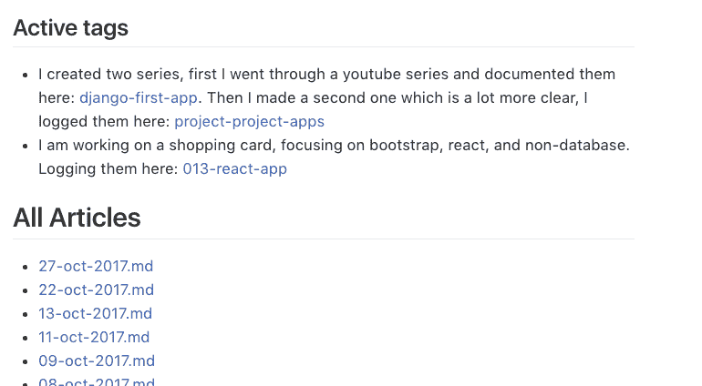

# 用 git wiki 代替 evernote 来组织个人内容

> 原文:[https://dev . to/aurelkurtula/using-git-wiki-而不是-evernote-to-organize-personal-content-e9d](https://dev.to/aurelkurtula/using-git-wiki-instead-of-evernote-to-organize-personal-content-e9d)

在阅读了 joo Cerqueira 关于他如何推荐使用 Github 组织你的生活的帖子后，我想，“是的，我不是唯一一个看到版本控制对内容而不是代码的好处的人。

我的问题是我从来不满意我整理笔记的方式。我有列表、书籍引用、代码注释，以及 evernote 等工具所针对的各种内容。

evernote 的麻烦在于，我发现它很丑！在那个编辑器里看我自己的内容让我分心。更不用说它不能处理代码和降价。

如果你想知道，我尝试了其他解决方案。在 mac 上有一个漂亮的编辑器叫做 [Ulyssesapp](https://ulyssesapp.com/) ，它带我走了很远，但它缺乏细致组织的能力。我也运行了一段时间的本地博客，但是我添加的内容越多，速度就越慢。

现在我用 gitlab 的维基页面。我确信它就像 github 的 wiki 页面一样，我使用 gitlab 是因为它有无限的免费私有库。

这些页面基本上是 markdown 文件，当被推送到远程存储库时，它们被读取为 html。

## 自动生成页面

[T2】](https://res.cloudinary.com/practicaldev/image/fetch/s--39PN3hKj--/c_limit%2Cf_auto%2Cfl_progressive%2Cq_auto%2Cw_880/https://thepracticaldev.s3.amazonaws.com/i/dau8bevxalc03sev1w0y.png)

受 jekyll 等静态网站生成器的启发，我用 node 创建了自己的小生成器。以上是主页的一个片段，文章的链接都是自动生成的。在终端中，我键入以下代码片段

```
npm start -- "post title" tags1 tag2 
```

并且在具有第一标签的名称的文件夹中创建降价页面。此外，还会为每个标签创建一个页面(如果不存在)，并添加一个指向新页面的链接。

然后我跑了

```
npm run build 
```

它获取所有页面并添加一个指向主页的引用链接。

最终的结果是一个博客/维基百科风格的私人网站，我可以从任何电脑访问。

主要好处是:

1.  我用我喜欢的编辑器写我的内容。用很少的包，崇高的文本写降价内容是真正崇高的。
2.  功能随着我自己的需求而增长。我最近增加了创建子文件夹的功能，或者说我如何把它们看作子博客。
3.  甚至在线编辑也是令人愉快的。如果我不在，并且没有克隆回购的能力，可以在浏览器上编辑维基页面。它没有增加多少价值，但它是一个奖金。

## 最后，代码

你可以在 [github](https://github.com/aurelkurtula/wiki-generator) 上看到我的简单解决方案。我不愿意分享这个，因为现在看着它，代码有点乱。

这些命令有点不同，因为文件名对您来说是唯一的，但是如果您选择使用它，请阅读`readme.md`文件，这非常简单。您所需要的就是在您的机器上安装节点。

既然它是公开的，我将在某个时候重构整个东西