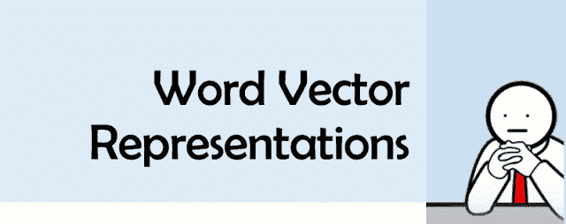
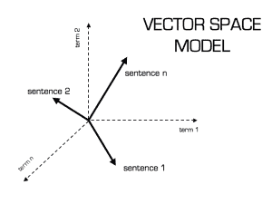
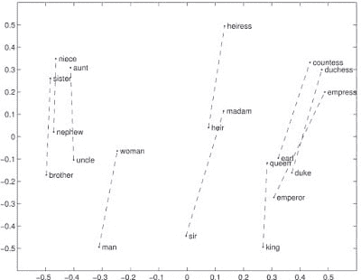

# 单词矢量化-Word2Vec

> 原文:[https://dev.to/japneet121/word-vectorization-word 2 vec-177](https://dev.to/japneet121/word-vectorization--word2vec-177)

[T2】](https://3.bp.blogspot.com/-EzGSSDTyxq4/Wff7sYIW3iI/AAAAAAAAB5c/NRsslGTJlb8qZBxZKVZGFI0lsOS0eu1sACLcBGAs/s1600/cropped.png)

## 介绍

随着对从事该领域工作的专业人员的需求不断增加，机器学习已经成为数据行业最热门的话题。

在互联网和世界各地的巨型服务器中存在大量的文本数据。

只是为了一些事实

*   每天有 120.96 万新数据产生社交媒体用户。*   每天 6.56 亿条推文！*   每天有超过 400 万小时的内容上传到 Youtube，用户每天观看 59.7 亿小时的 Youtube 视频。*   每天上传 6730.56 万条 Instagram 帖子*   脸书每月活跃用户超过 20 亿，而 2015 年初为 14.4 亿，2016 年初为 16.5 亿。*   截至 2017 年 6 月，脸书平均每天有 13.2 亿活跃用户*   每天发布 43 亿条脸书消息！*   每天有 57.5 亿个脸书喜欢。*   每天发送 220 亿条短信。*   2017 年每天 52 亿次谷歌搜索。

## 需要矢量化

[](https://2.bp.blogspot.com/-g-5dcPNryNE/Wff5k_l_JCI/AAAAAAAAB5U/D4W2kDJ5MjEgDoU0I2WBhy7fsFpnkRz_QCEwYBhgL/s1600/vector_space1.png) The amount of textual data is massive, and the problem with textual data is that it needs to be represented in a format that can be mathematically used in solving some problem. In simple words, we need to get an integer representation of a word. There are simple to complex ways to solve this problem.   

### 解决这个问题最简单的方法之一是创建一个简单的从字到整数的映射。

```
#list of sentences to be vectorized
line="Hello this is a tutorial on how to convert the word in an integer format"

#dictionary to hold the words
word_list={}

#initialize the counter for assigning to different word
counter=0

#iterate over the words
for word in line:
 #check if the word is in dict
 if word not in word_list:
  word_list[word]=counter
  #update the counter
  counter+=1

```

这将为我们返回带有相应整数表示的单词字典。

### 获取这些数字的另一种方法是使用 TD-IDF

TF-IDF stands for term frequency-inverse document frequency which assigns some weight to the word based on the number of occurrences in the document also taking into consideration the frequency of the word in all the documents. This approach is better than the previous approach as it lowers the weight of the words that occur too often in all the sentences like 'a', 'the', 'as' etc and increases the weight of the words that can be important in a sentence. This is useful in the scenarios where we want to get the important words from all the documents . This approach is also used in topic modelling.  

### 第三种方法是 Word2VEC，这也是本文关注的重点

Word2vec 是一组相关的模型，用于产生所谓的单词嵌入。这些模型是浅层的两层神经网络，被训练来重建单词的语言上下文。

经过训练后，word2vec 模型可以用于将每个单词映射到一个通常包含数百个元素的向量，这些元素代表该单词与其他单词的关系。这个向量是神经网络的隐藏层。

Word2vec 依赖于跳跃式语法或连续单词包(CBOW)来创建神经单词嵌入。它是由谷歌的托马斯·米科洛夫领导的研究小组创造的。该算法随后被其他研究人员分析和解释。

幸运的是，如果你想在你的工作中使用这个模型，你不必写这些算法。Gensim 是 Python 中的一个库，它具有文本处理和自然语言处理所需的一些令人敬畏的特性。在本文的其余部分，我们将学习使用这个棒极了的库进行单词矢量化。

[](https://2.bp.blogspot.com/-TCovoMhSwL4/Wff5lGQa45I/AAAAAAAAB5U/hK1zJ-FDlhElm5YqFxwrkEmO-KcfpSUIQCEwYBhgL/s1600/man_woman.jpg)

#### 安装 Gensim

```
pip install --upgrade gensim
```

It has three major dependencies

*   计算机编程语言
*   NumPy
*   我的天啊

确保在安装 gensim 之前安装依赖项。

让我们来看看代码。

#### 文本预处理:

在这一步中，我们将对文本进行预处理，如删除停用词、对词进行词条归类等。

您可以根据自己的需求执行不同的步骤。

我将使用 nltk 停用词语料库来移除停用词，并使用 nltk 词词条化来查找词条。

为了使用 nltk 语料库，您需要使用以下命令下载它。

 **T2】**

**下载文集**

```
import nltk
nltk.download()
#this will open a GUI from which you can download the corpus

```

**输入初始化**

```
#list of sentences to be vectorized
lines=["Hello this is a tutorial on how to convert the word in an integer format",
"this is a beautiful day","Jack is going to office"]
```

**Removing the Stop Words**

```
from nltk.corpus import stopwords
stop_words=set(stopwords.words('english'))

lines_without_stopwords=[]
#stop words contain the set of stop words
for line in lines:
 temp_line=[]
 for word in lines:
  if word not in stop_words:
   temp_line.append (word)
 string=' '
 lines_without_stopwords.append(string.join(temp_line))

lines=lines_without_stopwords

```

 **T2】**

**词汇化**

```
#import WordNet Lemmatizer from nltk
from nltk.stem import WordNetLemmatizer
wordnet_lemmatizer = WordNetLemmatizer()

lines_with_lemmas=[]
#stop words contain the set of stop words
for line in lines:
 temp_line=[]
 for word in lines:
  temp_line.append (wordnet_lemmatizer.lemmatize(word))
 string=' '
 lines_with_lemmas.append(string.join(temp_line))
lines=lines_with_lemmas

```

现在我们已经完成了文本的基本预处理。任何其他预处理工作都可以类似地完成。

### 准备输入

We have out input in the form of array of lines. In order for model to process the data we need covert our input to an array of array of words ( :\ ). <u>*Our Input*</u> lines=["Hello this is a tutorial on how to convert the word in an integer format", "this is a beautiful day","Jack is going to office"] <u>*New Input*</u> lines=[['Hello', 'this','tutorial', 'on', 'how','convert' ,'word',' integer','format'], ['this' ,'beautiful', 'day'],['Jack','going' , 'office']

```
new_lines=[]
for line in lines:
 new_lines=line.split('')
#new lines has the new format
lines=new_lines

```

### 构建 WORD2VEC 模型

Building a model with gensim is just a piece of cake .

```
#import the gensim package
model = gensim.models.Word2Vec(lines, min_count=1,size=2)

```

Here important is to understand the hyperparameters that can be used to train the model. Word2vec model constructor is defined as:

```
gensim.models.word2vec.Word2Vec(sentences=None, size=100, 
alpha=0.025, window=5, min_count=5, max_vocab_size=None, 
sample=0.001, seed=1, workers=3, min_alpha=0.0001, sg=0, 
hs=0, negative=5, cbow_mean=1, hashfxn=<built-in function hash>, 
iter=5, null_word=0, trim_rule=None, sorted_vocab=1,
batch_words=10000, compute_loss=False)
```

*sentence=* This is the input provided in the form of a list size= This defines the size of the vector we want to convert the word ('Hello'=[ ? , ? , ? ] if size=3) alpha= It is the initial learning rate (will linearly drop to min_alpha as training progresses). window= It is the maximum distance between the current and predicted word within a sentence. min_count= ignore all words with total frequency lower than this. max_vocab_size = limit RAM during vocabulary building; if there are more unique words than this, then prune the infrequent ones. Every 10 million word types need about 1GB of RAM. Set to None for no limit (default). sample = threshold for configuring which higher-frequency words are randomly downsampled; default is 1e-3, useful range is (0, 1e-5). workers = use this many worker threads to train the model (=faster training with multicore machines). hs = if 1, hierarchical softmax will be used for model training. If set to 0 (default), and negative is non-zero, negative sampling will be used. negative = if > 0, negative sampling will be used, the int for negative specifies how many “noise words should be drawn (usually between 5-20). Default is 5\. If set to 0, no negative sampling is used. cbow_mean = if 0, use the sum of the context word vectors. If 1 (default), use the mean. Only applies when cbow is used. hashfxn = hash function to use to randomly initialize weights, for increased training reproducibility. The default is Python’s rudimentary built-in hash function. iter = number of iterations (epochs) over the corpus. Default is 5. trim_rule = vocabulary trimming rule specifies whether certain words should remain in the vocabulary, be trimmed away, or handled using the default (discard if word count < min_count). Can be None (min_count will be used), or a callable that accepts parameters (word, count, min_count) and returns either utils.RULE_DISCARD, utils.RULE_KEEP or utils.RULE_DEFAULT. Note: The rule, if given, is only used to prune vocabulary during build_vocab() and is not stored as part of the model. sorted_vocab = if 1 (default), sort the vocabulary by descending frequency before assigning word indexes. batch_words = target size (in words) for batches of examples passed to worker threads (and thus cython routines). Default is 10000\. (Larger batches will be passed if individual texts are longer than 10000 words, but the standard cython code truncates to that maximum.)

### 使用模型

```
#saving the model persistence
model.save('model.bin')

#loading the model
model = gensim.models.KeyedVectors.load_word2vec_format('model.bin', binary=True) 

#getting the most similar words
model.most_similar(positive=['beautiful', 'world'], negative=['convert'], topn=1)

#finding the odd one out
model.doesnt_match("bullish holding stock".split())

#getting the vector for any word
model[word]

#finding the similarity between words
model.similarity('woman', 'man')

```

For more details, you can read the documentation of the word2vec  gensim [here](https://radimrehurek.com/gensim/models/word2vec.html).