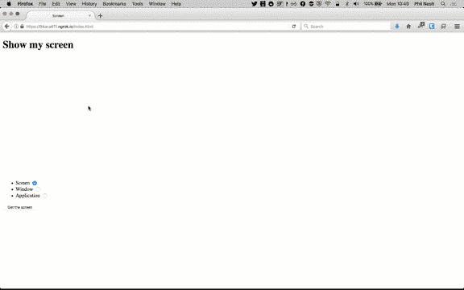
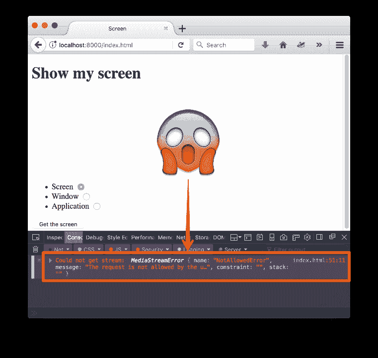
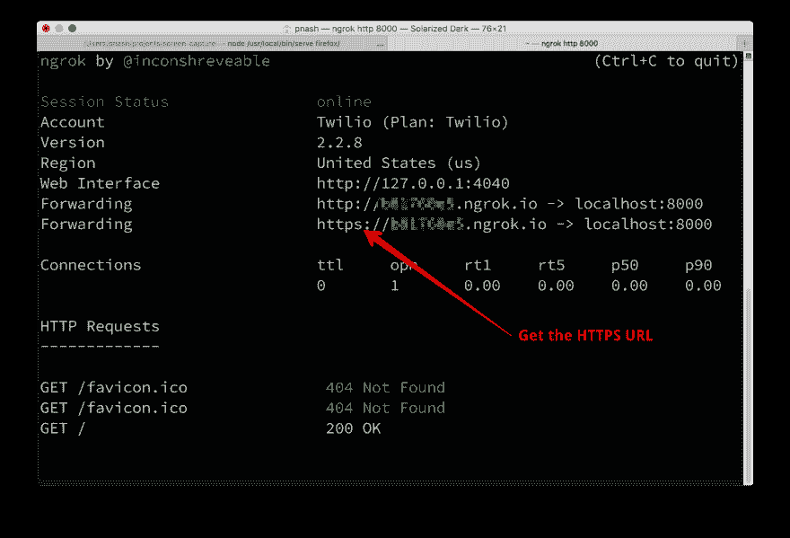

# Firefox 中的屏幕截图

> 原文：<https://dev.to/twilio/screen-capture-in-firefox-bma>

屏幕共享是一个非常有用的功能，您可以将其嵌入视频聊天中。我们最近看到了如何使用 Chrome 来[捕捉屏幕。只在一个浏览器中支持不是很有趣，所以你会很高兴听到我们也可以在 Firefox 中访问屏幕捕捉。让我们看看怎么做。](https://dev.to/philnash/screen-capture-in-google-chrome-bjo)

[T2】](https://res.cloudinary.com/practicaldev/image/fetch/s--Qgeabt2o--/c_limit%2Cf_auto%2Cfl_progressive%2Cq_auto%2Cw_880/https://twilioinc.wpengine.com/wp-content/uploads/2017/10/35W6m2ZumESuVdSSLjXF98mQa9KlVsOvsyE3ngL-u1B6sVtl-3PH75BOseLm0kkVbpT84xbsvYYuNDQNxXr122iHi4cXYuHX-QhVQQecmksKTvlE94YIrWgn6ZgRSCq3KcmNwwM.png)

## 你需要什么

*   [火狐](https://www.mozilla.org/firefox/)
*   文本编辑器
*   本地 web 服务器——我喜欢用 [servedir](https://www.npmjs.com/package/servedir) 来做这样的事情
*   为本地主机设置的 [ngrok](https://ngrok.com/) 或等效的隧道服务或 TLS 证书(我们稍后会看到原因)

## 屏幕截图

用 Chrome 为我们自己的应用程序实现屏幕捕捉并不简单，因为我们需要构建一个扩展。另一方面，Firefox 从版本 33 开始就支持屏幕捕捉，使用 [`mediaDevices` API](https://developer.mozilla.org/en-US/docs/Web/API/MediaDevices) 中的`mediaSource`约束。

然而，在 Firefox 版本 52 之前，你的网站需要在白名单中才能访问 Firefox 中的屏幕截图。在 Firefox 中打开 about:config，搜索“屏幕共享”，就可以看到谁在白名单中。

从 Firefox 版本 52 开始，该功能对 HTTPS 的所有站点都可用。你可以创建一个扩展来将你的站点添加到白名单中，但是当我写这篇文章的时候，Firefox 已经升级到了第 56 版，所以我们不会在这篇文章中探讨这个问题。

### 代码

要在 Firefox 中访问屏幕的媒体流，代码看起来有点像这样:

```
navigator.mediaDevices.getUserMedia({
  video: {
    mediaSource: 'screen'
  }
}).then(returnedStream => {
  // use the stream
}); 
```

Enter fullscreen mode Exit fullscreen mode

这与 Chrome 示例略有不同，在 Chrome 示例中，您可以传递一组潜在的源，包括“窗口”、“屏幕”或“标签”。在 Firefox 中，你一次只能从“屏幕”、“窗口”或“应用程序”中选择一个`mediaSource`。

为了探索这一切在 Firefox 中是如何工作的，让我们构建与 Chrome 相同的示例应用程序[，捕捉屏幕，然后在`<video>`元素中显示它。](https://dev.to/philnash/screen-capture-in-google-chrome-bjo)

## 建筑截屏

为这个项目创建一个新目录和一个名为`index.html`的文件。在这个例子中，所有的工作都在 HTML 中，所以这是您需要的唯一文件。

我们将使用与 [Chrome 示例](https://github.com/philnash/screen-capture/blob/master/chrome/index.html)相同的 HTML 结构，除了我们将添加一组单选按钮来选择我们想要的源。将以下内容添加到`index.html` :

```
<!DOCTYPE html>
<html lang="en">

<head>
  <meta charset="UTF-8">
  <meta name="viewport" content="width=device-width, initial-scale=1.0">
  <meta http-equiv="X-UA-Compatible" content="ie=edge">
  Screen
</head>

<body>
  <h1>Show my screen</h1>

  <video autoplay id="screen-view" width="50%"></video>
  <ul>
    <li>
      <label for="screen">Screen</label>
      <input type="radio" name="capture" id="screen" value="screen" checked>
    </li>
    <li>
      <label for="window">Window</label>
      <input type="radio" name="capture" id="window" value="window">
    </li>
    <li>
      <label for="application">Application</label>
      <input type="radio" name="capture" id="application" value="application">
    </li>
  </ul>
  <button id="get-screen">Get the screen</button>
  <button id="stop-screen" style="display:none">Stop the screen</button>

  <script>

  </script>
</body>
</html> 
```

Enter fullscreen mode Exit fullscreen mode

在`<script>`标签中，我们将从之前项目中已经有的一些代码开始。这段代码选择我们需要使用的视频和按钮元素，初始化一个`stream`变量，并设置一个监听器在“停止屏幕”按钮被按下时停止播放。

```
(() => {
  const video = document.getElementById('screen-view');
  const getScreen = document.getElementById('get-screen');
  const stopScreen = document.getElementById('stop-screen');
  let stream;

  // Fill in the rest here

  stopScreen.addEventListener('click', event => {
    stream.getTracks().forEach(track => track.stop());
    video.src = '';
    stopScreen.style.display = 'none';
    getScreen.style.display = 'inline';
  });
})(); 
```

Enter fullscreen mode Exit fullscreen mode

现在，当用户点击“获取屏幕”按钮时，我们将判断他们是否想要共享屏幕、窗口或应用程序，然后将其传递给`getUserMedia`。

```
 let stream;

  getScreen.addEventListener('click', event => {
    const mediaSource = document.querySelector('[name=capture]:checked').value;
    navigator.mediaDevices
      .getUserMedia({
        video: {
          mediaSource: mediaSource
        }
      });

  stopScreen.addEventListener('click', event => { 
```

Enter fullscreen mode Exit fullscreen mode

一旦我们访问了流，我们将它设置为视频对象的`src`，隐藏 get screen 按钮，并显示 stop screen 按钮。如果有错误，我们可以在`catch`函数中记录。

```
 navigator.mediaDevices
      .getUserMedia({
        video: {
          mediaSource: mediaSource
        }
      })
      .then(returnedStream => {
        stream = returnedStream;
        video.src = URL.createObjectURL(stream);
        getScreen.style.display = 'none';
        stopScreen.style.display = 'inline';
      })
      .catch(err => {
        console.error('Could not get stream: ', err);
      });
  }); 
```

Enter fullscreen mode Exit fullscreen mode

这就是我们需要的所有代码！让我们看看它的实际效果。

## 捕捉屏幕

要运行这个示例，我们需要从本地 web 服务器提供 HTML。我喜欢用 npm 模块 [servedir](https://www.npmjs.com/package/servedir) 来做这件事。如果你安装了 Node.js 和 npm，可以用:
安装

```
npm install servedir -g 
```

Enter fullscreen mode Exit fullscreen mode

然后，您可以使用命令行导航到保存您的`index.html`文件的目录，并通过输入:
在 localhost:8000 上提供它

```
serve . 
```

Enter fullscreen mode Exit fullscreen mode

如果您有另一种方法用于在本地主机上提供静态文件，您也可以使用这种方法。

设置你的网络服务器并在 Firefox 中打开它。点击“获取屏幕”按钮并…

[T2】](https://res.cloudinary.com/practicaldev/image/fetch/s--5-R78T1X--/c_limit%2Cf_auto%2Cfl_progressive%2Cq_auto%2Cw_880/https://twilioinc.wpengine.com/wp-content/uploads/2017/10/JVq-nCG0-p7v_U8jTUq64-5jHrklW6s7ROEOmOyz5l2ocSabEK9A_ptMxl8FNHlbKfdu5Ww5UOEE8Zpl32g3pIMf0Rct4r59vJTL-zYE8cidfqPPZqp2xFxK_WICYS57gHWpWNE.png)

***错误！*T3】**

### 哪里出了问题？

Firefox 实现的`mediaDevices` API 要求通过 HTTPS 提供站点访问屏幕截图，即使是在本地主机上。因为我们只是通过常规的 HTTP 连接加载站点，所以我们得到了一个错误。

要在本地解决这个问题，您可以生成一个自签名的 TLS 证书，并配置您的本地 web 服务器来使用它在 HTTPS 为站点提供服务。不过，有一个更简单的解决方案。我通常喜欢使用 ngrok 在本地测试 webhooks，但是它也可以给你一个 HTTPS URL 来测试你的应用程序。

为您服务的 HTML 端口启动 ngrok】

```
ngrok http 8000 
```

Enter fullscreen mode Exit fullscreen mode

获取 HTTPS 的网址，在 Firefox 中输入。

[T2】](https://res.cloudinary.com/practicaldev/image/fetch/s--cYv6zIqz--/c_limit%2Cf_auto%2Cfl_progressive%2Cq_auto%2Cw_880/https://twilioinc.wpengine.com/wp-content/uploads/2017/10/tyeZ426JDanyRT4_ZDm4mu251JlPldQc7DEzSOlCHjERV49zje46e8M3gHDiyW7YS-Xz__y6RUmISklFCXOJBUIbnnK7n3b1RjuEmT0syEtOKQv3J805Q1rsdt9Py0iqvn_hHzw.png)

现在按下“获取屏幕”按钮，您将能够访问屏幕并在页面上的`<video>`元素中看到它。您还可以探索在选择您想要捕捉的媒体时，“屏幕”、“窗口”和“应用程序”给你的结果。

[T2】](https://res.cloudinary.com/practicaldev/image/fetch/s--Qgeabt2o--/c_limit%2Cf_auto%2Cfl_progressive%2Cq_auto%2Cw_880/https://twilioinc.wpengine.com/wp-content/uploads/2017/10/35W6m2ZumESuVdSSLjXF98mQa9KlVsOvsyE3ngL-u1B6sVtl-3PH75BOseLm0kkVbpT84xbsvYYuNDQNxXr122iHi4cXYuHX-QhVQQecmksKTvlE94YIrWgn6ZgRSCq3KcmNwwM.png)

## 下一步

现在我们已经看到了 Chrome 和 Firefox 的截屏。如果你想要这两者的代码，请查看 GitHub repo 。

接下来，我们将看看如何使用我们在这两篇博文中看到的内容来提供一种跨两种浏览器访问屏幕截图的方法，并最终使用 [Twilio Video](https://www.twilio.com/docs/api/video) 完成一个屏幕共享应用程序。

你有一个有趣的浏览器截屏用例吗？在下面的评论中留下你的想法或任何问题。或者你也可以在推特上发微博到 [@philnash](https://www.twitter.com/philnash) ，或者发邮件到 philnash@twilio.com[。](mailto:philnash@twilio.com)

* * *

火狐中的 *[截屏最初发布于 2017 年 10 月 25 日](https://www.twilio.com/blog/2017/10/screen-capture-in-firefox.html) [Twilio 博客](https://www.twilio.com/blog)。*