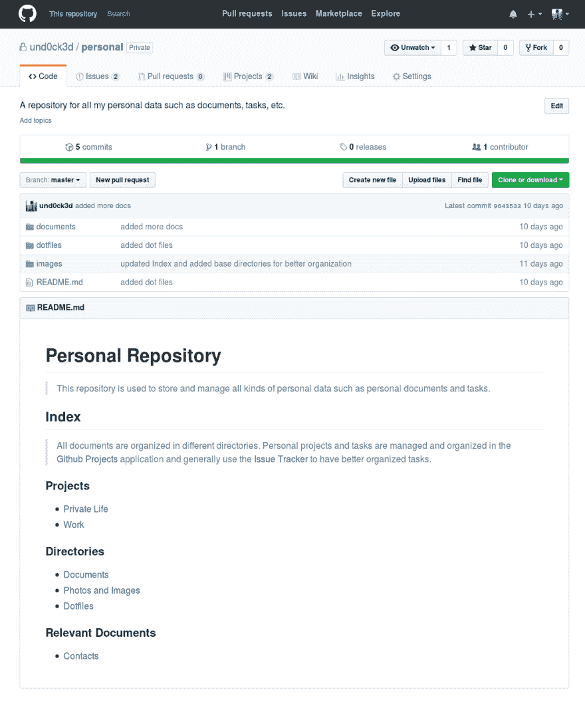
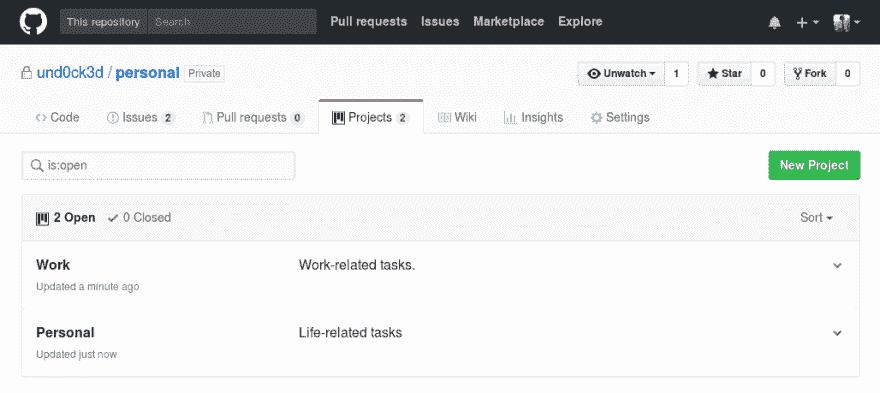

# 使用 Github 组织您的生活

> 原文：<https://dev.to/jpcs369/organizing-your-life-using-github-6an>

我是那种非常努力地自学变得有条理的人。这必须改变有利于恢复我的理智回来，有一天灯泡盘旋我的头继续。

# 这个问题

以前的一切都很混乱:任务和笔记写在松散的纸张或随机任务管理软件中，未接电话丢失在承诺要返回的信息中，文件和重要文档分散在无数不同的云存储服务中。恢复，一切都是黑暗的。

我尝试了很多软件，这些软件承诺简化我经历的恐惧，并实际上帮助我完成事情，不要忘记任何事情-但它们都失败了。大多数时候，这与软件本身无关，只是因为它们不适合我的工作方式。

# *多田*的时刻

我正处于崩溃的边缘，在 Github 的一个仓库中浏览一些问题，这时: *tada* ！突然间一切都清楚了。我已经在使用一个很棒的软件(Github)来管理我的项目代码、问题和必须完成的任务，为什么不把它应用到一个新的“项目”中:我的个人生活！

# 我是怎么做到的

基本上，我所做的是将我们(开发人员)已经在 Github 上用于项目管理和组织的概念应用到我的个人生活中。因此，我不会用一个存储库来存储和跟踪我的代码，而是用它来存储和跟踪任何重要的文档、图片和其他我不能丢失的随机文件。

在建立了我命名为`personal`的新的*私有*存储库之后，这非常简单，并且立即显示出优势。最引人注目的一次是在我给它输入重要文档后，我去我自己的另一台笔记本电脑上克隆了这个库。在大约 5 秒钟内，我在两台机器上“同步”了我的文档，安全地保存在一个私有的 Github 存储库中，并且可以在 Github 界面和我亲爱的终端上使用臭名昭著的`git`工具轻松管理。

[T2】](https://res.cloudinary.com/practicaldev/image/fetch/s--btzwZGP4--/c_limit%2Cf_auto%2Cfl_progressive%2Cq_auto%2Cw_880/https://thepracticaldev.s3.amazonaws.com/i/ce54ehzk6q4h28iato02.png)

这是开始实现一个更好的组织的第一步，但是仍然缺少一件事:我还必须跟踪我的个人和专业任务(专业=自由职业/开源项目，而不是特定于组织的项目)。

为了实现这一点，我在这个存储库上启用了“Github 项目”特性，并启动了两个项目:“个人”和“个人工作”(购物、支付账单等)。)和具体工作(给客户打电话、回复电子邮件、评论一个专题等等。)任务分别。

[T2】](https://res.cloudinary.com/practicaldev/image/fetch/s--VOHRl9qm--/c_limit%2Cf_auto%2Cfl_progressive%2Cq_auto%2Cw_880/https://thepracticaldev.s3.amazonaws.com/i/qxt7esvbr3789erh3g66.png)

每个项目有 4 个基本栏来放置任务:

1.  待办事项——我可能还没有决定要做的事情，或者还没有考虑如何去做的事情；
2.  要做的事情——我必须做并且准备好开始做的事情，或者我正在等待第三方的反馈来继续做下去；
3.  进展中-我现在正在做的事情。
4.  我已经完成的事情，可以安全地存档，有时会忘记。

任务本身是简单的“卡片”或完整详细的问题(对于需要额外信息的更重要/复杂的事情)。

现在我把所有的(文件和任务)都放在了一个我喜欢的地方！好多了！当然，我有时仍然会在纸上或智能手机的 notes 应用程序上写任务和笔记，但是我对自己做出了承诺，只要我打开笔记本电脑，立即在 Github 上浏览任务/笔记，进入相应的项目。

除了这两个基础项目，你还可以自由地创建越来越多的项目，使组织更加清晰和简单。例如，想象你从一个城市搬到另一个城市，有很多事情你必须做，其中大多数都很重要，以避免未来的头痛。你可以创建一个新的“移动到 X 地方”项目和一个相应的里程碑(在问题跟踪上)来跟踪这个过程，不要错过任何事情。

我猜已经有人在用类似于我现在用 Github 做的方式做“自我管理”,但是由于我还没有在网上看到任何类似的经历，我想与他人分享这一点可能会很有趣，也许可以得到一些关于这个“系统”的反馈或改进它的建议。

希望你喜欢！不要忘记，例如，我组织任务的方式是针对我个人的使用案例的，当然不适合每个人的需求。你仍然可以根据自己的组织方式来调整它，让这个系统更好地为自己服务。

感谢 Github，再次拯救了我！