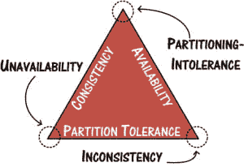

# 收获、产量和可扩展的耐受系统:综述

> 原文:[https://dev . to/shubheksha/harvest-yield-and-scalable-tolerant-systems-a-summary-256](https://dev.to/shubheksha/harvest-yield-and-scalable-tolerant-systems-a-summary-256)

[T2】](https://res.cloudinary.com/practicaldev/image/fetch/s--uLj5yGQY--/c_limit%2Cf_auto%2Cfl_progressive%2Cq_auto%2Cw_880/https://cdn-images-1.medium.com/max/300/0%2APlLhXyx7tBvL4fVm.png)

这篇文章提供了埃里克·布鲁尔&阿曼多·福克斯在 1999 年发表的论文“[收获、产量和可扩展的耐受系统](https://pdfs.semanticscholar.org/5015/8bc1a8a67295ab7bce0550886a9859000dc2.pdf)的摘要。

本文讨论了大型系统的一致性和可用性之间的权衡。指向 CAP 并断言任何系统都不可能具有一致性和可用性是非常容易的。然而，有一个问题。CAP 被误解的方式多种多样。正如 Coda Hale 在他出色的博客文章“[中解释的那样，你不能牺牲分区容忍度](https://codahale.com/you-cant-sacrifice-partition-tolerance/):

> 在 CAP 定理的一致性、可用性和分区容差中，分区容差在分布式系统中是强制性的。你不能选择它。你应该从*产出*(成功响应请求的百分比)和*收获*(实际包含在响应中的所需数据的百分比)的角度考虑你的可用性，以及当故障发生时，你的系统将牺牲这两者中的哪一个。

本文的重点是通过容错、包容和隔离来提高大规模系统的可用性。

本文的重点是通过容错、包容和隔离来提高大规模系统的可用性。

> 我们假设客户端向服务器发出查询，在这种情况下，至少有两个衡量正确行为的指标:yield(完成请求的概率)和 harvest(测量响应中反映的数据部分，即查询答案的完整性)。

两个指标**收获**和**产量**可以总结如下:

*   **收获**:响应数据/总数据

*示例*:如果 100 个节点的集群中有一个节点发生故障，那么在故障持续期间的收获率为 99%。

*   **产出**:成功完成的请求/请求总数

*注意*:产量不同于正常运行时间。Yield 专门处理请求的数量，而不仅仅是系统无法响应请求的时间。

该论文认为，虽然有某些系统要求每次对查询做出完美的响应，但也有一些系统可以偶尔容忍不完美的回答。为了提高我们系统的整体可用性，我们需要仔细考虑它需要提供的一致性和可用性保证。

#### 以收获换取产量——概率可用性

> 几乎所有的系统都是概率性的，不管它们是否意识到这一点。特别是，任何在单一故障下 100%可用的系统在总体上可能是可用的(因为多重故障的概率不为零)

福克斯和布鲁尔谈论理解可用性的概率性质。这有助于通过决定什么需要可用以及系统可以处理什么类型的故障来理解和限制故障的影响。

它们概述了在多个节点故障的情况下 harvest 的线性降级。收获与正常运行的节点数量成正比，因此呈线性减少/增加。提出了两种提高产量的策略:

1.  节点上数据的随机分布。如果其中一个节点发生故障，一般情况和最坏情况下的故障行为都不会改变。相反，如果分布不是随机的，那么根据数据的类型，故障的影响可能是可变的。例如，如果只有一个节点存储了与用户帐户余额相关的信息，而它崩溃了，整个银行系统将无法工作。
2.  复制最重要的数据。这降低了包含高优先级数据子集的节点之一出现故障时的影响，还提高了收获率。

论文中的另一个值得注意的观察是，虽然复制所有数据是可能的，但这并不能提高你的收获/产量，反而会大大增加运营成本。这是因为互联网是基于尽力而为的协议工作的，这种协议永远不能保证 100%的收获/收益。

#### 应用分解和正交机制

第二个策略关注正交系统设计的好处。它首先指出，大型系统是由独立的子系统组成的，这些子系统不能容忍故障，但在某种程度上允许整个系统继续运行，并对公用事业产生一些影响。

> 实际的好处是能够分别提供每个子系统的状态管理，只为需要的子系统而不是整个应用程序提供强一致性或持久状态。如果只有几个小的子系统需要额外的复杂性，那么节省可能是显著的。

该论文指出，正交组件是完全相互独立的，除了一个配置接口之外，没有与其他组件的运行时接口。这允许每个单独的组件独立地发生故障，从而最小化其对整个系统的影响。

> 正交子系统的组合将检查可能有害的交互的负担从运行时转移到了编译时，并且正交防护机制的部署通过提供改进的故障遏制来提高对于确实发生的运行时交互的健壮性。

总的来说，本文的目标是激励容错和高可用性大规模系统设计领域的研究。此外，要仔细考虑应用程序需要提供的一致性和可用性保证，以及它能够在收获和产出之间做出的权衡。