# e 代表所有地方

> 原文：<https://dev.to/rpalo/e-for-everywhere-1c1>

我刚刚学到了一些新东西，这促使我想要分享它(以及一大堆其他的东西)。先说字母`e`。这篇文章会有一点点数学(可能很多)，但我会尽量让这些部分不那么痛苦，让你和我在一起。

## e

`e`是一个数学常数(像`pi`)，它出现在很多地方。

[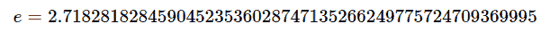T2】](https://res.cloudinary.com/practicaldev/image/fetch/s--EOumoon8--/c_limit%2Cf_auto%2Cfl_progressive%2Cq_auto%2Cw_880/https://thepracticaldev.s3.amazonaws.com/i/7p57dxtjd994aq62bda7.png)

和`pi`一样，它是一个*无理数*的数，意思是它的小数位数永远不会结束，永远不会重复(进入无限循环)。

[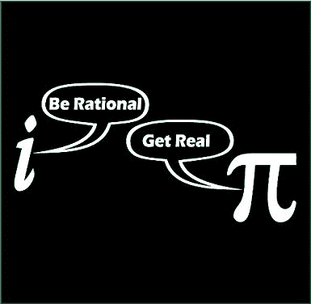T2】](https://res.cloudinary.com/practicaldev/image/fetch/s--mN_YvQeI--/c_limit%2Cf_auto%2Cfl_progressive%2Cq_auto%2Cw_880/https://thepracticaldev.s3.amazonaws.com/i/bdfpne7k15dqlh3mkqnt.jpg)

*“布拉布拉布拉，”*你说——雄辩地，我可能会补充。*“我听到的都是废话，什么数学字母，什么数字。你为什么拿这个`e`来烦我？”*

我想告诉你这件事，因为，尽管它没有得到`pi`所得到的那种压力(更不用说`phi` -黄金比例)，但它出现在你所看到的任何地方，并在各种统计、金融和更多方面帮助我们！我写这篇文章是为了展示`e`在幕后工作的几种方式。

## 有趣而实用的东西

先说**兴趣**。比如银行利息！喜欢投资股票利息。你想过这是怎么算出来的吗？这是利息等式:

[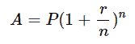T2】](https://res.cloudinary.com/practicaldev/image/fetch/s--OfdI7BY2--/c_limit%2Cf_auto%2Cfl_progressive%2Cq_auto%2Cw_880/https://thepracticaldev.s3.amazonaws.com/i/icpdivfe0hu680vfi2qk.png)

其中:

```
A is the future value of your money.

P is the present value of your money.

r is the interest rate over the time period you care about (usually a year, in practice).

n is the number of times you compound your interest over the time period. 
```

Enter fullscreen mode Exit fullscreen mode

例如，如果你将 100 美元存入银行一年，银行在此期间提供 7%(或. 07%)的利率，*和*银行只给你复利一次(他们有时会这么做)，一年后，你会得到:

[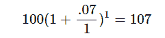T2】](https://res.cloudinary.com/practicaldev/image/fetch/s--mXBC2TL6--/c_limit%2Cf_auto%2Cfl_progressive%2Cq_auto%2Cw_880/https://thepracticaldev.s3.amazonaws.com/i/kr47he9ac7hh3sckflyn.png)

这是意料之中的，因为我们已经说过你的年利率是 7%，100 的 7%是 7，所以在年底得到 107 美元应该是合理的。

但是有的银行每个月给你复利！检查你的银行对账单——你的可能会这样做！那看起来像什么？

[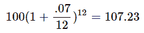T2】](https://res.cloudinary.com/practicaldev/image/fetch/s--ZMUimGJc--/c_limit%2Cf_auto%2Cfl_progressive%2Cq_auto%2Cw_880/https://thepracticaldev.s3.amazonaws.com/i/hci73wi3nb7dgyz4mn64.png)

怎么了？你只需简单地每年做 12 次数学运算，而不是在期末做一次，就能得到额外的 0.23 美元。你怀疑地斜眼看着我，问道:“这种模式还会继续吗？”来试试吧！一天复合一次吧。

[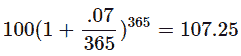T2】](https://res.cloudinary.com/practicaldev/image/fetch/s--ZpTUeOr6--/c_limit%2Cf_auto%2Cfl_progressive%2Cq_auto%2Cw_880/https://thepracticaldev.s3.amazonaws.com/i/8oc864z60nk0yp9949iv.png)

没错。算是吧。肯定没有这么多的增长，我们正在复合 waaaay 更多。让我们真正放大复利，看看会发生什么。

实际上，让我们先简化一下我们的生活，让数学变得简单一些:

1.  假设我们从 1 美元开始。
2.  假设我们的利率是 100%(即 1)。因此，每年复合，我们会加倍我们的钱。

现在让我们看看我们的模式是什么样的。

```
r = 1.0
p = 1.0

def compound(p, r, n):
    """Calculates interest after one time period (e.g. a year).
    p: float - initial money amount
    r: float - interest rate over the time period
    n: int - number of times we compound
    returns float - amount of money after one time period
    """
    return p*((1 + r/n)**n)

result_data = [compound(p, r, n) for n in range(1, 100)] 
```

Enter fullscreen mode Exit fullscreen mode

```
from matplotlib import pyplot as plt
plt.plot(result_data)
plt.show() 
```

Enter fullscreen mode Exit fullscreen mode

[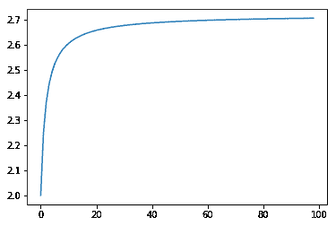T2】](https://res.cloudinary.com/practicaldev/image/fetch/s--UGnY8asx--/c_limit%2Cf_auto%2Cfl_progressive%2Cq_auto%2Cw_880/https://assertnotmagic.com/img/e-interest.png)

你可以看到，用 1 个化合物，我们得到了 100%的回报，就像我们计划的那样。从 1 美元开始，到 2 美元结束。随着我们的复合越来越多，我们看到它上升了不少，然后增益开始持平。但是等等。收益稳定在多少？

```
from math import e
plt.plot((0, 100), (e, e))  # Plot horizontal line at 2.71828... plt.plot(result_data)
plt.show() 
```

Enter fullscreen mode Exit fullscreen mode

[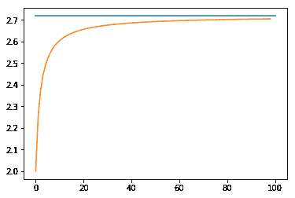T2】](https://res.cloudinary.com/practicaldev/image/fetch/s--WL1AM2yI--/c_limit%2Cf_auto%2Cfl_progressive%2Cq_auto%2Cw_880/https://assertnotmagic.com/img/e-interest-with-line.png)

哦，太棒了，是 e。随着复利频率越来越高，我们接近 e 的回报金额。这就是**连续复利**概念的来源。如果你想要更多的细节，少挥挥手，看看[这些幻灯片](https://www.ima.umn.edu/~tmlai/M119-Section16.pdf)。他们做得很好，慢慢地，简单地，用大量的例子解释事情。

所以我们找到了`e`一次。我们再来一次。

## 阶乘和 e

如果你读过我的其他博客文章，你可能已经厌倦了阶乘。啊，那太糟糕了。让我们把它们和分数结合起来，看看我们能得到什么。

[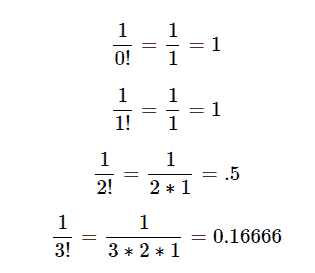T2】](https://res.cloudinary.com/practicaldev/image/fetch/s--TcwN_jej--/c_limit%2Cf_auto%2Cfl_progressive%2Cq_auto%2Cw_880/https://thepracticaldev.s3.amazonaws.com/i/077pf747bwvvu20jc8oh.png)

我要带着这个去哪里？我们把它们加起来看看。

```
from math import factorial

def sum_of_factorial_fractions(n):
    """Calculates the sum of 1/0! + 1/1! + 1/2! ... 1/n!"""
    return sum(1/factorial(x) for x in range(0, n + 1))

results2 = [sum_of_factorial_fractions(n) for n in range(10)]
plt.plot(results2)
plt.show()
print("The last result:", results2[-1]) 
```

Enter fullscreen mode Exit fullscreen mode

[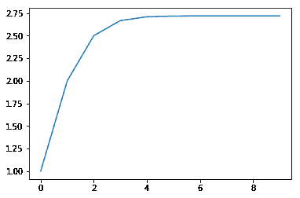T2】](https://res.cloudinary.com/practicaldev/image/fetch/s--6hHPfAct--/c_limit%2Cf_auto%2Cfl_progressive%2Cq_auto%2Cw_880/https://assertnotmagic.com/img/e-factorials.png)

```
The last result: 2.7182815255731922 
```

Enter fullscreen mode Exit fullscreen mode

(a)在下列情况下:lsdkjfalkjsdfjsdlkfjeivlennvoiej。

### E

(大概)。

再来一个:我最喜欢的。

## 随机 E

这一张来自推特上的费马图书馆。在 0 和 1 之间选择一个随机数。继续挑选数字并把它们相加，直到总和大于 1。比如:

```
from random import random
x = random()
print(x) 
```

Enter fullscreen mode Exit fullscreen mode

```
0.185263666584764 
```

Enter fullscreen mode Exit fullscreen mode

```
x += random()
print(x) 
```

Enter fullscreen mode Exit fullscreen mode

```
0.5797470876977189 
```

Enter fullscreen mode Exit fullscreen mode

```
x += random()
print(x) 
```

Enter fullscreen mode Exit fullscreen mode

```
1.2821236982804123 
```

Enter fullscreen mode Exit fullscreen mode

好吧！我们现在大于 1，我们花了 3 次滚动才到达那里。让我们这样做一吨倍，看看平均卷数是多少。

```
def rolls_to_greater_than_n(n):
    """Rolls a random number between 0 and 1 and adds them up
    until the sum is greater than n.  Returns the number of rolls it took.
    """
    total = 0
    rolls = 0
    while total < n:
        total += random()
        rolls += 1
    return rolls

def roll_experiment_avg(n, times):
    """Performs the rolls_to_greater_than_n 'times' times.
    Returs the average number of rolls it took."""
    return sum(rolls_to_greater_than_n(n) for _ in range(times))/times

results3 = [roll_experiment_avg(1, x) for x in range(1, 10000)]
plt.plot(results3)
plt.plot((0, 10000), (e, e))  # Line representing e for reference. plt.show()
print("The last result was", results3[-1]) 
```

Enter fullscreen mode Exit fullscreen mode

[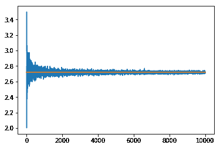T2】](https://res.cloudinary.com/practicaldev/image/fetch/s--y7A6FwV5--/c_limit%2Cf_auto%2Cfl_progressive%2Cq_auto%2Cw_880/https://assertnotmagic.com/img/e-random.png)

```
The last result was 2.712271227122712 
```

Enter fullscreen mode Exit fullscreen mode

这一次肯定收敛得慢得多，但确实如此。数学是这么说的。

无论如何，这是一篇关于虚无的长文，但我认为`e`似乎到处都在出现，甚至在阶乘和随机数中，这很酷。让我知道你是否能想到任何其他酷的方法来想出`e`！

* * *

*原帖 [`assert_not magic?`](https://assertnotmagic.com)*