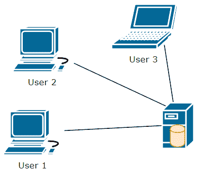
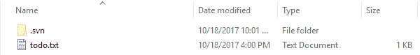
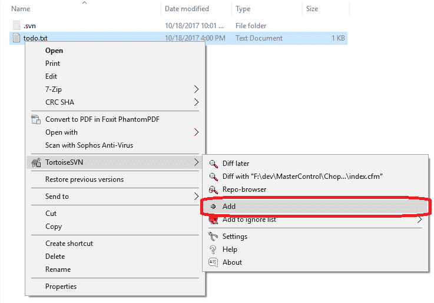
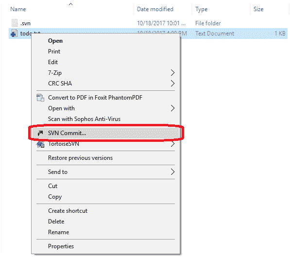
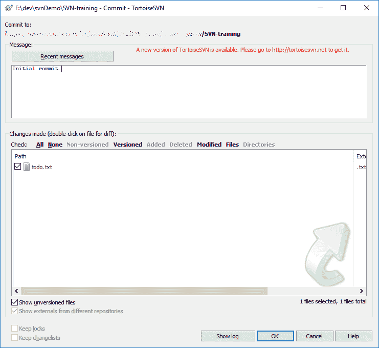

# 从开发开始-颠覆

> 原文：<https://dev.to/jtvanwage/starting-out-in-development---subversion-d9a>

*这篇文章最初发表在[我的个人博客](https://vdubinatorcoder.blogspot.com/2017/10/starting-out-in-development-subversion.html)上。它在那里出乎意料地受欢迎(这并没有说太多)，所以我想我也应该在[开发社区](https://dev.to)上分享这个帖子。*

这是关于[开始开发](https://vdubinatorcoder.blogspot.com/2017/09/starting-out-in-development-series.html)的系列文章中的一篇。本系列的目标是简要介绍开发人员需要的关键工具、概念和技能。

到目前为止，您应该已经熟悉了什么是版本控制。如果你不确定，看看我的文章介绍它。

现在您已经知道了什么是版本控制，是时候熟悉它的一些具体实现了。在这篇文章中，我们将讨论 Subversion，它的版本控制，以及如何使用它。

[T2】](https://res.cloudinary.com/practicaldev/image/fetch/s--AXR0-dKA--/c_limit%2Cf_auto%2Cfl_progressive%2Cq_auto%2Cw_880/https://upload.wikimedia.org/wikipedia/en/thumb/9/9f/Subversion_Logo.svg/1280px-Subversion_Logo.svg.png)

## 颠覆:是什么？

[Subversion](https://subversion.apache.org/) (通常缩写为 SVN)是版本控制的软件实现。它是由 CollabNet 创建的，现在是 Apache 的一个主要项目。它自 2000 年以来就存在了，并且一直在积极地发展和更新。还有许多工具可以让 SVN 的使用变得更加简单和方便。这些工具中最受欢迎的是[龟。我将在后面的例子中使用它。](https://tortoisesvn.net/)

## 颠覆:它的范式

首先要谈的是我称之为 SVN 范式的东西。我的意思是它如何处理和解决版本控制的问题。版本控制有两种主要方法:集中式和分散式。Subversion 是一个集中的版本控制系统。这意味着有一台机器或服务器设置了整个存储库的一个副本来跟踪一切。这意味着，如果您需要了解存储库中的任何信息，您需要向服务器请求该信息。

[T2】](https://res.cloudinary.com/practicaldev/image/fetch/s--HrshR-4c--/c_limit%2Cf_auto%2Cfl_progressive%2Cq_auto%2Cw_880/https://thepracticaldev.s3.amazonaws.com/i/fq14t0i96mxnb4wb0bkc.PNG)

在上图中，我们有三个用户和一台服务器。在服务器上，圆柱表示 SVN 存储库。请注意，服务器是唯一拥有存储库的服务器。如果任何用户想要存储库中的任何东西，他们需要向服务器请求。如果用户想要一个存储库中的文件，用户会请求服务器，服务器会给他们该文件的副本。当用户对该文件进行更改时，如果他们希望更改在存储库中可用，则需要将他们的更改发送到服务器。如果用户想要查看一个文件的历史，他们需要向服务器请求该历史。

长话短说，在集中式版本控制系统中，如果不与存储库的服务器进行对话，用户可以做的事情很少。您在 SVN 进行的大多数活动都需要通过网络访问服务器。

这有利有弊。另一方面，它使得管理谁可以访问存储库中的内容以及谁可以访问服务器变得容易。它还使得用户机器上的内存占用非常小，因为他们只有文件的副本(加上少量的元数据)，而不是整个存储库的副本。用户第一次请求存储库的副本时(这个动作被称为“检出”存储库)，它进行得相当快，因为用户只接收文件的副本。

然而，它也有一些消极的方面。几乎所有你做的事情都需要互联网或网络接入。这意味着如果不能访问服务器所在的网络，您将无法查看日志、运行责备、更改分支或提交。这也意味着提交、查看日志、切换分支和其他活动需要时间，因为这些操作是通过网络发送并在服务器上执行的。与分散的版本控制系统相比，SVN 的一般配置在它所支持的工作流方面也稍有限制。

正如你可能想象的那样，Subversion 对一些公司很有吸引力。拥有一个集中的系统意味着企业通常可以按照自己的意愿保持系统的安全性。公司可能会对他们的源代码有更多的控制权，这是集中式系统的一个非常令人欣慰和吸引人的方面。

## 颠覆:如何使用它

理论的东西说够了，让我们进入正题吧！我们如何使用我所说的这种颠覆？很高兴你问了！我们开始吧。在我们开始之前，请确保您(1)能够访问配置了 SVN 的服务器，并且(2)在您的本地机器上安装了 [TortoiseSVN](https://tortoisesvn.net/) 。如果你无法访问装有 SVN 的服务器，你可以在你的机器上本地设置它( [Linux](https://civicactions.com/blog/how-to-set-up-an-svn-repository-in-7-simple-steps/) 或 [Windows](https://www.visualsvn.com/server/) )。一旦你有了一台装有 SVN 库的机器，并且在你的本地机器上安装了乌龟 SVN，我们就可以开始了！

首先，您要做的是在文件系统中找到您希望 SVN 存储库中的文件所在的位置。我通常会在某个地方创建一个名为“dev”的文件夹，并在其中创建子文件夹以保持有序。一旦你选择了你的位置，你将会想要“检查”你想要的 SVN 仓库。为此，请打开您的文件资源管理器，右键单击您选择的文件夹。您应该会看到类似这样的内容:

[T2】](https://res.cloudinary.com/practicaldev/image/fetch/s--NC8_oS4K--/c_limit%2Cf_auto%2Cfl_progressive%2Cq_auto%2Cw_880/https://thepracticaldev.s3.amazonaws.com/i/28ku2uqig5r1eavifb5j.png)

点击“SVN 结账……”您应该会看到这样一个窗口:

[T2】](https://res.cloudinary.com/practicaldev/image/fetch/s--hcSEhxfb--/c_limit%2Cf_auto%2Cfl_progressive%2Cq_auto%2Cw_880/https://thepracticaldev.s3.amazonaws.com/i/6zl5js6shbf6ser6eyvp.png)

在“存储库的 URL”字段中，输入已设置供您使用的存储库或文件夹的 URL。完成后，确保“签出目录”字段是正确的。通常情况下，它应该与你要检查的文件夹相匹配，但是只要它对你有意义，什么都可以。填写完这些字段后，单击“确定”这将签出您输入的文件夹中的所有内容，并将它们放入您指定的目录中。完成后，在打开的窗口中点击“OK”。

这就对了。第一步完成！现在，您已经拥有了所选 SVN 回购文件的本地副本！在我的例子中，我签出的文件夹是空白的，所以我将创建一个新文件，并将其添加到存储库中进行跟踪。

[T2】](https://res.cloudinary.com/practicaldev/image/fetch/s--w6lXdaQ7--/c_limit%2Cf_auto%2Cfl_progressive%2Cq_auto%2Cw_880/https://thepracticaldev.s3.amazonaws.com/i/5xng15hechwianmz4ont.PNG)

在上图中，您会看到我签出的 SVN 文件夹的本地副本中现在有一个文件。现在，SVN 并不在乎那份文件。我没有告诉它做任何事情，所以它不会做任何事情。然而，我确实希望 SVN 继续跟踪这个文件。所以，我会把这个文件“添加”到 SVN。为此，只需右键单击文件，找到“TortoiseSVN”，然后单击“Add”

[T2】](https://res.cloudinary.com/practicaldev/image/fetch/s--0iQfcPTe--/c_limit%2Cf_auto%2Cfl_progressive%2Cq_auto%2Cw_880/https://thepracticaldev.s3.amazonaws.com/i/qvcv3ttp9i0i1vgsvkr2.png)

这将告诉 SVN，它需要跟踪这个文件。SVN 仍然没有存储文件，但它准备在我下次“提交”时跟踪它所以，我们就把这件事定了吧！右键单击文件夹中的任意位置，然后选择“SVN 提交…”

[T2】](https://res.cloudinary.com/practicaldev/image/fetch/s--QEo7UIWI--/c_limit%2Cf_auto%2Cfl_progressive%2Cq_auto%2Cw_880/https://thepracticaldev.s3.amazonaws.com/i/7m2fgs6av7m1gpnx578r.png)

这将打开提交对话框，如下所示:

[T2】](https://res.cloudinary.com/practicaldev/image/fetch/s--xJ9YxLzg--/c_limit%2Cf_auto%2Cfl_progressive%2Cq_auto%2Cw_880/https://thepracticaldev.s3.amazonaws.com/i/m58pecz9wcyda3apf9h3.png)

这里有几点需要注意。首先，在顶部有一个“承诺:”字段。**始终确保这是你所期望的**。如果不是，那就是有问题，你不应该承诺。你很可能已经换了一个分支，还没有换回来。找一个更了解 SVN 的人，让他们指导你在这里应该做什么。我不打算在这篇文章中讨论这个问题，但可能会在以后的文章中讨论。

如果这个网址是你所期望的，我通常做的下一件事就是跳到“所做的更改…”部分。这是可以提交给 SVN 进行跟踪的文件列表。在这种情况下，我们有一个非常简单的文件列表。在更大的应用程序中，这个列表可能会很长。仔细浏览一遍，确保你只提交你打算提交的东西。如果一个复选框被选中，但它不应该被选中，现在是时候取消选中该复选框，以确保它不会被提交。此外，您可能需要花点时间右键单击并“与基准比较”来查看您所做的更改。这将在左边显示原始文件，在右边显示您的更改。任何差异都将被清楚地突出显示。如果你注意到有什么不对劲，现在是时候回去修理任何不合适的东西了。

在确保我提交到了正确的地方，并且只提交了我打算提交的内容之后，我现在填写“消息”文本区域。在某些情况下，我会点击“最近的消息”按钮来重复使用我最近使用过的消息。在大多数情况下，我会试着写一条有意义的信息。在工作中，这通常意味着在我们的问题追踪器中引用问题，然后用一行文字描述变更或正在修复的问题。对于个人的东西，它通常只是这个提交中的变化的有意义的总结。

一旦这一切都完成了，我很快仔细检查一切，然后按下“确定”现在你知道了！你现在对 SVN 做出了承诺！如果其他人签出了存储库，他们现在会看到您的更改。如果其他人已经签出了此回购，他们可以运行“SVN 更新”来获取您的更改。

## 包装完毕

所以，你走吧！你现在已经掌握了 SVN 的基本知识。我鼓励你从这里继续前进！找一个朋友，让你们俩都把事情交给回购。当您对同一文件的相同行进行更改时，看看它是如何处理的。看看分支和合并以及如何在 SVN 做到这一点。SVN 真的是一个强大的工具。我觉得它已经得到了一个坏的说唱，因为许多企业已经建立了它很差，并与它进行了很多斗争。话虽如此，SVN 也有一些劣势，这使得其他选择值得追求。

一旦您已经熟悉了 SVN，并且花了一些时间来使用它，我鼓励您花一些时间来熟悉 Git！你甚至可以看看我在这个系列中的下一篇文章:[开始开发- Git](https://vdubinatorcoder.blogspot.com/2017/10/starting-out-in-development-git.html) 。