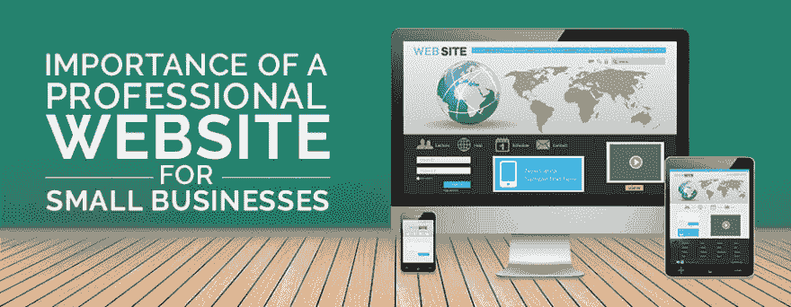

# 专业网站对小型企业的重要性

> 原文:[https://dev . to/proglobalbusinesssolutions/importance-of-a-professional-website-for-small-business-2e 9](https://dev.to/proglobalbusinesssolutions/importance-of-a-professional-website-for-small-businesses-2e9)

今天，很难想象在数字空间之外有什么成功的商业策略。当你将你的营销策略数字化时，建立一个网站是首先要完成的任务。小型企业需要特定行业的网站来利用他们的营销政策。一个强大的网站有可能提升你的品牌形象，增加你的销售额。这也提高了你的客户服务质量。此外，这些天来，几乎所有类别的企业都可以负担得起一个专业网站。在这里，你会看到小企业从网站上获得的一系列好处。

[T2】](https://res.cloudinary.com/practicaldev/image/fetch/s--7Xyil22D--/c_limit%2Cf_auto%2Cfl_progressive%2Cq_auto%2Cw_880/http://www.proglobalbusinesssolutions.com/wp-content/uploads/2017/10/professional-website-design.jpg)

## 正面的第一印象

网站是你公司的虚拟形象。让你的网站信息丰富，吸引人，引人入胜。当潜在客户、合作伙伴和投资者访问您的网站时，他们应该会对您的个人资料感兴趣。即使你不是一个完美的销售人员，当你使你的网站吸引人时，它会在你的客户心中产生积极的第一印象。

## 销售的有力工具

有必要确定你的客户的需求，并在你的网站上放置期望的解决方案。由于一个网站享有本地和全球影响力，它可以将你的销售信息传达给你确切的目标群体。你可以在你的网站上为你的客户创建一个论坛，这样他们就可以分享他们对你的产品的看法。这将帮助你感受他们的脉搏，并在你的产品中整合必要的变化。如果你的产品真的很好，给出的积极反馈会激励你网站的新访客下订单，这正是你想要的。在整个网站创建过程中，所有这些因素都应该牢记在心。

## 树立你的专业精神

你网站上的真实信息为你提供了一个可信的形象。此外，你应该设计好你的网站，并以吸引人的方式展示信息。这为你的公司树立了一个积极的形象，这是由专业精神驱动的。当你通过文章和博客展示声音信息时，它会提升你的形象。你可以成为市场的领导者之一，这是网站最重要的好处之一。

## 树立自己的权威

顾客喜欢依赖那些对所推销的产品或服务有详细了解的成熟公司。因此，你可以利用你的网站来建立你作为行业先驱之一的形象。例如，您需要确定客户面临的常见问题，并在页面中提供相关的解决方案。这将确立你在该领域的权威。

## 建立邮件列表

电子邮件营销已被证明是最有效的数字营销手段之一。一个网站可以帮助你利用你的电子邮件营销活动。你可以在网站上添加注册表格，这将有助于你收集对你的产品感兴趣的人的电子邮件地址。之后，你需要在电子邮件中创建优化的内容来推销你的产品。

## 识别你的客户

为了通过你的网站有效地推销你的商品并获得最大的收益，你应该知道谁是你的顾客。使用谷歌分析等工具可以帮助你识别相同的问题。只有当你能够分析客户的人口统计数据和偏好时，你才能评估你的努力的有效性。根据这些信息，你可以改变你的在线营销策略。

## 曝光增加

当你想提高你的品牌在全球观众中的知名度时，你的网站似乎是最有力的工具之一。一个设计良好的网站可以享有广泛的知名度。通过 SEO 友好的网站设计来优化你的在线形象，让它在搜索引擎结果中享有靠前的位置。

## 强化广告策略

小企业可以利用网站，通过各种方式增强广告策略。例如，你的宣传材料应该包含你的网站地址，以便感兴趣的客户可以在你的网站上寻找相关信息。你只需要分发你的地址，以扩大你的产品的强度。

## 减少广告费用

在传统的广告策略中，小企业发现很难在小册子、目录、海报和广告牌上投资。然而，数字平台上的广告不涉及这些成本。您可以使用内容管理系统(CMS)来整合在线材料的快速更改。一个灵活的 CMS 网站设计也可以帮助你在需要的时候改变图片。

## 访问客户

你的网站为新客户提供了一个简单的入口，他们通过从搜索引擎结果中获得的链接来访问你。此外，您的现有客户提供您的网站链接作为他们熟人的参考，以防他们寻找您的服务。因此，你可以通过你的网站接触到多个客户群。

### 强大的虚拟身份

您的域名在在线平台上是一个强大的品牌标识。它可以用来营销你的产品，尤其是当你树立了一个令人印象深刻的品牌形象。大多数成功的公司以定制的方式设置他们的电子邮件地址，包括他们的员工和品牌名称。这进一步强化了你的品牌形象。

### 易于访问

访问你的网站很容易，只要你保持更新。今天，大多数公司选择响应式网站设计，允许在线营销人员通过移动设备访问它。有必要用所有当前的特征来保持网站的更新。移动可访问性确保及时整合新鲜信息；所以，如果你的网站还没有响应，雇佣任何一家提供[网站重新设计服务](http://www.proglobalbusinesssolutions.com/web-design-services/website-redesign/)的最好的公司来使你的网站有响应。

### 手机兼容性

在目前的营销场景下，你需要设计一个网站，考虑移动用户的易用性。超过一半的人口通过手机使用互联网访问网站。对小企业来说，开发这些顾客是很重要的。如果你的网站与移动设备不兼容，你将会失去一半的潜在客户。因此，一个小型企业网站，如果在多种设备上兼容，可以增加你的客户群。

### 生产力水平的提高

当顾客寻找新产品时，他需要关于它的详细信息。您的网站包含了您的客户可能感兴趣的所有数据和产品特性。你不需要雇佣员工来演示这些商品的功能流程。它可以节省您的时间，并提高您公司的生产率。如果您必须定期更新信息或添加新产品，来自专家的网站维护服务可能会有所帮助。

### 教育你的客户

一个网站应该包含所有必要的信息，可以让顾客了解产品。如果你发布新产品，你需要在网站上添加“如何做”的视频和内容。大多数时候，人们访问信息丰富的网站来迎合他们的智力。他们可能对了解某些产品的效用感兴趣。你可以利用你的网站来教育你的客户关于你的产品的功能机制和好处。

### 拓展你的市场

当你的企业规模扩大时，你可能会对开拓国外市场感兴趣。如果你想拓展你的业务超越人口界限，你的网站是最有力的工具。它可以享有全球观众，并传达你的产品信息给你的目标国家的人民。一个典型的网站设计公司战略性地开发网站，以确保他们取悦本地和全球观众。

### 拓展你在当地的影响力

如果你愿意专注于你的本地化业务，你会发现你的网站在这里也很方便。内容开发人员整合以本地化搜索为重点的关键词，这将产生相关线索。如果依靠提供[网站设计服务](http://www.proglobalbusinesssolutions.com/web-design-services/)的最佳专业人士，你可以很容易地利用你的网站从当地市场获得最大利益。

### 通过视觉效果推广您的产品

在在线平台上，人们无法像在传统流程中那样触摸或感受产品。相反，他们会寻找相关的照片和视频。当你把这些材料放在你的网站上时，它会引起你的客户的兴趣。今天，大多数电子商务门户网站在竞争激烈的市场中蓬勃发展，使用视觉效果来吸引客户。

### 帮助别人定位你

网页上的高级功能使人们能够在途中找到您的商店。大多数互联网用户都熟悉全球定位系统，这有助于他们跟踪你的位置。此外，网页上有清晰的地图，标明你商店的位置。餐馆、温泉浴场、酒吧和其他实体设施都受益于这一功能。

### 培训您的供应商和员工

某些小企业使用他们的网站来培训他们的员工和供应商。这些网站有特定的页面，上面有必要的培训材料。显然，他们能够学得更快，因为内容始终是实时的。此外，你不需要花费在文件，传单和其他培训材料的硬拷贝。

#### 移动到新的位置

如果你和你的公司搬到一个新的地方，你仍然可以留住你的客户群。网站是你的关键营销武器。它将通知您的客户有关的变化。即使你迁移了你的企业，它仍然是他们的信息来源。

#### 发现潜在员工

找工作的潜在雇员可以通过你的网站联系到你。大多数网站都有“与我们一起工作”或“职业”栏目。人们可以通过这个页面与您联系。你也可以把你的网站链接放在在线招聘网站上。

#### 轻松沟通

与顾客保持融洽的关系很重要。网站通过论坛、投诉页面和聊天机器人实现双向交流。它有助于您确定客户的需求。

#### 增强客户服务

网站帮助公司向他们的客户提供足够的支持。检查他们是否与你的服务竞争是很重要的。将必要的客户支持功能整合到您的网站中。现在，你知道小企业主寻找强大网站的所有原因了。除了建立健全的营销策略，小型企业网站还能让他们以自己想要的方式为客户服务。