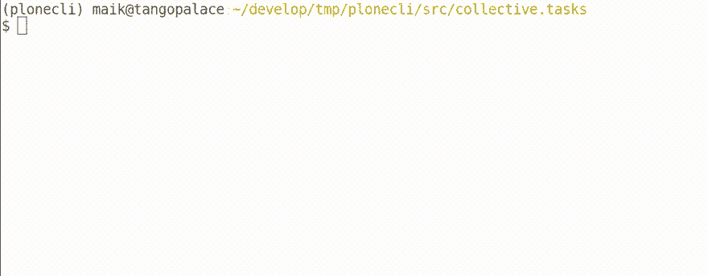

# Plone 命令行界面- plonecli

> 原文:[https://dev . to/mrtango/plone-command-line-interface-plonecli-53jg](https://dev.to/mrtango/plone-command-line-interface-plonecli-53jg)

**PloneConf 会后 sprint 在 plonecli 和 bobtemplates.plone 上报告**。

在巴塞罗纳的会后冲刺阶段，我们( [MrTango](https://github.com/MrTango) 、 [tmassman](https://github.com/tmassman) 和 [Gomez](https://github.com/Gomez) )为开发 Plone 包创建了一个命令行客户端。plonecli 主要是 mr.bob 和 bobtemplates.plone 的包装器，但也可以与其他 bobtemplates 一起使用。plonecli 增加了之前关于重构和模块化 bobtemplates.plone 模板的工作，这是一个简单易用的命令行前端。

## 特性

*   允许为 plonecli 注册 bobtemplates
*   列出当前上下文可用的 bobtemplates
*   独立和子模板
*   命令和可用模板的自动完成
*   命令链

## 用法

### 创建 Plone 插件包

要用 plonecli 创建 Plone 插件，您只需使用 create 命令:

```
$ plonecli create addon src/collective.todos 
```

<svg viewBox="0 0 448 512" class="highlight-action highlight-action--fullscreen-on"><title>Enter fullscreen mode</title></svg> <svg viewBox="0 0 448 512" class="highlight-action highlight-action--fullscreen-off"><title>Exit fullscreen mode</title></svg>

如果你想知道有哪些模板可用，你可以使用 -l/ - list-templates 选项或者只需按 TAB 键两次。

```
$ plonecli --list-templates
Available mr.bob templates:
 - buildout
 - addon
  - vocabulary
  - theme
  - content_type
 - theme_package 
```

<svg viewBox="0 0 448 512" class="highlight-action highlight-action--fullscreen-on"><title>Enter fullscreen mode</title></svg> <svg viewBox="0 0 448 512" class="highlight-action highlight-action--fullscreen-off"><title>Exit fullscreen mode</title></svg>

#### 举例

[T2】](https://res.cloudinary.com/practicaldev/image/fetch/s--KSxcYcJ4--/c_limit%2Cf_auto%2Cfl_progressive%2Cq_66%2Cw_880/http://mrtango.planetcrazy.img/plonecli_create_addon_optimized.gif)

用 plonecli 创建插件

## 添加一个内容类型到你的 Plone 插件

要将 content_type 添加到现有的 Plone Addon 包中，只需在包中使用 add 命令:

```
$ cd src/collective.todos
$ plonecli add content_type 
```

<svg viewBox="0 0 448 512" class="highlight-action highlight-action--fullscreen-on"><title>Enter fullscreen mode</title></svg> <svg viewBox="0 0 448 512" class="highlight-action highlight-action--fullscreen-off"><title>Exit fullscreen mode</title></svg>

-l/ - list-templates 和自动完成也适用于子模板(add 命令)。

```
$ plonecli add
content_type theme vocabulary 
```

<svg viewBox="0 0 448 512" class="highlight-action highlight-action--fullscreen-on"><title>Enter fullscreen mode</title></svg> <svg viewBox="0 0 448 512" class="highlight-action highlight-action--fullscreen-off"><title>Exit fullscreen mode</title></svg>

[T2】](https://res.cloudinary.com/practicaldev/image/fetch/s--4rh_nRVk--/c_limit%2Cf_auto%2Cfl_progressive%2Cq_66%2Cw_880/http://mrtango.planetcrazy.img/plonecli_add_content_type_optimized.gif)

将内容类型添加到您的包中

## 将一个词汇添加到你的 Plone 插件中

要添加 Plone 词汇表，可以使用 add 命令和词汇表子模板:

```
$ plonecli add vocabulary 
```

<svg viewBox="0 0 448 512" class="highlight-action highlight-action--fullscreen-on"><title>Enter fullscreen mode</title></svg> <svg viewBox="0 0 448 512" class="highlight-action highlight-action--fullscreen-off"><title>Exit fullscreen mode</title></svg>

### 举例

[T2】](https://res.cloudinary.com/practicaldev/image/fetch/s--uGVcDFhW--/c_limit%2Cf_auto%2Cfl_progressive%2Cq_66%2Cw_880/http://mrtango.planetcrazy.img/plonecli_add_vocabulary_optimized.gif)

向您的包中添加一个 vacobulary

#### 构建 Plone 插件

您也可以使用 plonecli 来构建包:

```
$ plonecli build 
```

<svg viewBox="0 0 448 512" class="highlight-action highlight-action--fullscreen-on"><title>Enter fullscreen mode</title></svg> <svg viewBox="0 0 448 512" class="highlight-action highlight-action--fullscreen-off"><title>Exit fullscreen mode</title></svg>

这将运行:

```
$ virtualenv .
$ ./bin/pip install -r requirements.txt --upgrade
$ ./bin/buildout 
```

<svg viewBox="0 0 448 512" class="highlight-action highlight-action--fullscreen-on"><title>Enter fullscreen mode</title></svg> <svg viewBox="0 0 448 512" class="highlight-action highlight-action--fullscreen-off"><title>Exit fullscreen mode</title></svg>

在您的目标目录中。您总是可以通过使用命令 virtualenv，`requirements`，buildout 而不是 build 来显式运行这 3 个步骤。如果你想重置你的构建，使用 -清理选项。这将在安装需求之前清除您的 virtualenv，并使用 -n 运行 buildout 以获得最新版本。

### 举例

[T2】](https://res.cloudinary.com/practicaldev/image/fetch/s--z14hDZxh--/c_limit%2Cf_auto%2Cfl_progressive%2Cq_66%2Cw_880/http://mrtango.planetcrazy.img/plonecli_build_optimized.gif)

用 plonecli 构建您的包

#### 服务包的开发 Plone 站点

plonecli 还提供了一个 serve 命令，它将在前台启动 Plone 实例，并提供一个在浏览器中打开它的链接:

```
$ plonecli serve
RUN: ./bin/instance fg

INFO: Open this in a Web Browser: http://localhost:8080
INFO: You can stop it by pressing CTRL + c

2017-10-30 14:21:01 INFO ZServer HTTP server started at Mon Oct 30 14:21:01 2017
    Hostname: 0.0.0.0
    Port: 8080
... 
```

<svg viewBox="0 0 448 512" class="highlight-action highlight-action--fullscreen-on"><title>Enter fullscreen mode</title></svg> <svg viewBox="0 0 448 512" class="highlight-action highlight-action--fullscreen-off"><title>Exit fullscreen mode</title></svg>

### 组合(链式)命令

您可以组合创建、构建和服务等命令:

```
$ plonecli build serve 
```

<svg viewBox="0 0 448 512" class="highlight-action highlight-action--fullscreen-on"><title>Enter fullscreen mode</title></svg> <svg viewBox="0 0 448 512" class="highlight-action highlight-action--fullscreen-off"><title>Exit fullscreen mode</title></svg>

这将首先运行所有的构建步骤，然后服务于 Plone 站点

### 举例

[T2】](https://res.cloudinary.com/practicaldev/image/fetch/s--mTfH_1yw--/c_limit%2Cf_auto%2Cfl_progressive%2Cq_66%2Cw_880/http://mrtango.planetcrazy.img/plonecli_serve_optimized.gif)

用 plonecli 服务您的包裹