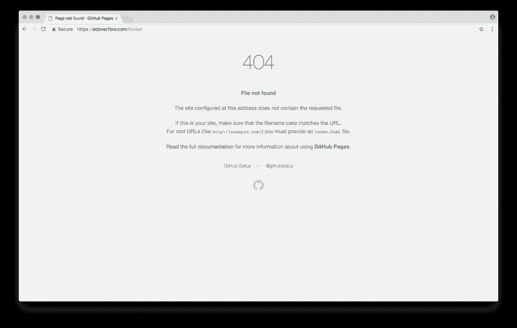

# 虫类赏金猎人的轻型侦察装置

> 原文:[https://dev . to/security txt/a-lightweight-detection-setup-for-bug-bounty-hunters-1fo 1](https://dev.to/securitytxt/a-lightweight-reconnaissance-setup-for-bug-bounty-hunters-1fo1)

[T2】](https://res.cloudinary.com/practicaldev/image/fetch/s--TA4ymWys--/c_limit%2Cf_auto%2Cfl_progressive%2Cq_auto%2Cw_880/https://user-images.githubusercontent.com/18099289/32144906-639add86-bcc0-11e7-9071-bdb1c125257a.png)

下面是一个轻量级的侦察设置，可以帮助您快速收集给定目标的信息。我们将运行基本的安装步骤，然后看看如何使用这个设置，而狩猎。

请记住，有数百种工具，不可能全部包含在本文中。这篇文章的目标读者是刚入门的人或者想要简单设置的人。作者假设读者已经对如何使用终端有了基本的了解。如果没有，读者可能想在继续阅读之前从 https://linuxjourney.com/开始。

## 子列表 3r

**📀安装**

```
$ git clone https://github.com/aboul3la/Sublist3r.git
$ cd Sublist3r
$ sudo pip install -r requirements.txt 
```

<svg width="20px" height="20px" viewBox="0 0 24 24" class="highlight-action crayons-icon highlight-action--fullscreen-on"><title>Enter fullscreen mode</title></svg> <svg width="20px" height="20px" viewBox="0 0 24 24" class="highlight-action crayons-icon highlight-action--fullscreen-off"><title>Exit fullscreen mode</title></svg>

**💬别名**

```
alias sublist3r='python /path/to/Sublist3r/sublist3r.py -d '

alias sublist3r-one=". <(cat domains | awk '{print \"sublist3r \"$1 \" -o \" $1 \".txt\"}')" 
```

<svg width="20px" height="20px" viewBox="0 0 24 24" class="highlight-action crayons-icon highlight-action--fullscreen-on"><title>Enter fullscreen mode</title></svg> <svg width="20px" height="20px" viewBox="0 0 24 24" class="highlight-action crayons-icon highlight-action--fullscreen-off"><title>Exit fullscreen mode</title></svg>

## 目录搜索

**📀安装**

```
$ git clone https://github.com/maurosoria/dirsearch.git
$ cd dirsearch/db
$ wget https://gist.githubusercontent.com/EdOverflow/c4d6d8c43b315546892aa5dab67fdd6c/raw/7dc210b17d7742b46de340b824a0caa0f25cf3cc/open_redirect_wordlist.txt 
```

<svg width="20px" height="20px" viewBox="0 0 24 24" class="highlight-action crayons-icon highlight-action--fullscreen-on"><title>Enter fullscreen mode</title></svg> <svg width="20px" height="20px" viewBox="0 0 24 24" class="highlight-action crayons-icon highlight-action--fullscreen-off"><title>Exit fullscreen mode</title></svg>

**💬别名**

```
alias dirsearch='python3 /path/to/dirsearch/dirsearch.py -u '

alias dirsearch-one=". <(cat domains | awk '{print \"dirsearch \"\$1 \" -e *\"}')"

alias openredirect=". <(cat domains | awk '{print \"dirsearch \"\$1 \" -w /path/to/dirsearch/db/open_redirect_wordlist.txt -e *\"}')" 
```

<svg width="20px" height="20px" viewBox="0 0 24 24" class="highlight-action crayons-icon highlight-action--fullscreen-on"><title>Enter fullscreen mode</title></svg> <svg width="20px" height="20px" viewBox="0 0 24 24" class="highlight-action crayons-icon highlight-action--fullscreen-off"><title>Exit fullscreen mode</title></svg>

## 网页截图

**📀安装**

确保也安装了[幻象](https://github.com/maaaaz/webscreenshot/wiki/Phantomjs-installation)。

```
$ git clone https://github.com/maaaaz/webscreenshot.git 
```

<svg width="20px" height="20px" viewBox="0 0 24 24" class="highlight-action crayons-icon highlight-action--fullscreen-on"><title>Enter fullscreen mode</title></svg> <svg width="20px" height="20px" viewBox="0 0 24 24" class="highlight-action crayons-icon highlight-action--fullscreen-off"><title>Exit fullscreen mode</title></svg>

## 接近目标时要采取的步骤

1)验证目标的范围(`*.example.com`)；

2)在`example.com`上运行 Sublist3r，并将所有结果输出到一个名为`output` :
的文件中

```
$ sublist3r example.com -o output
...
$ cat output
foo.example.com
bar.example.com
admin.example.com
dev.example.com
www.example.com
git.example.com 
```

<svg width="20px" height="20px" viewBox="0 0 24 24" class="highlight-action crayons-icon highlight-action--fullscreen-on"><title>Enter fullscreen mode</title></svg> <svg width="20px" height="20px" viewBox="0 0 24 24" class="highlight-action crayons-icon highlight-action--fullscreen-off"><title>Exit fullscreen mode</title></svg>

3)检查哪些域被解析:

```
$ while read domain; do if host "$domain" > /dev/null; then echo $domain; fi; done < output >> domains 
```

<svg width="20px" height="20px" viewBox="0 0 24 24" class="highlight-action crayons-icon highlight-action--fullscreen-on"><title>Enter fullscreen mode</title></svg> <svg width="20px" height="20px" viewBox="0 0 24 24" class="highlight-action crayons-icon highlight-action--fullscreen-off"><title>Exit fullscreen mode</title></svg>

4)在`domains`文件上运行网页截图:

```
$ python webscreenshot.py -i domains output example
...
$ eog example 
```

<svg width="20px" height="20px" viewBox="0 0 24 24" class="highlight-action crayons-icon highlight-action--fullscreen-on"><title>Enter fullscreen mode</title></svg> <svg width="20px" height="20px" viewBox="0 0 24 24" class="highlight-action crayons-icon highlight-action--fullscreen-off"><title>Exit fullscreen mode</title></svg>

💡提示:查看截图时，寻找 [404 页面](https://hackerone.com/reports/263902)、登录面板、目录列表和旧页面。

[T2】](https://res.cloudinary.com/practicaldev/image/fetch/s--TI2r7Mur--/c_limit%2Cf_auto%2Cfl_progressive%2Cq_auto%2Cw_880/https://user-images.githubusercontent.com/18099289/32145630-3e1b6d6c-bccc-11e7-9ad3-ad4d4a6beb13.png)

5)在`domains`文件上运行目录搜索:

```
$ dirsearch-one 
```

<svg width="20px" height="20px" viewBox="0 0 24 24" class="highlight-action crayons-icon highlight-action--fullscreen-on"><title>Enter fullscreen mode</title></svg> <svg width="20px" height="20px" viewBox="0 0 24 24" class="highlight-action crayons-icon highlight-action--fullscreen-off"><title>Exit fullscreen mode</title></svg>

6)使用目录搜索在`domains`文件上检查打开的重定向:

```
$ openredirect 
```

<svg width="20px" height="20px" viewBox="0 0 24 24" class="highlight-action crayons-icon highlight-action--fullscreen-on"><title>Enter fullscreen mode</title></svg> <svg width="20px" height="20px" viewBox="0 0 24 24" class="highlight-action crayons-icon highlight-action--fullscreen-off"><title>Exit fullscreen mode</title></svg>

## 📝练习

以下任务留给读者作为练习:

1)编写一个 shell 脚本，当提供单个域(`example.com`)时，该脚本执行整个过程。

2)通过在 [HackerOne](https://hackerone.com/directory) 和 [Bugcrowd](https://bugcrowd.com/programs) 上挑选几个 bug bounty 程序来练习这个过程。

## 结论

作者在此感谢 [@TomNomNom](https://twitter.com/TomNomNom) 提供的帮助。封面图片由[乔·塞拉斯](https://unsplash.com/@joaosilas)拍摄。