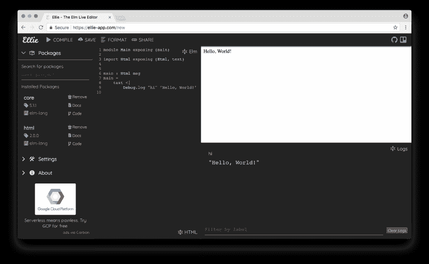

# 艾莉每周更新 2017-10-28

> 原文：<https://dev.to/lukewestby/ellie-weekly-update-2017-10-28-11e>

嗨，朋友们！因为我一直在旅行和处理个人事务，所以现在没有很多事情发生。以下是本周的简要更新:

### 新增功能

*   在右下方添加了查看对`Debug.log`的呼叫的部分。

### 社区

*   删除了艾莉的推特账号。如果有足够多的人感兴趣，我可以写下我为什么选择这样做。

### [进行中的](#in-progress-and-experiments)和实验

*   开始用 PureScript 重写构建管理器。
*   为了给 GitHub auth、Gist import 和其他一大堆东西做准备，开始修改 Ellie 判断一个版本是否是你的方式。