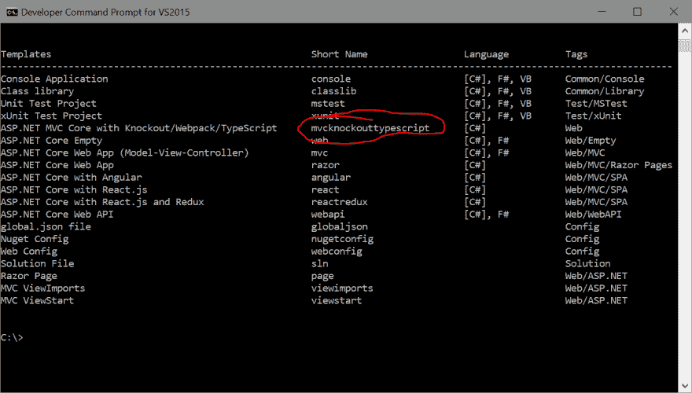

# 创建您自己的 Visual Studio 项目模板

> 原文：<https://dev.to/t4rzsan/creating-your-own-visual-studio-project-template-74m>

*这篇文章最初出现在我的[个人博客](leruplund.dk/2017/10/28/creating-your-own-visual-studio-project-template/)上。*

*Github 上的所有代码。*

在以前的文章( [1](https://dev.to/t4rzsan/setting-up-aspnet-core-in-visual-studio-2017-with-npm-webpack-and-typescript-part-i) 和 [2](https://dev.to/t4rzsan/setting-up-aspnet-core-in-visual-studio-2017-with-npm-webpack-and-typescript-part-ii) )中，我介绍了如何将 Webpack 和 Typescript 添加到 Visual Studio ASP.NET 核心 MVC 项目中。

这被证明是一个相当麻烦和容易出错的过程，这不是你希望你最大的敌人经历两次的事情(或者你可能会经历两次——我不知道)。

幸运的是，为 Visual Studio 创建自己的项目模板非常容易，这样就可以用相同的设置重复创建新项目。

您可能知道，您可以使用`dotnet new`命令为 Visual Studio 创建新项目。例如，您可以通过运行以下命令来创建一个新的 ASP.NET 核心 MVC 项目

```
dotnet new mvc -n "MyFacebookKillerApp" 
```

键入`dotnew new`列出所有可用的模板。

如果我们能用 Webpack 和 Typescript thingy 项目为我们的 ASP.NET MVC 做同样的事情，那不是很好吗？幸运的是，我们可以(否则这将是一篇非常有趣的文章)。

第一步是配置我们的模板。

## 配置模板

首先，在解决方案的根文件夹中创建一个名为“. template.config”的文件夹。这通常是。sln 文件已就位。

在“. template.config”文件夹中创建一个名为“template.json”的文件。将以下内容插入文件并更改相关属性(如作者、身份、简称和源名):

```
{
  "author": "Jakob Christensen", 
  "classifications": [ "Web" ],
  "name": "ASP.NET MVC Core with Knockout/Webpack/TypeScript",
  "identity": "t4rzsan.MvcKnockoutTypeScript", // Unique name for this template
  "shortName": "mvcknockouttypescript", // Short name that can be used on the CLI
  "tags": {
    "language": "C#"
  },
  "sourceName": "CoreWebApplication2", // Will replace the string 'CoreWebApplication2' with the value provided via -n.
  "preferNameDirectory": true,
  "exclude": [ "**/[Bb]in/**", "**/[Oo]bj/**", ".template.config/**/*", "**/*.filelist", "**/*.user", "**/*.lock.json", "**/node_modules/**/*" ]
} 
```

为“简称”选择简短但有意义的东西。这是运行`dotnet new`命令时将使用的名称。

属性“sourceName”很重要。当模板运行时，字符串“CoreWebApplication2”将被用户为`dotnet new`的`-n(ame)`参数指定的内容替换。所有文件中的文本都将被替换。中包含命名空间的。cs 文件和重命名。csproj 文件。因此，您必须将“CoreWebApplication2”更改为您用作解决方案的项目名称的任何名称，您将它用作您的模板的模板(如果您明白我的意思)。

我已经将“preferNameDirectory”设置为 true，这意味着如果没有指定`-n`，那么`dotnet new`将使用当前文件夹的名称作为项目名称。

完成配置后，就该注册模板了。

## 注册模板

通过运行命令`dotnet new --install [folder]`来安装模板，其中【文件夹】是“. template.config”的父文件夹的路径。所以，对我来说，那就是

```
dotnet new --install C:\Users\Jakob\Source\Repos\CoreWebApplication2 
```

列出已安装的模板时，您将在列表中使用自己的简称:

[T2】](https://res.cloudinary.com/practicaldev/image/fetch/s--VRVNC9Dp--/c_limit%2Cf_auto%2Cfl_progressive%2Cq_auto%2Cw_880/http://leruplund.dk/wp-content/uploads/2017/10/dotnetnewinstall.png)

最后，看看有没有效果。

## 使用模板

在某个地方为您的新项目创建一个新文件夹，然后在命令提示符下用 CD 找到该文件夹。首先键入(插入您自己的简短模板名称):

```
dotnet new mvcknockouttypescript 
```

就是这样。非常酷！

顺便说一下，不要忘记更新 npm 并安装新项目的所有依赖项(如果你像我一样，你总是忘记这一点)。

```
npm update npm@latest -g
npm install
npm run build 
```