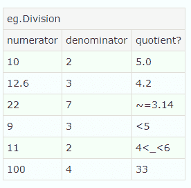
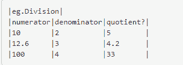
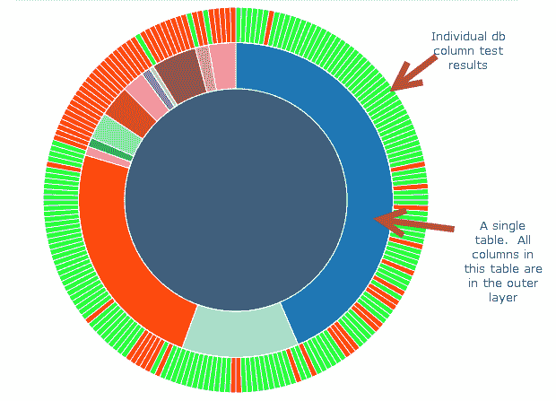

# 尝试用非表格方式显示测试结果

> 原文:[https://dev . to/franndotex e/experimenting-with-non-table-way-of-showing-test-results-9n 9](https://dev.to/franndotexe/experimenting-with-non-tabular-ways-of-showing-test-results-9n9)

听说过 [FitNesse](http://fitnesse.org/) 吗？如果没有，想象一下 [SpecFlow](http://specflow.org/) 之父会是什么样子，以及它可能如何被使用。

如果您想象用 wiki 风格的语法填充 HTML 表来对其中的数据执行断言，那么您的想法是正确的。

来自[fitness 两分钟示例页面](http://www.fitnesse.org/FitNesse.UserGuide.TwoMinuteExample)的一个小示例:

[T2】](https://res.cloudinary.com/practicaldev/image/fetch/s--vQVxmo_V--/c_limit%2Cf_auto%2Cfl_progressive%2Cq_auto%2Cw_880/https://frannsoft.github.io/asseimg/posts/enhancing-old-tests/fitnesse-example.png)

以及创建表格的支持标记:

[T2】](https://res.cloudinary.com/practicaldev/image/fetch/s--815OxnLU--/c_limit%2Cf_auto%2Cfl_progressive%2Cq_auto%2Cw_880/https://frannsoft.github.io/asseimg/posts/enhancing-old-tests/wikimarkup.png)

对于简单的测试来说，这似乎相对简单。虽然这可能不是一种超现代的编写测试的方式，但是让不一定能够编写代码的测试人员能够编写自动化测试是一件好事。

这些测试可以在浏览器中执行，并以类似于 SpecFlow 的方式得到代码的支持。用户根本不需要安装任何东西就可以上手；只转到一个 url。

最近，我遇到了一个场景，其中这些表的一个小套件被用来验证来自外部服务的数据。这些测试是必要的，因为我们需要确保数据以预期的格式和预期的值到达。

问题是有些 FitNesse 表有超过 90 列。这将测试的可读性降低到几乎为零，因为阅读结果的人可以找到特定失败的唯一方法是手动搜索结果或在结果页面上按 CTRL+F。任何包含 90+列表格的网页都不能使用这种格式导航。

尽管如此，这些类型的测试已经存在了一段时间，简单地将它们移植到 FitNesse 之外的东西上并不是一个真正的选择。这带来了一个问题，因为这些类型的测试在确保提供商服务应用程序正常工作方面起着关键作用。人们正在寻找一种更好的方法来可视化这些结果。

### D3.js

输入 [d3.js](https://d3js.org) 。我鼓励你查看这个链接，但是本质上 d3.js 擅长于用 html(通常称为`SVG` s)呈现复杂的数据图表。在研究了用非表格方式呈现表格数据之后，我选择了一个[旭日图](https://datavizcatalogue.com/methods/sunburst_diagram.html)。

将这些大型 FitNesse 结果表可视化为可缩放的旭日图，读者无需滚动即可一次查看所有表。旭日图还提供了结果的高级视图(“有测试失败吗？”)以及放大特定表格进行更深入分析的能力。将结果的附加细节放置在图表的特定层上，可以使读者更容易了解这些结果所包含的大量信息。

理想情况下，最高级别对每个表使用唯一的颜色，对每个数据库列使用红/绿色，分别表示失败/通过。将鼠标悬停在“表”部分会显示特定于数据库表的信息，而将鼠标悬停在单个测试的特定部分会显示失败/通过的详细信息，即测试中的数据库表和列。

以下是生成的图表示例:

[T2】](https://res.cloudinary.com/practicaldev/image/fetch/s--phb22tDn--/c_limit%2Cf_auto%2Cfl_progressive%2Cq_auto%2Cw_880/https://frannsoft.github.io/asseimg/posts/enhancing-old-tests/sunburst.png)

首先，为这些数据库列测试结果抓取 FitNesse 测试结果页面，并构建适当的 JSON 结构。我的技术没有什么神奇之处——只是一些正则表达式和选择器，用来获取必要的 HTML 元素和我需要的测试结果数据。根据 Mike Bostock 的这个例子，d3.js 中旭日图的必要 JSON 应该是这样的:

```
{  "name":  "name",  "children":  [  "name":  "name",  "children":  [  "name":  "name",  "children":  [  ...and  so  on  ]  ]  ]  } 
```

属性内的每个“层”代表旭日图中的另一层。第一层是根层，包含被测系统的总体信息。第二层`children`节点每个都包含一个数据库表，其中包含关于该表的信息。第三层`children`包含特定于父表的数据库列信息和测试结果信息。参考上面显示的图像，可以看到这个 JSON 结构是如何呈现的。

(*值得一提的是，JSON 并不是 d3.js 接受的唯一格式，我只是发现它对于这个实验来说是最简单的。*)

最后一步是使用抓取和解析的 FitNesse 结果数据生成旭日图。这与之前提到的 Mike Bostock 的旭日图非常相似。这里有一个简单的例子来说明这种情况:

```
svg.selectAll("path") //get all the path elements in the SVG.  At thsi point it's empty so there will only be one.  https://github.com/d3/d3-selection
    .data(nodes) //nodes is the parsed FitNesse results JSON data.  Give the data to d3 and begin the process of generating the SVG.
    .enter().append("path") //iterates nodes, creating a new path element for each.  https://github.com/d3/d3-selection#selection_enter
    .on("click", click) //wire events for each create path element that contains a node.  Click will cause the diagram to zoom in on the clicked node
    .on("mouseover", mouseover) //show info about the cell in question
    .on("mouseleave", mouseleave) //clear shown info
    .attr("d", arc) //determine the measurements of the generated path for this node
    .style("fill", function(d){
        if(d.data.passed != null){ //set the color of the arc based on whether or not the node is a test and passed/fail or the node is another non-test piece of data like a db table
            if(d.data.passed = true){
                return testPassedColor;
            } else{
                return testFailedColor;
            }
        }
        if(d.data.name === 'root'){
            return rootColor;
        }
        return colors((d.children ? d : d.parent).data.name); //ensure unique colors are used for tables
    }) 
```

这里有一个 gif 的链接，展示了这一切是如何组合在一起的。

gif 中显示的仪表板部件，如面包屑轨迹和组合框，旨在进一步简化查找读者所需信息的过程。因此，读者可以直接钻研结果，而不必滚动浏览。使用的组合框来自 [select2.js](https://github.com/select2/select2) ，包含自动完成功能，因此用户可以开始键入他们希望看到的数据库表或列的名称，并根据需要过滤结果。

### 结果

所有这些都是为了让消费者更容易理解测试结果。最终，可读性是测试套件最重要的特性之一。如果用户很难分析测试结果，他们会开始忽略它们，因为随着时间的推移，处理它们变得太单调乏味了。

### 膨胀

FitNesse 为测试表使用了一个相当通用的结构，因此从其他测试结果中恢复代码来创建 JSON 在理论上是很简单的。

声明一下，我绝不是健身专家。如果存在更有效的替代方法，允许我们以 JSON 的形式从 FitNesse wiki 测试结果表中获取原始数据，那么应该使用该方法来消除流程中的一个步骤。我确实遇到过一个 url 参数，它可以用来以 XML 的形式返回测试结果，但是它似乎是在各种“表格”中返回测试结果，而不仅仅是包含原始数据。

同样值得注意的是，虽然这个概念验证代码是为了创建一个旭日图，但是任何类型的可视化都是可能的。如果需要另一种类型的图表，我强烈建议看一看 [d3.js 图库](https://github.com/d3/d3/wiki/gallery)来获得灵感。