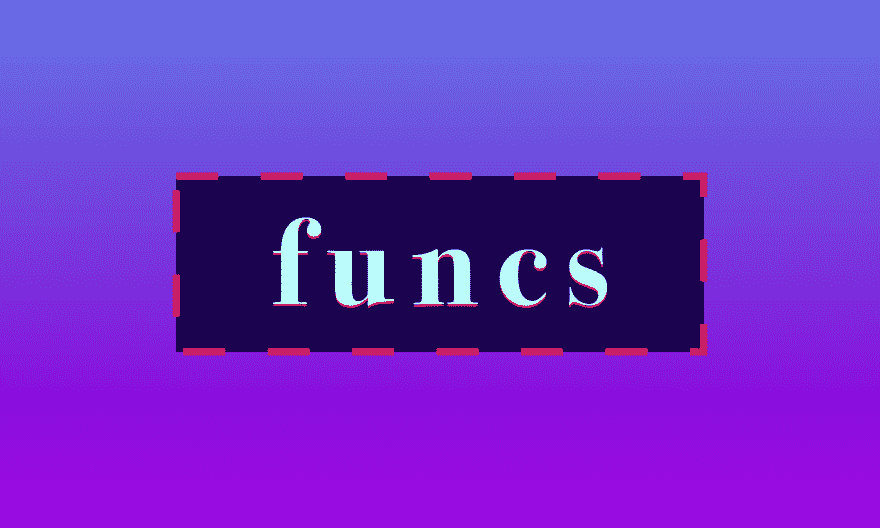

# 🐣Go Funcs — Baby-Gopher 的视觉指南

> 原文:[https://dev . to/incongumus/-go-funcs baby-gophers-visual-guide-3mj](https://dev.to/inancgumus/-go-funcsbaby-gophers-visual-guide-3mj)

[T2】](https://blog.learngoprogramming.com/golang-funcs-params-named-result-values-types-pass-by-value-67f4374d9c0a)

## 里面是什么？

*   **如何声明一个 Go 函数？**
    *   因素
    *   签名
    *   身体
    *   返回关键字
    *   街区
*   **Func 参数和结果类型示例**
    *   尼拉二世(神圣罗马帝国)
    *   奇异函数
    *   多个输入参数和结果类型
    *   带有错误值的示例
    *   丢弃结果值
    *   命名结果参数和裸返回
    *   阴影问题
    *   按值传递
    *   按值传递和指针
*   **命名函数**
    *   做一个极简主义者
    *   mixercaps 中的名称
    *   描述性参数名称
    *   使用动词
    *   使用 is / are
    *   省略名称中的类型
    *   Getters 和 Setters
*   **有些东西 Go funcs 不支持**

* * *

## ★ [点击此处阅读指南](https://blog.learngoprogramming.com/golang-funcs-params-named-result-values-types-pass-by-value-67f4374d9c0a)。

下周五见！