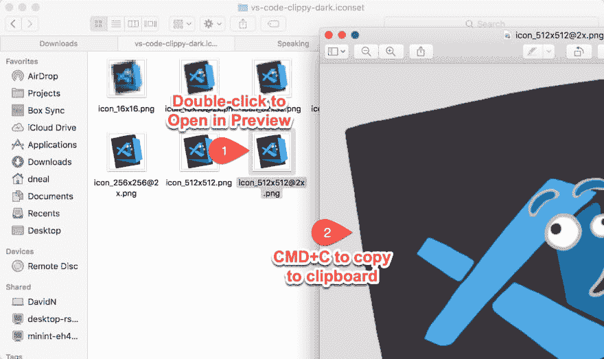
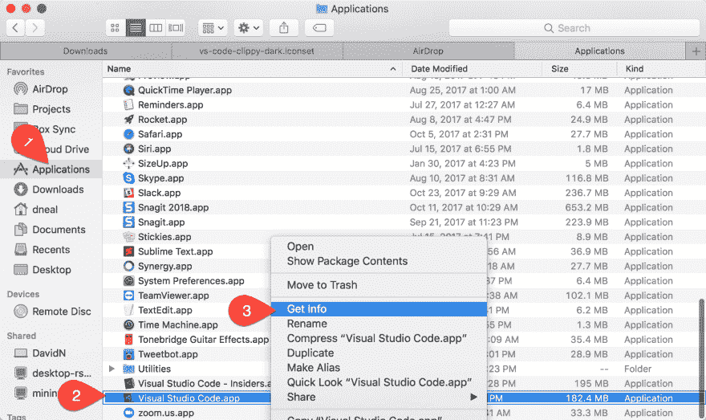
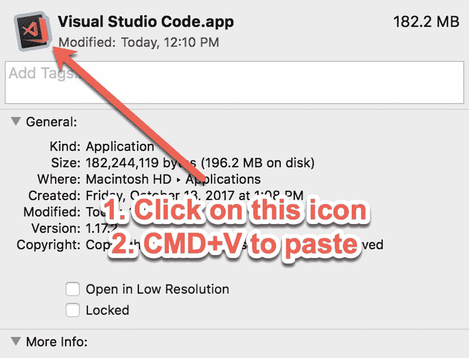
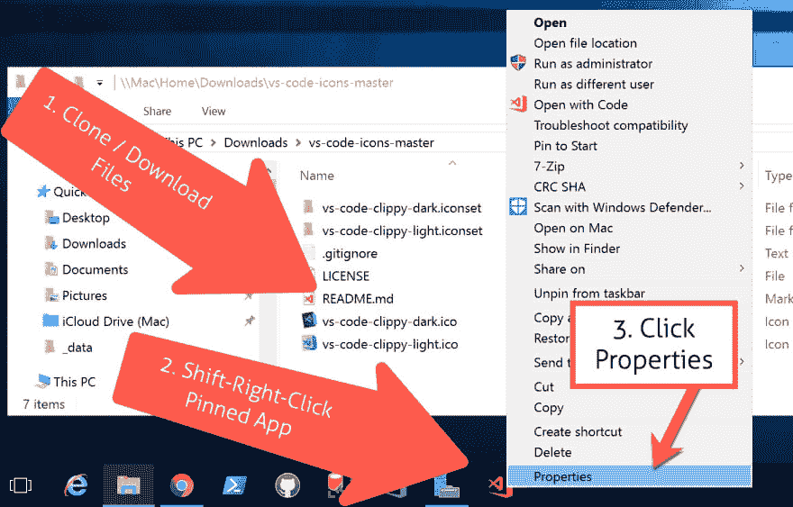
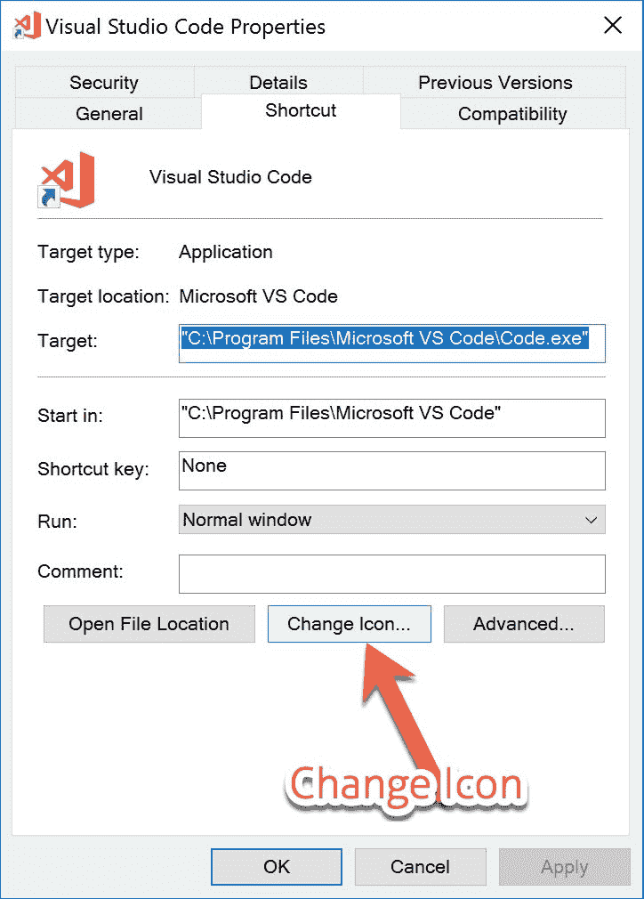
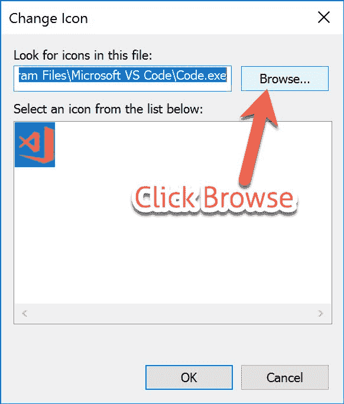
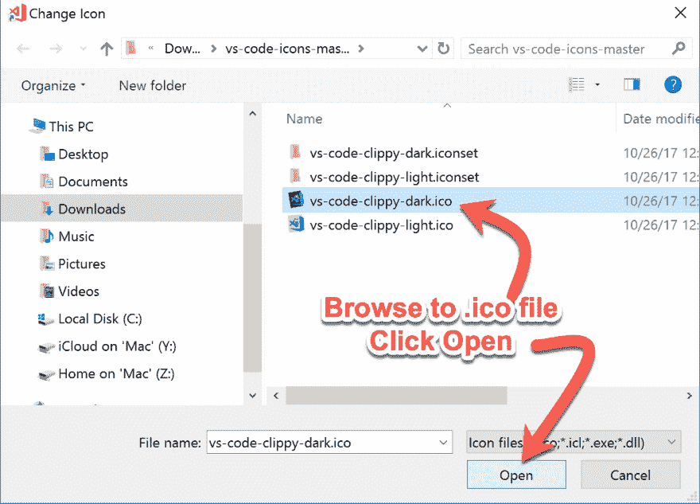

# 自定义您的 VS 代码图标

> 原文:[https://dev.to/reverentgeek/customize-your-vs-code-icon-6gd](https://dev.to/reverentgeek/customize-your-vs-code-icon-6gd)

(或任何应用程序图标，就此而言。)

橙色的 Visual Studio 代码图标似乎惹恼了很多人。因此，微软将在下一个版本中改变它。

一些人对“南瓜香料”图标非常不满，他们开始用其他东西来代替它。

我想出了几个我自己的变体，让人想起我们在微软办公室的老朋友 Clippy。

[T2】](https://res.cloudinary.com/practicaldev/image/fetch/s--5s2B73oJ--/c_limit%2Cf_auto%2Cfl_progressive%2Cq_auto%2Cw_880/https://thepracticaldev.s3.amazonaws.com/i/43qq4terwnwcr8s4gbay.jpg)

你可以从以下网址下载 Windows 或 Mac 版的文件:[https://github.com/reverentgeek/vs-code-icons](https://github.com/reverentgeek/vs-code-icons)

如果您对自己的自定义图标有任何建议或要求，请告诉我！

## 如何在 macOS 上更改应用程序图标

*   下载或克隆 [GitHub 库](https://github.com/reverentgeek/vs-code-icons)
*   打开所需的。图标集文件夹
*   双击最大的。要在预览中打开的 png 文件
*   按 CMD+C 将图像复制到剪贴板

[T2】](https://res.cloudinary.com/practicaldev/image/fetch/s--ui3HdzDV--/c_limit%2Cf_auto%2Cfl_progressive%2Cq_auto%2Cw_880/https://thepracticaldev.s3.amazonaws.com/i/5lqz9iyq512ogjc60dmu.jpg)

*   打开您的应用程序文件夹
*   右击 Visual Studio 代码应用程序
*   点击“获取信息”

[T2】](https://res.cloudinary.com/practicaldev/image/fetch/s--fJrJVNqS--/c_limit%2Cf_auto%2Cfl_progressive%2Cq_auto%2Cw_880/https://thepracticaldev.s3.amazonaws.com/i/tdly96yyf1srkxou81d7.jpg)

*   单击左上角的应用程序图标
*   按 CMD+V 粘贴自定义图像

[T2】](https://res.cloudinary.com/practicaldev/image/fetch/s--0Ow0L3Kg--/c_limit%2Cf_auto%2Cfl_progressive%2Cq_auto%2Cw_880/https://thepracticaldev.s3.amazonaws.com/i/ezr7mz1mm375l7nd5bjx.jpg)

你现在在野兽模式下操作。

## 如何在 Windows 上更改应用程序图标

虽然在技术上可以通过仔细修改`.exe`文件来改变 Windows 中应用程序的图标(不适合胆小的人！)，你唯一能做的实际的事情就是改变捷径。

*   下载或克隆 [GitHub 库](https://github.com/reverentgeek/vs-code-icons)
*   启动 VS 代码应用程序
*   右键单击正在运行的应用程序，并将该应用程序固定到任务栏上(如果您还没有这样做)
*   关闭应用程序
*   shift+右键+单击任务栏上锁定的应用程序
*   单击“属性”

[T2】](https://res.cloudinary.com/practicaldev/image/fetch/s--Rlx3aEtX--/c_limit%2Cf_auto%2Cfl_progressive%2Cq_auto%2Cw_880/https://thepracticaldev.s3.amazonaws.com/i/mjce4hpsuauki2s8ye5c.jpg)

*   单击“更改图标”按钮

[T2】](https://res.cloudinary.com/practicaldev/image/fetch/s--o5yNnFtd--/c_limit%2Cf_auto%2Cfl_progressive%2Cq_auto%2Cw_880/https://thepracticaldev.s3.amazonaws.com/i/o75ad7ez4afijn1uwej2.jpg)

*   单击“浏览...”按钮

[T2】](https://res.cloudinary.com/practicaldev/image/fetch/s--YhSMCk3w--/c_limit%2Cf_auto%2Cfl_progressive%2Cq_auto%2Cw_880/https://thepracticaldev.s3.amazonaws.com/i/e7v0o49u2tn1d6o1sy6q.jpg)

*   找到所需的`.ico`文件并点击“打开”

[T2】](https://res.cloudinary.com/practicaldev/image/fetch/s--jrl27HdB--/c_limit%2Cf_auto%2Cfl_progressive%2Cq_auto%2Cw_880/https://thepracticaldev.s3.amazonaws.com/i/7z8v4imcdvkg9dkfrimt.jpg)

至少你的钉住应用看起来很牛逼！