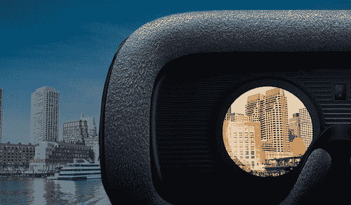

# AR 和 VR 如何重新定义房地产行业的体验？

> 原文：<https://dev.to/paulcook159/how-ar-and-vr-are-redefining-experiences-in-real-estate-industry-3ef>

想买自己梦想中的家却苦于找不到理想的选择？不再是了！随着技术的进步，房地产行业正在快速变化。房地产专业人士正在利用流行的技术，特别是增强现实(ar)和虚拟现实(VR)，为买家提供独特的体验。此外，根据高盛的报告，随着 AR 和 VR 预计到 2025 年将达到至少 800 亿美元，移动和网络应用开发专家 也有巨大的潜在业务。

[T2】](https://res.cloudinary.com/practicaldev/image/fetch/s--To3m2tDZ--/c_limit%2Cf_auto%2Cfl_progressive%2Cq_auto%2Cw_880/https://thepracticaldev.s3.amazonaws.com/i/fag0s7h3ujm1chzt9i0s.jpg)

现在让我们来看看 AR 和 VR 如何扰乱房地产场景，以及这项技术如何让你在竞争中获得优势。

## 让客户体验家居

问任何一个房地产经纪人，他们都会告诉你带客户看房需要多少时间。他们欢迎 AR 和 VR 应用程序，这些应用程序使他们展示房屋的过程变得更加简单和无缝。由于潜在买家可以从一个完全不同的角度体验一个家，客户可以在实际看到它之前过滤掉他们喜欢或不喜欢的房子，从而节省房地产经纪人的宝贵时间。

## 向国际投资敞开大门

随着房地产行业 AR 和 VR 的出现，外国投资有所增加。这是因为现在你可以一边在新加坡用餐，一边轻松体验旧金山的一处房产。因此，这些身临其境的技术正在释放全球房地产市场的国际投资潜力。

## 加速决策过程

早些时候，房地产开发商很难预售项目。这是因为过去很难让潜在买家看到最终产品。然而，现在有了 AR 和 VR，他们甚至可以在最终产品真正建成之前就带客户参观并体验它们。因此，有效地促进销售，并节省资金，避免长期滞留在项目中。

## 许多增强现实/虚拟现实应用正在上市

随着 AR 和 VR 对房地产行业产生重大影响，许多玩家都在推出自己的应用程序，以领先于竞争对手。然而，与经验丰富的 [**网络和移动应用程序开发机构**](https://www.heliossolutions.in/website-development-agency/) 合作以充分利用这个机会是非常重要的。

## 通过身临其境的观看体验促进奢侈品销售

房地产领域的许多交易都是在没有实际看到房产的情况下发生的。对于奢侈品销售来说，尽管潜在买家的数量有限，但身临其境的观看体验已经成为改变游戏规则的因素。因此，如果潜在买家来自另一个国家，AR/VR 应用程序可以在轻松转换他们方面发挥关键作用。

## 包装完毕

今天 AR/VR 可以给你竞争优势；然而，在未来十年，这将成为一种规范。因此，为了在行业中保持相关性，你需要随时掌握 AR 和 VR 的脉搏。
你是否同意 AR 和 VR 正在彻底改变房地产领域？请第一个让我知道你如何看待这些技术对房地产行业的影响。我很想收到你的来信；请在下面留下您的评论，开始对话。