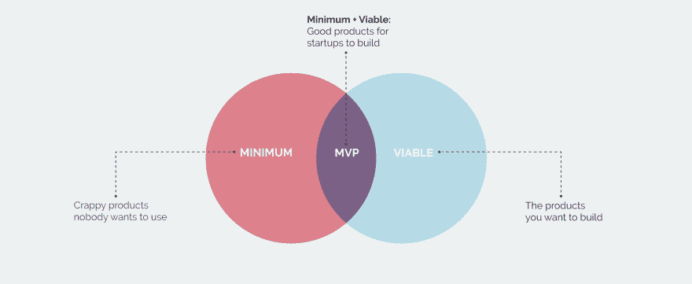
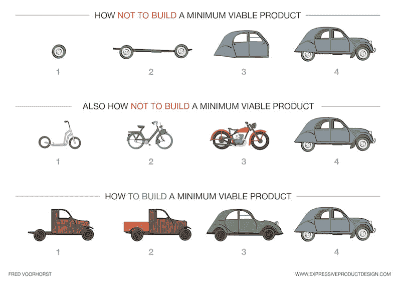

# MVP 悖论之谜

> 原文:[https://dev . to/galyna _ chekan/the-mystery-of-MVP-paradox-456 e](https://dev.to/galyna_chekan/the-mystery-of-mvp-paradox-456e)

精益创业运动[使‘最小可行产品](http://theleanstartup.com/)(MVP)’的概念变得广泛流行，从那以后每个人都虔诚地使用它。企业正在从 Eric Reis 的书中吸取经验，并试图适应和采用它的一些最佳实践，MVP 就是其中之一。但是 MVP 的问题和矛盾在于，为了在现代数字世界中取得成功，它不应该仅仅是最低限度的，也不应该仅仅是可行的。这也提出了一个问题，MVP 是否仍然是一个正确的术语。今天，我们深入探讨为什么大公司应该采用这种策略，并揭示它所聚集的矛盾，以最终弄清什么是 MVP？

[T2】](https://res.cloudinary.com/practicaldev/image/fetch/s--kJpThxIh--/c_limit%2Cf_auto%2Cfl_progressive%2Cq_auto%2Cw_880/https://perfectial.com/wp-content/uploads/2017/10/img0.jpg)

## 何必纠结 MVP？

如果执行正确，MVP 有助于首先关注最重要的，并从用户那里获得真实的反馈。通过把顾客的需求放在首位，它检查你是否有机会制造一个没人想要的产品。

* * *

在现代数字世界中，MVP 既不应该是最低的，也不应该是可行的。

[点击推文](https://twitter.com/share?text=MVP+in+a+modern+digital+world+should+be+neither+minimum+nor+viable.&via=perfectial&related=perfectial&url=https://perfectial.com/blog/the-mystery-of-mvp-paradox/)

* * *

MVP 不是最终产品，但它仍然必须为客户带来价值。这个想法是，不要开发一个成本高、耗时且通常有风险的产品的完美最终版本，而是专注于足够的功能，以首先带来影响，作为测试你的假设的一种方式。通过这种方式，你可以快速失败，快速学习，降低风险，并在产品开发的下一次迭代中应用你所获得的知识。初创公司很久以前就已经接受了这一点，企业正在通过变得敏捷来学习适应这一点。所以基本上 MVP 有助于降低项目的成本、时间和金钱。很多成功的项目都是从完美的 MVP 开始的，比如 [BuzzTarget](https://perfectial.com/cases/buzztarget/) 、 [Prosper p2p 借贷市场](https://perfectial.com/cases/prosper/)和 [Metic，SaaS 商业智能平台](https://perfectial.com/cases/metis/)。

但对大公司来说，挑战在于改变他们的思维模式。企业其实习惯于发布高度复杂、经过打磨的产品来展示自己的品质。交付一个功能不完整的产品可能看起来像是一个失败。通过采用 MVP，他们需要从发布这些完整的产品转移到通过一个发布周期了解哪些功能具有最大的 ROI 并对它们进行投资。

最小可行产品哲学可以帮助企业更好地采用那些敏捷原则，将创新实施和产品发布从几年加速到几个月。唯一需要解决的问题是如何执行 MVP？

## 如何不打造 MVP

一个非常受欢迎的“纸杯蛋糕 MVP”建议，与其从一个枯燥无味的蛋糕开始，然后添加馅料和糖衣，不如从一个纸杯蛋糕开始，迭代到蛋糕的最终版本。

这种方法的灵感来源于互联网上非常流行的“滑板变成汽车”的比喻。

[T2】](https://res.cloudinary.com/practicaldev/image/fetch/s--kgDFjTqW--/c_limit%2Cf_auto%2Cfl_progressive%2Cq_auto%2Cw_880/https://perfectial.com/wp-content/uploads/2017/10/How_To_Build_A_MVP.jpg)

图片来源:[expressiveproductdesign.com](http://www.expressiveproductdesign.com/minimal-viable-product-mvp/)

虽然它最初的想法是完全正确的——你不能开发单独的部分，最终组合成一个产品。一个对买车感兴趣的人对购买车轮的前景感到兴奋的可能性有多大？实际上，就像他们想买滑板或自行车的想法一样渺茫。

MVP 必须与你的最终产品有共同的核心特征。它应该是一系列产品，探索你的最终版本的关键想法。通过测试和迭代最低限度，你可以创建另一个原型，它不仅是最低限度的，而且是可行的，最终会把你带到产品本身。但是，当你想吸引汽车市场时，制造一辆功能齐全的摩托车并不是正确的做法。通过追求这种模式，你要么将你最初的汽车想法搁置，转而成为摩托车专家，要么你将通过你的 MVP 制造一个没有有效市场的产品。

MVP 悖论之谜这个帖子最早出现在[软件开发公司完美](https://perfectial.com)上。