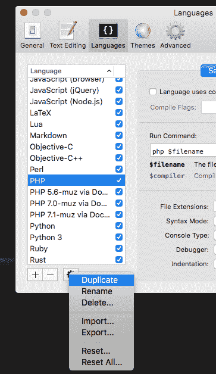
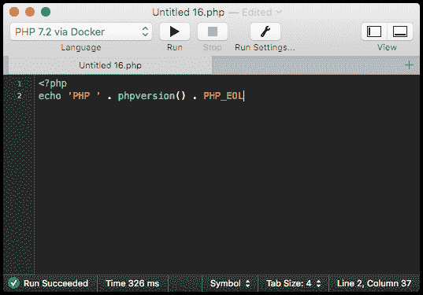
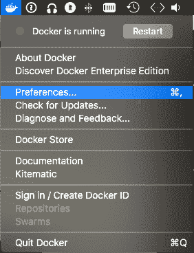
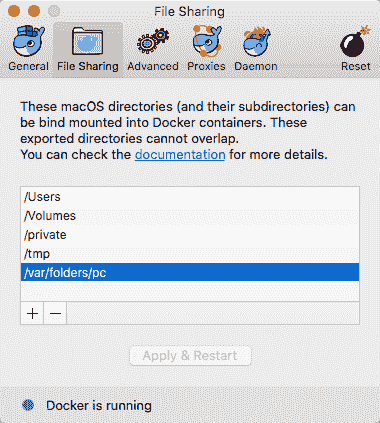

# 在 macOS 上使用 CodeRunner 通过 Docker 并行运行各种 PHP 版本

> 原文:[https://dev . to/JK/run-variable-PHP-versions-side-by-side-via-docker-using-coderunner-on-MAC OS-7n 5](https://dev.to/jk/run-various-php-versions-side-by-side-via-docker-using-coderunner-on-macos-7n5)

这些天我在 PHP 中做了很多小事情，但没有一件是真正的 web 开发。运行这些脚本的环境安装了各种 PHP 版本(我在看你，CentOS LTS)。因为我的大部分任务都涉及简短的 PHP 脚本，所以不值得启动 [phpStorm](https://www.jetbrains.com/phpstorm/) 并设置整个项目。

所以我使用了我的小脚本工具: [CodeRunner](https://coderunnerapp.com) ，但是它开箱即用，一次只支持一个 PHP 版本，因为它使用的是 macOS High Sierra 自带的预装 PHP，已经相当过时了。你可以通过 [Homebrew(软件包管理器)](https://brew.sh/)安装其他 PHP 版本，但是并行使用它们并不是一件愉快的事情。为此，我更喜欢使用[码头](https://www.docker.com/)。这就是我们要做的，让我们开始配置 CodeRunner:

# 设置 CodeRunner

*   首先进入设置(`⌘;` ) →语言，在左侧列表中搜索`PHP`。
*   用列表下方的设置按钮复制`PHP`
*   将其重命名为有意义的名称，如`PHP 7.1 via Docker`
*   对于**运行命令**,输入

```
docker run --rm -v $(pwd):/opt/project php:7.1 -f /opt/project/$filename 
```

<svg width="20px" height="20px" viewBox="0 0 24 24" class="highlight-action crayons-icon highlight-action--fullscreen-on"><title>Enter fullscreen mode</title></svg> <svg width="20px" height="20px" viewBox="0 0 24 24" class="highlight-action crayons-icon highlight-action--fullscreen-off"><title>Exit fullscreen mode</title></svg>

这是从名为`php:7.1`的映像运行一个新容器。`-v $(pwd):/opt/project`将 CodeRunner 运行代码的当前目录装载到容器内的`/opt/project`中。
`-f /opt/project/$filename`告诉容器内的 php 二进制程序运行名为`/opt/project/$filename`的脚本。
`$filename`实际上是 CodeRunner 将你的代码(临时)保存到的文件名的占位符。
最后但同样重要的是，`--rm`将确保在 CodeRunner 执行您的代码后，它将再次从您的系统中删除刚刚创建的容器。
这样做还有一个好处，那就是每次你在 CodeRunner 中运行你的代码时，它会在一个新的环境中执行(你在`/opt/project`目录下保存的所有代码都会被清除)

*   关闭设置窗口并将 CodeRunner 窗口置于最前面
*   在工具栏中，有一个下拉字幕语言。选择您新创建的标记为`PHP 7.1 via Docker`的 PHP 环境。

# 为 Mac 设置 Docker

在我们开始之前，我们必须允许 Mac 版的 Docker 挂载(CodeRunner 放置临时文件的目录。为了做到这一点

*   通过菜单项打开 Mac Preferences…的 Docker
*   转到`File Sharing`选项卡并点击`+`按钮
*   这将打开系统打开对话框。你打开哪个目录并不重要，所以你只需点击右下角的打开按钮
*   新创建列表项必须双击。现在你可以修改它了
*   输入`/var/folders/pc`并按回车键(↩) 

# 汇集一切

如果您不适合，请输入类似下面的脚本来测试您新创建的 CodeRunner docker 环境:

```
<?php
echo 'PHP ' . phpversion() . PHP_EOL; 
```

<svg width="20px" height="20px" viewBox="0 0 24 24" class="highlight-action crayons-icon highlight-action--fullscreen-on"><title>Enter fullscreen mode</title></svg> <svg width="20px" height="20px" viewBox="0 0 24 24" class="highlight-action crayons-icon highlight-action--fullscreen-off"><title>Exit fullscreen mode</title></svg>

当你第一次使用`php:7.1` Docker 镜像时，它需要先从 Docker Hub 下载，这可能需要几秒到几分钟，取决于你的互联网连接。它将如下所示:

```
Unable to find image 'php:7.1' locally
7.1: Pulling from library/php

85b1f47fba49: Already exists 
66e22dddbf92: Already exists 
bf0df491fd2e: Already exists 
0cbe7899c5b5: Already exists 
515aeb1bd86c: Already exists 
842bd485599e: Already exists 
Digest: sha256:9d847a120385a1181ffa8ba4d17f28968fb2285923a0ca690b169ee512c55cb1
Status: Downloaded newer image for php:7.1 
```

<svg width="20px" height="20px" viewBox="0 0 24 24" class="highlight-action crayons-icon highlight-action--fullscreen-on"><title>Enter fullscreen mode</title></svg> <svg width="20px" height="20px" viewBox="0 0 24 24" class="highlight-action crayons-icon highlight-action--fullscreen-off"><title>Exit fullscreen mode</title></svg>

然后你会得到你的 PHP 脚本的输出: [](https://res.cloudinary.com/practicaldev/image/fetch/s--ycQbLCtu--/c_limit%2Cf_auto%2Cfl_progressive%2Cq_auto%2Cw_880/https://thepracticaldev.s3.amazonaws.com/i/jchf51jyp4066ljqlzij.png)

# 下一步怎么办？

恭喜你，你已经完成了，可以在 CodeRunner 中通过 Docker 运行你的简短 PHP 脚本了。您可以为其他 PHP 版本克隆`PHP 7.1 via Docker`环境。目前官方 PHP docker 镜像中有几个版本，甚至是 PHP 7.2 的最新预发布版本。

但是这种方法并不局限于 PHP。我想你可以为你的 python、node.js 和 ruby 环境设置一些类似的东西。

但是有一个警告:您必须读取相应的`Dockerfile`来找出在映像中的何处设置挂载点(它可能不是`/opt/project`),以便在运行 docker 容器时找到您想要执行的文件。