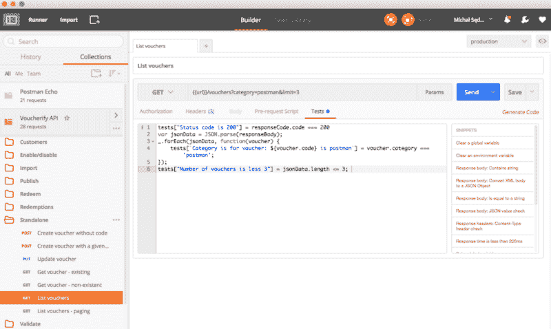
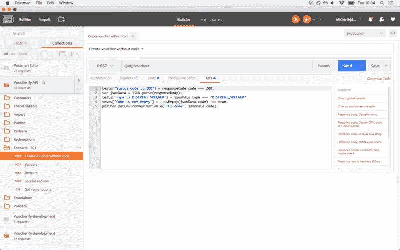
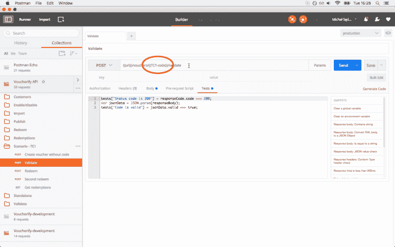

# 邮差真的增压器你的 api

> 原文:[https://dev . to/msedzielewski/postman-really-super charges-your-API-9og](https://dev.to/msedzielewski/postman-really-supercharges-your-api-9og)

上次用[邮差](https://www.getpostman.com)已经有一段时间了。既然我们需要快速测试一个端点，我决定再次使用它。当我发现邮递员比我们几年前看到的能干得多的时候，我感到很惊讶。令人惊讶的是，一个像玩具一样的小 Chrome 插件已经发展成为一个生产就绪的测试框架，背后有一个很好的商业模式。这就是为什么我们决定让 Postman 来增强我们的优惠券管理 API 平台。

### UX 或其实是 DX

邮差超级好用。不需要教程。您只需打开构建器并开始编写请求。无论您是开发人员、质量保证人员、运营人员还是项目经理，您都能立即了解它的工作方式。这就是为什么它成为了[vouchi fy](https://voucherify.io/?utm_campaign=tech&utm_medium=Post&utm_source=devto)的一个有用的交流工具。例如，我们可以用它来向客户演示。或者，我们可以交流与特定端点相关的问题。最后，由于请求历史，我们可以试验各种极限情况，确保 API 没有错误，并提供良好的整体开发人员体验。除此之外，Postman 还有一个很棒的实用功能，可以帮助您入门。像标题自动完成、cURL 导入、代码生成器、批量编辑、请求复制这样的一些东西使入职过程变得更加顺利。

### 协作

如果没有共享功能，上面描述的可用性特征将是半个生产力。有了 Postman collections，只需点击几下鼠标就可以共享了(我提到过 collections 吗？).您可以在 Team Library 中找到的角色管理器使您能够定义谁可以在您的组织中查看什么。虽然这是一个付费功能，但在我们看来这是值得的。尤其是从每月 5 美元开始的时候。

### 测试框架

Postman 也已经发展成为一种高级测试工具。通过引入参数和断言，您可以创建非常复杂的测试场景。同样，将 JavaScript 解释器放入测试部分给你额外的能力。看这个:

[T2】](https://res.cloudinary.com/practicaldev/image/fetch/s---FeKCRnS--/c_limit%2Cf_auto%2Cfl_progressive%2Cq_auto%2Cw_880/https://cdn-images-1.medium.com/max/800/1%2ARCURmax5GHpSj55QjPDeVw.png)

在这个例子中，我们检查包含列表的响应是否正确。请注意，您不仅可以编写纯 JavaScript，而且 postman 的人还包括了 lodash 和其他实用程序，支持的库的完整列表可在此处获得[。](https://www.getpostman.com/docs/sandbox)除此之外，如果仔细观察端点的 URL，您会发现我们在那里使用了一个参数。您应该知道，除了像这样的内置动态变量:

*

`{{$guid}}`

:添加 v4 样式 guid

*

`{{$timestamp}}`

:添加当前时间戳。

*

`{{$randomInt}}`

:添加 0 到 1000 之间的随机整数

Postman 让您能够定义自己的变量，这些变量反过来可以被分组到环境中。这是一个强大的特性，因为我们可以在生产机器和本地机器之间快速切换测试目标。此外，团队成员或客户可以轻松共享环境，因此这使得测试和故障排除速度更快。在未来，我希望它能有助于涵盖不同版本的 API。到目前为止，我们已经设法不在 v1 中引入突破性的变化。使 Postman 成为一个严肃的测试框架的另一个很好的特性是在测试之间存储上下文的能力。以一个基本的凭证流程为例:

*   创建唯一的一次性优惠券(返回只能兑换一次的唯一代码)
*   验证代码(通知客户端应用程序代码是否有效，如果为真，则返回折扣值)
*   兑现凭单(实际上将凭单标记为已使用，以便它变得无效)
*   再次兑换优惠券(由于限制，应该会失败)
*   获取优惠券的兑换历史记录(应返回兑换的详细信息)

在第一个请求被调用后，Voucherify 返回一个唯一的代码。这里的关键是其他请求依赖于这段代码，所以我们需要找到一种方法来传递它。邮差的环境和全球存储来拯救这里。请参见下面的示例:

[T2】](https://res.cloudinary.com/practicaldev/image/fetch/s--mXj6z4k5--/c_limit%2Cf_auto%2Cfl_progressive%2Cq_auto%2Cw_880/https://cdn-images-1.medium.com/max/800/1%2Adk5Ozf7P5nmCJs9v85NxbA.png)

我们放入了一行程序(postman.setEnvironmentVariable 方法),从现在开始，我们可以在其他请求中引用 TC1-code 参数。无论是在请求 URL、有效负载还是测试部分。
*提示:测试用例完成后，最好清理一下上下文，这样就不会干扰其他场景。*

[T2】](https://res.cloudinary.com/practicaldev/image/fetch/s--1MV3v4lg--/c_limit%2Cf_auto%2Cfl_progressive%2Cq_auto%2Cw_880/https://cdn-images-1.medium.com/max/800/1%2AGbclqHguReyymEMyhoMpfg.png)

### 客户入职

最后，Postman 是一个很好的工具，可以让开发者使用你的 API。开发者体验在我们的业务中非常重要。这就是为什么像 Run in Postman 或 Postman Documenter 这样的工具非常有助于简化第一步，并让开发人员运行更高级的场景。这是他们快速确保 Voucherify 满足优惠券软件要求的方法。Run in Postman 是分享功能的一部分。它将集合公开，这样任何拥有免费邮差帐户的人都可以导入它。而邮差发电机的磨合更是锦上添花。在我们的例子中是这样的:

[T2】](https://app.getpostman.com/run-collection/9b17c94efccb5776be35#?env%5Btest%5D=W3siZW5hYmxlZCI6dHJ1ZSwia2V5IjoidXJsIiwidmFsdWUiOiJodHRwczovL2FwaS52b3VjaGVyaWZ5LmlvL3YxIiwidHlwZSI6InRleHQifSx7ImVuYWJsZWQiOnRydWUsImtleSI6IlgtQXBwLUlkIiwidmFsdWUiOiJjNzBhNmYwMC1jZjkxLTQ3NTYtOWRmNS00NzYyODg1MDAwMmIiLCJ0eXBlIjoidGV4dCJ9LHsiZW5hYmxlZCI6dHJ1ZSwia2V5IjoiWC1BcHAtVG9rZW4iLCJ2YWx1ZSI6IjMyNjZiOWY4LWUyNDYtNGY3OS1iZGYwLTgzMzkyOWIxMzgwYyIsInR5cGUiOiJ0ZXh0In0seyJlbmFibGVkIjp0cnVlLCJrZXkiOiJDbGllbnQtQXBwLUlkIiwidmFsdWUiOiIwMTEyNDBiZi1kNWZjLTRlZjEtOWU4Mi0xMWViNjhjNDNiZjUiLCJ0eXBlIjoidGV4dCJ9LHsiZW5hYmxlZCI6dHJ1ZSwia2V5IjoiQ2xpZW50LUFwcC1Ub2tlbiIsInZhbHVlIjoiOWUyMjMwYzUtNzFmYi00NjBhLTkxYzYtZmJlZTY0NzA3YTIwIiwidHlwZSI6InRleHQifV0=)

Postman 文档——另一个在入职阶段发挥巨大价值的单击式工具。该工具为您的请求集合生成并发布交互式文档。为了让事情变得更好，这个在线规范允许您为 7 种风格(cURL、jQuery、Node、Ruby、PHP、Go 和 Python)的请求生成代码片段。

### 持续整合

我们还没有看到 Newman——一个命令行收集程序。这不仅对终端发烧友来说是一个很好的特性，而且它还开辟了一条将 Postman 测试集成到持续集成管道中的途径。已经有[教程](https://www.getpostman.com/docs/integrating_with_jenkins)如何连接到詹金斯。纽曼与[工作流](https://www.getpostman.com/docs/workflows)的结合听起来像是运行综合测试套件的强大工具的良好候选。

### 定价

所有这些功能每月 5 美元？这就是我们所说的超效益成本比。尤其是当你把它和 Runscope 相比时，run scope 给了你更多的功能，但是起价是 79 美元。我们从第一天起就喜欢邮递员。它已经成为 Voucherify 的常用工具，因为它在许多领域支持我们的 API 优先平台，如质量保证、客户支持或最终的开发人员入职。事实上，他们做到了天衣无缝。我喜欢认为 Voucherify 在优惠券管理软件方面将达到相同的开发人员体验水平。

* * *

*最初发布于 [www.voucherify.io](https://voucherify.io/blog/postman-really-supercharges-your-api) 。*