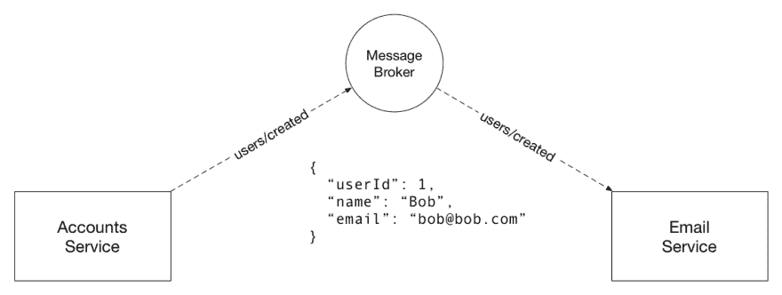

# 事件驱动架构和 AsyncAPI

> 原文:[https://dev.to/fmvilas/event-driven-architectures-阿辛卡皮-db7](https://dev.to/fmvilas/event-driven-architectures--asyncapi-db7)

我们作为工程师，经常忘记 API 不仅仅是 HTTP APIs。我们已经如此习惯于思考 HTTP 和 REST APIs，以至于我们甚至不得不停下来回忆 API 术语的含义。API 代表*“应用编程**接口**”*。这正是我想要关注的*【界面】*部分。根据牛津词典，接口是:

> 两种制度、主体、组织等的结合点。见面互动。

在软件工程中，高质量的架构总是与定义良好的接口和责任边界紧密相连。同样，定义不清的接口和边界通常是糟糕设计的主要原因。

## 事件驱动架构

当设计事件驱动架构(EDA)时，您也在构建 API。这些 API 将位于您的服务的边界内，并允许它们进行通信。

主题和消息是一等公民，因为它们精确地代表了服务接口。考虑下面的例子:

[T2】](https://res.cloudinary.com/practicaldev/image/fetch/s--v37Ew-Va--/c_limit%2Cf_auto%2Cfl_progressive%2Cq_auto%2Cw_880/https://thepracticaldev.s3.amazonaws.com/i/oprf1q5igrhcejazg7ig.png)

电子邮件服务期望收到关于`users/created`主题的消息。该消息必须包含有关用户姓名和电子邮件的信息，以便能够发送正确的欢迎电子邮件。

你能想象如果我们改变帐户服务，现在它通过`accounts/created`主题发送消息会发生什么吗？或者，如果我们改变消息，现在它在`emailAddress`字段中指定电子邮件，而不是`email`字段，会怎么样？在第一种情况下，消息将永远不会到达电子邮件服务，因此，您不会得到一个错误，但系统将停止正常工作。在第二种情况下，从电子邮件服务的角度来看，消息将是格式错误的。

如您所见，主题和消息是我们服务的接口，因此我们必须关心它们，尤其是在服务数量增长的时候。我们应该像对待 HTTP APIs 中的端点、请求和响应有效负载一样注意。

## AsyncAPI

AsyncAPI 提供了一个规范，允许您以机器可读的格式定义消息驱动的 API。该规范与 OpenAPI/Swagger 非常相似，因此，如果您熟悉它们，AsyncAPI 对您来说应该很容易。

### 它是如何工作的？

您的 API 定义由一个文件或一组文件组成，您可以在其中定义主题、消息、服务器等等。之后，您可以使用这些文件来创建文档、工具或任何您需要的东西。

### 用例

AsyncAPI 有许多有用的用例，主要是为您的 API 生成人类可读的文档和引导代码。但是，其他使用案例包括:

*   文档-第一次开发:你的 API 实现不会改变，除非你改变它的文档。
*   **API 测试**:因为您有所有的 API 信息，您可以很容易地生成集成测试。
*   **API 管理**:您可以构建 API 管理解决方案，从 AsyncAPI 文件中收集信息。
*   **监控**:您可以创建工具来帮助您监控您的 API。

### 入门

开始使用 AsyncAPI 的一个简单直接的方法是使用[在线编辑器](http://editor.asyncapi.org)。不过，如果你有心情写代码，可以看看 asyncapi.org 的[网站和](https://asyncapi.org)[教程](https://www.asyncapi.com/v1/tutorial/)。

### 进一步资源

*   [AsyncAPI HTML 文档生成器](https://github.com/asyncapi/docgen)
*   [AsyncAPI Slate/Shins 文档生成器](https://github.com/Mermade/widdershins)
*   [API:世界 2017 幻灯片](https://www.slideshare.net/fmvilas/asyncapi-specification)