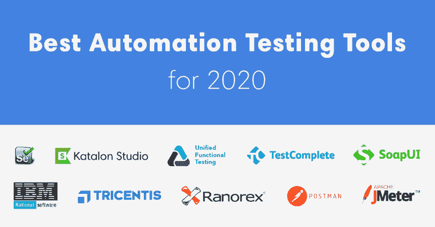
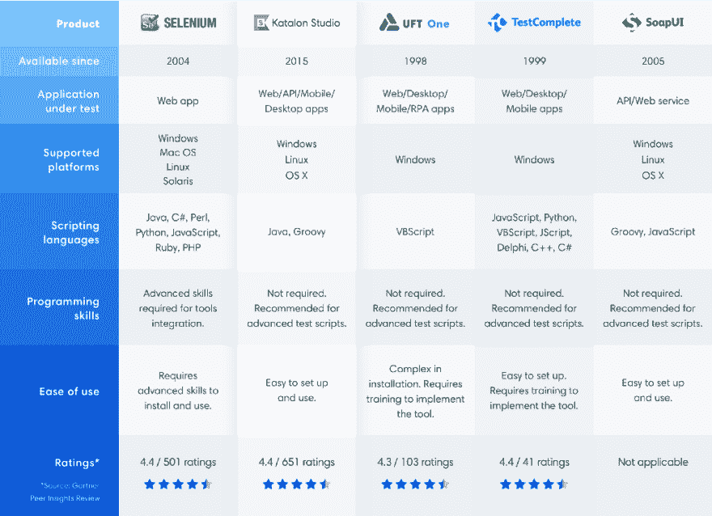

# 2020 年最佳自动化测试工具(10 大评论)

> 原文：<https://dev.to/briananderson2209/best-automation-testing-tools-for-2020-top-10-reviews-2dk7>

<figure>

<figcaption>2020 年最佳自动化测试工具</figcaption>

</figure>

更快地交付高质量软件的需求——或者“快速的质量”——要求组织在敏捷、持续集成(CI)和 DevOps 方法中寻找解决方案。测试自动化是这些方面的重要组成部分。最新的《2018–2019 年世界质量报告》表明，测试自动化是交付“快速质量”的最大瓶颈，因为它是成功采用敏捷和 DevOps 的促成因素。

没有好的工具就无法实现测试自动化；因为它们决定了如何执行自动化以及自动化的好处是否能够实现。测试自动化工具是 DevOps 工具链中至关重要的组件。当前的测试自动化趋势在应用人工智能和机器学习(AI/ML)来提供测试优化、智能测试生成、执行和报告的高级能力方面有所增长。了解哪些工具最适合利用这些趋势是值得的。

这里有一些顶级的测试自动化工具，它们被认为能够最好地解决未来几年自动化中的挑战。此列表中包含的工具选自以下标准:

*   支持 API 和服务测试
*   提供一些人工智能/人工智能和分析能力
*   流行和成熟

<figure>

<figcaption>2020 年前 5 大自动化测试工具</figcaption>

</figure>

### **1。硒**

[T2】](https://res.cloudinary.com/practicaldev/image/fetch/s--VG5JuYeO--/c_limit%2Cf_auto%2Cfl_progressive%2Cq_auto%2Cw_880/https://cdn-images-1.medium.com/max/1024/1%2AKYPmb-9juZ9L9FvDFqHh0g.png)

谈到测试自动化，Selenium 是一个家喻户晓的名字。它被认为是 Web 应用程序用户界面自动化测试的行业标准。根据对测试自动化挑战的调查**，几乎十分之九的测试人员正在或者曾经在他们的项目中使用 Selenium。**

 **对于拥有编程和脚本编写经验和技能的开发人员和测试人员来说，Selenium 提供了许多其他测试自动化工具和框架所没有的灵活性。用户可以用许多不同的语言(如 Java、Groovy、Python、C#、PHP、Ruby 和 Perl)编写测试脚本，这些脚本可以在多个系统环境(Windows、Mac、Linux)和浏览器(Chrome、Firefox、IE 和 Headless 浏览器)上运行。

Selenium 最近于 2019 年 4 月发布了其首个 alpha 版本的 Selenium。Selenium 4 正式版的发布还有待确定，但你可以期待该版本将会有许多改进和丰富的功能。

为了有效地使用 Selenium，用户必须具备高级编程技能，并且需要花费大量时间来构建自动化框架和自动化所需的库。这是 Selenium 的主要缺点，其他为无代码测试自动化构建的工具(如 Katalon Studio)解决了这个问题。

网址:[https://selenium.dev/](https://selenium.dev/)

许可证:开源

### **2。卡塔龙工作室**

[T2】](https://res.cloudinary.com/practicaldev/image/fetch/s--Lroy-ZsS--/c_limit%2Cf_auto%2Cfl_progressive%2Cq_auto%2Cw_880/https://cdn-images-1.medium.com/max/1024/1%2AlRcOrsi33D8JeNAIOm6agQ.png)

Katalon Studio 是一个强大而全面的自动化解决方案，用于测试 API、Web、移动和桌面应用程序测试。它还为这些类型的测试提供了丰富的特性集，并支持多种平台，包括 Windows、macOS 和 Linux。

利用 Selenium 和 Appium 引擎，Katalon Studio 为那些在集成和部署不同框架和库以使用 Selenium 和 Appium 时遇到困难的测试人员，以及那些已经熟悉这些引擎的测试人员提供了一个独特的集成环境。

Katalon Studio 被评为 2020 年 Gartner Peer Insights 客户对软件测试自动化的选择，获得了 600 多条正面评论，这再次证明了该工具现在是市场上最大的参与者之一。

该工具的亮点包括:

*   API/Web 服务、Web 和移动应用程序测试自动化的完整功能集
*   支持 SOAP 和 RESTful 进行 API 和服务测试
*   数百个用于创建测试用例的内置关键字
*   支持 BDD Cucumber 用自然语言表达测试场景
*   可用于自动化测试和探索性测试
*   测试能力可以通过[卡塔隆商店](https://store.katalon.com)上的插件扩展[卡塔隆测试操作](http://analytics.katalon.com/)上报告的深度视图

2020 年 4 月，Katalon 发布了其最新更新——Katalon Studio 7.3——主要增强功能支持可扩展项目，解决了 Selenium 中的等待问题，在多个项目之间共享测试工件，等等。

网址:[https://www.katalon.com/](https://www.katalon.com/)

许可:免费——每年 759 美元

### **3。UFT 一号**

[T2】](https://res.cloudinary.com/practicaldev/image/fetch/s--BEqcAj1T--/c_limit%2Cf_auto%2Cfl_progressive%2Cq_auto%2Cw_880/https://cdn-images-1.medium.com/max/1024/1%2A6pQEcN730YjwhABvwGfJ4A.png)

UFT 一号(原名 UFT)是一款流行的商业工具，用于测试 Web、桌面、移动和 RPA 应用程序。它已经被扩展到包括一组很好的 API 测试功能。通过支持多平台的目标应用程序测试(AUT)，UFT 一号提供了一个方便的选择，以测试在桌面，网络和移动设备上运行的 AUT。

UFT 一号为智能对象检测、基于图像的对象检测和校正提供了多种高级功能。2020 年 1 月，微焦点发布了最新版本的 UFT (v15.0)。该更新提供了新的功能和增强，简化了测试过程，提高了测试效率，并在减少测试时间的同时保持了质量。

该工具支持 API 测试的几个亮点:

*   用于创建、执行和报告 API 测试的直观用户界面
*   支持从 WADL 文档生成 API 测试
*   测试的动作、活动和参数可以在图表中可视化

网址:[https://software.microfocus.com/fr-ca/software/uft](https://www.microfocus.com/en-us/products/uft-one/overview)

许可证:每年 3200 美元起。

### **4。测试完成**

[T2】](https://res.cloudinary.com/practicaldev/image/fetch/s--3QK6oH4l--/c_limit%2Cf_auto%2Cfl_progressive%2Cq_auto%2Cw_880/https://cdn-images-1.medium.com/max/1024/1%2AvNFofl4KRqZJGf2VPxhrBw.png)

TestComplete 因其强大而全面的 Web、移动和桌面应用程序测试功能而继续位列今年的榜单。测试人员可以使用 JavaScript、VBScript、Python 或者 c++脚本来编写测试脚本。

像 UFT 一号一样，TestComplete 有一个对象识别引擎，可以准确地检测动态用户界面元素。该引擎在具有动态和频繁变化的用户界面的应用程序中特别有用。

TestComplete 版本 14.4 于 2020 年 4 月发布，包括其与吉拉集成的改进——在用户的吉拉项目上创建任何类型的问题。跨平台 web 测试允许用户在支持的浏览器中手动记录/创建 web 测试，并在各种其他浏览器中运行这些测试。自我修复功能，利用改进的基于人工智能的算法，通过图像找到替换对象。测试人员可以很容易地使用 TestComplete 的记录和回放功能，就像 Katalon Studio 一样。他们可以在测试步骤中插入检查点来验证结果。作为 SmartBear 的产品，TestComplete 可以很容易地与 SmartBear 提供的其他产品集成。

网址:[https://smartbear.com/product/testcomplete/overview/](https://smartbear.com/product/testcomplete/overview/)

许可证:每年 5803 美元起

### **5。SoapUI**

[T2】](https://res.cloudinary.com/practicaldev/image/fetch/s--RoYp8x9j--/c_limit%2Cf_auto%2Cfl_progressive%2Cq_auto%2Cw_880/https://cdn-images-1.medium.com/max/1024/1%2ALLVG_4HAklyUEoAXx0sXOQ.png)

SoapUI 不是用于 Web 或移动应用程序测试的测试自动化工具，但它可以成为测试 API 和服务的首选工具。它是一个专门为 API 测试设计的无头功能测试工具。

SoapUI 支持 REST 和 SOAP 服务。API 自动化测试人员可以使用开源或专业版本。pro edition 具有用户友好的界面和一些高级功能，如断言向导、表单编辑器和 SQL 查询生成器。SoapUI 是由 SmartBear 提供的 ReadyAPI 套件的一个工具。

该工具为 API 测试提供了非常全面的功能集，具有许多高级功能，包括:

*   使用拖放和点击功能轻松生成测试
*   使用来自文件和数据库的数据进行强大的数据驱动测试
*   异步测试
*   脚本可以很容易地重用
*   使用 RESTful 模拟创建模拟服务

此外，SoapUI 最近将 SoapUI Pro 的 API Explorer 特性引入了开源版本，允许开发人员和测试人员即时调试他们的 API 响应。SoapUI(开源)的最新版本 5.5 于 2019 年 2 月发布，其中添加了端点资源管理器对话框，以帮助用户发送探索性请求和分析响应，而无需创建项目。然而，版本 3.1.0 (Pro)允许用户使用外部数据源来快速做出反应，如果用户想要模拟不同的用户行为，而不需要重新创建他们的测试用例。

网址:[https://www.soapui.org/](https://www.soapui.org/)

许可:免费——每年 709 美元。

请注意，SoapUI 和 Postman 只是这个列表中几个顶级 API 测试工具的两个代表。要了解更多关于这些工具之间的比较，请参考 [**这篇文章**](https://www.katalon.com/resources-center/blog/soapui-vs-postman-katalon-api-tools/) 。

### **6。IBM Rational Functional Tester(RFT)**

[T2】](https://res.cloudinary.com/practicaldev/image/fetch/s--h-Hw0MM7--/c_limit%2Cf_auto%2Cfl_progressive%2Cq_auto%2Cw_880/https://cdn-images-1.medium.com/max/1024/1%2ADjetfamKwMYw_nJzdGUd4g.png)

IBM Rational Functional Tester 是一个测试自动化工具，设计用于测试使用不同语言和技术开发的应用程序，例如 Web。Net、Java、Visual Basic、Siebel、SAP、PowerBuilder、Adobe Flex 和 Dojo Toolkit。它也是一个数据驱动的测试平台，用于功能和回归测试。

该工具的一些亮点:

*   通过屏幕截图的可视化编辑提供了一种可视化的故事板格式来表示测试动作，允许用户适应频繁的用户界面变化，并避免维护开销的增加。
*   高级 ScriptAssure 技术
*   早期数据检测
*   测试脚本允许用户在 Java 或 Visual Basic 之间进行选择。网
*   与其他软件集成，支持协作式应用生命周期管理

RFT 提供了一个名为“故事板测试”的特性，它帮助使用自然语言和应用程序截图来可视化和编辑测试。RFT 的 ScriptAssure 功能允许测试人员生成对 AUT 用户界面变化有弹性的测试脚本。RFT 还可以与其他 IBM 的应用程序生命周期管理工具集成，例如 IBM Rational Team Concert 和 Rational Quality Manager。

网址:[https://en.wikipedia.org/wiki/Rational_Functional_Tester](https://en.wikipedia.org/wiki/Rational_Functional_Tester)

许可证:商业-联系销售

### **7。特里森蒂斯托斯卡**

[T2】](https://res.cloudinary.com/practicaldev/image/fetch/s--tA6Otktr--/c_limit%2Cf_auto%2Cfl_progressive%2Cq_auto%2Cw_880/https://cdn-images-1.medium.com/max/1024/1%2AOGr2gh0QwMrTBqJzo648UA.png)

有一些连续测试平台提供了全面的工具集来支持从测试设计和测试自动化到测试报告和分析的大多数(如果不是全部)测试活动。特里森蒂斯托斯卡就是其中之一。

该工具具有许多功能，如仪表板、分析、集成和分布式执行，以支持持续集成和 DevOps 实践。此外，它为设计、实现、执行、管理和优化 API 测试提供了友好的用户界面和丰富的特性集。

该工具的其他一些亮点:

*   可以轻松集成为 DevOps 流程的重要组成部分
*   API 测试可以跨浏览器、移动设备和平台执行
*   支持多种协议和标准，包括 HTTP(s) JMS、AMQP、Rabbit MQ、TIBCO EMS、SOAP、REST 和 IBM MQ
*   一套良好的测试报告和分析功能

Tricentis Tosca 支持 API 连接管理器中的 API 安全配置。它还允许用户使用签名安全选项对消息的多个部分进行签名。

Tricentis 声称显著减少了回归测试(从几周到几分钟的数量级)。然而，这种说法需要由测试团队仔细验证。

在 2020 年 3 月发布的最新版本 13.1 中，不再支持部分功能和集成，如移动探索性测试、洪水集成、Android SDK 等。

网址:[https://www.tricentis.com/](https://www.tricentis.com/)

许可证:商业-联系销售

### **8。Ranorex**

[T2】](https://res.cloudinary.com/practicaldev/image/fetch/s--1yCVhRe0--/c_limit%2Cf_auto%2Cfl_progressive%2Cq_auto%2Cw_880/https://cdn-images-1.medium.com/max/1024/1%2A7DA3nAzbBn33Byjoa-weLw.png)

Ranorex 已经存在很多年了，它为 Web、移动、桌面和 API 测试提供了一套全面而专业的特性。利用其在基于桌面的测试自动化方面的经验，Ranorex 拥有先进的 UI 元素识别、编辑和管理能力。

像 Katalon Studio 一样，Ranorex 通过友好直观的 GUI、记录/回放和脚本生成，使自动化测试对测试人员来说变得容易。

测试人员可以将 Ranorex 与 Selenium Grid 集成，以支持分布式测试和并行测试执行。

Ranorex 9.3 引入了增强的吉拉和 TestRail 报告。最新版本 rano rex Studio 9 . 3 . 1(2020 年 3 月)提供了 Ranorex Instrumentation Wizard 来重新签名使用代码签名 v2.0 签名的 iOS IPA 包。

网址:[https://www.ranorex.com/](https://www.ranorex.com/)

许可证:高级许可证 2，290 欧元起。

### **9。邮递员**

[T2】](https://res.cloudinary.com/practicaldev/image/fetch/s--hAx3EPau--/c_limit%2Cf_auto%2Cfl_progressive%2Cq_auto%2Cw_880/https://cdn-images-1.medium.com/max/1024/1%2AnIiWHN60z4IvBUCsTzIUoQ.png)

Postman 是另一个为 API 测试设计的自动化工具。用户可以将该工具作为浏览器扩展或桌面应用程序安装在 Mac、Linux 和 Windows 上。它不仅在 API 测试自动化的测试人员中流行，而且在使用该工具开发和测试 API 的开发人员中也很流行。事实上，它是一个开发和测试 API 的开发环境。

该工具的一些亮点:

*   用于设计、调试、测试、记录和发布 API 的全面功能集
*   友好易用的用户界面
*   支持自动化测试和探索性测试
*   接受 Swagger 和 RAML API 格式
*   请求和回复可以打包并与团队成员共享

在 2019 年 6 月发布的 7.2 版本中，Postman 扩展了对 GraphQL 请求和模式、GraphQL 查询自动完成功能以及 GraphQL 变量的支持。适用于 Mac、Windows 和 Linux 应用程序的最新版本 7.21.2 已于 2020 年 4 月发布，并修复了一些小错误。

网址:[https://www.getpostman.com/](https://www.getpostman.com/)

许可:免费——每位用户每年 216 美元

### **10。阿帕奇 JMeter**

[T2】](https://res.cloudinary.com/practicaldev/image/fetch/s--QfD9siyz--/c_limit%2Cf_auto%2Cfl_progressive%2Cq_auto%2Cw_880/https://cdn-images-1.medium.com/max/1024/1%2AZQrRefV04WtXCg9MSpVCng.png)

JMeter 是一个为测试加载和性能测量而设计的开源工具——JMeter 的两个特性是众所周知的。然而，该工具现在也用于 API 和服务测试，尤其是 API 性能测试。JMeter 是第三个最受欢迎的测试自动化工具，在 [**测试自动化挑战调查**](https://www.katalon.com/resources-center/blog/infographic-challenges-test-automation/) **中，有 25%的受访者提到了它。**

该工具的亮点包括:

*   轻巧，用户界面简单易用
*   测试结果可以重放
*   支持 CSV 文件来设置 API 参数的值
*   支持与 Jenkins 等 CI 工具的集成。JMeter 经常被用作 CI 和 DevOps 工具链的一部分

2019 年 11 月最新发布的 JMeter 5.2 已经堆叠了多个新功能、增强和许多错误修复，例如新协议、JMESPath 提取器、JDBC 改进、StringtoFile、HTTP 采样器。最新版本 5.2.1 仅修复了一些小错误。

网址:[https://jmeter.apache.org/](https://jmeter.apache.org/)

许可证:开源

— — — — —

这里的顶级工具列表并不详尽；但它代表了成熟、受欢迎的最佳工具，并提供了使用 AI/ML 来解决组织在交付“速度质量”时所面临的挑战的能力该列表还包括了专门支持 API 和服务测试的工具，这些测试对于成功的敏捷和开发运维转型至关重要。

可以说，2020 年的软件测试工具格局将继续演变。新兴趋势——人工智能和机器学习、无代码、大数据和物联网测试、测试自动化的广泛采用(尤其是在敏捷团队中)等。—将为现有的工具和新的参与者创造挑战和机会，以维护测试社区的价值。

您对测试工具的选择不仅应该满足您当前的需求，还应该关注潜在的趋势和改进。一个像样的工具应该支持基本的优化、测试用例及数据生成的自动化、更智能的解决方案和分析。

将引入更多工具，因为有增长的机会；尽管组织中的测试自动化水平很低，在 14%到 18%之间(WQR 报告)。此外，看到现有的和即将出现的工具如何应用 AI/ML 来应对未来的挑战将是令人兴奋的。API 和服务测试也是一个趋势，在未来应该会有进一步的发展。

**参考文献:**

*   [2020 年顶级软件测试自动化软件](https://www.gartner.com/reviews/customers-choice/software-test-automation) — Gartner Peer Insights
*   [100+最佳软件测试工具](https://www.qasymphony.com/blog/100-plus-best-software-testing-tools/) — QASymphony 的研究
*   [十大 API 测试工具](https://medium.com/@alicealdaine/top-10-api-testing-tools-rest-soap-services-5395cb03cfa9)(详情&为您完成更新！)**