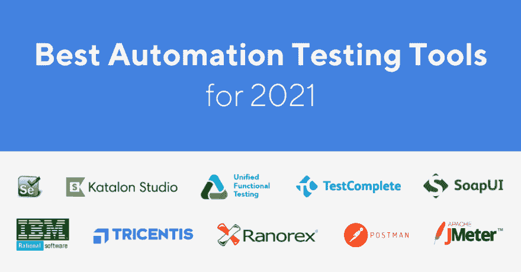

# 2021 年最佳自动化测试工具(15 大评论)

> 原文：<https://dev.to/briananderson2209/best-automation-testing-tools-for-2021-top-15-reviews-24o9>

<figure>

<figcaption>2021 年最佳自动化测试工具</figcaption>

</figure>

更快地交付高质量软件的需求——或者“快速的质量”——要求组织在敏捷、持续集成(CI)和 DevOps 方法中寻找解决方案。测试自动化是这些方面的重要组成部分。最新的《2020–2021 年世界质量报告》指出，测试自动化是交付“快速质量”的最大瓶颈，因为它是成功采用敏捷和 DevOps 的促成因素。

没有好的工具就无法实现测试自动化；因为它们决定了如何执行自动化以及自动化的好处是否能够实现。测试自动化工具是 DevOps 工具链中至关重要的组件。当前的测试自动化趋势在应用人工智能和机器学习(AI/ML)来提供测试优化、智能测试生成、执行和报告的高级能力方面有所增长。了解哪些工具最适合利用这些趋势是值得的。

这里有一些顶级的测试自动化工具，它们被认为能够最好地解决未来几年自动化中的挑战。此列表中包含的工具选自以下标准:

*   支持 API 和服务测试
*   提供一些人工智能/人工智能和分析能力
*   流行和成熟

<figure>

<figcaption>2021 年前 5 大自动化测试工具</figcaption>

</figure>

### **1。硒**

[T2】](https://res.cloudinary.com/practicaldev/image/fetch/s--VG5JuYeO--/c_limit%2Cf_auto%2Cfl_progressive%2Cq_auto%2Cw_880/https://cdn-images-1.medium.com/max/1024/1%2AKYPmb-9juZ9L9FvDFqHh0g.png)

谈到测试自动化，Selenium 是一个家喻户晓的名字。它被认为是 Web 应用程序用户界面自动化测试的行业标准。具体来说，根据****2022 年质量状况报告，54%的受访者使用 Selenium 作为他们的自动化测试工具。****

 **对于拥有编程和脚本编写经验和技能的开发人员和测试人员来说，Selenium 提供了许多其他测试自动化工具和框架所没有的灵活性。用户可以用许多不同的语言(如 Java、Groovy、Python、C#、PHP、Ruby 和 Perl)编写测试脚本，这些脚本可以在多个系统环境(Windows、Mac、Linux)和浏览器(Chrome、Firefox、IE 和 Headless 浏览器)上运行。

自 2020 年 11 月发布最新版本 Selenium 4.0.0 Alpha 7 以来，它通过允许 W3C 标准化提供了更无缝的测试体验。由于这一新功能，开发人员现在不再需要修改代码来与不同的浏览器配合工作，因为 Chrome、Safari、Firefox、Internet Explorer 和 Edge 也将遵循 W3C 标准协议。

为了有效地使用 Selenium，用户必须具备高级编程技能，并且需要花费大量时间来构建自动化框架和自动化所需的库。这是 Selenium 的主要缺点，其他为无代码测试自动化构建的工具(如 Katalon Studio)解决了这个问题。

**网站**:【https://selenium.dev/ T2】

许可:开源

### **2。卡塔龙工作室**

[T2】](https://res.cloudinary.com/practicaldev/image/fetch/s--Lroy-ZsS--/c_limit%2Cf_auto%2Cfl_progressive%2Cq_auto%2Cw_880/https://cdn-images-1.medium.com/max/1024/1%2AlRcOrsi33D8JeNAIOm6agQ.png)

Katalon Studio 是一个强大而全面的自动化解决方案，用于测试 API、Web、移动和桌面应用程序测试。它还为这些类型的测试提供了丰富的特性集，并支持多种平台，包括 Windows、macOS 和 Linux。

利用 Selenium 和 Appium 引擎，Katalon Studio 为那些在集成和部署不同框架和库以使用 Selenium 和 Appium 时遇到困难的测试人员，以及那些已经熟悉这些引擎的测试人员提供了一个独特的集成环境。

Katalon Studio 被评为 2020 年 Gartner Peer Insights 客户对软件测试自动化的选择，获得了 600 多条正面评论，这再次证明了该工具现在是市场上最大的参与者之一。

该工具的亮点包括:

*   API/Web 服务、Web 和移动应用程序测试自动化的完整功能集
*   支持 SOAP 和 RESTful 进行 API 和服务测试
*   数百个用于创建测试用例的内置关键字
*   支持 BDD Cucumber 用自然语言表达测试场景
*   可用于自动化测试和探索性测试
*   测试能力可以通过 [Katalon 商店](https://store.katalon.com)上的插件进行扩展
*   在 [Katalon TestOps](http://analytics.katalon.com/) 上查看质量报告，这是一个面向敏捷团队的测试编排平台。

2021 年 1 月，Katalon 发布了其最新更新——Katalon Studio 7 . 9 . 0——主要增强功能:升级了具有现代外观和感觉的 Eclipse IDE 框架，与应用程序生命周期管理(ALM)工具集成，默认的类文件反编译器用于调试支持，并解决了几个 bug 问题。

**网站**:【https://www.katalon.com/ T2】

许可证:免费——每年 759 美元

### **3。UFT 一号**

[T2】](https://res.cloudinary.com/practicaldev/image/fetch/s--BEqcAj1T--/c_limit%2Cf_auto%2Cfl_progressive%2Cq_auto%2Cw_880/https://cdn-images-1.medium.com/max/1024/1%2A6pQEcN730YjwhABvwGfJ4A.png)

UFT 一号(原名 UFT)是一款流行的商业工具，用于测试 Web、桌面、移动和 RPA 应用程序。它已经被扩展到包括一组很好的 API 测试功能。通过支持多平台的目标应用程序测试(AUT)，UFT 一号提供了一个方便的选择，以测试在桌面，网络和移动设备上运行的 AUT。

UFT 一号为智能对象检测、基于图像的对象检测和校正提供了多种高级功能。2020 年 11 月，微焦点发布了最新版本的 UFT (v15.0.2)。该更新提供了新的功能和增强，简化了测试过程，提高了测试效率，并在减少测试时间的同时保持了质量。

该工具的几个亮点:

*   使用 AI Transformation Assistant 中建议的对象步骤创建一个更加平台无关的测试
*   使用 ParallelRunner 并行运行多个 API 和 GUI 测试
*   在“记录和运行”设置中跟踪和报告 WiFi 状态、热量状态和可用磁盘空间指标
*   支持火狐或 Chrome 浏览器的自动页面检查点

**网站**:【https://software.microfocus.com/fr-ca/software/uft T2】

许可证:每年 3200 美元起。

### **4。测试完成**

[T2】](https://res.cloudinary.com/practicaldev/image/fetch/s--3QK6oH4l--/c_limit%2Cf_auto%2Cfl_progressive%2Cq_auto%2Cw_880/https://cdn-images-1.medium.com/max/1024/1%2AvNFofl4KRqZJGf2VPxhrBw.png)

TestComplete 因其强大而全面的 Web、移动和桌面应用程序测试功能而继续上榜。测试人员可以使用 JavaScript、VBScript、Python 或者 c++脚本来编写测试脚本。

像 UFT 一号一样，TestComplete 有一个对象识别引擎，可以准确地检测动态用户界面元素。该引擎在具有动态和频繁变化的用户界面的应用程序中特别有用。

TestComplete 版本 14.72 于 2021 年 1 月发布，包括测试运行和 web 测试方面的改进。自我修复功能利用改进的基于人工智能的算法，通过图像找到替换对象。测试人员可以很容易地使用 TestComplete 的记录和回放功能，就像 Katalon Studio 一样。他们可以在测试步骤中插入检查点来验证结果。作为 SmartBear 的产品，TestComplete 可以很容易地与 SmartBear 提供的其他产品集成。

**网站**:【https://smartbear.com/product/testcomplete/overview/ T2】

许可费:每年 6095 美元起

### **5。SoapUI**

[T2】](https://res.cloudinary.com/practicaldev/image/fetch/s--RoYp8x9j--/c_limit%2Cf_auto%2Cfl_progressive%2Cq_auto%2Cw_880/https://cdn-images-1.medium.com/max/1024/1%2ALLVG_4HAklyUEoAXx0sXOQ.png)

SoapUI 不是用于 Web 或移动应用程序测试的测试自动化工具，但它可以成为测试 API 和服务的首选工具。它是一个专门为 API 测试设计的无头功能测试工具。

SoapUI 支持 REST 和 SOAP 服务。API 自动化测试人员可以使用开源或专业版本。pro edition 具有用户友好的界面和一些高级功能，如断言向导、表单编辑器和 SQL 查询生成器。SoapUI 是由 SmartBear 提供的 ReadyAPI 套件的一个工具。

该工具为 API 测试提供了非常全面的功能集，具有许多高级功能，包括:

*   使用拖放和点击功能轻松生成测试
*   使用来自文件和数据库的数据进行强大的数据驱动测试
*   异步测试
*   脚本可以很容易地重用
*   使用 RESTful 模拟创建模拟服务

此外，SoapUI 最近将 SoapUI Pro 的 API Explorer 特性引入了开源版本，允许开发人员和测试人员即时调试他们的 API 响应。

SoapUI(开源)的最新版本 5.6 于 2020 年 7 月发布，更新了第三方库(org.apache.httpcomponents、commons-logging、commons-codec 和 Junit)。然而，SoapUI Pro 3.5.1 是由 Smartbear 支持的商业化版本的最新继任者，包括许多改进，使 API 测试无缝且更强大。

**网站**:【https://www.soapui.org/ T2】

许可证:免费——每年 749 美元。

请注意，SoapUI 和 Postman 只是这个列表中几个顶级 API 测试工具的两个代表。要了解更多关于这些工具之间的比较，请参考 [**这篇文章**](https://www.katalon.com/resources-center/blog/soapui-vs-postman-katalon-api-tools/) 。

### **6。IBM Rational Functional Tester(RFT)**

[T2】](https://res.cloudinary.com/practicaldev/image/fetch/s--h-Hw0MM7--/c_limit%2Cf_auto%2Cfl_progressive%2Cq_auto%2Cw_880/https://cdn-images-1.medium.com/max/1024/1%2ADjetfamKwMYw_nJzdGUd4g.png)

IBM Rational Functional Tester 是一个测试自动化工具，设计用于测试使用不同语言和技术开发的应用程序，例如 Web。Net、Java、Visual Basic、Siebel、SAP、PowerBuilder、Adobe Flex 和 Dojo Toolkit。它也是一个数据驱动的测试平台，用于功能和回归测试。

该工具的一些亮点:

*   通过屏幕截图的可视化编辑提供了一种可视化的故事板格式来表示测试动作，允许用户适应频繁的用户界面变化，并避免维护开销的增加。
*   高级 ScriptAssure 技术
*   早期数据检测
*   测试脚本允许用户在 Java 或 Visual Basic 之间进行选择。网
*   与其他软件集成，支持协作式应用生命周期管理

RFT v 10 . 1 . 0(2020 年 7 月)已经发布，提供了新的特性以及对客户报告的和内部发现的缺陷的错误修复。此版本中增强的统一报告可用于功能测试、Web UI 和复合测试、加速功能测试(AFT)套件以及广泛的用户界面，以分析和过滤测试结果细节。

**网站**:【https://en.wikipedia.org/wiki/Rational_Functional_Tester T2】

**许可**:商业——联系销售

### **7。特里森蒂斯托斯卡**

[T2】](https://res.cloudinary.com/practicaldev/image/fetch/s--tA6Otktr--/c_limit%2Cf_auto%2Cfl_progressive%2Cq_auto%2Cw_880/https://cdn-images-1.medium.com/max/1024/1%2AOGr2gh0QwMrTBqJzo648UA.png)

有一些连续测试平台提供了全面的工具集来支持从测试设计和测试自动化到测试报告和分析的大多数(如果不是全部)测试活动。特里森蒂斯托斯卡就是其中之一。

该工具具有许多功能，如仪表板、分析、集成和分布式执行，以支持持续集成和 DevOps 实践。此外，它为设计、实现、执行、管理和优化 API 测试提供了友好的用户界面和丰富的特性集。

该工具的其他一些亮点:

*   可以轻松集成为 DevOps 流程的重要组成部分
*   API 测试可以跨浏览器、移动设备和平台执行
*   支持多种协议和标准，包括 HTTP(s) JMS、AMQP、Rabbit MQ、TIBCO EMS、SOAP、REST 和 IBM MQ
*   一套良好的测试报告和分析功能
*   基于模型而不是代码自动化 UI 测试用例

Tricentis Tosca 支持 API 连接管理器中的 API 安全配置。它还允许用户使用签名安全选项对消息的多个部分进行签名。

Tricentis 声称显著减少了回归测试(从几周到几分钟的数量级)。然而，这种说法需要由测试团队仔细验证。

在 2020 年 9 月的最新更新 13.4 中，引入了 Project NEO 的第一个版本，Tricentis 的 AI 驱动的测试自动化引擎。使用 Project NEO，可以快速、虚拟地执行自动化测试。

**网站**:【https://www.tricentis.com/ T2】

**许可**:商业——联系销售

### **8。Ranorex**

[T2】](https://res.cloudinary.com/practicaldev/image/fetch/s--1yCVhRe0--/c_limit%2Cf_auto%2Cfl_progressive%2Cq_auto%2Cw_880/https://cdn-images-1.medium.com/max/1024/1%2A7DA3nAzbBn33Byjoa-weLw.png)

Ranorex 已经存在很多年了，它为 Web、移动、桌面和 API 测试提供了一套全面而专业的特性。利用其在基于桌面的测试自动化方面的经验，Ranorex 拥有先进的 UI 元素识别、编辑和管理能力。

像 Katalon Studio 一样，Ranorex 通过友好直观的 GUI、记录/回放和脚本生成，使自动化测试对测试人员来说变得容易。

测试人员可以将 Ranorex 与 Selenium Grid 集成，以支持分布式测试和并行测试执行。

Ranorex 9.3 引入了增强的吉拉和 TestRail 报告。最新发布的 rano rex Studio 9 . 3 . 4(2020 年 11 月)增加了对 Delphi TAdvStringGrid 隐藏列的支持，也支持基于苹果 iOS 14 和 Android 11 的设备，此外还修复了一些错误。

**网站**:【https://www.ranorex.com/ T2】

**许可证**:高级捆绑包 5，460 欧元起。

### **9。邮递员**

[T2】](https://res.cloudinary.com/practicaldev/image/fetch/s--hAx3EPau--/c_limit%2Cf_auto%2Cfl_progressive%2Cq_auto%2Cw_880/https://cdn-images-1.medium.com/max/1024/1%2AnIiWHN60z4IvBUCsTzIUoQ.png)

Postman 是另一个为 API 测试设计的自动化工具。用户可以将该工具作为浏览器扩展或桌面应用程序安装在 Mac、Linux 和 Windows 上。它不仅在 API 测试自动化的测试人员中流行，而且在使用该工具开发和测试 API 的开发人员中也很流行。事实上，它是一个开发和测试 API 的开发环境。

该工具的一些亮点:

*   用于设计、调试、测试、记录和发布 API 的全面功能集
*   友好易用的用户界面
*   支持自动化测试和探索性测试
*   接受 Swagger 和 RAML API 格式
*   请求和回复可以打包并与团队成员共享

从 2020 年的 7.3 版本开始，Postman 通过使用新的高级首选项，帮助用户更好地组织从 API 模式生成的集合和 API 元素(模拟服务器、监视器、测试和文档)。2021 年 1 月发布了用于更好的 API 开发体验的最新版本 8.0。新版本增强了通用导航功能(工作区、报告、浏览等)。)以及支持统一的 web 和本地界面。

**网站**:【https://www.getpostman.com/ T2】

许可证:免费——每位用户每年 216 美元

### **10。阿帕奇 JMeter**

[T2】](https://res.cloudinary.com/practicaldev/image/fetch/s--QfD9siyz--/c_limit%2Cf_auto%2Cfl_progressive%2Cq_auto%2Cw_880/https://cdn-images-1.medium.com/max/1024/1%2AZQrRefV04WtXCg9MSpVCng.png)

JMeter 是一个为测试加载和性能测量而设计的开源工具——JMeter 的两个特性是众所周知的。然而，该工具现在也用于 API 和服务测试，尤其是 API 性能测试。

该工具的亮点包括:

*   轻巧，用户界面简单易用
*   测试结果可以重放
*   支持 CSV 文件来设置 API 参数的值
*   支持与 Jenkins 等 CI 工具的集成。JMeter 经常被用作 CI 和 DevOps 工具链的一部分

作为 2020 年 12 月的最新版本，JMeter 5.4 已经进行了多次更改:应用程序模式闪屏、LogKit logger 部分删除、错误修复和 JMeter 功能测试实现。

**网站**:【https://jmeter.apache.org/ T2】

许可:开源

### **11。Telerik 测试工作室**

[T2】](https://res.cloudinary.com/practicaldev/image/fetch/s--SJNW14Ef--/c_limit%2Cf_auto%2Cfl_progressive%2Cq_auto%2Cw_880/https://cdn-images-1.medium.com/max/1024/0%2ANMrq_UaQECe5meTJ)

作为基于 Windows 的软件测试工具，Telerik Test Studio 以 web 和桌面功能测试、软件性能测试和移动应用程序测试而闻名。该解决方案支持基于代码的功能和无代码的方法，确保最佳的应用质量和最出色的结果。

该工具的亮点包括:

*   支持跨浏览器的直观记录器
*   执行仪表板中显示的测试结果
*   智能混合元件检测
*   计划和并发运行
*   测试元素管理

2020 年 12 月最新发布的 Test Studio R3 2020 SP1(v . 2020 . 3 . 1209)带来了全新的功能，比如黑暗主题和状态栏中的新通知版本。此外，通信机制也有所更新，以便创建的项目能够高效工作。

**网站**:【https://www.telerik.com/teststudio T2】

**许可证**:联系销售

### **12。等待**

[T2】](https://res.cloudinary.com/practicaldev/image/fetch/s---JlePbEg--/c_limit%2Cf_auto%2Cfl_progressive%2Cq_auto%2Cw_880/https://cdn-images-1.medium.com/max/1024/0%2AaKrQ23qvDjI7TMU_)

Watir，发音为“water”，是一个轻量级开源测试工具，旨在自动化 web 应用程序测试。Watir 带来了一组丰富的 API 来帮助测试人员与浏览器交互、定位页面元素、处理警告、无头测试等等。

该工具的一些亮点:

*   位置 web 元素
*   根据需要拍摄测试截图
*   页面性能
*   测试您的用户界面或网站中弹出的警报
*   在命令行执行 UI 测试用例的无头测试

在很长一段时间没有更新之后，Watir 于 2020 年 8 月 28 日发布了 6.17 版本。该版本解决了一些与定位器代码、浏览器实例等相关的关键错误。此外，在 Watir 6.17 中，浏览器现在接受带有 Selenium 服务实例值的服务参数。此版本需要 Ruby 2.5 或更高版本。

**网站**:【http://watir.com/ T2】

许可:开源

### **13。工作软件**

[T2】](https://res.cloudinary.com/practicaldev/image/fetch/s--6HMzHPyY--/c_limit%2Cf_auto%2Cfl_progressive%2Cq_auto%2Cw_880/https://cdn-images-1.medium.com/max/1024/0%2AZwOgVdJJ9aJ5Yrd5)

作为持续测试自动化软件的平台，Worksoft 提供了一套用于 ERP 应用程序、web 应用程序、移动应用程序等的功能。该平台通过了 SAP 认证，具有与 SAP 应用程序的集成能力。

该工具的亮点包括:

*   使用 Groovy 作为脚本语言&支持外部 Java 库
*   支持敏捷和开发运维测试实践的能力
*   与其他测试工具、ALM 系统和 DevOps 工具链的无缝集成
*   SAP 费奥里的对象识别功能以及版本更新的快速发布

最新版本的 Worksoft Certify 12 提供了扩展的 DevOps 集成，以及针对现代 web 和云应用的现成优化。Certify 还增加了对 Postman 的支持，以及在 Jenkins 商店中使用官方插件对 12 Jenkins 的改进。

**网站**:【https://www.worksoft.com/ T2】

**许可**:商业(联系销售)

### 14。Appium

[T2】](https://res.cloudinary.com/practicaldev/image/fetch/s--eIGMujdN--/c_limit%2Cf_auto%2Cfl_progressive%2Cq_auto%2Cw_880/https://cdn-images-1.medium.com/max/1024/0%2AkqxGUXLKn-0mAKMm)

这个列表中的另一个开源工具是 Appium，这是一个用于移动 web、iOS/ Android 移动和 Windows 桌面平台上的混合应用程序的自动化测试工具。

该工具的亮点包括:

*   支持多种编程语言(Java、Ruby、Python 等。)
*   在真实设备、仿真器和模拟器上进行跨平台(Android 和 iOS)测试

2021 年 1 月，Appium 发布了一个补丁，修复了设置会话功能的一个错误。

**网站**:【https://github.com/appium T2】

许可:开源

### 15。黄瓜

[T2】](https://res.cloudinary.com/practicaldev/image/fetch/s--oGIGM8KZ--/c_limit%2Cf_auto%2Cfl_progressive%2Cq_auto%2Cw_880/https://cdn-images-1.medium.com/max/1024/0%2AzWQ5FDifK5mLT76v)

最后但同样重要的是，Cucumber 是一个支持行为驱动开发(BDD)的自动化测试工具，它为每个人编写和执行测试用例提供了一个简单的方法，而不考虑技术知识。

该工具的亮点包括:

*   跨多个平台工作:Java、JavaScript、Ruby、.NET 和许多其他平台
*   在同一个流程中无缝自动化 Selenium、API 调用或直接函数调用
*   与吉拉整合，增强团队协作
*   HTML、JSON 和其他格式的报告，用于监控团队的表现

最新版本 Cucumber Open 6.9.1 于 2020 年 12 月 14 日发布，对 Core 和 JUnit 平台的一些 bug 进行了修复。

**网站**:【https://cucumber.io/tools/cucumber-open/ T2】

许可:开源

— — — — —

这里的顶级工具列表并不详尽；但它代表了成熟、受欢迎的最佳工具，并提供了使用 AI/ML 来解决组织在交付“速度质量”时所面临的挑战的能力该列表还包括了专门支持 API 和服务测试的工具，这些测试对于成功的敏捷和开发运维转型至关重要。

可以说，2021 年的软件测试工具格局将继续演变。新兴趋势——人工智能和机器学习、无代码、大数据和物联网测试、测试自动化的广泛采用(尤其是在敏捷团队中)等。—将为现有的工具和新的参与者创造挑战和机会，以维护测试社区的价值。

您对测试工具的选择不仅应该满足您当前的需求，还应该关注潜在的趋势和改进。一个像样的工具应该支持基本的优化、测试用例及数据生成的自动化、更智能的解决方案和分析。

将引入更多工具，因为有增长的机会；尽管组织中的测试自动化水平很低，在 14%到 18%之间(WQR 报告)。此外，看到现有的和即将出现的工具如何应用 AI/ML 来应对未来的挑战将是令人兴奋的。API 和服务测试也是一个趋势，在未来应该会有进一步的发展。

**参考文献:**

*   [2020 年顶级软件测试自动化软件](https://www.gartner.com/reviews/customers-choice/software-test-automation) — Gartner Peer Insights
*   【2022 年质量状况报告
*   [十大 API 测试工具](https://medium.com/@alicealdaine/top-10-api-testing-tools-rest-soap-services-5395cb03cfa9)(详情&为您完成更新！)
*   【2021 年 15 大移动测试工具(最新更新)**