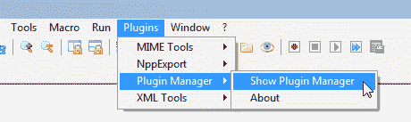
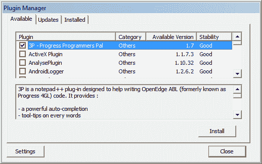
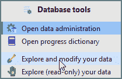

# 记事本++中的数据挖掘器

> 原文:[https://dev.to/patricktingen/datadigger-in-notepad-43om](https://dev.to/patricktingen/datadigger-in-notepad-43om)

如果你使用 Notepad++作为编辑器，你真的应该看看朱利安·卡隆的 3P 插件。他的插件 3P——Progress Programmers Pal 的缩写——是 Notepad++的忠实补充。它的特性列表几乎是无止境的，他的支持是巨大的，并且他在 Notepad++中提供了额外的工具。可以用 ALT-D 从 Notepad++调用 DataDigger，最新版本将从 GitHub 下载并安装。普帕斯也是如此；只需按 F12，最新版本将自动安装。

你可以通过 Notepad++的插件管理器安装 3P。点击“插件>插件管理器>显示插件管理器”

[T2】](https://res.cloudinary.com/practicaldev/image/fetch/s--zGr3CBtT--/c_limit%2Cf_auto%2Cfl_progressive%2Cq_auto%2Cw_880/https://datadigger.files.wordpress.com/2017/10/r7pxc3g.png%3Fw%3D840)

并从可用插件列表中选择 3P。它应该在顶部

[T2】](https://res.cloudinary.com/practicaldev/image/fetch/s--KoRhCX3B--/c_limit%2Cf_auto%2Cfl_progressive%2Cq_auto%2Cw_880/https://datadigger.files.wordpress.com/2017/10/6uaikyu.png%3Fw%3D840)

安装后，Notepad++将重新启动以完成安装。3P 将给出一些关于语法高亮和更新检查的附加通知。只要按照说明，然后，当插件安装后，按 ALT-D。

[T2】](https://res.cloudinary.com/practicaldev/image/fetch/s--HeWX4yei--/c_limit%2Cf_auto%2Cfl_progressive%2Cq_auto%2Cw_880/https://datadigger.files.wordpress.com/2017/10/hhwg8ik.png%3Fw%3D840)

它会告诉你需要提供可执行进度的路径。请设置并重试。当 DataDigger 安装后，您应该会看到

[T2】](https://res.cloudinary.com/practicaldev/image/fetch/s--cTm683UA--/c_limit%2Cf_auto%2Cfl_progressive%2Cq_auto%2Cw_880/https://datadigger.files.wordpress.com/2017/10/e9w4rrc.png%3Fw%3D840)

在 Notepad++中快乐挖掘