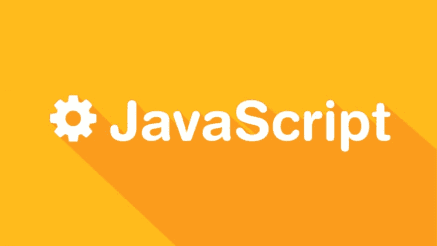

# 为什么大多数前端开发人员面试(#JavaScript #Typescript)都是狗屎

> 原文：<https://dev.to/k_ivanow/why-most-front-end-dev-interviews-javascript-typescript-are-shit-2hc>

<figure>[](https://res.cloudinary.com/practicaldev/image/fetch/s---bJQV1kt--/c_limit%2Cf_auto%2Cfl_progressive%2Cq_auto%2Cw_880/https://cdn-images-1.medium.com/max/1024/1%2AIxX3zeSViow1so2z-w8OcA.png) 

<figcaption>图片来自[http://blog . debug me . eu](http://blog.debugme.eu)</figcaption>

</figure>

对不起，我没有审查狗屎，但狗屎非常=== s**t，每个人都知道我的意思。

### 首先讲一点后面的故事

我要换工作了(我换 wohoo，我的团队换 ohno)。我是 dev，我成了 TL，我们是 dev 团队，然后前阵子我们成了游戏团队(dev，界面，动画)，然后我决定退出(如果你想知道为什么，随便问，这是 npt 文章的重点)。我的一个朋友，在一家和我现在的公司从事相同领域的公司工作，直到我给他们的公司一个机会，她才会停止打扰我。然而，他的公司正在寻找一个高级游戏/前端开发。考虑到我已经在目前的公司工作了近 6 年，我决定尝试一下，哪怕只是为了亲眼看看目前公司以外的开发者市场。

### 第二

在我看来，两家公司都应该保持匿名。假设他们是普通公司。

### 第三

让我们称之为面试问题，从 TL 和 dev 的角度来看，当 TL 尝试 dev 面试时。这听起来可能很奇怪，但这是一个很好的视角，一个人在一家公司面试过开发人员，而同一个人在另一家公司以开发人员的身份尝试面试。

### 第四

我会把这个分成两部分。过一会儿你就会知道为什么了。

### 第四点一——人体部位

采访首先由代表开发团队及其经理的人进行。他们的经理当然关注我的职业生涯，我做了什么，作为一个 TL，我的工作允许我写代码多少(百分比)，我用什么 ide 写我的代码，我的副业是什么，我为什么用那些编程语言写它们等等。这很容易理解。然而，我对他们的发展有更高的期望。在大约一个小时的采访中，他有两个问题。第一个问题——你用过 Gulp 吗？问题二——你学习新技术、新 API 或新框架等的方法是什么？

显然，我表现得足够好，以至于被要求在公司进行一次测试。我不确定这是不是心理测试，是为了确定我可以知道多少信息而不会泄露出去的测试，还是技术测试。我去了那里，和他们的经理谈了谈。他是一个非常好的人，善解人意，动机合理等等。我发现这是我将要做的技术测试。还好，反正我也不会为此而学习。以下是我对测试的印象。

### 第四点二——测试

#### 失望一

这只是一个测试。你不要和开发人员、他们的团队领导、架构师或者其他任何人交谈。 **It。是。只是。的。测试。**

#### 失望二——考试本身

这些不是打字错误或书写错误。所有内容都和测试中写的一样。

这个测试有三页纸。它是在 Java Script，Node.js & Gulp，TypeScript 中拆分的。

现在来回答问题。为了避免重复，省略了一些。

#### 关于 JavasScript 的问题

1.  使用 type of bar = = = object 来确定 bar 是否为对象的潜在缺陷是什么？如何避免这个陷阱？*回答:*欢迎来到[2015–6](http://developer-interview.com/p/javascript/what-is-a-potential-pitfall-with-using-typeof-bar-object-to-determine-if-bar-is-an-object-how-can-this-pitfall-be-avoided-36)论坛问题。这是一种可靠的方法，但是 type of bar = = = object '返回 true。牢记在心。你很少(永远不会)在考试中使用它，但它显然是面试和考试中非常常见 JS 问题。
2.  南是什么？它的类型是什么？如何可靠地测试一个值是否等于 NaN？*回答:*又带着明显的老问题。 [NaN 代表不是一个数。](https://developer.mozilla.org/en-US/docs/Web/JavaScript/Reference/Global_Objects/NaN)然而它的类型是数字，因为 JavaScript 是 JavaScript。如果你想测试某个东西是否是 NaN，JavaScript 有 [isNan 方法](https://developer.mozilla.org/en-US/docs/Web/JavaScript/Reference/Global_Objects/isNaN)来做这件事。用起来并不直观，也不是很常见，但确实存在。
3.  当执行下面的代码时，数字 1-4 将以什么顺序记录到控制台？为什么？

```
(function(){
    console.log(1);
    setTimeout( function(){ console.log(2)}, 1000);
    setTimeout( function(){ console.log(3)}, 0 );
    console.log( 4 );
})(); 
```

答案还是老一套。它的一个变种可以在这里找到，并有很好的解释。

基本上——解释函数的浏览器会这样:

我得写 1

我得写 2 一会儿

我得写 3 一会儿。超时设置为 0 毫秒并不重要。如果你使用过带有 setTimeout(0)的 JS 事件库管理，你会知道什么时候使用**这个极其丑陋的修复**(永远不要使用它！).

我必须写 4

该函数不返回任何内容，因此浏览器将输出“未定义”

我**让**在 0 毫秒内写 3，因此记录“3”

我**让**在 1000 毫秒内写 2，因此记录“2”。你的整个答案是“1，4 未定义，3，2”

1.  下面的代码会输出什么？解释一下你的答案。

```
console.log( 0.1 + 0.2 );
console.log( 0.1 + 0.2 == 0.3 ); 
```

你认为 JavaScript 中 0.1 + 0.2 的结果是什么？0.3?该死的不！ JS 以浮点算术题闻名。0.1 = 0.2 得出 0.30000000000000004(这里或那里有或多或少的零)。

*所以，你的答案是:***0.300000000000004**和**假**

1.  以下代码的输出是什么:

```
for( var i = 0; i < 5; i++){
    setTimeout( function(){ console.log( i ); }, i * 1000 );
} 
```

好了，欢迎来到 2016–7 关于 JS、setTimeouts 和闭包的一般性问题。是本文中[的第一个问题。是的，还有其他文章，总结了人们在 JS 面试中被问到的问题，这篇文章只是更详细一点，是从进行 dev 面试的人和刚参加 dev 面试的人的角度写的。

我在很多文章里看到过这种情况，真的很疼。如果任何人在任何时候读过一些关于这种语言的东西，他/她可以在完全不理解的情况下回答。在我看来，一个更好的问题是——解释什么是闭包，以及为什么要使用它。至少给出两个例子(其中一个可以是幸运的猜测)](https://medium.com/coderbyte/a-tricky-javascript-interview-question-asked-by-google-and-amazon-48d212890703)

1.  控制台中的以下代码会输出什么？

```
console.log( "0 || 1 = " + (0 || 1 ));
console.log( "1 || 2 = " + (1 || 2 ));
console.log( " 0 && 1 = " + ( 0 && 1 )); 
```

很明显…我把它包括进来是因为它没有通常的“*请解释为什么*”。如果它有，我可能会写“1，1，0”，因为这就是||和&T3 的工作方式。

1.  控制台中的以下输出会是什么:

```
console.log((function f(n){return ((n > 1) ? n * f(n-1) : n)})(10)); 
```

*回答:*这是一个非常明显的递归函数，它用一个简单的三元组调用自己——10 * 9 * 8 * 7 * 6 * 5 * 4 * 3 * 2 * 1

在这一点上，我真的感到很无聊。

1.  创建一个返回两个值之和的函数“sum”。这个函数应该像这些例子一样调用:console.log( sum( 5，3))；//返回 8 console . log(sum(5)(3))；//返回 8

优皮！！！我们面临着一个挑战！这太棒了。尤其是在人们即使是半个脑死亡也应该能够回答的 8 个通用 JavaScript 问题之后。

不幸的是，这既是一个挑战，也不是。

乍一看，这很吓人，也很奇怪，实际上我很喜欢它。不幸的是，我最近在媒体上读到了几篇由[乔尔·托马斯](https://hackernoon.com/@joelthoms)写的关于[阿谀奉承](https://en.wikipedia.org/wiki/Currying)的文章。在“[挑战赛:没有变量的程序#javascript](https://hackernoon.com/challenge-program-without-variables-javascript-bee89a41455e) ”中，它们可以被视为一种工作用途，在“[JavaScript ES6](https://blog.benestudio.co/currying-in-javascript-es6-540d2ad09400)中，它们可以被视为一种解释。所以这个问题本身并不具有挑战性。当然，我认识的熟悉奉承的人很少，而我认识的真正使用过奉承的人就更少了。乔尔·托马斯例子和描述非常有用，你应该读一读。

1.  什么是“回调地狱”，如何避免？*回答:*callbackhell.com有一整个网站专门介绍这个术语。通俗地说，就是开发人员用 JavaScript 编写并创建一堆由一个又一个回调触发的函数。这为测试和调试产品创造了一个相当困难的环境。如果你想修复它，你可以做以下事情:保持你的代码简洁——也就是说，保持代码简洁(KISS)模块化处理每一个错误——node . js 中有一个概念叫做错误优先回调。你可以在这里了解更多关于[的信息。这也将在后面提到。](http://fredkschott.com/post/2014/03/understanding-error-first-callbacks-in-node-js/)

#### 关于 Node.js 的问题&大口

那些不知何故设法更加通用。我不知道怎么做。

1.  什么是吞咽？*答:(从他们的网页上复制过来)gulp 是一个工具包，用于自动化开发工作流程中痛苦或耗时的任务，因此您可以停止浪费时间并构建一些东西。*个人回答:*我主要看到它被用作建造基地。*
2.  Gulp 是基于 node.js 吗？*回答:*其实我也不太确定。Node.js 里有 Gulp 吗——有。其他环境中有吞咽吗——有。根据他们的网站-------------------------------------------------------------------集成已经内置于所有主流的 ide 中，人们正在将 gulp 与 PHP 结合使用。NET、Node.js、Java 等平台。然而，我不得不说是的，因为 Gulp 的开发者将它解释为“使用 npm 模块做任何你想做的事情+超过 2000 个用于流文件转换的精选插件”。我实际上还没有看到它被用于任何 JS。
3.  Node.js 中有哪些模块？
4.  packaje.json 文件的用途是什么？(是的，他们用那样的错别字写的)
5.  在 Node.js 中解释 npm 我将以上三个作为同一个问题来回答，既然是。*首先，节点中的模块是什么？“T1”——它们基本上是库、“类”等在 Node 中的表示方式。主题为“T2”w3schools 的一些文章。它们(模块)可以写成 AMD 组件和 CommonJS 组件。Amd 根据[维基百科](https://en.wikipedia.org/wiki/Asynchronous_module_definition)。从[要求的 Amd 和 CommonJS 模块比较](http://requirejs.org/)可以在几节[这里](http://requirejs.org/docs/whyamd.html)找到。*其次是 packaGe.json 文件*——它的文档可以在[这里](https://docs.npmjs.com/files/package.json)找到。大致来说，package.json 允许您指定项目需要哪些库，项目需要哪些库版本，并且它使您的构建/安装易于复制。*至于什么是 NPM*，缩写代表结节包管理器。它是不言自明的吗？我相信是的。它允许你为一个给定的项目发布和使用外部库，更新，保存和管理它们。如果使用 Node，您应该查看 npm 命令列表---------------------------------------------------------------------------------------------------------------------------------------------------------------------npm 文档可在此处[找到](https://docs.npmjs.com/)但是，全局安装和带“保存”的安装之间的区别主要通过使用它来找到和记忆。*
6.  什么是错误优先回调？*回答:*前面我已经跨 callbackhell 提过了。它基本上意味着将错误作为函数的第一个参数，成功作为第二个参数。

#### 关于打字稿的问题

1.  如何在 TypeScript 中实现继承？*回答:*使用 extend 关键字。TypeScript 有， [JavaScript 也有](https://developer.mozilla.org/en-US/docs/Web/JavaScript/Reference/Classes/extends)。
2.  如何在 TypeScript 中从子类调用基类构造函数？*答案:* super()或 super( arghs)
3.  TypeScript 中的模块是什么？你觉得无聊吗？我是。这些问题是通用的，在 StackOverflow 等类似的文章和问题中可以看到。*答:*在这里可以找到[的某种透彻的描述。大致来说，它们(模块)是节点模块的扩展版本。您可以使用外部和内部模块，有效地创建名称空间。](https://blog.oio.de/2014/01/31/an-introduction-to-typescript-module-system/)
4.  TypeScript 支持哪些面向对象的术语？*回答:*像“TypeScript 有哪些 JavaScript 没有的 OOP 关键字和原则”一样去读？(类、接口、扩展、类型、公共/私有/受保护变量)当然，所有这些都可以在 JS 中通过使用[object . define property()](https://developer.mozilla.org/en-US/docs/Web/JavaScript/Reference/Global_Objects/Object/defineProperty)*(我是其中的超级粉丝)、* [js 来模拟。扩展](https://developer.mozilla.org/en-US/docs/Web/JavaScript/Reference/Classes/extends)，jQuery 或 Zepto [扩展](https://api.jquery.com/jquery.extend/)和 [fn .扩展](https://api.jquery.com/jquery.fn.extend/)。
5.  什么是 tsconfig.json 文件？*回答:*读作“你用过 TypeScript 吗？如果没有，这里是你的总结——一个 **tsconfig** 的存在。**一个目录中的 json 文件**表示该目录是一个 TypeScript 项目的根目录。 **tsconfig** 。json 文件指定了编译项目所需的根文件和编译器选项。

### 总结

就这样。我意识到有几篇文章，包括 Medium，讨论了工作面试中与 JS 相关的问题。我刚刚决定分享我自己最近的经历，这有点不同，因为这是从一个采访过开发人员的人和一个刚刚作为开发人员被采访过的人的角度来看的。

所有这些问题都是通用的，整个测试花了我大约 20 分钟(阅读和写作，包括在一张纸上手写)。如果你问我，我会强烈建议公司和 TLs 和技术人员进行这种测试，粉碎它们并把它们扔进垃圾桶，而不是最近的垃圾桶，而是几个街区以外的垃圾桶，这样就没有机会有人看到它们并把它们与作者联系起来。把你的公司标题放在每一页的顶部也没有必要…

不要误解我的意思，你可以用这个测试来测试某人的理解能力。但这是在一个非常狭窄的范围内，而且这些问题足够普遍，我在上周在 Medium、StakOverflow 或另一个论坛上看到了几乎 80%的问题，这意味着有人可以快速回答它们，而不必真正理解它们。

所以，我更喜欢被采访，采访一个真实的人，而不是做一个测试或阅读一个测试。与某人交谈并问他一些问题，然后澄清后续问题，这要容易得多，你可以用这些问题来测试某人是否真的知道他或她在说什么，或者他或她只是在读了无数遍后记住了这些问题。这也是一个很好的方法来找到一个因为一些陷阱而得到错误答案的人，但他是一个足够好的开发人员，可以在未来学习它，他或她第一次没有正确回答的唯一原因是因为他们没有实际使用它。你也可以在自己问他们那些问题，和他们讨论问题的时候，看到你面试的人是怎么想的。即使他们的答案是错误的，因为某些原因，如果他们的思维过程是正确的，我愿意给他们一个机会，帮助他们。

这些问题中的大多数分为两类——要么你遇到过它，并且它是一次痛苦的经历，足以让你记住它(因为它当时看起来真的不合逻辑和奇怪，或者只是因为你当时对 JS 不够熟悉(0.1+0.2 = 0.3000000004 是 JS 古怪的一个很好的例子，或者 NaN 是一个数字的事实))，要么是你还没有遇到过的足够抽象的事情。这两个类别都可以在考试中记忆。为了考试而记忆它们并不意味着理解了 JavaScript，也不意味着这个人能够在工作中正确地应用它们。这也是为什么我更喜欢人与人之间的互动，或者做一个项目/任务并进行讨论，而不是在一张纸上写下答案，一周后进行评估。

顺便说一下，上面讨论的测试没有讨论任何设计模式或任何比理解语言的基本原则更深入的内容，在我看来这有点奇怪，因为它是为高级开发人员设计的。

当然这只是我的看法。如果有人对我说的/写的任何东西有不同的看法，或者我的任何回答或解释看起来不正确，我欢迎在评论中讨论:)

我希望这对任何人都有用，或者至少让任何人思考这些事情。

我真的希望一些 TL，而不是邀请他们，给他们几张纸，把他们留在会议室(在那里你可以打开笔记本电脑，电脑或电话，只是复制答案，不要想它。事实上，我知道有些人已经通过了这样的测试，并因此获得了体面的工作)将开始与人们进行面试，并与他们交谈，看看他们在团队工作中的能力有多强。

* * *