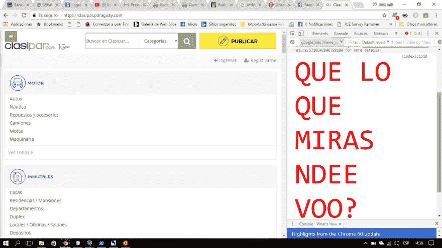
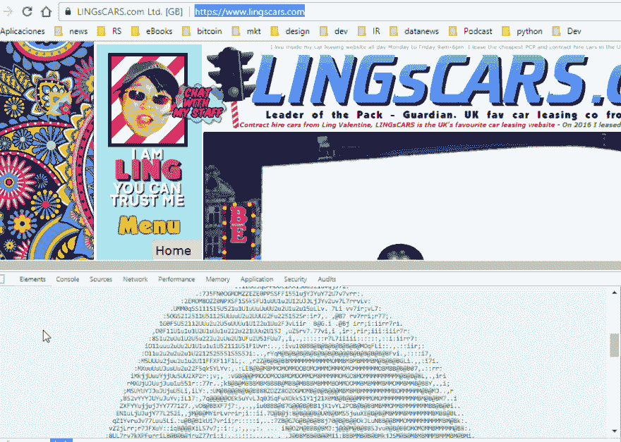

# Epic 代码注释

> 原文：<https://dev.to/nelruk/epic-code-comments-523>

我知道我缺乏专业知识，但作为一个正在努力学习如何编码的人，我倾向于做的一个练习是*检查网站的元素*，复制粘贴并在我自己的环境中运行。

## 生活(和代码)给你惊喜和幽默

许多开发人员告诉我仍然这样做，并寻找各种情况，我发现两个特别的，我想与你分享。首先，一个朋友告诉我关于巴拉圭一个很受欢迎的网站的新闻，这个网站叫做 Clasipar，Craiglist-类似的业务，我进去看看有什么新内容，我发现了这个:

[T2】](https://res.cloudinary.com/practicaldev/image/fetch/s--wUvL2XXr--/c_limit%2Cf_auto%2Cfl_progressive%2Cq_auto%2Cw_880/https://thepracticaldev.s3.amazonaws.com/i/8bwdf9m01h18s20s9epk.jpg)

翻译过来就是: *WHA 你在看什么？*

我知道你笑了。

## 准备第二个

寻找租车网站的替代品，我不知道为什么我和凌疤分手了。仅供参考，我知道我是如何结束的，Reddit 的在线用户告诉我，它有很多 gif，我会发现一个惊喜。天啊，我做到了。当我(再次)查看源代码时，我看到了这个:

[T2】](https://res.cloudinary.com/practicaldev/image/fetch/s--o0yYxZej--/c_limit%2Cf_auto%2Cfl_progressive%2Cq_auto%2Cw_880/https://thepracticaldev.s3.amazonaws.com/i/ilw4zg1yjv58ijxciaxs.png)

我复制粘贴了整个评论，结果如下:

[T2】](https://res.cloudinary.com/practicaldev/image/fetch/s--czb1UUPk--/c_limit%2Cf_auto%2Cfl_progressive%2Cq_auto%2Cw_880/https://thepracticaldev.s3.amazonaws.com/i/49gkbcamvmqm6487qtos.png)

我知道你笑了。

## 如此

我知道你们中大多数有更多经验的人发现了类似的案例(也许更有趣)，**你能告诉我你发现了什么吗**？

### 更新

谢谢大家的评论，我很努力的在笑，顺便说一句，有人给了我一个链接，找到了这个:

```
// stop; Hammertime! 
```

Enter fullscreen mode Exit fullscreen mode

PS:当一个开发者告诉你不要惹他/她，那就别惹。T2】