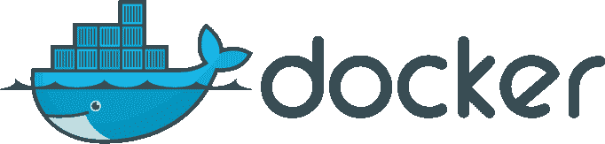

# Docker 到底是干什么用的

> 原文:[https://dev . to/eddy mens/what-the-heck-what-the-docker-used-for-EII](https://dev.to/eddymens/what-the-heck-is-docker-used-for-eii)

[T2】](https://res.cloudinary.com/practicaldev/image/fetch/s--GPiRuBSq--/c_limit%2Cf_auto%2Cfl_progressive%2Cq_auto%2Cw_880/https://cdn-images-1.medium.com/max/800/1%2A5Qpq2ADsZiSIrIjebCcjaA.png)

如果您最近不得不处理设置开发环境或尝试部署到
生产环境，那么您可能已经通过搜索或作为
建议的解决方案遇到了 docker。

Docker 到底是什么？

对我来说最困难的事情之一是弄清楚 Docker 到底是干什么的。因为我找到的每一份材料都解释了它的用途，在
中以不同于之前的方式使用它，我甚至阅读了官方文件。所以我要去
给你一个外行人的定义。Docker 是一个软件，它使得
在你的
机器上独立运行一个操作系统(OS)的副本成为可能。句号("开发人员开始咆哮！!").等等！这不就像虚拟机
或者类似流浪者的东西做的事情吗？是的，这是一回事，但有趣的是它是如何做到的。

**Docker 是如何工作的？**

因此，如果你想在你的主机上运行一个操作系统的副本，你最好的办法是
设置一个虚拟机，双引导或使用一个像 vagger 这样的工具，后者
使虚拟化过程自动化和可共享。Docker 做同样的
事情，但是不需要安装另一个操作系统，而是使用主机操作系统。ie:
你的电脑正在运行的操作系统通过隔离部分主机
资源来创建一个虚拟机。Docker 隔离的一些东西
包括网络、空间和进程。由于 Docker 使用了主机操作系统，因此
意味着没有操作系统设置和启动过程。这使得旋转一个
**虚拟盒子**更快。好吧，所以我们不能一直把 Docker 为你设置的盒子称为虚拟盒子或机器。* *相反，我们称它们为图像。我们很快会再多谈一点这个问题。

我如何开始？

哦，差点忘了，Docker 用来提供
隔离环境的技术(LXC)只在 linux 上可用。你可以从
[维基百科](https://en.wikipedia.org/wiki/LXC)中了解更多。因此，根据你的操作系统不同，docker 的设置也会有所不同
。

实际上在 OS X 和 Windows 上更容易。跟着
[这边](https://docs.docker.com/docker-for-mac/)去 OS X，那边
[去窗口](https://docs.docker.com/docker-for-windows/)就行了。我唯一运行过 Docker 的 linux 发行版是 Ubuntu。既然 Docker 在
上运行的技术是 linux 内核固有的，那么安装起来应该很简单，对吗？
不是我开始的时候:(。但是我发现了一种更简单的方法，那就是使用
二进制文件。* *注意:* *这可能不是安装 Docker 的推荐方式，但
在文档中，它的工作原理是这样的……………………要开始使用二进制文件安装
Docker，请转到
[此处](https://docs.docker.com/engine/installation/binaries/#/install-the-linux-binaries)
并按照说明进行设置。您可以从您的终端通过输入“docker -v 显示您已经安装的 docker 的版本
来检查安装是否
成功。

真的吗？我到底可以用 Docker 做什么？

正如我之前所说的，Docker 就像一个虚拟机一样工作。就像你在你的 windows box 上为 Ubuntu 设置的那个
一样，唯一的区别是你没有
访问操作系统 GUI 的权限，只有它的终端像流浪者一样(如果你在你明白我的意思之前使用过它
)。Docker 的一些常见用途包括设置开发环境、生产设置、分发软件等。**

这就是“码头吊杆的用途！！！！

但是怎么做呢？

要写 Docker 实际上是如何用于上述目的的，需要一篇
完整的博文。这篇文章的其余部分将是关于 Docker 如何使软件
的发布变得容易。

想象一下，你在网上发现了一个有趣的开源软件，想尝试一下，但是它要求你安装一大堆东西。Docker 可以
把你从这里面解放出来。

**举例？**

Ghost 是一个开源的博客引擎，广受欢迎。但是
运行它需要你安装 node 和一吨的其他东西，也许我
夸大了:)。要做到这一点，我们只需运行

```
$ docker pull ghost 
```

<svg width="20px" height="20px" viewBox="0 0 24 24" class="highlight-action crayons-icon highlight-action--fullscreen-on"><title>Enter fullscreen mode</title></svg> <svg width="20px" height="20px" viewBox="0 0 24 24" class="highlight-action crayons-icon highlight-action--fullscreen-off"><title>Exit fullscreen mode</title></svg>

这会将 ghost 安装程序加载到您的计算机上。这被称为**图像**。
根据你的网速，这可能需要一段时间才能完成。

完成后，您应该可以查看您的图片列表

```
$ docker images 
```

<svg width="20px" height="20px" viewBox="0 0 24 24" class="highlight-action crayons-icon highlight-action--fullscreen-on"><title>Enter fullscreen mode</title></svg> <svg width="20px" height="20px" viewBox="0 0 24 24" class="highlight-action crayons-icon highlight-action--fullscreen-off"><title>Exit fullscreen mode</title></svg>

现在，下一步是从我们刚刚提取的图像旋转一个容器。容器和图像的概念通常会让大多数人感到困惑。**图像**和
有点像 OS ISOs，而**容器**就像打开电脑。这不是确切的
，但现在已经足够了。所以让我们继续从我们的图像旋转一个容器。我们走吧？

这将启动在端口 8080 上运行的容器。你应该可以在 [http://localhost:8080/](http://localhost:8080/) 上访问
ghost

好，让我们来看看最后一条命令

```
docker run 
```

<svg width="20px" height="20px" viewBox="0 0 24 24" class="highlight-action crayons-icon highlight-action--fullscreen-on"><title>Enter fullscreen mode</title></svg> <svg width="20px" height="20px" viewBox="0 0 24 24" class="highlight-action crayons-icon highlight-action--fullscreen-off"><title>Exit fullscreen mode</title></svg>

这是从* *图像旋转容器的命令。* *该命令的下一个
重要部分是

```
-p 
```

<svg width="20px" height="20px" viewBox="0 0 24 24" class="highlight-action crayons-icon highlight-action--fullscreen-on"><title>Enter fullscreen mode</title></svg> <svg width="20px" height="20px" viewBox="0 0 24 24" class="highlight-action crayons-icon highlight-action--fullscreen-off"><title>Exit fullscreen mode</title></svg>

这只是将机器的端口号 8080 映射到容器中的端口 2368。这就是我们使用
[访问 ghost 的原因](http://localhost:8080/)

您还可以使用以下命令列出所有正在运行的容器

```
docker ps 
```

<svg width="20px" height="20px" viewBox="0 0 24 24" class="highlight-action crayons-icon highlight-action--fullscreen-on"><title>Enter fullscreen mode</title></svg> <svg width="20px" height="20px" viewBox="0 0 24 24" class="highlight-action crayons-icon highlight-action--fullscreen-off"><title>Exit fullscreen mode</title></svg>

所有这些都不需要安装太多的麻烦。这使得
Docker 成为一种优秀的软件分发方式。想象一下在生产服务器上部署
ghost，Docker 让这变得轻而易举

**遗言？**

你可以在 [docker
商店](https://store.docker.com/)找到流行软件的 Docker 图片

需要熟悉的一些命令包括但不限于

```
$ docker exec -i -t <container_id> /bin/bash 
```

<svg width="20px" height="20px" viewBox="0 0 24 24" class="highlight-action crayons-icon highlight-action--fullscreen-on"><title>Enter fullscreen mode</title></svg> <svg width="20px" height="20px" viewBox="0 0 24 24" class="highlight-action crayons-icon highlight-action--fullscreen-off"><title>Exit fullscreen mode</title></svg>

这为您提供了对容器的终端访问。您可以使用以下命令找到容器
id

```
$ docker ps 

$ docker stop <container_id> 
```

<svg width="20px" height="20px" viewBox="0 0 24 24" class="highlight-action crayons-icon highlight-action--fullscreen-on"><title>Enter fullscreen mode</title></svg> <svg width="20px" height="20px" viewBox="0 0 24 24" class="highlight-action crayons-icon highlight-action--fullscreen-off"><title>Exit fullscreen mode</title></svg>

上面的命令停止一个正在运行的容器。一旦一个容器被停止"
docker ps 命令不会列出它，所以你需要添加"-a 标志到
列表停止的容器

以及启动停止的容器

```
$ docker start <container_id> 
```

<svg width="20px" height="20px" viewBox="0 0 24 24" class="highlight-action crayons-icon highlight-action--fullscreen-on"><title>Enter fullscreen mode</title></svg> <svg width="20px" height="20px" viewBox="0 0 24 24" class="highlight-action crayons-icon highlight-action--fullscreen-off"><title>Exit fullscreen mode</title></svg>

Docker 还提供了一大堆其他的东西，这使得它比像流浪者这样的东西更强大。例如，Docker 允许你将一个
**容器**提交给一个**映像**，这意味着你可以保存一个正在运行的
容器(软件)的状态并与其他人共享。

如果终端不是你喜欢的东西，不要担心，有一些可视化的工具可以让你和 Docker 一起工作更加愉快。我个人最喜欢的
是[搬运工](http://portainer.io/)。

有这么多码头工人提供。我们才刚刚开始触及表面。

如何了解更多信息？

Docker 提供了优秀的[文档](https://docs.docker.com/)，只有
的东西最适合获取更详细的东西。如果你刚刚开始，我会建议你查阅
其他资料，并使用
[文档](https://docs.docker.com/)获取详细参考。

这里有一些你可以开始使用的材料:

那么现在该怎么办？

不知道爱贴，评论离开…

*   [码头工人](https://medium.com/tag/docker?source=post)
*   [DevOps](https://medium.com/tag/devops?source=post)
*   [集装箱](https://medium.com/tag/containers?source=post)
*   [软件开发](https://medium.com/tag/software-development?source=post)
*   [服务器](https://medium.com/tag/servers?source=post)