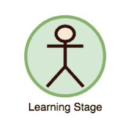
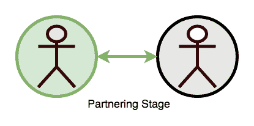
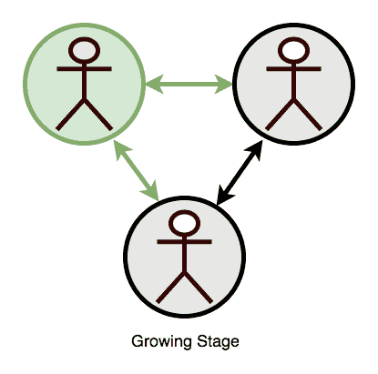
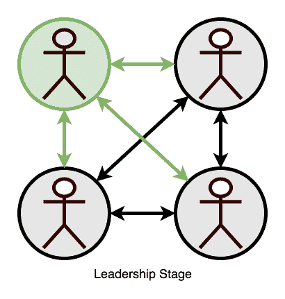
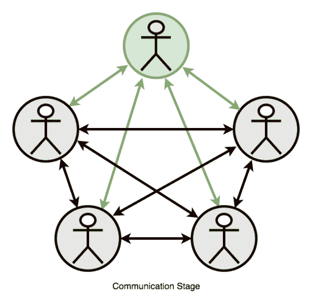
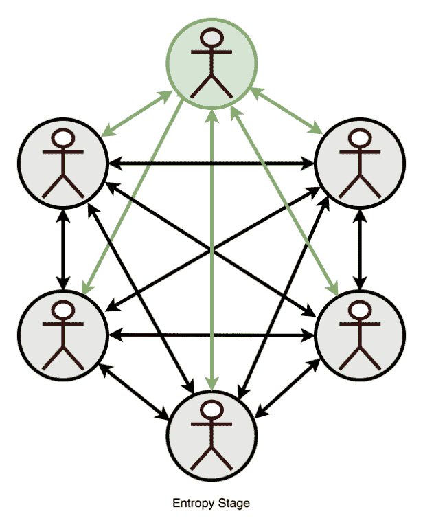
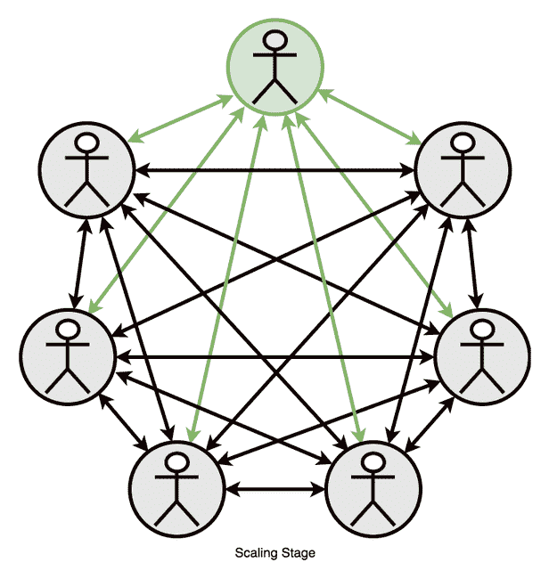
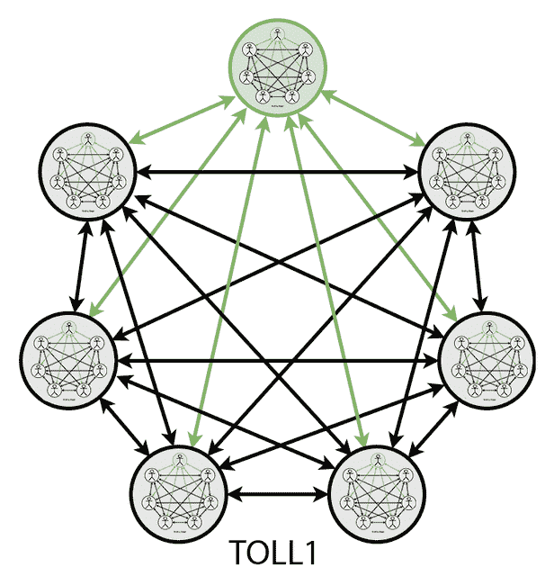
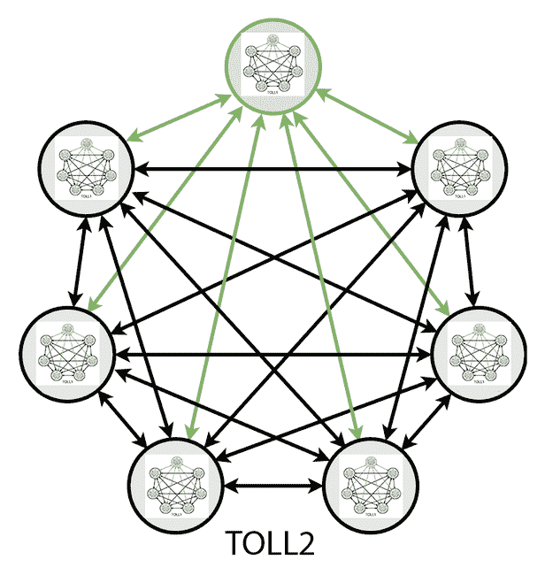

# 团队合作的复杂性阶段

> 原文:[https://dev . to/lpas qualis/the-stages-of-team-complexity-ce8](https://dev.to/lpasqualis/the-stages-of-teamwork-complexity-ce8)

这篇文章最初发表在 [CoderHood](https://coderhood.com) 上，名为[团队合作复杂性的阶段](https://www.coderhood.com/stages-teamwork-complexity/)。CoderHood 是一个致力于软件工程人类层面的博客。

* * *

单独编码和在团队中编码是两种截然不同的活动。人们通常没有意识到随着人数的增加，团队合作的复杂性会有多快。如果你很难看到一个开发过程的好处，或者如果你从来没有考虑过不同规模的团队的生产力，这篇文章是为你准备的。

像杰夫·萨瑟兰、大野泰一和肯特·贝克这样的思想家设计了不同形式的生产过程来组织和驯服团队互动的复杂性。这些过程形成了一个定义良好的框架体，可以用来管理沟通的流程，提供了一种方法来同步团队成员之间的交互，并试图创建团队输出的某种可预测性。

即使有了一个框架，当超过七个人在一个项目上工作并作为一个团队运作时，事情也会变得极其复杂。超过这个限度，由于开销、沟通不畅和普遍的混乱，大多数团队开始经历明显的生产力下降。当然，也有例外，但 7 是一个合理且安全的上限。

我已经给工程团队扩展的各个阶段起了名字，并且我已经确定了每个阶段的特征。这篇文章中的术语大部分是我自己的。我鼓励你自由地使用它，因为它将有助于在一个扩展工程团队和组织中阐明阶段和挑战。

## 定义

### 总通信线路(TLC)

团队成员之间所有可能的单独一对一互动的次数。在一个 N 人的团队中，这个数字是:

> TLC = N*(N-1)/2。

### 个人通信线路(ILC)

每个人可以与其他团队成员进行的所有可能的一对一互动的次数。在一个 N 人的团队中，这个数字是:

> ILC = N-1

### 【个体交流缺失】(ICL)

个人沟通损失是指每个团队成员错过的一对一谈话的次数。它是用机智计算的:

> ICL =薄层色谱-离子色谱

个人沟通损失越大，每个团队成员经历的信息损失和脱离整体状态的情况就越多。

你可以这样写这个等式:

> ICL = (N-1)*(N-2)/2

## 团队规模阶段

下面描述的阶段解释了在不同的团队规模下会发生什么。在这种情况下，我假设如下:

1.  团队成员在同一个代码库上工作。每个人的工作要么依赖于其他人的工作，要么依赖于其他人的工作。
2.  为了提高效率，每个人都需要知道其他人在做什么，至少要定期知道。
3.  团队共享目标和里程碑。

### 团队中的一员，学习阶段。

[T2】](https://www.coderhood.com/stages-teamwork-complexity/)

*   通信线路总数:零。
*   个人通信线路:零。
*   个人通信损失:零。

当你学习编码的时候，或者当你开始一个个人项目的时候，你经常是一个人。愿景就在你的脑海中，时间表是你自己设定的，你可以以任何你想要的速度前进。单独编码就像探索一个未知的领域，以最适合你的方式做决定。

即使你作为一个团队为某人工作，你也要做出大部分的技术决定。你可能有最后期限要满足，但是你的工作方式和如何组织你的任务完全取决于你自己。

不必与其他开发人员交流和同步您的开发过程，为您节省了大量的时间。但是，所有的问题都在你的肩上，你不能委派任何事情。如果你决定不做某件事，那么直到你去做，它才会被完成。

在一个人的团队中，你的工作质量不受审查，你犯的任何错误都不会被发现，直到很久以后。你可能有也可能没有人来集思广益，但在大多数情况下，你是唯一一个理解你所做的每个决定的深刻含义的人。

在这个阶段，你接触到开发的所有方面，但是你不能扩展。您可以编写和测试的代码数量受到您交付能力的限制，并受到您的经验和技能的约束。

### 两人一组，搭档阶段。

[T2】](https://www.coderhood.com/stages-teamwork-complexity/)

*   沟通渠道:一。
*   个人通信线路:一条。
*   个人通信损失:零。

当你在两人团队中工作时，你有一个与你合作的伙伴。在这个阶段，你可以划分工作和责任，你必须讨论你的工作如何与你的搭档的工作相结合。你开始意识到 API 需要很好的定义和存根，测试成为避免你的合作伙伴破坏你所做的东西的基础，集成成为你日常活动中的一个词。

合作需要你去沟通，而沟通是费时的。在这个阶段，你和你的伴侣之间只有一条沟通线路，所以这并不太复杂，因为你直接参与了每一次对话。如果你和你的伴侣相处融洽，事情进展顺利，开销可以降到最低。然而，如果你的伴侣有不同的想法，交流会成为你一天中重要的一部分。

在这个阶段，你学会了头脑风暴的力量，你不再是一个人做所有的决定和犯所有的错误。你发现了你搭档的一些错误，你的搭档发现了你的一些错误。代码评审开始自然地发生，并且您发现自己周期性地给予和要求状态。

两个人的发展过程可以是自然的、有机的。只要经常沟通，事情是向前发展的。

### 团队三人，成长阶段。

[T2】](https://www.coderhood.com/stages-teamwork-complexity/)

*   沟通渠道:三条。
*   个人通信线路:两条。
*   个体交流缺失:一。

当团队成长到三个工程师的时候，你就正式处于成长阶段了。三个人之间的交流比两个人之间的交流要复杂得多。团队现在有三条沟通线需要管理，每个人只是其中两条的一部分。这意味着每个团队成员平均会错过 1/3 的一对一讨论。因此，您需要开始正式化开发过程，以确保信息不会丢失。

在这个阶段，偶然的或松散的对齐不再起作用。与两人团队相比，决策需要以更正式、更有组织的方式被很好地记录和共享。

成长是令人兴奋的，但也会让人分心。在这个阶段，团队开始形成一种微观文化，这种文化开始对结果和整体生产力产生影响。

在成长阶段，领导力并不是绝对必要的，但它有很大的帮助。如果没有人担任领导角色，只要每个人都参与并保持一致，事情仍然可以顺利进行。这种情况很少见，但也有可能。

### 团队四人，领导阶段。

[T2】](https://www.coderhood.com/stages-teamwork-complexity/)

*   通信线路:六条。
*   个人通信线路:三条。
*   个人交流损失:三。

和四个人在一起，你总共有六条交流线路；每个人只是其中三个人的一部分，因此信息丢失的可能性是真实存在的。对于四个人来说，有一个设计良好的工作方式是至关重要的，收集数据，分工，决定谁做什么，并让彼此了解情况。

这个阶段被称为领导阶段，因为一个人应该自然地或通过商定的安排开始发挥领导作用。没有领袖，四人团队磕磕绊绊，经常失速；正在构建的内容的愿景很容易丢失，沟通不畅会对生产力和结果的质量产生很大的影响。

在领导阶段，团队文化变得更加明显，领导者应该在塑造团队文化中扮演积极的角色。没有那种积极的作用，群体就会形成一种自然的、偶然的文化。这可能行得通，但有可能演变成摩擦和误解。

一个没有明确开发过程的四人工程团队会开始感到没有目标和效率低下。误解开始使工作瘫痪，团队在处理后勤问题时面临着损失大量生产力的风险。

### 团队五人，交流阶段。

[T2】](https://www.coderhood.com/stages-teamwork-complexity/)

*   通信线路:十条。
*   个人通信线路:四条。
*   个人交流损失:六。

当五个团队成员在做同一个项目时，每个人都会错过一半以上的一对一对话。除非有一个合适的开发过程来集中重要的讨论和决策，否则这个阶段将会被错误的沟通和误解所削弱。

我称之为“沟通阶段”，因为除非专注于沟通管理，否则事情往往会内爆，即使团队有一个 go 领导者。在这种情况下，沟通管理是分享、讨论和保留关键信息的有效方法。这样的方法不可能是偶然的；它必须经过精心设计和定义。像 Scrum 和看板这样的开发过程提供了定义良好的沟通框架。如果标准方法在组织的环境中不起作用，可以根据需要描述不同的定制方法。

### 团队六人，熵阶段

[T2】](https://www.coderhood.com/stages-teamwork-complexity/)

*   通信线路:15 条
*   个人通信线路:五条
*   通信损耗:10

熵是一种缺乏秩序或可预测性，并逐渐陷入无序的状态。即使有一个设计良好的沟通框架，一个团队有六个人，团队也会自然地陷入无序和缺乏可预测性的状态；这种趋势可以通过设计良好的开发过程来控制，例如 Scrum 或看板，并注意保持活动有序和同步。

在这个阶段，团队应该通过讨论如何在不同的、独立的或部分独立的项目中组织工作，开始寻找分裂成两个或更多独立小组的方法。

### 七人小组，缩放阶段

[T2】](https://www.coderhood.com/stages-teamwork-complexity/)

*   通信线路:21 条。
*   个人通信线路:六条。
*   个人通信损耗:十五。

团队中的每个人都有可能错过 4 次一对一对话中的 3 次，一个 7 人小组就像你希望的那样大，而不会被它的重量压垮。这就是为什么我称之为“缩放阶段”任何超过 7 人的团队都会从分成多个小组中受益，这使得 7 人成为实际的上限。

澄清一下，我见过超过 7 人(多达 10 人)的团队工作效率有所提高；尽管如此，我还是不推荐它。开销太大，我不认为这是一个可持续的安排。

## 多个团队和 TOLLx(领导团队 x 级)

当七个以上的工程师在同一个项目上工作时，明智的做法是将团队分成多个更小的小组，每个小组最多七个人。

在这样的配置中，每个团队都应该有一个熟悉团队所属领域细节的技术负责人。领导通常是上面“领导阶段”部分讨论的人。每个团队领导都有责任定期与其他团队领导会面，以确保团队之间进行适当的协调和沟通。我把这个会议称为跨团队会议，它可以每天、每周或以任何适当的间隔举行。

在使用 Scrum 作为开发过程的组织中，这一组项目领导可以作为一个 Scrum 团队运作，有一个单独的 backlog。在 Scrum 中，这个过程被称为 Scrum 中的 Scrum，领导者被称为大使或冠军。这样的安排适用于多达 7 个团队，每个团队 7 人，总共多达 49 名工程师。我称“TOLL1”(领导团队级别 1)为由七个项目领导组成的小组。

[T2】](https://www.coderhood.com/stages-teamwork-complexity/)

如果你需要七个以上的团队，你可以扩展到下一个级别。在这样的配置中，您将从每个 TOLL1 中选择一个销售线索，该销售线索与来自其他 toll 1 的销售线索相遇并协调。TOLL1 销售线索团队称为 TOLL2，或销售线索 2 级团队。这种配置理论上可以组织多达 343 名工程师。

[T2】](https://www.coderhood.com/stages-teamwork-complexity/)

我不知道你为什么要在同一个项目上安排超过 343 名工程师，但是如果你不得不这样做的话，理论上你可以将这个规模扩大到一个 TOLL3，它可以组织多达 2401 名工程师。在实践中，您可能希望使用独立的工程部门以不同的方式管理事情。我将在以后处理这个话题。

* * *

### 如果你喜欢这篇文章，请保持联系！

*   在 CoderHood 上找到我所有的帖子。不要忘记订阅邮件来接收新帖子的通知。
*   在 LinkedIn 上加入我的职业网络。
*   在推特上关注我。
*   加入我的脸书主页。
*   最后，请在 dev.to 上关注我！