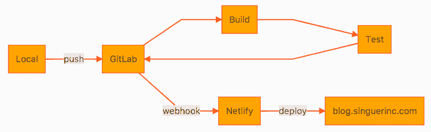

# 从哲基尔到盖茨比

> 原文:[https://dev.to/singuerinc/migrate-from-jekyll-to-gatsby-11a](https://dev.to/singuerinc/migrate-from-jekyll-to-gatsby-11a)

#### 一点历史

几年前，我和[杰基尔](https://jekyllrb.com/)一起创建了我的[博客](https://blog.singuerinc.com/)，它已经运行了一段时间。

我从来都不是 Ruby 的超级粉丝，但是因为需求或者方便，我用它做了一些应用(Rails / Sinatra / Jekyll / etc)。

我曾经喜欢 Jekyll，因为我可以用 Markdown 写我的帖子，并且很容易迭代它们。那时，我选择了一个名为 [Lanyon](https://github.com/poole/lanyon) 的主题，并进行了一些调整。那对我来说已经足够了。

但是最近我发现我在我的机器上安装 Ruby 和 Jekyll 只是为了管理我的博客(我主要用 Node 开发)。我试图在 Docker 容器中开发它，但是速度非常慢。

几周前，我的一个同事在工作中跟我谈起了[盖茨比](https://www.gatsbyjs.org/)，自从我学习[反应](https://reactjs.org/)并开始关注[图表 QL](http://graphql.org/) (在参加了 [Nordic.js](http://nordicjs.com/) 的一次演讲后)我很有兴趣尝试一下。

### 从哲基尔到盖茨比的迁移

[T2】](https://res.cloudinary.com/practicaldev/image/fetch/s--OYWsgFp8--/c_limit%2Cf_auto%2Cfl_progressive%2Cq_auto%2Cw_880/https://cdn-images-1.medium.com/max/219/1%2Axbn0cmHi2jjxy2cYaP_npg.png)

#### 数据

从一个生成器迁移到另一个生成器的最大问题之一是如何移动数据。在我的例子中，我有大约 45 个帖子，所以从一种类型转换到另一种类型不是什么大不了的事情，但仍然是我想避免的手工工作。

幸运的是，Gatsby 与 Markdown 合作，它可以从您的 YAML 前台事务块中获取数据，因此您不必更改任何内容。你只需要安装盖茨比-变压器-备注插件。

然后，在您的 gatsby-config.js 文件中添加:

```
plugins: [
  'gatsby-transformer-remark'
] 
```

<svg width="20px" height="20px" viewBox="0 0 24 24" class="highlight-action crayons-icon highlight-action--fullscreen-on"><title>Enter fullscreen mode</title></svg> <svg width="20px" height="20px" viewBox="0 0 24 24" class="highlight-action crayons-icon highlight-action--fullscreen-off"><title>Exit fullscreen mode</title></svg>

#### 主题

我的博客干净简单，我不需要太多的 css，而不是用一个我添加了[超光速粒子](http://tachyons.io/)的主题来膨胀我的博客。我成功地用超光速粒子复制了我之前 99%的主题。我想做得更好的是把我不用的部分去掉。

当前的 css 文件不到 30 行，其余的布局是用 tachyons 类创建的:[https://github . com/singuerinc/blog/blob/master/src/layouts/index . CSS](https://github.com/singuerinc/blog/blob/master/src/layouts/index.css)

### 鼻涕虫+日期

这是唯一“棘手”的一个，因为我想保留相同的页面名称以便进行 1:1 的转换，这对于 Gatsby 的默认行为是不可能的。我的 front matter 块中没有日期字段，所以我需要从文件名中提取日期。

在我的例子中，slug 是用这个(默认为 Jekyll)结构生成的:

```
https://blog.singuerinc.com/[n-categories]/YYYY/MM/DD/dashed-title/

// Given this data:
categories:
  - app
  - macos
  - vuejs
  - electron

filename: 2017-05-09-introducing-tomeito.md

// I would like to get:
/app/macos/vuejs/electron/2017/05/09/introducing-tomeito/ 
```

<svg width="20px" height="20px" viewBox="0 0 24 24" class="highlight-action crayons-icon highlight-action--fullscreen-on"><title>Enter fullscreen mode</title></svg> <svg width="20px" height="20px" viewBox="0 0 24 24" class="highlight-action crayons-icon highlight-action--fullscreen-off"><title>Exit fullscreen mode</title></svg>

我是如何创造的？在胃旁结内。

我使用 onCreateNode 函数来调整 slug:

```
exports.onCreateNode = ({ node, getNode, boundActionCreators }) => {
  const { createNodeField } = boundActionCreators

  if (node.internal.type === `MarkdownRemark`) {
    const { categories } = node.frontmatter

    const filename = createFilePath({ node, getNode, basePath: `pages` })

    // get the date and title from the file name
    const [, date, title] = filename.match(/^\/([\d]{4}-[\d]{2}-[\d]{2})-{1}(.+)\/$/)

    // create a new slug concatenating everything
    const slug = `/${slugify(categories.concat([date]).join('-'), '/')}/${title}/`

    createNodeField({ node, name: `slug`, value: slug })

    // save the date for later use
    createNodeField({ node, name: `date`, value: date })
  }
} 
```

<svg width="20px" height="20px" viewBox="0 0 24 24" class="highlight-action crayons-icon highlight-action--fullscreen-on"><title>Enter fullscreen mode</title></svg> <svg width="20px" height="20px" viewBox="0 0 24 24" class="highlight-action crayons-icon highlight-action--fullscreen-off"><title>Exit fullscreen mode</title></svg>

### 部署

我曾经部署到 [GitLab Pages](https://about.gitlab.com/features/pages/) ，但是我注意到它有时会停机，所以现在我用几乎相同的 CI 工作流测试 [Netlify](https://www.netlify.com/) :

[T2】](https://res.cloudinary.com/practicaldev/image/fetch/s--k9lo2Lh5--/c_limit%2Cf_auto%2Cfl_progressive%2Cq_auto%2Cw_880/https://cdn-images-1.medium.com/max/719/1%2AiuonuLVRzAzN9E_L0EzAqw.png)

### 结论

一些要点:

*   节点而不是 Ruby
*   更快的开发工作流程，开箱即用。
*   我可以查询我需要什么，并在使用之前转换数据。(我正在查看 gatsby-plugin-feed 以重新创建 Atom Feed)
*   和盖茨比一起免费 React 和 GraphQL。
*   因为我对节点生态系统充满信心，我能够做出贡献:首先向盖茨比提出请求:[https://github.com/gatsbyjs/gatsby/pull/2569](https://github.com/gatsbyjs/gatsby/pull/2569)
*   Netlify 与 GitLab 页面(希望 100%正常运行)

最终想法:

虽然博客是一样的，但在内容和外观上，创建的方式已经完全改变了。对我来说，这是一个全新的体验，更容易，更快。

很久以前我就想把博客移到 Node，现在终于有了！

现在是我的作品集的时候了(也是用哲基尔制作的):[https://www.singuerinc.com/](https://www.singuerinc.com/)

### 显示代码

如果你想看看代码，你可以这样做，它发表在 GitHub:[https://github.com/singuerinc/blog](https://github.com/singuerinc/blog)

*最初发布于*[https://blog . singuerinc . com/Jekyll/Gatsby/graph QL/2017/11/01/migrate-from-Jekyll-to-Gatsby/](https://blog.singuerinc.com/jekyll/gatsby/graphql/2017/11/01/migrate-from-jekyll-to-gatsby/)