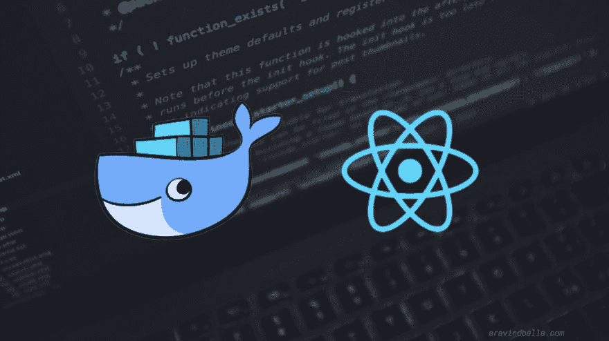

# React/Web 应用程序的 Docker 工作流

> 原文：<https://dev.to/aravindballa/docker-workflow-for-reactweb-applications-3d67>

[T2】](https://res.cloudinary.com/practicaldev/image/fetch/s--pcCuQv1I--/c_limit%2Cf_auto%2Cfl_progressive%2Cq_auto%2Cw_880/https://cdn-images-1.medium.com/max/1024/1%2AjqAtFycwVTCJfOBVu7Ic9Q.jpeg)

我最近一直在摆弄 React。在上面建了我的网站。我在部署时没有遇到大问题，因为这是一个静态站点。但是，总的来说，我们在部署时会遇到问题。它在我们的本地上运行，但不在生产中运行。常见问题吧？

如果你了解 Docker，那么你可能会疑惑，他为什么不开门见山！

是的，使用 Docker，我们在开发和生产时有相同的环境。甚至是测试，如果你选择去做的话。

使用 docker 进行生产很容易。我们必须这么做