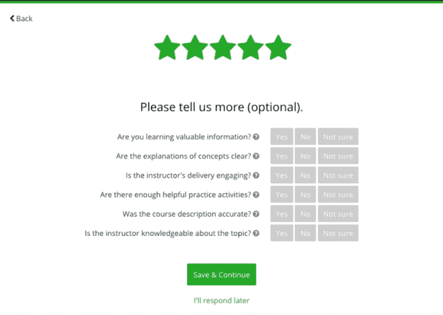
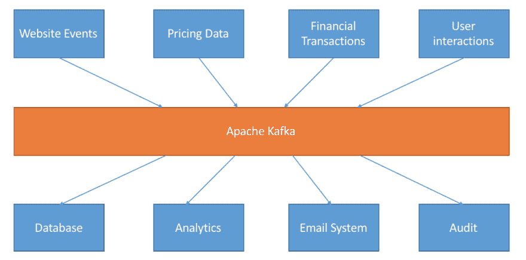
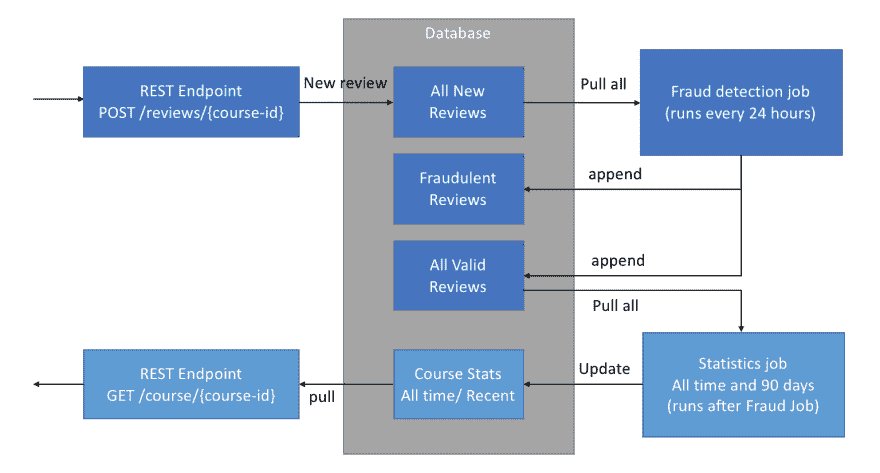
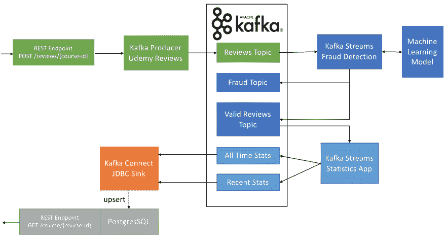

# 如何使用 Apache Kafka 将批处理管道转换为实时管道

> 原文：<https://dev.to/simplesteph/how-to-use-apache-kafka-to-transform-a-batch-pipeline-into-a-real-time-one-a3p>

在这篇博客中，我将彻底解释如何通过在 Apache Kafka 之上构建四个微服务来构建端到端的实时数据管道。它将让您深入了解 Kafka Producer API、Avro 和合流模式注册表、Kafka Streams 高级 DSL 和 Kafka Connect Sinks。

# 我们将解决的挑战

除了作为数据流顾问的常规工作之外，我还是 Udemy 在线课程市场的在线讲师。我教授我所热爱的技术，比如面向初学者的[Apache Kafka](http://bit.ly/kafka-beginners-medium)、 [Kafka Connect](http://bit.ly/kafka-connect-medium) 、 [Kafka Streams](http://bit.ly/kafka-streams-medium) 、[Kafka Setup&Administration](http://bit.ly/kafka-cluster-medium)、[Confluent Schema Registry&REST Proxy](http://bit.ly/confluent-schema-registry-medium)、 [Kafka Security](http://bit.ly/kafka-security-medium) 。

在 Udemy 上，学生有机会发表对他们所学课程的评论，以便向教师和其他平台的用户提供一些反馈。
但是这些评论每隔……**24 小时**就向公众发布一次！我知道这一点，因为太平洋标准时间每天早上 9 点我都会收到一批的新评论。

[T2】](https://res.cloudinary.com/practicaldev/image/fetch/s--jGAhL5hh--/c_limit%2Cf_auto%2Cfl_progressive%2Cq_auto%2Cw_880/https://cdn-images-1.medium.com/max/1200/1%2Aeeonz3zalxwpyHQEX1A9ow.png)

课程页面可能需要再过**几个小时**才能更新为新的点评数和平均评分。听起来好像某个地方正在运行一个每日计划的批处理作业！

[T2】](https://res.cloudinary.com/practicaldev/image/fetch/s--XftBMQS5--/c_limit%2Cf_auto%2Cfl_progressive%2Cq_auto%2Cw_880/https://cdn-images-1.medium.com/max/1600/1%2A-htAkNXa78Aj1_4CUltwkQ.png)

在这篇博客中，我将向您展示如何通过构建一些微服务，使用 Apache Kafka 将这个批处理管道转换为实时管道。
所有的源代码都在这里:[https://github.com/simplesteph/medium-blog-kafka-udemy](https://github.com/simplesteph/medium-blog-kafka-udemy)

对于懒人，你可以看到我运行这个视频中的所有代码:

[https://www.youtube.com/embed/h5i94umfzMM](https://www.youtube.com/embed/h5i94umfzMM)

激动吗？我们开始吧！

# 什么是阿帕奇卡夫卡？

Apache Kafka 是一个分布式流媒体平台。其核心是，它允许生成数据的系统(称为生产者)在 Apache Kafka 主题中实时保存数据。任何主题都可以被任何需要实时数据的系统(称为消费者)读取。因此，在其核心，卡夫卡是一个 Pub/Sub 系统。在幕后，Kafka 是分布式的，可伸缩性好，跨代理(服务器)复制数据，可以在代理停机时存活，等等。

[T2】](https://res.cloudinary.com/practicaldev/image/fetch/s--TzVbbeLg--/c_limit%2Cf_auto%2Cfl_progressive%2Cq_auto%2Cw_880/https://cdn-images-1.medium.com/max/1600/1%2A2qLyGs46KHEd2gMLYy4i6A.png)

Apache Kafka 起源于 LinkedIn，后来开源成为 Apache 顶级项目。一些大公司，如优步、Airbnb、网飞、雅虎、Udemy 和超过 35%的财富 500 强公司都在利用它。这个博客有些超前，如果你想在继续阅读之前更好地理解卡夫卡，可以看看[阿帕奇卡夫卡初级读本](http://bit.ly/kafka-beginners-medium)。

# 审核处理批处理流水线

在直接进入之前，规划出当前的流程并看看我们如何改进每个组件是非常重要的。以下是我个人的假设:

*   当用户写评论时，评论会被发送到 Web 服务(REST 端点)，Web 服务会将评论存储到某种数据库表中
*   每隔 24 小时，一个批处理作业(可能是 Spark)将获取所有新评论，并应用垃圾邮件过滤器从合法评论中过滤欺诈性评论。
*   新的有效评论被发布到另一个数据库表(包含所有历史有效评论)。
*   另一个批处理作业或 SQL 查询为课程计算新的统计数据。统计数据包括历史平均评分、历史评论数、90 天平均评分和 90 天评论数。
*   当用户浏览网站时，网站通过 REST API 显示这些指标。

[T2】](https://res.cloudinary.com/practicaldev/image/fetch/s--aipVnlF3--/c_limit%2Cf_auto%2Cfl_progressive%2Cq_auto%2Cw_880/https://cdn-images-1.medium.com/max/1600/1%2Af0G_rU6ITJj_GYRD-1y0jg.png)

让我们看看如何使用 Apache Kafka 将批处理管道转换为可伸缩的实时分布式管道。

# 目标架构

构建实时管道时，需要考虑**微服务**。微服务是为了很好地完成一项任务而设计的小组件。他们彼此互动，**但不直接**。取而代之的是，他们通过使用一个中介间接互动，在我们的例子中是一个卡夫卡式的话题。因此，两个微服务之间的**契约就是数据本身**。这个契约是通过利用模式来执行的(稍后将详细介绍)

[T2】](https://res.cloudinary.com/practicaldev/image/fetch/s--TzVbbeLg--/c_limit%2Cf_auto%2Cfl_progressive%2Cq_auto%2Cw_880/https://cdn-images-1.medium.com/max/1600/1%2A2qLyGs46KHEd2gMLYy4i6A.png)

总而言之，我们唯一的工作就是对数据建模，因为**数据就是王道**。

注意，这篇博客中的所有微服务都是普通的 Java 应用程序，轻量级，可移植，你可以很容易地把它们放在 Docker 容器中(这与 Spark 形成了鲜明的对比)。以下是我们将需要的微服务:

1.  **Review Kafka Producer** :当用户向 REST 端点发布评论时，它应该会立即在 Kafka 中结束。
2.  欺诈侦查员 Kafka Streams :我们将会收到一连串的评论。我们需要能够使用一些实时机器学习对这些评论进行欺诈评分，并验证它们或将其标记为欺诈。
3.  **评论聚合器 Kafka Streams** :现在我们有了一个有效的评论流，我们应该聚合它们，或者从课程启动开始，或者只考虑最近 90 天的评论。
4.  **回顾 Kafka Connect Sink** :我们现在有一系列课程统计数据的更新。我们需要将它们放在 PostgreSQL 数据库中，以便其他 web 服务可以获取它们并向用户和教师展示。

[T2】](https://res.cloudinary.com/practicaldev/image/fetch/s--j4nzdbZE--/c_limit%2Cf_auto%2Cfl_progressive%2Cq_auto%2Cw_880/https://cdn-images-1.medium.com/max/1600/1%2AA3he5ns9XnjY_qJs_ZxkZA.png)

现在，我们对端到端实时管道有了清晰的了解，看起来我们还有很多工作要做。我们开始吧！

# 1)评论卡夫卡的制片人

为了获得评论数据，我将使用提供的  来获取一个课程的现有和已发布的评论列表。
生产者 API 帮助你生产数据给阿帕奇 Kafka。它将一个对象与一个`Serializer`(一个允许你将对象转换成原始字节的类)结合起来，然后将它发送出去。

因此，在这里，我们有两个步骤要实现:

1.  使用 Udemy REST API 创建获取任何课程评论的方法
2.  将这些评论模型化成一个漂亮的 Avro 对象，然后发送给 Kafka。

[T2】](https://res.cloudinary.com/practicaldev/image/fetch/s--1OsquWd2--/c_limit%2Cf_auto%2Cfl_progressive%2Cq_auto%2Cw_880/https://cdn-images-1.medium.com/max/1600/1%2AuIqgh-Lt5xSio9nDIcfnHA.png)

您可以在这里找到生产者的源代码[。](https://github.com/simplesteph/medium-blog-kafka-udemy/blob/master/udemy-reviews-producer/src/main/java/com/github/simplesteph/kafka/producer/udemy/)

## 抓取 Udemy 评论

获得评论其实很容易，你可以在这里了解 REST API。我们只是要计算一门课程总共有多少条评论，然后从最后一页到第一页重复调用 REST API。我们将评论添加到 java 队列中。