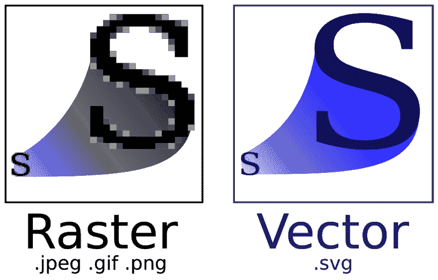

# 如何以及为什么清理 SVG 标记

> 原文:[https://dev . to/adammckenna/how-and-why-to-clean-SVG-markup-49i](https://dev.to/adammckenna/how-and-why-to-clean-svg-markup-49i)

您不会想到 SVG 格式已经存在了将近 20 年。

在过去的几年里，这种格式的受欢迎程度惊人地增长，如果你认为这是最近才有的创新，那也情有可原。

现在，通常的做法是将您的徽标、图形、图表等作为 SVG，而不是其像素化的位图副本。

那么，这种文件格式是从哪里来的呢？1999 年，W3C ( *万维网联盟*)提出了 SVG ( *可缩放矢量图形*)格式。这是一种基于 XML 的矢量图像格式，专为网络设计。

包括 SVG 在内的矢量图像的众多优点之一是，它们可以被缩放到任意大小而不损失质量。另一方面，位图图像，如。jpg，。png，还有。gif，当缩放超过其自然尺寸时像素化。

可伸缩性使得 SVG 格式非常适合响应式 web。SVG 可以很容易地扩展到移动设备、桌面设备、5K 显示器以及任何其他设备。

[T2】](https://res.cloudinary.com/practicaldev/image/fetch/s--uTTllPfe--/c_limit%2Cf_auto%2Cfl_progressive%2Cq_auto%2Cw_880/https://thepracticaldev.s3.amazonaws.com/i/36z13rvrk142v181pz33.png)

[图像来源](https://en.wikipedia.org/wiki/Scalable_Vector_Graphics)

SVG 的文件大小通常比位图文件小。SVG 还支持位图不能支持的一些有趣的用例，包括动画和与 JavaScript 的交互。

如果你还不相信 SVG 就是未来，我强烈推荐你观看克里斯·科伊尔的视频或者阅读 T2·克里斯的书《实用 SVG》。

说服读者使用这种格式并不是本文的目的。相反，这篇文章是为那些已经采用了 SVG，并想从这种格式中再挤出一点东西的人准备的指南。

让我们探索如何清理 SVG 标记，以及为什么我们可能应该这样做。

## SVG 解剖(SVG ==标记)

当您在浏览器或图像查看器中预览 SVG 时，它或多或少会表现为位图。您可以看到渲染的图像。当然，SVG 会更清晰，如果放大也不会像素化，但除此之外就没什么区别了。

区别在幕后。SVG 是基于 XML 的。每一个 SVG 背后都有可读的、类似 HTML 的标记。这意味着您拥有可读的逐行控制，不管是什么工具生成的文件。

见鬼，SVG 可以从头开始编码，而且经常是这样。但是，大多数 SVG 是在图形编辑器中生成的，如 Adobe Illustrator、Inkscape 或 Sketch。这些应用程序经常导出带有多余的、有时甚至是过时的元素和属性的 SVG 标记。

例如，下面是在 *Adobe Illustrator* 中创建的 SVG 图标的 XML:

```
<?xml version="1.0" encoding="iso-8859-1"?>

<!-- Generator: Adobe Illustrator 19.0.0, SVG Export Plug-In . SVG Version: 6.00 Build 0) -->

<svg version="1.1" id="Capa_1"  xmlns:xlink="http://www.w3.org/1999/xlink" x="0px" y="0px" viewBox="0 0 60 60" style="enable-background:new 0 0 60 60;" xml:space="preserve">

    <g>

        <path d="M45.563,29.174l-22-15c-0.307-0.208-0.703-0.231-1.031 0.058C22.205,14.289,22,14.629,22,15v30c0,0.371,0.205,0.711,0.533,0.884C22.679, 45.962,22.84,46,23,46c0.197,0,0.394-0.059,0.563-0.174l22-15 C45.836,30.64,46,30.331,46,30S45.836,29.36,45.563,29.174z M24,43.107V16.893L43.225,30L24,43.107z"/>

        <path d="M30,0C13.458,0,0,13.458,0,30s13.458,30,30,30s30-13.458,30-30S46.542,0,30,0z M30,58C14.561,58,2,45.439,2,30S14.561,2,30,2s28,12.561,28,28S45.439,58,30,58z"/>

    </g>

</svg> 
```

<svg width="20px" height="20px" viewBox="0 0 24 24" class="highlight-action crayons-icon highlight-action--fullscreen-on"><title>Enter fullscreen mode</title></svg> <svg width="20px" height="20px" viewBox="0 0 24 24" class="highlight-action crayons-icon highlight-action--fullscreen-off"><title>Exit fullscreen mode</title></svg>

如果你熟悉 HTML，这看起来会很熟悉:它只是元素和属性。

就像 HTML 一样，我们可以优化它。

让我们看另一个例子。该 SVG 标记用于由*草图*生成的地图标记图标:

```
<?xml version="1.0" encoding="UTF-8" standalone="no"?>

<svg width="39px" height="39px" viewBox="0 0 39 39" version="1.1"  xmlns:xlink="http://www.w3.org/1999/xlink">

    <!-- Generator: Sketch 39.1 (31720) - http://www.bohemiancoding.com/sketch -->

    <title>Hospital</title>

    <desc>Created with Sketch.</desc>

    <defs>

        <rect id="path-1" x="0" y="0" width="33" height="33" rx="9"></rect>

    </defs>

    <g id="Maps" stroke="none" stroke-width="1" fill="none" fill-rule="evenodd">

        <g id="Map" transform="translate(-483.000000, -779.000000)">

            <g id="Hospital" transform="translate(486.000000, 782.000000)">

                <rect id="Rectangle-57" fill-opacity="0.599999964" fill="#FFFFFF" opacity="0.5" x="0" y="0" width="33" height="33" rx="9"></rect>

                <g id="Rectangle-57">

                    <use stroke="#2D2D2D" stroke-width="6" fill-opacity="0.599999964" fill="#FFFFFF" fill-rule="evenodd" xlink:href="#path-1"></use>

                    <use stroke="#FF0000" stroke-width="3" xlink:href="#path-1"></use>

                </g>

                <polygon id="Shape" fill="#FF0000" points="19.7149758 19.5157005..."></polygon>

            </g>

        </g>

    </g>

</svg> 
```

<svg width="20px" height="20px" viewBox="0 0 24 24" class="highlight-action crayons-icon highlight-action--fullscreen-on"><title>Enter fullscreen mode</title></svg> <svg width="20px" height="20px" viewBox="0 0 24 24" class="highlight-action crayons-icon highlight-action--fullscreen-off"><title>Exit fullscreen mode</title></svg>

Sketch 用 21 行标记生成了这个简单的图标。

相对于一个典型的 HTML 文件，这并不多行。但是，对于一个简单的图标来说，这是非常必要的。我使用的大多数图标大约有 4-10 行。

为什么会肿胀？有几个元素和属性是多余的，可以删除。让我们看看它们是什么，以及为什么我们可以删除它们。

## 我们可以移除哪些标记？

### XML Prolog

我们首先可以删除的是第一行:XML prolog。

```
<?xml version=”1.0″ encoding=”UTF-8″ standalone=”no”?> 
```

<svg width="20px" height="20px" viewBox="0 0 24 24" class="highlight-action crayons-icon highlight-action--fullscreen-on"><title>Enter fullscreen mode</title></svg> <svg width="20px" height="20px" viewBox="0 0 24 24" class="highlight-action crayons-icon highlight-action--fullscreen-off"><title>Exit fullscreen mode</title></svg>

大多数 XML 文档都以序言开头。prolog 是一行或多行代码，提供有关当前 XML 文档和相关文档的信息。

如果 SVG 将被嵌入到 HTML 文档或另一个 SVG 中(这种情况很可能发生),那么 prolog 就是多余的，可以删除。

保留 prolog 对用户没有任何影响，但是移除它有助于保持代码的整洁并减小文件大小。

### `<svg>`版本属性

`<svg>`标签打包了`version`属性，表明它使用的是最新版本的 SVG—*SVG 1.1*。

```
<svg version=”1.1″ … > 
```

<svg width="20px" height="20px" viewBox="0 0 24 24" class="highlight-action crayons-icon highlight-action--fullscreen-on"><title>Enter fullscreen mode</title></svg> <svg width="20px" height="20px" viewBox="0 0 24 24" class="highlight-action crayons-icon highlight-action--fullscreen-off"><title>Exit fullscreen mode</title></svg>

这个属性对 SVG 的渲染没有影响，可以被删除。

### XML 注释

你看到 Sketch 突兀的 XML 注释了吗？

```
<!– Generator: Sketch 39.1 (31720) – http://www.bohemiancoding.com/sketch → 
```

<svg width="20px" height="20px" viewBox="0 0 24 24" class="highlight-action crayons-icon highlight-action--fullscreen-on"><title>Enter fullscreen mode</title></svg> <svg width="20px" height="20px" viewBox="0 0 24 24" class="highlight-action crayons-icon highlight-action--fullscreen-off"><title>Exit fullscreen mode</title></svg>

尽管在某些情况下，XML 注释可能会有所帮助，但是这个特定的注释是多余的。我们不需要知道图标从何而来。

许多其他图形编辑器在生成 SVG 时包含 XML 注释，这些注释也可以安全地删除。

### `<title>`和`<desc>`标签

接下来，我们将看看`title`和`desc`元素。

```
<title>Hospital</title>

<desc>Created with Sketch.</desc> 
```

<svg width="20px" height="20px" viewBox="0 0 24 24" class="highlight-action crayons-icon highlight-action--fullscreen-on"><title>Enter fullscreen mode</title></svg> <svg width="20px" height="20px" viewBox="0 0 24 24" class="highlight-action crayons-icon highlight-action--fullscreen-off"><title>Exit fullscreen mode</title></svg>

您可能不想删除这些元素。这取决于使用 SVG 的上下文。

`title`和`desc`标签有助于访问。在某些浏览器中,`title`元素会在鼠标悬停时显示。如果出现无法呈现 SVG 路径的情况，也可以显示这两个元素，而不是图形。

如果 SVG 为页面提供了重要的上下文，例如一个图形或图表，那么您应该保留`title`和`desc`标签，并更改它们的文本内容来传达图形的内容。

另一方面，如果 SVG 不提供重要的上下文，例如图标或徽标，那么可以删除`title`和`desc`标签。

因为我在这个例子中使用的是图标，所以我删除了标签。

### `<g>`标签

在我的例子中，SVG 标记的主要混乱是用作 SVG 路径包装器的`<g>`标记链。

大多数的`<g>`元素都有一个`transform`属性。

```
<g id="Maps" stroke="none" stroke-width="1" fill="none" fill-rule="evenodd">

    <g id="Map" transform="translate(-483.000000, -779.000000)">

        <g id="Hospital" transform="translate(486.000000, 782.000000)">

            <rect ...></rect>

            <g id="Rectangle-57">

                <use ...></use>

                <use ...></use>

            </g>

            <polygon ...></polygon>

        </g>

    </g>

</g> 
```

<svg width="20px" height="20px" viewBox="0 0 24 24" class="highlight-action crayons-icon highlight-action--fullscreen-on"><title>Enter fullscreen mode</title></svg> <svg width="20px" height="20px" viewBox="0 0 24 24" class="highlight-action crayons-icon highlight-action--fullscreen-off"><title>Exit fullscreen mode</title></svg>

所有这些`<g>`元素都是多余的，可以删除。

为什么 *Sketch* 决定在其身后留下无尽的`<g>`标签，这是生命中最大的谜团之一。我们可能永远不会知道。

### `<svg>``viewBox`属性

`<svg>` `viewBox`属性是一个复杂的概念。

我不会在本文中深入探讨这个问题，但是如果您不熟悉这个属性，我强烈推荐 Sara Soueidan 的文章。

```
<svg viewBox=”0 0 39 39″ … > 
```

<svg width="20px" height="20px" viewBox="0 0 24 24" class="highlight-action crayons-icon highlight-action--fullscreen-on"><title>Enter fullscreen mode</title></svg> <svg width="20px" height="20px" viewBox="0 0 24 24" class="highlight-action crayons-icon highlight-action--fullscreen-off"><title>Exit fullscreen mode</title></svg>

一旦移除了`<g>`标签，SVG 元素的位置就会稍微偏离 3 个像素。我调整了`viewBox`的起点进行补偿。

```
<svg viewBox=”-3 -3 39 39″ … > 
```

<svg width="20px" height="20px" viewBox="0 0 24 24" class="highlight-action crayons-icon highlight-action--fullscreen-on"><title>Enter fullscreen mode</title></svg> <svg width="20px" height="20px" viewBox="0 0 24 24" class="highlight-action crayons-icon highlight-action--fullscreen-off"><title>Exit fullscreen mode</title></svg>

这并不理想，但比无止境的标签链和它们毫无意义的属性要好。

尽管我这样做了，但是您可能不需要对`viewBox`属性进行任何编辑。但是，如果您这样做，很可能您将不得不使用不同的值。

### id

大多数 SVG 元素都是用一个`id`属性生成的。例如，`<rect>`元素:

```
<rect id=”Rectangle-57″ … /> 
```

<svg width="20px" height="20px" viewBox="0 0 24 24" class="highlight-action crayons-icon highlight-action--fullscreen-on"><title>Enter fullscreen mode</title></svg> <svg width="20px" height="20px" viewBox="0 0 24 24" class="highlight-action crayons-icon highlight-action--fullscreen-off"><title>Exit fullscreen mode</title></svg>

除非您需要用 JavaScript 将这些元素作为目标，否则这些`id`属性可以被去掉。只有在`<defs>`块中，`id`属性才是重要的。

在我的例子中，`<defs>`块看起来像这样:

```
<defs>

    <rect id=”path-1″ x=”0″ y=”0″ width=”33″ height=”33″ rx=”9″></rect>

</defs> 
```

<svg width="20px" height="20px" viewBox="0 0 24 24" class="highlight-action crayons-icon highlight-action--fullscreen-on"><title>Enter fullscreen mode</title></svg> <svg width="20px" height="20px" viewBox="0 0 24 24" class="highlight-action crayons-icon highlight-action--fullscreen-off"><title>Exit fullscreen mode</title></svg>

`<defs>`中的元素不在该块中初始化，而是声明供将来使用。

你可以看到在`<defs>`块中定义的`path-1`元素在后面的标记中通过`<use>`元素被引用:

```
<use xlink:href=”#path-1″ … ></use> 
```

<svg width="20px" height="20px" viewBox="0 0 24 24" class="highlight-action crayons-icon highlight-action--fullscreen-on"><title>Enter fullscreen mode</title></svg> <svg width="20px" height="20px" viewBox="0 0 24 24" class="highlight-action crayons-icon highlight-action--fullscreen-off"><title>Exit fullscreen mode</title></svg>

这意味着我们需要保留`id`属性，以便`<use>`元素可以引用`<rect>`。但是，`id`值`path-1`不是描述性的。我把它改名为`border`:

```
<defs>

    <rect id=”border” x=”0″ y=”0″ width=”33″ height=”33″ rx=”9″></rect>

</defs>

<use xlink:href=”#border” … ></use> 
```

<svg width="20px" height="20px" viewBox="0 0 24 24" class="highlight-action crayons-icon highlight-action--fullscreen-on"><title>Enter fullscreen mode</title></svg> <svg width="20px" height="20px" viewBox="0 0 24 24" class="highlight-action crayons-icon highlight-action--fullscreen-off"><title>Exit fullscreen mode</title></svg>

新的`id`清楚地描述了这个元素。

## 接下来是什么？

好吧，让我们解决房间里的大象...

### 为什么不使用自动 SVG 优化器，比如 T2 SVGO T3 或 T4 T5？

是真的。有许多自动化工具可以为您优化 SVG 标记。

但是，这是有代价的。

在某些情况下，自动化工具可以合并所有的 SVG 层，使得 SVG 在将来更难使用。

引用莎拉·苏伊丹的话:

> 例如，[SVGO]可以破坏 SVG 以及你在其中为动画创建的任何结构。我很少使用 SVGO。Ai 出口是 v 干净。

Sara Soueidan 等人在 Twitter 上发了一个有趣的帖子，也是上述引用的来源。

## 结论

仅此而已。

```
<svg width="39px" height="39px" fill="none" viewBox="-3 -3 39 39"  xmlns:xlink="http://www.w3.org/1999/xlink">

    <defs>

        <rect id="border" x="0" y="0" width="33" height="33" rx="9"></rect>

    </defs>

    <rect fill-opacity="0.6" fill="#FFFFFF" opacity="0.5" x="0" y="0" width="33" height="33" rx="9"></rect>

    <use xlink:href="#border" stroke="#2D2D2D" stroke-width="6" fill-opacity="0.599999964" fill="#FFFFFF" fill-rule="evenodd"></use>

    <use xlink:href="#border" stroke="#FF0000" stroke-width="3"></use>

    <polygon fill="#FF0000" points="19.7149758 19.5157005..."></polygon>
</svg> 
```

<svg width="20px" height="20px" viewBox="0 0 24 24" class="highlight-action crayons-icon highlight-action--fullscreen-on"><title>Enter fullscreen mode</title></svg> <svg width="20px" height="20px" viewBox="0 0 24 24" class="highlight-action crayons-icon highlight-action--fullscreen-off"><title>Exit fullscreen mode</title></svg>

我们已经设法将代码行减少到 9 行——超过 50%的代码行被删除。真是令人印象深刻。

现在，你可能想知道所有这些清理的目的是什么。

干净的 SVG 标记有很多好处，包括:

*   可维护性——您的 SVG 更容易编辑和维护，无需打开图像编辑器。

*   速度更低的代码意味着更小的文件大小，更小的文件大小意味着更快的网页加载速度。

*   动画——当标记经过优化并且没有多余的标签时，制作 SVG 动画会变得非常容易。

*   可访问性——图像编辑器在生成标记时很少关注可访问性。清晰的标记使得创建可访问的图形更加容易。

*   JavaScript——可理解的标记更容易与 JavaScript 集成。例如，合理的、独特的`id`属性。

虽然 SVG minifier(比如 SVGOMG)确实可以为您完成大部分的工作，但是它也会损害 SVG 的质量。

你知道时间吗？你要制作 SVG 动画吗？这取决于具体情况，选择权在你。

感谢阅读。