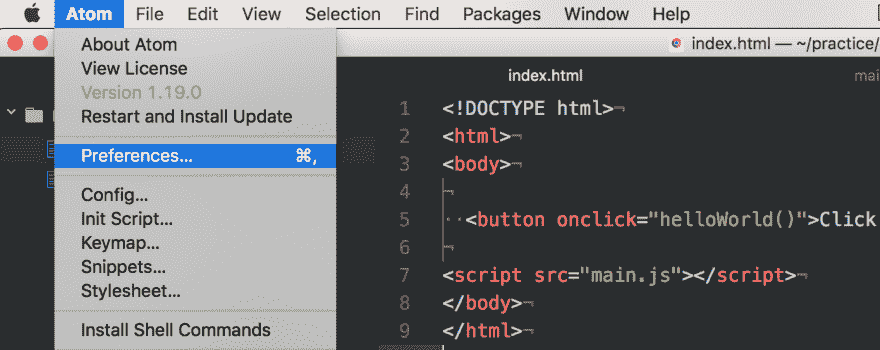
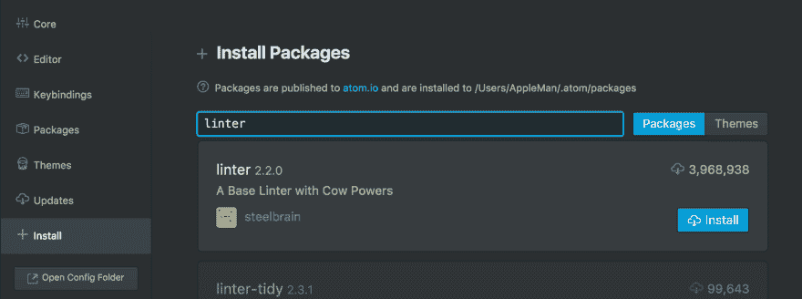
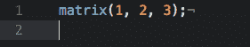

# 林挺(开发环境第 2 部分)&额外收获:其他有趣的 Atom 包！

> 原文:[https://dev . to/matt 24 ray/林挺-开发-环境-part-2-bonus-other-fun-atom-packages-e2o](https://dev.to/matt24ray/linting-development-environment-part-2--bonus-other-fun-atom-packages-e2o)

如果有什么东西可以帮助加强风格，帮助避免语言中的陷阱，这不是很棒吗？有！这叫棉绒。今天我们将为我们的项目添加一个棉绒。

在上一集里，我们安装了 Atom，并设置了一个基本的“hello world”应用程序。今天，我们将更深入地研究 Atom，并使用 Atom 为我们的项目添加一个 linter。

首先，进入 Atom 中的“首选项”。

[T2】](https://res.cloudinary.com/practicaldev/image/fetch/s--b8qx6oAe--/c_limit%2Cf_auto%2Cfl_progressive%2Cq_auto%2Cw_880/https://dailydrip-assets.s3.amazonaws.com/DailyDrip/blog_posts/linting-dev-env/image_0.png)

现在，将弹出设置/首选项屏幕，并单击“安装”选项卡。然后，在搜索栏中输入“linter ”,并点击安装。[T2】](https://res.cloudinary.com/practicaldev/image/fetch/s--hcFf5I4a--/c_limit%2Cf_auto%2Cfl_progressive%2Cq_auto%2Cw_880/https://dailydrip-assets.s3.amazonaws.com/DailyDrip/blog_posts/linting-dev-env/image_1.png)

您现在已经安装了 Atom 的基本处理器。在 Atom 网站上阅读更多关于 Linter 包的信息。现在我们已经安装了基础，我们需要安装特定于我们想要 linited 的语言的 linter 包，也就是 Javascript。因此，今天我们将尝试使用[‘prettle-atom’](https://atom.io/packages/prettier-atom)包来满足林挺的 javascript 需求。搜索，并安装'漂亮-原子'。

“漂亮-atom”包基于一个固执己见的代码格式化程序[漂亮](https://prettier.io/)。使用 Linter 将有助于加强风格，无论是出于美学原因还是(更常见的)帮助避免语言中的陷阱，并帮助您成为更高效的程序员。

现在您已经安装了 linter 包，让我们测试一下。创建一个名为 test.js 的新文件。

```
 touch test.js 
```

然后，将这段 JavaScript 代码放入文件中:

```
 matrix(

  1, 2, 3,

) 
```

现在，如果你按下' CRTL' + 'ALT' + 'F '漂亮会发挥它的魔力。

[T2】](https://res.cloudinary.com/practicaldev/image/fetch/s--coSjQcE6--/c_limit%2Cf_auto%2Cfl_progressive%2Cq_auto%2Cw_880/https://dailydrip-assets.s3.amazonaws.com/DailyDrip/blog_posts/linting-dev-env/image_2.png)

正如你所看到的，漂亮使代码更加美观，并添加了分号。当分号选项设置为 True 时，漂亮地在每个语句的末尾添加一个分号。Prettier 还强制要求任何类都不能太大。你可以在[漂亮的 GitHub 库](http://aesthetic)上看到漂亮的格式化你的代码的所有方法。

如果你想让你的代码的某一部分不被格式化，只需在你不想被格式化的代码的上一行加上“//prettle-ignore”。

```
 // prettier-ignore

matrix(

  1, 2, 3,

) 
```

现在，如果你尝试' CRTL' + 'ALT' + 'F '，漂亮格式化程序将知道不要编辑注释'//漂亮-忽略'下面的语句

如果你想了解更多关于棉绒的信息，请阅读 DailyDrip 博客中的[一个棉绒案例](%5Bhttps://www.dailydrip.com/blog/a-case-for-linters%5D(https://www.dailydrip.com/blog/a-case-for-linters))，或者尝试使用 [coala](https://www.dailydrip.com/topics/coala) 。

# 奖励:其他好玩的 Atom 包！

忍不住把我另外三个喜欢的 atom 插件也包括进来了。

1.  [激活电源模式](https://atom.io/packages/activate-power-mode) -下次你无聊编码时激活电源模式！这是一个有趣的插件，可以在你打字时添加烟火动画。我个人不喜欢屏幕抖动部分，所以停用了。

2.  [颜料](https://atom.io/packages/pigments)——如果你正在摆弄一大堆 CSS，颜料是必须的。这个插件在你的代码中显示任何 rgb 颜色。

3.  Atom-Clock -一个方便的可定制的时钟，帮助提醒你现在是几月。

在 [JavaScript Zero 系列](https://www.dailydrip.com/blog?tag=JavaScriptZero)中的前一篇文章是[用 JS 和设置你的开发环境](https://www.dailydrip.com/blog/hello-world-with-js-and-setting-up-your-development-environment)

在 [JavaScript Zero 系列](https://www.dailydrip.com/blog?tag=JavaScriptZero)中的上一篇帖子是 [Hello World with JS 并设置您的开发环境](https://www.dailydrip.com/blog/hello-world-with-js-and-setting-up-your-development-environment) [在 JavaScript 频道的 DailyDrip 的社区 Slack 上和我一起学习 JavaScript。](http://join-community.dailydrip.com/)

这篇文章最初发布在[dailydrip.com](https://www.dailydrip.com/admin/posts/linting-development-environment-part-2-bonus-other-fun-atom-packages)。