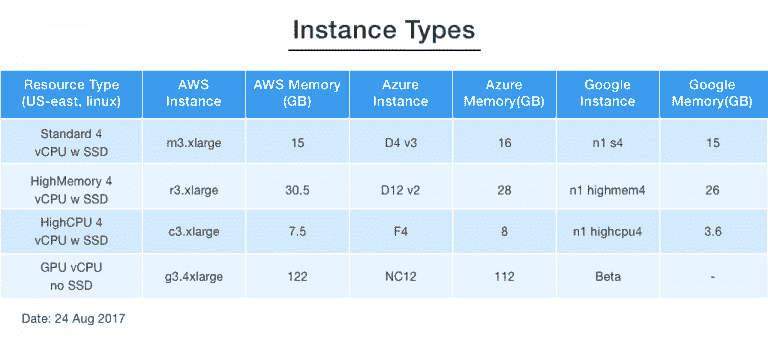
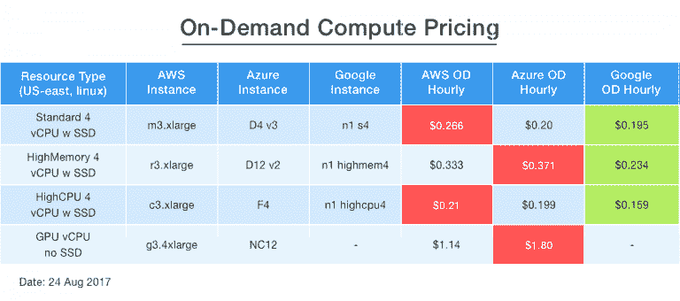

# 按需计算定价:AWS vs. Azure vs. Google

> 原文:[https://dev . to/jignesh _ sim form/on-demand-compute-pricing-AWS-vs-azure-vs-Google-ADB](https://dev.to/jignesh_simform/on-demand-compute-pricing-aws-vs-azure-vs-google-adb)

比较云计算服务是一项非常困难的任务。由于不同服务有不同的部署选项和不同的功能，制定相关和公平的比较具有挑战性。本文深入探讨细节，向您展示在不同环境下，哪些提供商拥有云计算实例的最低成本选项。

这篇文章的目的是展示如何有效地比较顶级云提供商的计算服务价格。实例是相同的，但通过理解计算定价的复杂性，云架构师仍然可以节省大量资金。这种分析也是制定[云成本优化策略](https://www.simform.com/cloud-cost-optimization-strategies-compute-storage/)的先决条件。此外，了解折扣定价和储备情况有利于技术基金的长期预算。在这篇博客中，我们比较了来自 AWS、Azure 和 Google 的类似实例的按需小时定价。

## 计算定价

在比较计算价格时，重要的是要注意所比较的实例哪里相似，哪里不相似。在我们的分析中，我们选择了四个场景来比较 AWS、Azure 和 Google 的实例。所有场景都基于每个提供商在美国东部地区的最低价格，并使用免费的标准 Linux 选项。

### 假设

对于每个云提供商，我们为每个场景映射了适当的实例类型。你很快就会发现，并非所有东西都可以完全“对等”地进行比较。为了有效地比较计算价格，我们为 AWS、Azure 和 Google 选择了具有相同数量 vCPUs 和 RAM 的类似实例。除了 GPU 实例，我们保留了 4 个 vCPUs 作为所有三种场景(标准、高内存和高 CPU)的公共链接。对于每个场景，我们都选择了具有相似 RAM 量的实例，以从 AWS、Azure 和 Google 获得最低定价的实例。例如，在标准场景中，实例的 RAM 是 15 (AWS)、16 (Azure)和 15 (Google) GB。这种情况同样适用于其他三种场景。

注意:我们已经使用了[谷歌云定价计算器](https://cloud.google.com/products/calculator/)来找出谷歌计算引擎的每小时定价。要查看 AWS 和 Azure 定价，请点击 [AWS 按需定价](https://aws.amazon.com/ec2/pricing/on-demand/)和 [Azure 虚拟机定价](https://azure.microsoft.com/en-us/pricing/details/virtual-machines/linux/)。

[T2】](https://res.cloudinary.com/practicaldev/image/fetch/s--4632F1bu--/c_limit%2Cf_auto%2Cfl_progressive%2Cq_auto%2Cw_880/https://www.simform.com/wp-content/uploads/2017/08/Images-1-blog-Copy-768x340.png)

对于这三种实例类型中的每一种，我们都考虑了需要本地 SSD 来进行更好比较的场景，因为 AWS 有带本地 SSD 和不带本地 SSD 的实例系列，而 Azure 总是将本地 SSD 包括在其所有实例类型中，因此，无论您是否需要，您都需要“作为实例价格的一部分来支付它”。Google Cloud 从不包含实例类型的本地 SSD，因此您需要支付它作为附加成本。附加本地 SSD 的最小大小是 375 GB，这相当大。

这种比较将帮助您了解对于不同的需求，哪个实例的价格最低。我们已经完成了 vCPU 和内存(RAM)方面的所有比较工作，因此您可以轻松确定三家主要云提供商中价格最低的实例。以下是一些场景:

情节

1.  带有 4 个虚拟 CPU 和固态硬盘的标准实例
2.  高内存 4 vCPUs 和固态硬盘
3.  高 CPU，带 4 个 vCPUs 和固态硬盘
4.  带 16 个虚拟 CPU 和固态硬盘的 GPU
5.  地区:美国东部(北弗吉尼亚)

## AWS vs . Azure vs . Google Cloud:按需计算定价比较

对于下面四个场景中的每一个，您可以看到每个云的每小时按需(OD)价格。

[T2】](https://res.cloudinary.com/practicaldev/image/fetch/s--ujCZB5th--/c_limit%2Cf_auto%2Cfl_progressive%2Cq_auto%2Cw_880/https://www.simform.com/wp-content/uploads/2017/08/Images-2-blog-Copy-1-768x340.png)

## 总结和结论

*   在上图中，红色表示一个场景中云提供商的最高价格，绿色表示最低价格。谷歌云在所有四种场景下的价格最低。
*   对于标准和高 CPU 场景，AWS 的价格最高。
*   对于 HighMemory 和 GPU，Azure 的价格最高。

* * *

*我在这里发布了这篇文章的更新版本[计算定价比较:AWS vs Azure vs Google Cloud](https://www.simform.com/compute-pricing-comparison-aws-azure-googlecloud/) 。它还包括折扣实例和无服务器计算服务的比较*