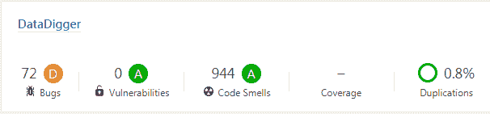

# SonarQube 上的 DataDigger

> 原文:[https://dev.to/patricktingen/datadigger-on-sonarqube-5cbc](https://dev.to/patricktingen/datadigger-on-sonarqube-5cbc)

昨天，Riverside Software 的 Gilles Querret 用[sonar cube](http://sonar.riverside-software.fr/about)分析了来自 GitHub 的 DataDigger 代码。虽然我一直认为我的代码非常干净，但事实证明还有很多需要改进的地方

[T2】](http://sonar.riverside-software.fr/projects?search=DataDigger)

SonarQube 报告的许多问题将在即将到来的 DataDigger 24 中得到解决，但我邀请您亲自检查您自己项目的工具。

我猜这将是一个令人大开眼界的 