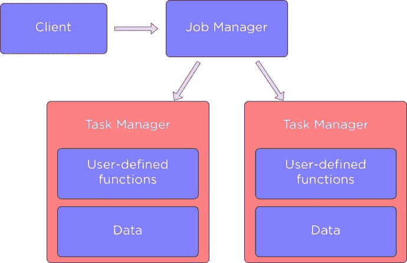
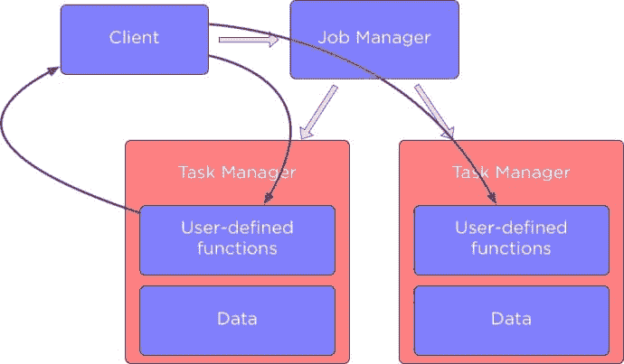

# 向和从 Flink 集群发送附加数据

> 原文:[https://dev . to/mushketyk/sending-additional-data-to-and-from-flink-cluster-b8g](https://dev.to/mushketyk/sending-additional-data-to-and-from-flink-cluster-b8g)

如果您了解 Apache Flink，您可能很熟悉如何向它发送数据以及如何返回结果。但是在某些情况下，我们需要向 Flink 集群发送配置数据，并从它那里接收一些额外的数据。

在本文的第一部分，我将描述如何向我们的 Flink 集群发送配置数据。我们要配置的东西很多:函数参数，配置文件，机器学习模型。Flink 提供了几种不同的方法，我们将介绍如何使用它们以及何时使用每种方法。在本文的第二部分，我将描述一种从 Flink 集群发回数据的重要方法。

本文需要一些 Apache Flink 的基础知识。如果你不熟悉，可以看看我其他的一些关于该话题的文章:[这里](https://brewing.codes/2017/09/25/flink-vs-spark/)、[这里](https://dev.to/mushketyk/getting-started-with-batch-processing-using-apache-flink-bnh)，还有[这里](https://dev.to/mushketyk/getting-started-with-stream-processing-using-apache-flink-530)。

# 向任务管理器发送数据

在我们深入探讨如何在 Apache Flink 中的不同组件之间发送数据的细节之前，我们先来谈谈一个 Flink 集群中有哪些组件，以及我们试图实现的是什么。下图显示了 Flink 的主要运动部件及其相互作用:

[T2】](https://res.cloudinary.com/practicaldev/image/fetch/s--bi_g0R0s--/c_limit%2Cf_auto%2Cfl_progressive%2Cq_auto%2Cw_880/https://i2.wp.com/lh3.googleusercontent.com/-VC1iepeKON8/WdM9D0APYZI/AAAAAAAAGdk/iwpXPl5dVNc4mRLQ9zPjZpohT8W4MzGjACHMYCw/I/15070159503265.jpg%3Fw%3D690%26ssl%3D1)

当我们需要执行一个 Flink 应用程序时，我们与一个作业管理器进行交互，这个作业管理器存储了正在运行的作业的详细信息，比如执行图。它控制任务管理器，每个任务管理器包含一部分数据，并执行我们定义的数据处理功能。

在许多情况下，我们希望配置在 Flink 集群中运行的函数的行为。根据不同的用例，我们可能需要设置一个变量或者提交一个静态配置文件，我们将讨论 Flink 如何支持这些和其他情况。

[T2】](https://res.cloudinary.com/practicaldev/image/fetch/s--KyybHwe_--/c_limit%2Cf_auto%2Cfl_progressive%2Cq_auto%2Cw_880/https://i1.wp.com/lh3.googleusercontent.com/-BrwTPnr-cFk/WdM9sexcS-I/AAAAAAAAGds/J4da5TaNL3sfCZ0UqPgF5j1DlZnFpxitQCHMYCw/I/15070161117794.jpg%3Fw%3D690%26ssl%3D1)

除了向任务管理器发送配置数据之外，有时我们可能希望从函数中返回常规输出之外的数据。

## 配置用户自定义功能

假设我们有一个从 CSV 文件中读取电影列表的应用程序，需要过滤特定类型的所有电影:

```
// Read a dataset of movies
DataSet<Tuple3<Long, String, String>> lines = env.readCsvFile("movies.csv")
        .ignoreFirstLine()
        .parseQuotedStrings('"')
        .ignoreInvalidLines()
        .types(Long.class, String.class, String.class);

lines.filter((FilterFunction<Tuple3<Long, String, String>>) movie -> {
    // Genres for a movie separated by the "|" symbol
    String[] genres = movie.f2.split("\\|");

    // Find all movies that has the "Action" genre
    return Stream.of(genres).anyMatch(g -> g.equals("Action"));
}).print(); 
```

很可能我们想要提取不同类型的电影，为此我们需要能够配置我们的过滤功能。当您实现这样一个函数时，最简单的配置方法是实现一个构造函数:

```
// Pass a genre name
lines.filter(new FilterGenre("Action"))
    .print();

...

class FilterGenre implements FilterFunction<Tuple3<Long, String, String>> {

    String genre;
    // Initialize filter function
    public FilterGenre(String genre) {
        this.genre = genre;
    }

    @Override
    public boolean filter(Tuple3<Long, String, String> movie) throws Exception {
        String[] genres = movie.f2.split("\\|");

        return Stream.of(genres).anyMatch(g -> g.equals(genre));
    }
} 
```

或者，如果你正在使用 lambda 函数，你可以简单地使用一个来自它的[闭包](https://en.wikipedia.org/wiki/Closure_(computer_programming))的变量:

```
final String genre = "Action";

lines.filter((FilterFunction<Tuple3<Long, String, String>>) movie -> {
    String[] genres = movie.f2.split("\\|");

    // Using variable
    return Stream.of(genres).anyMatch(g -> g.equals(genre));
}).print(); 
```

Flink 将序列化这个变量，并将其与函数一起发送到集群。

如果需要向函数传递大量变量，所有这些方法都会变得很烦人。为了帮助解决这个问题，Apache Flink 提供了`withParameters`方法。要使用它，你需要实现一个你感兴趣的函数的`Rich`版本，所以不要实现`MapFunction`接口，你必须实现`RichMapFunction`。

丰富的函数允许您使用`withParameters`方法传递多个参数:

```
// Class in Flink to store parameters
Configuration configuration = new Configuration();
configuration.setString("genre", "Action");

lines.filter(new FilterGenreWithParameters())
        // Pass parameters to a function
        .withParameters(configuration)
        .print(); 
```

为了读取这些参数，我们需要实现`open`并读取其中的参数:

```
class FilterGenreWithParameters extends RichFilterFunction<Tuple3<Long, String, String>> {

    String genre;

    @Override
    public void open(Configuration parameters) throws Exception {
        // Read the parameter
        genre = parameters.getString("genre", "");
    }

    @Override
    public boolean filter(Tuple3<Long, String, String> movie) throws Exception {
        String[] genres = movie.f2.split("\\|");

        return Stream.of(genres).anyMatch(g -> g.equals(genre));
    }
} 
```

所有这些选项都可以工作，但是如果您需要为多个函数设置相同的参数，这可能会很繁琐。为了解决这个问题，Flink 允许设置所有任务管理器都可以访问的全局环境变量。

为此，首先需要使用`ParameterTool.fromArgs`从命令行读取参数:

```
public static void main(String... args) {
    // Read command line arguments
    ParameterTool parameterTool = ParameterTool.fromArgs(args);
    ...
} 
```

然后使用`setGlobalJobParameters`设置全局作业参数:

```
final ExecutionEnvironment env = ExecutionEnvironment.getExecutionEnvironment();
env.getConfig().setGlobalJobParameters(parameterTool);
...

// This function will be able to read these global parameters
lines.filter(new FilterGenreWithGlobalEnv())
                .print(); 
```

现在我们可以实现一个函数来读取这些参数。和以前一样，它应该是一个丰富的函数:

```
class FilterGenreWithGlobalEnv extends RichFilterFunction<Tuple3<Long, String, String>> {

    @Override
    public boolean filter(Tuple3<Long, String, String> movie) throws Exception {
        String[] genres = movie.f2.split("\\|");
        // Get global parameters
        ParameterTool parameterTool = (ParameterTool) getRuntimeContext().getExecutionConfig().getGlobalJobParameters();
        // Read parameter
        String genre = parameterTool.get("genre");

        return Stream.of(genres).anyMatch(g -> g.equals(genre));
    }
} 
```

要读取一个参数，我们需要调用`getGlobalJobParameter`来获取所有全局参数，然后使用`get`方法来获取我们感兴趣的参数。

## 广播变量

如果您想将数据从客户端发送到任务管理器，我们之前讨论的所有这些方法都适合您，但是如果数据以数据集的形式存在于任务管理器中，该怎么办呢？在这种情况下，最好使用另一个名为广播变量的 Flink 功能。它只允许将数据集发送给任务管理器，任务管理器将执行您的函数。

假设我们有一个数据集，其中包含我们在进行文本处理时应该忽略的单词，我们希望将它设置为我们的函数。要为单个函数设置一个广播变量，我们需要使用`withBroadcastSet`方法和一个数据集。

```
DataSet<Integer> toBroadcast = env.fromElements(1, 2, 3);
// Get a dataset with words to ignore
DataSet<String> wordsToIgnore = ...

data.map(new RichFlatMapFunction<String, String>() {

    // A collection to store words. This will be stored in memory
    // of a task manager
    Collection<String> wordsToIgnore;

    @Override
    public void open(Configuration parameters) throws Exception {
        // Read a collection of words to ignore
        wordsToIgnore = getRuntimeContext().getBroadcastVariable("wordsToIgnore");
    }

    @Override
    public String map(String line, Collector<String> out) throws Exception {
        String[] words = line.split("\\W+");
        for (String word : words)
            // Use the collection of words to ignore
            if (wordsToIgnore.contains(word))
                out.collect(new Tuple2<>(word, 1));
    }
    // Pass a dataset via a broadcast variable
}).withBroadcastSet(wordsToIgnore, "wordsToIgnore"); 
```

您应该记住，如果您使用广播变量，数据集将存储在任务管理器的内存中，因此您应该只对小型数据集使用它。

如果您想向每个任务管理器发送更多数据，并且不想将这些数据存储在内存中，您可以使用 Flink 的分布式缓存向任务管理器发送一个静态文件。要使用它，您首先需要在分布式文件系统(如 HDFS)中存储一个文件，然后在缓存中注册这个文件:

```
ExecutionEnvironment env = ExecutionEnvironment.getExecutionEnvironment();

// Register a file from HDFS
env.registerCachedFile("hdfs:///path/to/file", "machineLearningModel")

...

env.execute() 
```

为了访问分布式缓存，我们再次需要实现一个丰富的函数:

```
class MyClassifier extends RichMapFunction<String, Integer> {

    @Override
    public void open(Configuration config) {
      File machineLearningModel = getRuntimeContext().getDistributedCache().getFile("machineLearningModel");
      ...
    }

    @Override
    public Integer map(String value) throws Exception {
      ...
    }
} 
```

请注意，要访问分布式缓存中的文件，我们需要使用注册它时使用的同一密钥。

# 累加器

我们已经讨论了如何向任务管理器发送数据，但是现在让我们来讨论如何从任务管理器发回数据。你可能想知道为什么我们需要做一些特别的事情。毕竟，Apache Flink 就是构建数据处理管道，读取输入数据，对其进行处理，然后返回结果。

为了弄清楚我们还可能想要什么，让我们看一个例子。假设我们需要计算每个单词在文本中出现的次数，同时我们希望计算文本中有多少行:

```
// Text to process
DataSet<String> lines = ...

// Word count algorithm
lines.flatMap(new FlatMapFunction<String, Tuple2<String, Integer>>() {
    @Override
    public void flatMap(String line, Collector<Tuple2<String, Integer>> out) throws Exception {
        String[] words = line.split("\\W+");
        for (String word : words) {
            out.collect(new Tuple2<>(word, 1));
        }
    }
})
.groupBy(0)
.sum(1)
.print();

// Count a number of lines in the text to process
int linesCount = lines.count()
System.out.println(linesCount); 
```

问题是，如果我们运行这个应用程序，它将运行两个 Flink 作业！首先计算字数，其次计算行数。

这肯定是低效的，但是怎么才能避免呢？一种方法是使用累加器。它们允许您从任务管理器发送数据，并使用预定义的函数聚合这些数据。Flink 具有以下内置累加器:

*   **IntCounter** 、 **LongCounter** 、**double counter**–允许对任务管理器发送的 int、long、double 值求和
*   **average accumulator**–计算双精度值的平均值
*   **LongMaximum** ， **LongMinimum** ， **IntMaximum** ， **IntMinimum** ， **DoubleMaximum** ，**double minimum**-累加器，确定不同类型的最大值和最小值
*   **直方图**–用于计算任务管理器的值分布

要使用累加器，我们需要创建并注册一个用户定义的函数，然后在客户端读取结果。我们可以这样做:

```
lines.flatMap(new RichFlatMapFunction<String, Tuple2<String, Integer>>() {

    // Create an accumulator
    private IntCounter linesNum = new IntCounter();

    @Override
    public void open(Configuration parameters) throws Exception {
        // Register accumulator
        getRuntimeContext().addAccumulator("linesNum", linesNum);
    }

    @Override
    public void flatMap(String line, Collector<Tuple2<String, Integer>> out) throws Exception {
        String[] words = line.split("\\W+");
        for (String word : words) {
            out.collect(new Tuple2<>(word, 1));
        }

        // Increment after each line is processed
        linesNum.add(1);
    }
})
.groupBy(0)
.sum(1)
.print();

// Get accumulator result
int linesNum = env.getLastJobExecutionResult().getAccumulatorResult("linesNum");
System.out.println(linesNum); 
```

这允许我们计算每个单词在输入文本中出现的次数以及它有多少行。

如果您需要自定义累加器，您也可以使用累加器或 SimpleAccumulator 接口实现自己的累加器。

# 更多信息

我希望你喜欢这篇文章，并发现它很有用。您可以在我的 git 存储库中找到本文的源代码，以及其他的 [Apache Flink 示例](https://github.com/mushketyk/flink-examples)。

近期会写更多关于 Flink 的文章，敬请期待！你可以在这里阅读我的其他文章[，或者你可以看看我的 Pluralsight 课程，我在那里详细介绍了 Apache Flink:](https://brewing.codes/)[了解 Apache Flink](http://bit.ly/understanding-flink) 。这是本课程的[短片预告](http://bit.ly/understanding-flink-preview)。

向 Flink 集群发送额外数据的帖子[首先出现在](https://brewing.codes/2017/10/24/flink-additional-data/)[酝酿代码](https://brewing.codes)上。