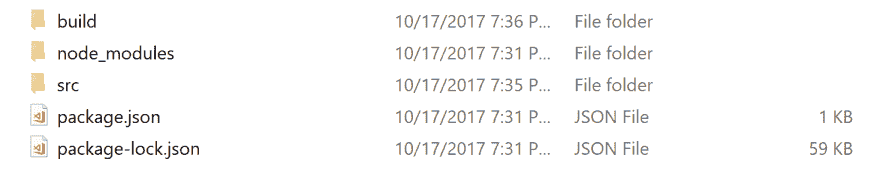
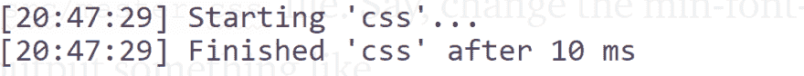

# PostCSS -简介和设置

> 原文：<https://dev.to/promisetochi/postcss---introduction-and-setup-3do>

在本文中，我将快速向您介绍什么是 PostCSS 以及如何设置它。

所以我向一个开发者提到了 PostCSS，他不知道这是什么。这是一个非常棒的工具，我想知道它是如何在一年前发布后保持安静的。

PostCSS 允许你更方便地编写 CSS。简单明了。它允许你编写更方便的语法，未来的 CSS，LESS，SASS 等。是的，萨斯。所有那些你可以在你的`.scss`文件中做的很酷的事情，你都可以通过 PostCSS 设置来完成。PostCSS 本身并不做任何事情，它的所有特性都来自于它的众多插件。这些插件是由来自世界各地的不同开发者编写的。

要进行设置，您需要安装节点和 npm。

运行`node -v`检查是否安装了 Nodejs。如果你不知道，去 nodejs.org 下载吧，npm 和 Nodejs 捆绑在一起。

下一步，在你的电脑上创建一个空文件夹(你可以命名为`postcss_intro`)。打开一个终端，确保它指向您刚刚创建的文件夹。接下来，运行`npm init`并按照提示操作，只要一直按`enter`键，直到你得到下面的提示，

```
Is this ok? (yes) 
```

Enter fullscreen mode Exit fullscreen mode

键入 y 并按回车键。这将在该文件夹中为您创建一个 package.json 文件。

接下来，运行

```
npm i -D gulp gulp-postcss 
```

Enter fullscreen mode Exit fullscreen mode

这将安装 gulp 和 gulp-postcss 模块，并将它们作为 dev 依赖项保存在您创建的文件夹中。

接下来，在 postcss_intro 文件夹中创建一个名为 src 的文件夹，或者您可能给它取的任何名称。在 postcss_intro 的顶层目录下创建另一个名为 build 的文件夹。

您现在应该有一个如下所示的目录，

[T2】](https://res.cloudinary.com/practicaldev/image/fetch/s--n7MsxXIk--/c_limit%2Cf_auto%2Cfl_progressive%2Cq_auto%2Cw_880/https://cdn-images-1.medium.com/max/2000/1%2A54lVC6Nf940iPKM6TjBtVA.png)

接下来，创建一个名为`gulpfile.js`的 Javascript 文件。这是我们运行 Gulp 和 PostCSS 的所有设置的位置。😃

复制下面的代码片段并粘贴到 gulpfile.js

```
const gulp = require("gulp")
const postcss = require("gulp-postcss")

gulp.task("css", function() {
  const processors = [
    //postcss plugins will go here
  ]
  return gulp
    .src("./src/*.css")
    .pipe(postcss(processors))
    .pipe(gulp.dest("./build"))
}) 
```

Enter fullscreen mode Exit fullscreen mode

它的作用是使用 gulp 模块加载`src/`目录中的所有 css 文件，将加载的文件提供给 PostCSS 及其插件，最后保存到`build/`目录中。

接下来，打开`package.json`文件。应该是这样的

```
{
  "name": "postcss_intro",
  "version": "1.0.0",
  "description": "",
  "main": "index.js",
  "scripts": {
    "test": "echo \"Error: no test specified\" && exit 1"
  },
  "author": "",
  "license": "ISC",
  "devDependencies": {
    "gulp": "^3.9.1",
    "gulp-postcss": "^7.0.0"
  }
} 
```

Enter fullscreen mode Exit fullscreen mode

添加下面的代码片段，将其添加到`"test": "echo \"Err` …
的上方

```
"postcss": "gulp css", 
```

Enter fullscreen mode Exit fullscreen mode

您的`package.json`文件现在应该看起来像这样

```
{
  "name": "postcss_intro",
  "version": "1.0.0",
  "description": "",
  "main": "index.js",
  "scripts": {
    "postcss": "gulp css",
    "test": "echo \"Error: no test specified\" && exit 1"
  },
  "author": "",
  "license": "ISC",
  "devDependencies": {
    "gulp": "^3.9.1",
    "gulp-postcss": "^7.0.0"
  }
} 
```

Enter fullscreen mode Exit fullscreen mode

接下来，在`src`文件夹中创建一个`master.css`文件，打开并添加一些 CSS 到其中，你可以添加这个，

```
html {
  transform: translate(0%);
} 
```

Enter fullscreen mode Exit fullscreen mode

转到您的终端，指向 postcss_intro 文件夹并运行

```
npm run postcss 
```

Enter fullscreen mode Exit fullscreen mode

您应该会得到类似这样的输出，

```
[19:58:56] Starting 'css'...
[19:58:56] Finished 'css' after 29 ms 
```

Enter fullscreen mode Exit fullscreen mode

检查您的构建目录，您应该会发现一个由 gulp 创建的崭新的`master.css`。

我们已经成功地让 gulp 获取了我们的 CSS 文件，将它提供给 PostCSS 并保存在`build/`目录中。

为了实际处理我们的 CSS 文件，我们将在 gulp 构建过程中安装和添加一些 PostCSS 插件。从您的终端运行

```
npm i -D autoprefixer 
```

Enter fullscreen mode Exit fullscreen mode

完成后，再次打开`gulpfile.js`文件，编辑成这样的

```
const gulp = require("gulp")
const postcss = require("gulp-postcss")
const autoprefixer = require('autoprefixer') //new line

gulp.task("css", function() {
  const processors = [
    autoprefixer //new line
  ]
  return gulp
    .src("./src/*.css")
    .pipe(postcss(processors))
    .pipe(gulp.dest("./build"))
}) 
```

Enter fullscreen mode Exit fullscreen mode

我们添加了 autoprefixer 作为插件，当它被提供给 PostCSS 时，它将在 CSS 上工作。

下一次运行，`npm run postcss again`，您应该得到和以前一样的输出，只是现在，当您在`build`中检查生成的`master.css`文件时，您会看到带有前缀的属性规则，自动添加。

```
html {
  -webkit-transform: translate(0%);
          transform: translate(0%);
} 
```

Enter fullscreen mode Exit fullscreen mode

就是这样。这就是设计。

让我们添加另一个插件，即**响应式**插件。你可以通过运行
来安装它

```
npm i -D postcss-responsive-type 
```

Enter fullscreen mode Exit fullscreen mode

正如我们为 autoprefixer 所做的一样，我们需要将**响应型**插件添加到我们的`gulpfile.js`中。再次打开`gulpfile.js`并编辑成这样，

```
const gulp = require("gulp")
const postcss = require("gulp-postcss")
const autoprefixer = require("autoprefixer")
const responsiveType = require("postcss-responsive-type") //new line

gulp.task("css", function() {
  const processors = [autoprefixer, responsiveType] //new line
  return gulp
    .src("./src/*.css")
    .pipe(postcss(processors))
    .pipe(gulp.dest("./build"))
}) 
```

Enter fullscreen mode Exit fullscreen mode

响应式允许你写流体大小值，我在我的[完全响应式 CSS 大小文章](https://dev.to/promhize/completely-responsive-css-values-no-not-media-queries-d4l)中提到过。所以不用手动写

```
html {
  font-size: 14px + 10 * ((100vw - 769px) / 2048px);
} 
```

Enter fullscreen mode Exit fullscreen mode

你可以写，

```
html {
  font-size: responsive;
  min-font-size: 14px;
  max-font-size: 24px;
  lower-font-range: 769px;
  upper-font-range: 2048px;
} 
```

Enter fullscreen mode Exit fullscreen mode

可读性要好得多。所以转到 src/目录下的 master.css，编辑成这样，

```
html {
  transform: translate(0%);
  font-size: responsive;
  min-font-size: 14px;
  max-font-size: 24px;
  lower-font-range: 769px;
  upper-font-range: 2048px;
} 
```

Enter fullscreen mode Exit fullscreen mode

再次运行`npm run postcss`，你应该有一个类似于
的`build/master.css`文件

```
html {
  -webkit-transform: translate(0%);
          transform: translate(0%);
  font-size: calc(14px + 10 * ((100vw - 769px) / 1279));
}
@media screen and (min-width: 2048px) {
  html {
    font-size: 24px;
  }
}
@media screen and (max-width: 769px) {
  html {
    font-size: 14px;
  }
} 
```

Enter fullscreen mode Exit fullscreen mode

太棒了吧。

每次我们做出改变的时候，跑步是很无聊的，我们懒得做这种事情。因此，我们将设置一个 gulp 任务运行器，以便在我们保存 CSS 文件时观察并自动转换和构建它们。

最后一次启动您的`gulpfile.js`文件，并将这段代码添加到底部，

```
gulp.task("watch", function() {
  gulp.watch("./src/*", ["css"])
}) 
```

Enter fullscreen mode Exit fullscreen mode

您的 gulp 文件现在应该是这样的，

```
const gulp = require("gulp")
const postcss = require("gulp-postcss")
const autoprefixer = require("autoprefixer")
const responsiveType = require("postcss-responsive-type")

gulp.task("css", function() {
  const processors = [autoprefixer, responsiveType]
  return gulp
    .src("./src/*.css")
    .pipe(postcss(processors))
    .pipe(gulp.dest("./build"))
})

gulp.task("watch", function() {
  gulp.watch("./src/*", ["css"])
}) 
```

Enter fullscreen mode Exit fullscreen mode

接下来将下面的代码片段添加到您的`package.json`文件中，在`"postcss": "gulp css"`行
的下面

```
"postcss-watch": "gulp watch", 
```

Enter fullscreen mode Exit fullscreen mode

您现在应该有一个类似于
的`package.json`文件

```
{
  "name": "postcss_intro",
  "version": "1.0.0",
  "description": "",
  "main": "index.js",
  "scripts": {
    "postcss": "gulp css",
    "postcss-watch": "gulp watch",
    "test": "echo \"Error: no test specified\" && exit 1"
  },
  "author": "",
  "license": "ISC",
  "devDependencies": {
    "autoprefixer": "^7.1.5",
    "gulp": "^3.9.1",
    "gulp-postcss": "^7.0.0",
    "postcss-responsive-type": "^1.0.0"
  }
} 
```

Enter fullscreen mode Exit fullscreen mode

有了这个，你现在可以运行

```
npm run postcss-watch 
```

Enter fullscreen mode Exit fullscreen mode

一旦进入你的终端，gulp 就会看着你的`src/master.css`文件并自动转换它，只要你做了改变并保存它。确保您的终端显示类似这样的内容，

[T2】](https://res.cloudinary.com/practicaldev/image/fetch/s--s0ZT1ZDE--/c_limit%2Cf_auto%2Cfl_progressive%2Cq_auto%2Cw_880/https://cdn-images-1.medium.com/max/2000/1%2AmfCv6nlnu7fWLnH08ypT7g.png)

现在，对 src/master.css 文件进行更改。比方说，将最小字体大小更改为 16px，您的终端将输出如下内容

[T2】](https://res.cloudinary.com/practicaldev/image/fetch/s--GYSDWl6C--/c_limit%2Cf_auto%2Cfl_progressive%2Cq_auto%2Cw_880/https://cdn-images-1.medium.com/max/2000/1%2AdXvR-Tc5cf_pUnaNM9XllA.png)

打开你的`build/master.css`，你应该会看到你的变化反映出来。任何时候你想停止这个进程，就去运行吞咽任务的终端，点击`CTRL+C`，输入`yes`，然后回车。

PostCSS 有更多的插件，功能更加强大，非常有用。可以在 [https://postcss.parts](https://postcss.parts) 查看。

我的具体构建过程，在我使用 PostCSS 的一年多时间里没有太大变化，包括插件，

* post CSS-inline-media
* CSS-MQ packer
* post CSS-simple-vars
* post CSS-media-variables
* post CSS-responsive-type
* autoprefixer
* rucksack

我最喜欢的是`postcss-media-variables`和`postcss-inline-media`的组合，使得 CSS 像这样成为可能

```
.sidebar {
  width: @ml 30%;
} 
```

Enter fullscreen mode Exit fullscreen mode

这条规则现在只适用于更大的屏幕，因为我已经在别的地方定义过了，

```
$ml: (min-width: 769px); 
```

Enter fullscreen mode Exit fullscreen mode

如果你以前没有使用过 PostCSS，我希望你探索一下它众多的插件并试用一下。有许多插件为 PostCSS 带来了 SASS 功能，[https://www.postcss.parts/tag/sass](https://www.postcss.parts/tag/sass)。像 Twitter、阿里巴巴这样的公司都使用 PostCSS，如果你没有试过，你应该试一试。

*[本文最初由我于 10 月 17 日在 medium 上发表。](https://medium.com/@promisetochi/day-2-postcss-introduction-and-setup-2db010352864)T3】*