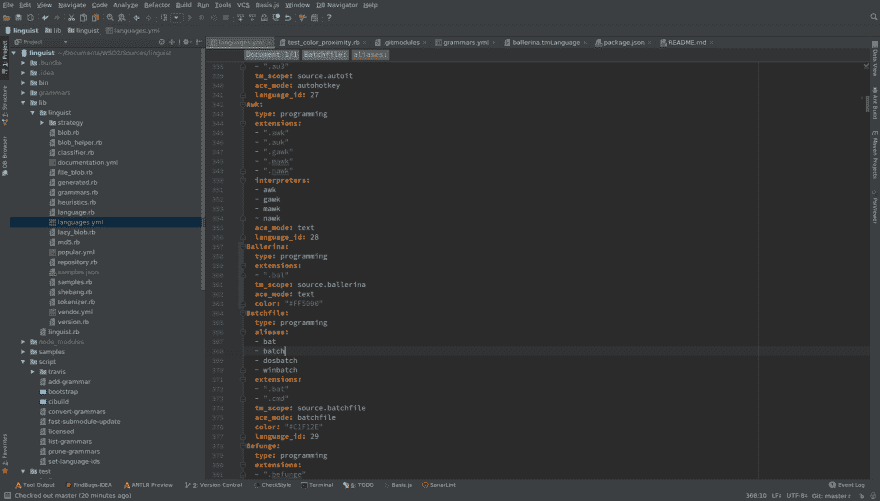
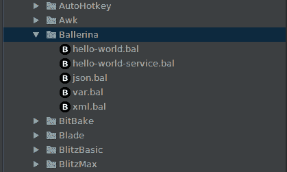
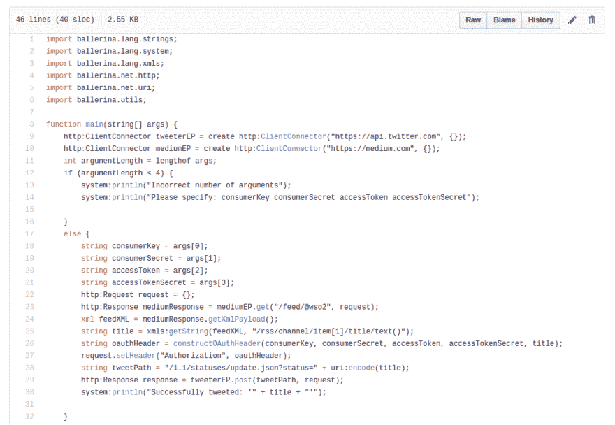
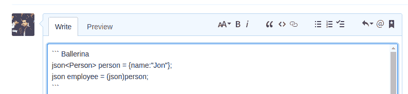
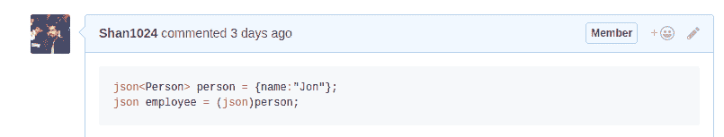

# 我如何为 GitHub 添加芭蕾舞演员支持

> 原文：<https://dev.to/shan1024/how-i-added-ballerina-support-to-github-6g>

故事从几个月前我加入 [WSO2](http://wso2.com/) 的[芭蕾舞团](https://ballerinalang.org/)开始。有一天，我正在开发芭蕾舞演员 IntelliJ IDEA 插件，突然我有了一个想法。这个想法是，“如果我们也能给 GitHub 添加芭蕾舞语法高亮支持，那会怎么样！?"。

众所周知，GitHub 为数百种语言提供了语法高亮支持，如 Java、JavaScripts、GO 等。当我们发送 PR 时，我们会看到突出显示的差异。您还可以通过点击语言细节栏来查看存储库中使用的编程语言。

[T2】](https://res.cloudinary.com/practicaldev/image/fetch/s--86bRsXa4--/c_limit%2Cf_auto%2Cfl_progressive%2Cq_auto%2Cw_880/https://thepracticaldev.s3.amazonaws.com/i/n36md73wb75odvvpkoid.png)

但是你有没有想过 GitHub 是如何突出显示语法的？不是吧。我也不知道。它只是工作，我们认为这是理所当然的，甚至从来没有想过两次。

所以一旦我有了这个想法，我就谷歌一下 GitHub 中的语法高亮是如何实现的。我发现这个功能是由语言学家库提供的。

我查看了存储库，看是否有向其中添加新语言的指南。幸运的是， [CONTRIBUTING.md](https://github.com/github/linguist/blob/master/CONTRIBUTING.md) 包含了一个关于*增加语言*的部分。看起来这个过程需要[红宝石](https://www.ruby-lang.org/en/)。我还看到了这个。

> 一旦新的扩展在 GitHub 上有所应用，我们就会尝试添加它们。在大多数情况下，在语言学家支持扩展之前，我们更喜欢在数百个存储库中使用扩展。

当时，芭蕾舞演员仍处于早期阶段，在 GitHub 中没有太多的用途。同时，我们那时正忙于一个接一个的发布，所以我想在我有空的时候检查一下，我们在 GitHub 中有更多的使用。

几个月过去了，我终于又找到了一些时间来做这件事。到那时，越来越多的芭蕾舞演员文件也被添加到 GitHub。所以我决定从我离开的地方开始挑选。令人惊讶的是，向 GitHub 添加一门语言比我想象的要容易，尽管在这个过程中很少出现问题。

在下面的部分中，我将总结我用来将芭蕾舞语言添加到语言学家库中的步骤。

### 语法文件

首先，您需要一个语法文件，它定义了用于语法高亮显示的规则。

定义语法有多种方法，但是我们需要一个 tmLanguage 文件( [textmate grammer](https://manual.macromates.com/en/language_grammars) )作为语法，因为它是语言学家库支持的语法。对我来说幸运的是，这已经是为芭蕾舞演员 VS 代码插件创建的。你可以在这里找到我用的[的语法文件](https://github.com/ballerinalang/plugin-vscode/blob/master/syntaxes/ballerina.tmLanguage)。这个语法有点老了，但它足以让事情开始。语法文件也应该有[这些](https://github.com/github/linguist/blob/257425141d4e2a5232786bf0b13c901ada075f93/vendor/licenses/config.yml#L2-L11)中的一个许可。如果你是 textmate 语法新手，可以参考[这](https://github.com/github/linguist/blob/master/CONTRIBUTING.md#fixing-syntax-highlighting)一节了解更多细节。

*注意:*我们将包含语法的知识库作为子知识库添加到语言学家知识库中。因此，每当发布新版本的语言学家知识库时，他们都会更新这些子模块，作为发布过程的一部分。所以这意味着如果你在你的 repo 中更新了你的语法，它将在语言学家库的下一个版本发布后反映在 GitHub 中。这样你就不用每次语法变化的时候都给语言学家 repo 发 PRs 了。

### 安装 Ruby

所以我做的第一件事就是安装 Ruby。这是一个相当简单的过程。

### 设置

1.  派生存储库。
2.  将存储库克隆到您的本地机器上。
3.  创建并签出一个新分支。
4.  使用以下命令安装捆扎机。

    `gem install bundler`

5.  使用以下命令导航到目录并安装依赖项。

    `bundle install`

    我犯的一个错误是我没有安装依赖项。这给我带来了一些问题。所以我找到了解决这些问题的方法:)

## 添加芭蕾舞女语言

### 更新语言. yml

所以第一步是更新*lib/languages/languages . yml*文件。在这里， **tm_scope** 字段应该具有语法中定义的作用域名称。确保不要更改列表中已经存在的条目。您也可以省略 **language_id** 字段，因为它将在以后生成和添加。

同样重要的是要注意，你不能使用与语言库中已经存在的颜色相似的颜色。这是通过*test/test _ color _ proximity . Rb*文件测试的。我猜这样做是为了让每种语言都有一个可区分的颜色。

[T2】](https://res.cloudinary.com/practicaldev/image/fetch/s--9tAfNiGJ--/c_limit%2Cf_auto%2Cfl_progressive%2Cq_auto%2Cw_880/https://thepracticaldev.s3.amazonaws.com/i/sr2d5muvm7y7pf9kltvp.png)

### 添加语法

所以接下来你要做的是使用下面的命令添加语法。

`script/add-grammar script/add-grammar https://github.com/ballerinalang/plugin-vscode`

这将把回购添加为子模块。模块名为*vendor/grammars/plugin-vs code*。这有点问题，因为这个名字太普通了。所以我必须将模块名重命名为一个更具体的名称。

### 添加样本

向样品/芭蕾舞演员目录添加少量样品。

[T2】](https://res.cloudinary.com/practicaldev/image/fetch/s--NNsB4-dr--/c_limit%2Cf_auto%2Cfl_progressive%2Cq_auto%2Cw_880/https://thepracticaldev.s3.amazonaws.com/i/fb0tsvw09kw1i09vuc1y.png)

### 生成语言 ID

现在我们必须使用下面的命令为我们的语言生成一个语言 ID。

`script/set-language-ids --update`

这将为我们的语言生成一个新的 ID。

### 测试

现在我们必须测试我们的变化。为此，运行以下命令。

```
script/bootstrap
bundle exec rake samples
bundle exec rake test 
```

Enter fullscreen mode Exit fullscreen mode

> 有时候让测试运行起来可能会太麻烦，尤其是如果你没有太多的 Ruby 经验的话。没关系:偷懒，让我们的构建机器人 Travis 为您运行测试。只要打开一个拉请求，机器人就会开始启动。

因此，如果你决定打开一个公关，而不是自己测试，以下部分是给你的。

### 打开请购单

现在，您已经完成了添加新语言的所有工作。提交更改并打开一个 PR。当发送 PR 时，您需要链接 GitHub 搜索结果，它显示了您的语言的广泛使用。比如参考[这个](https://github.com/search?utf8=%E2%9C%93&q=extension%3Abal+NOT+nothack&type=Code)。

## 语言学家群体

那个社区的开发商很受欢迎。我的 PR 审核得很快。他们指出了我的 PR 中的问题，所以我能够确保它符合他们的社区标准。如果你需要任何帮助或者有任何问题，请不要犹豫向他们询问。

## GitHub 中的芭蕾舞演员

通过将芭蕾舞语言添加到 GitHub，我们获得了以下优势。

### 芭蕾舞演员文件的语法高亮显示

[T2】](https://res.cloudinary.com/practicaldev/image/fetch/s--PtdIPOUY--/c_limit%2Cf_auto%2Cfl_progressive%2Cq_auto%2Cw_880/https://thepracticaldev.s3.amazonaws.com/i/kvm7024q5sbgzsjytbiz.png)

### 查看存储库中芭蕾舞演员代码的百分比

[T2】](https://res.cloudinary.com/practicaldev/image/fetch/s--tHu2x3qB--/c_limit%2Cf_auto%2Cfl_progressive%2Cq_auto%2Cw_880/https://thepracticaldev.s3.amazonaws.com/i/7jak9ya0k9udzx7xnz00.png)

### 芭蕾舞演员代码片段高亮显示

[T2】](https://res.cloudinary.com/practicaldev/image/fetch/s--nOC42Nk0--/c_limit%2Cf_auto%2Cfl_progressive%2Cq_auto%2Cw_880/https://thepracticaldev.s3.amazonaws.com/i/tse4xg5rdqshsh68khcn.png)

[T2】](https://res.cloudinary.com/practicaldev/image/fetch/s--UdQz3RII--/c_limit%2Cf_auto%2Cfl_progressive%2Cq_auto%2Cw_880/https://thepracticaldev.s3.amazonaws.com/i/sn56qkzmpb4cvtkesf9f.png)

除了其他人从中得到的，这也是我学习新事物的一个巨大机会。现在每当我在 GitHub 上看到芭蕾舞演员的代码，我都会感到非常高兴，因为我帮助实现了这一点。这可能是一生只有一次的机会，我很高兴我抓住了它。

希望你喜欢这篇文章。时间有点长，但我相信你学到了一些新东西:)