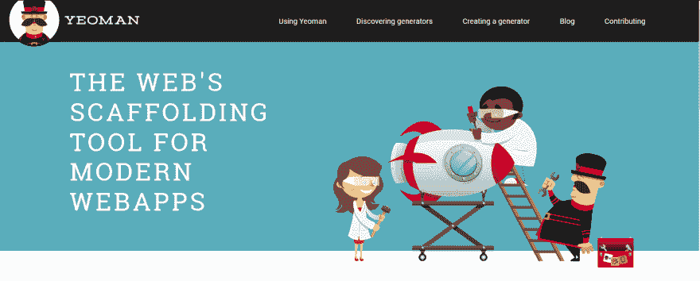

# 对于初级开发人员来说，使用脚手架是个好主意吗？

> 原文：<https://dev.to/metcoder/is-a-good-idea-for-a-junior-dev-the-use-of-scaffolding-1cf>

上周，在我完成我的第一篇文章(这里有一个[链接](https://dev.to/metcoder95/introduction-hi-my-name-is-charlie--this-is-where-i-started-35i)要走)后，我开始了一个简单的项目，只是为了实现我在这里和广阔的互联网世界的一些文章中读到和学到的一些东西。一旦我想好了我将在项目中实现什么东西，我就在 google 中搜索(只是出于好奇)启动项目的生成器(*像[express-generator](http://expressjs.com/es/starter/generator.html)for express js*)。

我用[自耕农](http://yeoman.io/)找到了一个很棒的叫 [rest](https://github.com/diegohaz/rest) 的。一旦我安装并运行了生成器，我就查看文件夹结构和文件，看看它是如何工作的。当我理解了它的工作原理后，我花时间思考并提出了一个问题:**对于初级开发人员来说，使用脚手架是个好主意吗？**

为了回答这个问题，我决定写这篇文章，所以我想解释一下我对脚手架的观点。

# 一、什么是脚手架(发电机)？

如果我们看一下 Yeoman 如何描述自己，我们可以有一个想法:“*基本上是一个插件，它可以运行一个命令来搭建完整的项目或有用的部分*”。

换句话说，这是一个有助于创建整个项目或部分项目的命令。

像约曼一样，我们可以找到其他搭建工具来为各种框架的应用程序创建框架。我们可以在 Ruby gems for Ruby on Rails、NPM 包 for Nodejs 等等中找到它。

[T2】](https://res.cloudinary.com/practicaldev/image/fetch/s--7GcWe9yY--/c_limit%2Cf_auto%2Cfl_progressive%2Cq_auto%2Cw_880/https://thepracticaldev.s3.amazonaws.com/i/tib0f5aok6dfwqxssy98.png)

# 超越善恶

### 我用了有什么好处？

**使用脚手架这是启动项目的好方法**。这个工具的创造者通过书籍、网络和其他方式进行研究；给你他们能找到的最好的设计模式和最佳实践。他们花时间给你一种方法，告诉你应该如何组织你的代码和文件，以得到一个好的、可读的项目。

这个工具是制造出来的或者应该是制造出来的，带有**模块架构**。给你一个可以以智能和可读的方式成长的应用程序的框架。这意味着你有一个支持来建立和发展你的实际产品。

脚手架是一个非常有用的节省时间的工具，给你一个快速的代码。这是一个节省从头开始一个项目的时间的机会，并给你一个方法来实现你需要的东西，同时减轻压力。越来越多的生成器实现的工具可能需要你花很长时间来自己实现，如果你没有这方面的经验，那么就更多了。这是一个了解工具如何工作的好方法，顺便说一句，在我们的项目中得到实现。

### 那么，我用它有什么错呢？

嗯，如果你是开发新手或者像我一样是初级开发人员，我想会有很多。

我们可以在大多数的搭建中找到一些**通用代码**的输出。他们中的一些人保持通用代码是最新的，如果你生活在 2014 年，其他人也是最新的。如果我们谈论一些已经预安装或实现的包或工具，我们也可以得到同样的结果。

通用代码带来了**定制**。有些生成器只是为了快速启动而准备的，很难根据您的需要进行修改。显然，这取决于脚手架的高度。有些只在代码和文件的结构中提供了一个脚手架，并使用了一些工具，另一些甚至提供了预迁移的 ORM，等等。只是让开发者更加不灵活地根据他们的需要进行定制。

# 结论

搭建和使用生成器是开始和理解设计模式和最佳实践的好方法，前提是我们要小心使用的方式和内容。获得使用脚手架的最佳体验的方法是理解它是如何工作的，而不仅仅是什么命令使它运行。深入了解它是如何工作的，每个文件是如何相互通信的，工具是如何工作的以及如何配置的，这是获得经验和防止使用生成器出现问题的最佳实践。

关键是永远保持好奇。好奇心带来了经验和知识。