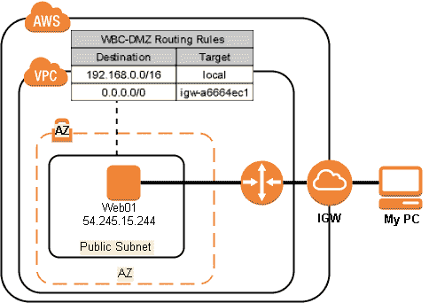
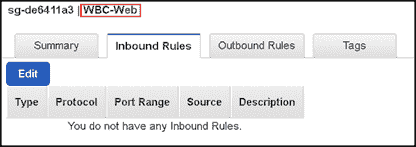
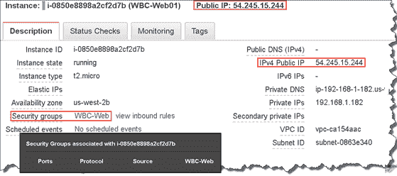
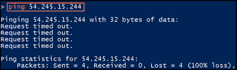
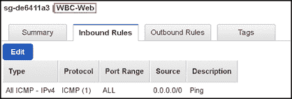
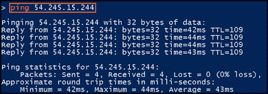
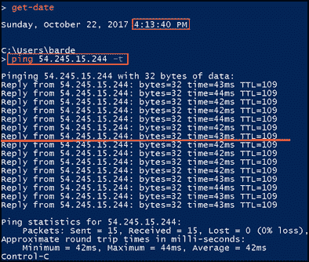
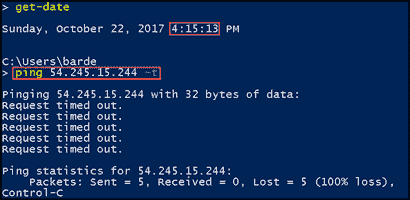

# 为什么删除 AWS 安全组规则不会停止流量

> 原文：<https://dev.to/bardev/why-removing-a-aws-security-group-rule-does-not-stop-traffic-flow-53p>

情况是这样的。我创建了一个 AWS 安全组入站规则来允许 ping，这允许我从我的家用计算机 Ping 一个 EC2 实例。问题是，当我删除 Ping 入站规则时，Ping 请求仍然会收到响应。我希望当我删除 Ping 入站规则时，响应会停止。

在这篇文章中，我将重现这个问题，并向您展示这是 AWS 安全组的一个特性，而不是一个错误。

## 初始设置:

*   1 VPC
*   1 AZ
*   1 个使用公共 IP 的 EC2 实例–54.245.15.244
*   互联网网关(IGW)
*   途径
    *   0.0.0.0/0 -> igw-a664ec1
    *   所有交通都可以通过 IGW
    *   192.168.0.0/16 ->本地
    *   所有资源都可以与 IP 范围内的其他资源对话
*   分配给 EC2 实例的安全组为空

[T2】](https://res.cloudinary.com/practicaldev/image/fetch/s--2cZ_O2NY--/c_limit%2Cf_auto%2Cfl_progressive%2Cq_auto%2Cw_880/http://www.bardev.com/wp-content/uploads/2017/10/img_59ed1ddfd4ce4.png)

安全组 WBC-Web 没有入站规则。不允许任何交通

[T2】](https://res.cloudinary.com/practicaldev/image/fetch/s--tsGKwFm_--/c_limit%2Cf_auto%2Cfl_progressive%2Cq_auto%2Cw_880/http://www.bardev.com/wp-content/uploads/2017/10/img_59ed1fcd59045.png)

尽管此 EC2 实例有一个公共 IP，但是没有入站流量应该到达此实例，因为此实例与没有入站规则的安全组 WBC-Web 关联。

[T2】](https://res.cloudinary.com/practicaldev/image/fetch/s--DwWWDrzj--/c_limit%2Cf_auto%2Cfl_progressive%2Cq_auto%2Cw_880/http://www.bardev.com/wp-content/uploads/2017/10/img_59ed1f5c5fef1.png)

## 让我们验证一下这个设置

在我的家用计算机上，如果我 ping EC2 实例，我将收到一个“请求超时”消息

[T2】](https://res.cloudinary.com/practicaldev/image/fetch/s--njAkD_bp--/c_limit%2Cf_auto%2Cfl_progressive%2Cq_auto%2Cw_880/http://www.bardev.com/wp-content/uploads/2017/10/img_59ed209deb3fb.png)

因为安全组没有入站规则，所以没有响应。

## 创建入站 Ping 规则

在 AWS 控制台中，我向安全组 WBC-Web 添加了入站规则，以允许来自所有 IP 地址的 ping。

[T2】](https://res.cloudinary.com/practicaldev/image/fetch/s--SMXmGcI3--/c_limit%2Cf_auto%2Cfl_progressive%2Cq_auto%2Cw_880/http://www.bardev.com/wp-content/uploads/2017/10/img_59ed21b7bf3ab.png)

现在，如果我尝试 ping EC2 实例，我将收到一个响应。

[T2】](https://res.cloudinary.com/practicaldev/image/fetch/s--U_sQXiNO--/c_limit%2Cf_auto%2Cfl_progressive%2Cq_auto%2Cw_880/http://www.bardev.com/wp-content/uploads/2017/10/img_59ed222e6c4fd.png)

## 迷茫

如果我删除了安全组入站 ping 规则，我会继续收到我不期望的响应。我想 ping 应该超时了。

为了演示这一点，我将使用-t 选项运行 ping。这将保持 ping 运行，直到我手动取消它。

我将在删除 ping 规则之前启动 ping。

在下图中，红线标记了我删除 ping 入站规则的时间点。删除 ping 入站规则后，仍然会返回响应。

[T2】](https://res.cloudinary.com/practicaldev/image/fetch/s--Q-2lwg8t--/c_limit%2Cf_auto%2Cfl_progressive%2Cq_auto%2Cw_880/http://www.bardev.com/wp-content/uploads/2017/10/img_59ed22eb0510e.png)

我停止了 ping，然后开始 ping，看看是否还会收到响应，我确实收到了响应。

[T2】](https://res.cloudinary.com/practicaldev/image/fetch/s--MeVO35dj--/c_limit%2Cf_auto%2Cfl_progressive%2Cq_auto%2Cw_880/http://www.bardev.com/wp-content/uploads/2017/10/img_59ed235fd9599.png)

我再次停止 ping，等了一分钟才再次启动。这一次 ping 终于超时了。

[T2】](https://res.cloudinary.com/practicaldev/image/fetch/s--CsdQm1Ia--/c_limit%2Cf_auto%2Cfl_progressive%2Cq_auto%2Cw_880/http://www.bardev.com/wp-content/uploads/2017/10/img_59ed23ceea22c.png)

## 那么到底怎么回事

对于安全组，有一个称为连接跟踪的特性。连接跟踪用于跟踪进出实例的信息。

当有通信流时，例如 ping，安全组入站规则被删除，通信流不会因为入站规则的删除而停止。当流量在客户端或主机上停止至少几分钟时，流量就会中断。

在通信流动时删除 ping 入站规则不会中断或停止通信流动。您必须首先停止客户端或主机上的 ping，并至少等待 1 分钟，入站规则的删除才会生效。

我认为亚马逊在这方面做得更好。

> 并非所有的流量都被跟踪。如果安全组规则允许所有流量(0.0.0.0/0)的 TCP 或 UDP 流，并且在另一个方向上有一个相应的规则允许所有端口(0-65535)的所有响应流量(0.0.0.0/0 ),则不会跟踪该流量。因此，允许响应流量是基于允许响应流量的入站或出站规则，而不是基于跟踪信息。
> 
> 跟踪端口 22 (SSH)上进出实例的 TCP 流量，因为入站规则只允许来自`203.0.113.1/32`的流量，而不是所有 IP 地址(`0.0.0.0/0`)。不会跟踪进出实例的端口 80 (HTTP)上的 TCP 流量，因为入站和出站规则都允许所有流量(`0.0.0.0/0`)。不管规则如何，ICMP 流量总是被跟踪。
> 
> 当您删除启用该流量的安全组规则时，被跟踪的现有流量可能不会中断。相反，当您或另一台主机停止传输至少几分钟时(对于已建立的 TCP 连接，可能长达 5 天)，传输就会中断。对于 UDP，这可能需要在流的远程端终止操作。如果启用流量的规则被删除或修改，未被跟踪的流量会立即中断。例如，如果您删除了允许所有入站 SSH 流量进入实例的规则，那么您与实例的现有 SSH 连接将立即断开。
> 
> 安全组-连接跟踪
> 
> [http://docs . AWS . Amazon . com/AWS C2/latest/user guide/using-network-security . html # security-group-connection-tracking](http://docs.aws.amazon.com/AWSEC2/latest/UserGuide/using-network-security.html#security-group-connection-tracking)

重要的是要明白，如果流量正在被跟踪和流动，那么删除允许规则不会停止流量。

以下是阻止交通的几种方法。

1.  创建网络访问控制列表(ACL)入站规则
2.  在实例上，禁用通信类型或阻塞端口
3.  删除安全组

在了解 AWS 安全组时，我遇到了这种情况，非常困惑。花了很大力气才弄明白发生了什么事。我希望这能帮助其他人，也希望其他人不会经历我所经历的痛苦。

### 更新——2017 年 11 月 11 日星期六

这似乎与 SSH 连接无关。我一删除 SSH 入站规则，SSH 连接就会终止。我假设 SSH 和 RDP 规则的功能类似。

帖子[为什么删除 AWS 安全组规则不会阻止流量](http://www.bardev.com/2017/10/22/aws-security-group-stop-traffic-flow/)最早出现在[迈克巴洛(巴德夫)](http://www.bardev.com)上。