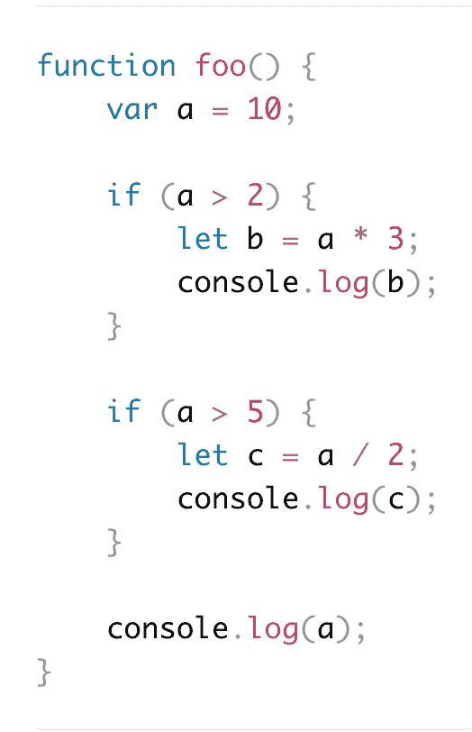

# 你真的不应该使用 var 吗？

> 原文:[https://dev . to/John Wolfe 820/should-you-never-true-use-var-BDI](https://dev.to/johnwolfe820/should-you-never-truly-use-var-bdi)

Javascript 社区中出现了一些关于这个经典变量声明的争议。那么，E6 纯粹主义者是正确的吗？我们应该永远把 var 扔进垃圾箱吗？这篇博客文章将对这场争论进行深入探讨。

首先，反对 var 的论点(前两个采用了 Learn Verified 的新的和优秀的 V3 课程)。

1.  如果使用 var 声明同一个变量两次，不会抛出错误(相反，如果一个变量声明两次，let 和 const 都会抛出错误)

2.  用 var 声明的变量不是块范围的(尽管它们是函数范围的)，而用 let 和 const 则是。这一点很重要，因为如果你不打算使用块作用域，那么它还有什么意义。因此，在这种情况下使用 var 需要在全局范围内使用函数内部声明的变量。我想不出在什么情况下这是绝对必要的，但也许它们确实存在。

3.  反对使用 var 的另一个论点是，JS Linters 现在指出使用 var 是不好的做法。我在网上快速搜索了一下，发现 Jslint.com 和 Jshint.com 并没有提出使用 var 作为变量声明的问题。然而，ESLint 明确有一条[无风险值规则，旨在阻止风险值的使用。](https://eslint.org/docs/rules/no-var)

4.  大多数 Javascript 专家都认为不应该使用 var。推广 JSON 的道格拉斯·克洛克福特反对使用 var。他指出，“在机器生成的代码这样的极端情况下，var 可能仍然有用，但我在这方面已经尽力了。韦斯·博斯也说他不会用 var。

所以，上面的理由清楚地、合乎逻辑地表明了为什么永远不应该使用 var，为什么还会有人想再次使用它而不是 const 或 let 呢？Kyle Simpson 是《你不知道 JS》的作者，也是全面的 Javascript 专家，他在这篇文章中为 var 提出了一个可能的例子。辛普森认为:

“在真实世界的代码中，有些地方会将某些变量适当地限定在整个函数的范围内，对于这些变量，var 是一个更好的信号”

他提供了以下代码块来说明他的观点:

[T2】](https://res.cloudinary.com/practicaldev/image/fetch/s--8fZT6Qgr--/c_limit%2Cf_auto%2Cfl_progressive%2Cq_auto%2Cw_880/https://thepracticaldev.s3.amazonaws.com/i/d9irf4dc0uo2n7ntekbk.png)

本质上，Simpson 认为，虽然在上面的例子中用 let 改变 var 仍然会起同样的作用，因为两个块明确地利用了 let 的块作用域(记住只有 let/const 是块作用域，而不是 var)，但 var 是一个有用的信号来指示函数作用域。

(Simpson 还指出，当他使用 try…catch 块进行调试时，Let 块范围会导致不必要的错误。)

最后，在看了上面 Simpson 提供的例子后，不难看出 var 是如何在这种情况下构成一个更干净的选项的。当然，许多人不同意辛普森的观点。当然，在上面的例子中，var 是一个比 let 更清晰的信号，但既然它的操作是一样的，那么它真的值得发挥作用吗？