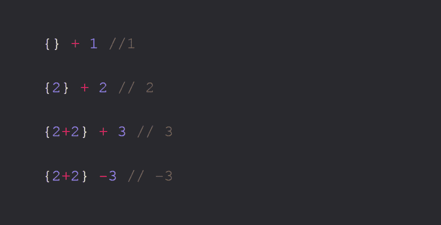

# JS 表达式关于 Javascript 的表达式、语句和表达式语句你需要知道的一切

> 原文:[https://dev . to/promise tochi/JavaScript-in-depth-all-you-need-know-on-expressions-statements-and-expression-statements-5k 2](https://dev.to/promisetochi/javascript-in-depth-all-you-need-to-know-about-expressions-statements-and-expression-statements-5k2)

到本文结束时，您应该能够详细描述下图中的代码是如何工作的，以及它为什么工作。

[T2】](https://res.cloudinary.com/practicaldev/image/fetch/s--GSp0f8jN--/c_limit%2Cf_auto%2Cfl_progressive%2Cq_auto%2Cw_880/https://thepracticaldev.s3.amazonaws.com/i/tkjfva9zp7kt9tajmxy8.PNG)

Javascript 中有两个主要的语法类别:

1.  声明
2.  公式

进行这种区分很重要，因为表达式可以像语句一样工作，这就是为什么我们也有表达式语句。但是，另一方面，陈述不能像表达式一样起作用。

## 表情

### **表达式产生一个值**

表达式是产生单个值的 Javascript 代码片段。表达式可以是您想要的长度，但是它们总是产生一个值。

```
2 + 2 * 3 / 2

(Math.random() * (100 - 20)) + 20

functionCall()

window.history ? useHistory() : noHistoryFallback()

1+1, 2+2, 3+3

declaredVariable

true && functionCall()

true && declaredVariable 
```

<svg width="20px" height="20px" viewBox="0 0 24 24" class="highlight-action crayons-icon highlight-action--fullscreen-on"><title>Enter fullscreen mode</title></svg> <svg width="20px" height="20px" viewBox="0 0 24 24" class="highlight-action crayons-icon highlight-action--fullscreen-off"><title>Exit fullscreen mode</title></svg>

以上都是表达式，可以出现在 Javascript 需要值的任何地方。因此下面的参数`console.log`解析为一个记录到控制台的值。

```
console.log(true && 2 * 9) // 18 
```

<svg width="20px" height="20px" viewBox="0 0 24 24" class="highlight-action crayons-icon highlight-action--fullscreen-on"><title>Enter fullscreen mode</title></svg> <svg width="20px" height="20px" viewBox="0 0 24 24" class="highlight-action crayons-icon highlight-action--fullscreen-off"><title>Exit fullscreen mode</title></svg>

### **表情不一定变化状态**

例如，

```
const assignedVariable = 2; //this is a statement, assignedVariable is state

assignedVariable + 4 // expression

assignedVariable * 10 // expression

assignedVariable - 10 // expression

console.log(assignedVariable) // 2 
```

<svg width="20px" height="20px" viewBox="0 0 24 24" class="highlight-action crayons-icon highlight-action--fullscreen-on"><title>Enter fullscreen mode</title></svg> <svg width="20px" height="20px" viewBox="0 0 24 24" class="highlight-action crayons-icon highlight-action--fullscreen-off"><title>Exit fullscreen mode</title></svg>

尽管上面的代码片段中有所有的表达式，assignedVariable 的值仍然是 2。那么为什么在这一节的标题中有`necessarily`呢，因为函数调用是表达式，但是函数可以包含改变状态的语句。所以`foo()`本身就是一个表达式，要么返回未定义的值，要么返回其他值，但是如果`foo`被写成

```
const foo = foo () => {
  assignedVariable = 14
} 
```

<svg width="20px" height="20px" viewBox="0 0 24 24" class="highlight-action crayons-icon highlight-action--fullscreen-on"><title>Enter fullscreen mode</title></svg> <svg width="20px" height="20px" viewBox="0 0 24 24" class="highlight-action crayons-icon highlight-action--fullscreen-off"><title>Exit fullscreen mode</title></svg>

然后，即使它的调用是一个表达式，它的调用也导致了状态的改变。因此，重写 foo 函数和语句的更好方法是:

```
const foo = foo () => {
  return 14 //explicit return for readability
}
assignedVariable = foo() 
```

<svg width="20px" height="20px" viewBox="0 0 24 24" class="highlight-action crayons-icon highlight-action--fullscreen-on"><title>Enter fullscreen mode</title></svg> <svg width="20px" height="20px" viewBox="0 0 24 24" class="highlight-action crayons-icon highlight-action--fullscreen-off"><title>Exit fullscreen mode</title></svg>

或者更好

```
const foo = foo (n) => {
  return n//explicit return for readability
}
assignedVariable = foo(14) 
```

<svg width="20px" height="20px" viewBox="0 0 24 24" class="highlight-action crayons-icon highlight-action--fullscreen-on"><title>Enter fullscreen mode</title></svg> <svg width="20px" height="20px" viewBox="0 0 24 24" class="highlight-action crayons-icon highlight-action--fullscreen-off"><title>Exit fullscreen mode</title></svg>

通过这种方式，您的代码更具可读性、可组合性，并且表达式和语句之间有明确的区别和分离。这是函数式和声明式 Javascript 的基础。

## 报表

语句是函数式编程ðÿ˜„.的头痛问题基本上，语句执行动作，它们做事情。

在 javascript 中，不能在需要值的地方使用语句。所以它们不能用作函数的参数、右边的赋值、运算符操作数、返回值…

```
foo(if () {return 2}) //js engine mind = blown 
```

<svg width="20px" height="20px" viewBox="0 0 24 24" class="highlight-action crayons-icon highlight-action--fullscreen-on"><title>Enter fullscreen mode</title></svg> <svg width="20px" height="20px" viewBox="0 0 24 24" class="highlight-action crayons-icon highlight-action--fullscreen-off"><title>Exit fullscreen mode</title></svg>

这些都是 javascript 语句:

1.  如果
2.  如果-否则
3.  在…期间
4.  做一会儿
5.  为
6.  转换
7.  对于-在
8.  with(已弃用)
9.  调试器
10.  变量声明

如果您在浏览器的控制台中键入下面的代码片段，然后按回车键

```
if (true) {9+9} 
```

<svg width="20px" height="20px" viewBox="0 0 24 24" class="highlight-action crayons-icon highlight-action--fullscreen-on"><title>Enter fullscreen mode</title></svg> <svg width="20px" height="20px" viewBox="0 0 24 24" class="highlight-action crayons-icon highlight-action--fullscreen-off"><title>Exit fullscreen mode</title></svg>

您将看到它返回了`18`,但是尽管如此，您还是不能将它用作表达式或者 Javascript 需要值的地方。这很奇怪，因为你期望语句不返回任何东西，因为如果你不能使用返回值，那么它几乎没有任何用处。那是给你的 Javascript，奇怪。

### **函数声明、函数表达式和命名函数表达式**

函数声明是一个语句

```
function foo (func) {
  return func.name
} 
```

<svg width="20px" height="20px" viewBox="0 0 24 24" class="highlight-action crayons-icon highlight-action--fullscreen-on"><title>Enter fullscreen mode</title></svg> <svg width="20px" height="20px" viewBox="0 0 24 24" class="highlight-action crayons-icon highlight-action--fullscreen-off"><title>Exit fullscreen mode</title></svg>

函数表达式就是表达式，你称之为匿名函数

```
console.log(foo(function () {} )) // "" 
```

<svg width="20px" height="20px" viewBox="0 0 24 24" class="highlight-action crayons-icon highlight-action--fullscreen-on"><title>Enter fullscreen mode</title></svg> <svg width="20px" height="20px" viewBox="0 0 24 24" class="highlight-action crayons-icon highlight-action--fullscreen-off"><title>Exit fullscreen mode</title></svg>

命名函数表达式是一个表达式，就像匿名函数一样，但是它有一个名字

```
console.log(foo(function myName () {} )) // "myName" 
```

<svg width="20px" height="20px" viewBox="0 0 24 24" class="highlight-action crayons-icon highlight-action--fullscreen-on"><title>Enter fullscreen mode</title></svg> <svg width="20px" height="20px" viewBox="0 0 24 24" class="highlight-action crayons-icon highlight-action--fullscreen-off"><title>Exit fullscreen mode</title></svg>

函数作为表达式和函数作为声明的区别归结为这样理解:
**每当你声明一个函数，而 Javascript 期望一个值，它就会试图把它当作一个值，如果它不能把它当作一个值，就会抛出一个错误。
而在脚本、模块的全局级别或块语句的顶层(即不需要值的地方)声明函数，将导致函数声明。**

例子:

```
if () {
  function foo () {} // top level of block, declaration
}

function foo () {} //global level, declaration

function foo () {
  function bar() {} //top level of block, declaration
}

function foo () {
  return function bar () {} // named function expression
}

foo(function () {}) // anonymous function expression

function foo () {
  return function bar () {
    function baz () {} // top level of block, declaration
  }
}

function () {} // SyntaxError: function statement requires a name

if (true){
  function () {} //SyntaxError: function statement requires a name
} 
```

<svg width="20px" height="20px" viewBox="0 0 24 24" class="highlight-action crayons-icon highlight-action--fullscreen-on"><title>Enter fullscreen mode</title></svg> <svg width="20px" height="20px" viewBox="0 0 24 24" class="highlight-action crayons-icon highlight-action--fullscreen-off"><title>Exit fullscreen mode</title></svg>

### **将表达式转换为语句:表达式语句**

JavaScriptðÿ˜ƒ有简单明了的事情吗

```
2+2; //expression statement
foo(); //expression statement 
```

<svg width="20px" height="20px" viewBox="0 0 24 24" class="highlight-action crayons-icon highlight-action--fullscreen-on"><title>Enter fullscreen mode</title></svg> <svg width="20px" height="20px" viewBox="0 0 24 24" class="highlight-action crayons-icon highlight-action--fullscreen-off"><title>Exit fullscreen mode</title></svg>

您可以将表达式转换为表达式语句，只需在行尾添加一个分号，或者让[自动插入分号](https://dev.to/promhize/what-you-need-to-know-about-javascripts-automatic-semi-colon-insertion-78a)来完成这项工作。本身是一个表达式，但完整的一行是一个陈述。

```
2+2 // on its own is an opposition

foo(2+2) //so you can use it anywhere a value is expected

true ? 2+2 : 1 + 1

function foo () {return 2+2}

2+2; //expression statement
foo(2+2;) //syntaxError 
```

<svg width="20px" height="20px" viewBox="0 0 24 24" class="highlight-action crayons-icon highlight-action--fullscreen-on"><title>Enter fullscreen mode</title></svg> <svg width="20px" height="20px" viewBox="0 0 24 24" class="highlight-action crayons-icon highlight-action--fullscreen-off"><title>Exit fullscreen mode</title></svg>

### **分号 vs 逗号运算符**

使用分号，您可以在同一行上保留多个语句

```
const a; function foo () {}; const b = 2 
```

<svg width="20px" height="20px" viewBox="0 0 24 24" class="highlight-action crayons-icon highlight-action--fullscreen-on"><title>Enter fullscreen mode</title></svg> <svg width="20px" height="20px" viewBox="0 0 24 24" class="highlight-action crayons-icon highlight-action--fullscreen-off"><title>Exit fullscreen mode</title></svg>

逗号操作符允许你链接多个表达式，只返回最后一个表达式

```
console.log( (1+2,3,4) ) //4

console.log( (2, 9/3, function () {}) ) // function (){}

console.log( (3, true ? 2+2 : 1+1) ) // 4 
```

<svg width="20px" height="20px" viewBox="0 0 24 24" class="highlight-action crayons-icon highlight-action--fullscreen-on"><title>Enter fullscreen mode</title></svg> <svg width="20px" height="20px" viewBox="0 0 24 24" class="highlight-action crayons-icon highlight-action--fullscreen-off"><title>Exit fullscreen mode</title></svg>

> 旁注:告诉 Javascript 引擎期待一个值的一种方法是通过括号，()，如果没有括号，每个表达式将被视为 console.log.
> 的一个参数

```
function foo () {return 1, 2, 3, 4}
foo() //4 
```

<svg width="20px" height="20px" viewBox="0 0 24 24" class="highlight-action crayons-icon highlight-action--fullscreen-on"><title>Enter fullscreen mode</title></svg> <svg width="20px" height="20px" viewBox="0 0 24 24" class="highlight-action crayons-icon highlight-action--fullscreen-off"><title>Exit fullscreen mode</title></svg>

所有的表达式将从左到右计算，最后一个将被返回。

### **【IIFEs(立即调用函数表达式)**

匿名函数可以是一个表达式，如果我们在 Javascript 需要一个值的地方使用它，这意味着我们如果我们可以告诉 Javascript 需要一个带括号的值，我们可以传递一个匿名函数作为那个值。

```
function () {} 
```

<svg width="20px" height="20px" viewBox="0 0 24 24" class="highlight-action crayons-icon highlight-action--fullscreen-on"><title>Enter fullscreen mode</title></svg> <svg width="20px" height="20px" viewBox="0 0 24 24" class="highlight-action crayons-icon highlight-action--fullscreen-off"><title>Exit fullscreen mode</title></svg>

因此，虽然上面的代码片段无效，但下面的代码片段有效

```
(function () {}) // this returns function () {} 
```

<svg width="20px" height="20px" viewBox="0 0 24 24" class="highlight-action crayons-icon highlight-action--fullscreen-on"><title>Enter fullscreen mode</title></svg> <svg width="20px" height="20px" viewBox="0 0 24 24" class="highlight-action crayons-icon highlight-action--fullscreen-off"><title>Exit fullscreen mode</title></svg>

如果把一个匿名函数放在一个括号内，立即返回相同的匿名函数，这意味着我们可以直接调用它，就像这样:

```
(function () {
  //do something
})() 
```

<svg width="20px" height="20px" viewBox="0 0 24 24" class="highlight-action crayons-icon highlight-action--fullscreen-on"><title>Enter fullscreen mode</title></svg> <svg width="20px" height="20px" viewBox="0 0 24 24" class="highlight-action crayons-icon highlight-action--fullscreen-off"><title>Exit fullscreen mode</title></svg>

所以，这些都是可能的

```
(function () {
  console.log("immediately invoke anonymous function call")
})() // "immediately invoke anonymous function call"

(function () {
  return 3
})() // 3

console.log((function () {
  return 3
})()) // 3

//you can also pass an argument to it
(function (a) {
  return a
})("I'm an argument") // I'm an argument 
```

<svg width="20px" height="20px" viewBox="0 0 24 24" class="highlight-action crayons-icon highlight-action--fullscreen-on"><title>Enter fullscreen mode</title></svg> <svg width="20px" height="20px" viewBox="0 0 24 24" class="highlight-action crayons-icon highlight-action--fullscreen-off"><title>Exit fullscreen mode</title></svg>

### **对象文字 vs 块语句**

> 旁注:这是有效的 javascript

```
r: 2+2 // valid

foo()

const foo = () => {} 
```

<svg width="20px" height="20px" viewBox="0 0 24 24" class="highlight-action crayons-icon highlight-action--fullscreen-on"><title>Enter fullscreen mode</title></svg> <svg width="20px" height="20px" viewBox="0 0 24 24" class="highlight-action crayons-icon highlight-action--fullscreen-off"><title>Exit fullscreen mode</title></svg>

以上是全局范围内的语句序列，将被解析为有效的 Javascript 并执行。`r`就是你所说的标签，它们主要用于打破循环。示例:

```
loop: {
  for (const i = 0; i < 2; i++) {
    for (const n = 0; n <2; n++) {
      break loop //breaks outer loop and stops entire loop
    }
  }
} 
```

<svg width="20px" height="20px" viewBox="0 0 24 24" class="highlight-action crayons-icon highlight-action--fullscreen-on"><title>Enter fullscreen mode</title></svg> <svg width="20px" height="20px" viewBox="0 0 24 24" class="highlight-action crayons-icon highlight-action--fullscreen-off"><title>Exit fullscreen mode</title></svg>

您可以在任何表达式或表达式语句前添加一个标签，注意这样做并不是在创建一个变量 lab:

```
lab: function a () {}
console.log(lab) //ReferenceError: lab is not defined 
```

<svg width="20px" height="20px" viewBox="0 0 24 24" class="highlight-action crayons-icon highlight-action--fullscreen-on"><title>Enter fullscreen mode</title></svg> <svg width="20px" height="20px" viewBox="0 0 24 24" class="highlight-action crayons-icon highlight-action--fullscreen-off"><title>Exit fullscreen mode</title></svg>

大括号{}允许您将表达式语句和语句分组。所以你可以写，

```
{var a = "b"; func(); 2+2} // 4 
```

<svg width="20px" height="20px" viewBox="0 0 24 24" class="highlight-action crayons-icon highlight-action--fullscreen-on"><title>Enter fullscreen mode</title></svg> <svg width="20px" height="20px" viewBox="0 0 24 24" class="highlight-action crayons-icon highlight-action--fullscreen-off"><title>Exit fullscreen mode</title></svg>

如果你把上面的内容粘贴到你的浏览器控制台，它将返回 4，当你做`console.log(a)`时，你将得到字符串`b`。您可以称之为 block 语句，这与您可能习惯的对象文字不同。

```
console.log({a: 'b'}) // {a: 'b'}

console.log({var a = "b", func(), 2+2}) // SyntaxError

const obj = {var a = "b", func(), 2+2} // SyntaxError 
```

<svg width="20px" height="20px" viewBox="0 0 24 24" class="highlight-action crayons-icon highlight-action--fullscreen-on"><title>Enter fullscreen mode</title></svg> <svg width="20px" height="20px" viewBox="0 0 24 24" class="highlight-action crayons-icon highlight-action--fullscreen-off"><title>Exit fullscreen mode</title></svg>

不能使用 block 语句作为值或表达式，因为 console.log 是一个函数，它不能接受语句作为参数。不过它可以接受一个对象文字。我希望你理解了我上面解释的所有内容，因为下面的一个片段可能会让你迷惑。

```
{} + 1 //1

{2} + 2 // 2

{2+2} + 3 // 3

{2+2} -3 // -3 
```

<svg width="20px" height="20px" viewBox="0 0 24 24" class="highlight-action crayons-icon highlight-action--fullscreen-on"><title>Enter fullscreen mode</title></svg> <svg width="20px" height="20px" viewBox="0 0 24 24" class="highlight-action crayons-icon highlight-action--fullscreen-off"><title>Exit fullscreen mode</title></svg>

您可能希望它抛出一个语法错误或者分别返回 1、4、7。记住语句不应该返回任何东西，因为它们不能作为值使用。因此 Javascript 会抛出一个错误，试图将`+`操作符的操作数转换成一个数字或字符串，如果不能，它就会抛出。因此，无论 block 语句返回什么，都会隐式地强制将`0`用作操作数。

咻，如果你一路看下去，你才是真正的 MVP。这可能就是你需要知道的关于表达式、语句和表达式语句的全部内容。