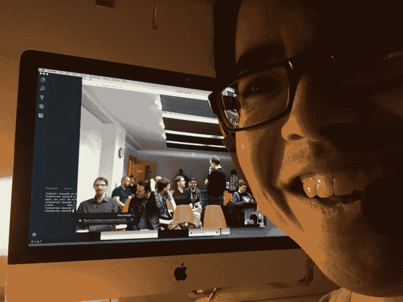

# 远程演讲技巧

> 原文:[https://dev.to/booyaa/remote-speaking-tips-2c05](https://dev.to/booyaa/remote-speaking-tips-2c05)

2017 年底，我做了我的第一次远程谈话(针对 [Rust
Edinburgh](https://www.meetup.com/rust-edi/) 用户组)。我想我会分享我的经验来帮助其他想做同样事情的人。

## TL；dr -您的检查表:

*   买一个质量好的耳机，不要使用电脑的内置麦克风。
*   做一个镜子(自拍)测试，确保背景中没有令人尴尬的东西。
*   制作更多幻灯片，让信息渗透进来，以强化概念。
*   避免信息密集的幻灯片。
*   事先做一个测试视频电话会议。
*   预先烘焙你的演示，除非你是一个现场编程老手。
*   不要东拉西扯，简短的原声片段更让人记忆深刻。
*   练习。

## 档位

买一个像样的耳机，不要在电脑上使用内置麦克风！我借了我另一半的一副 HyperX Cloud II(T1)和(T2)耳机，这是她的游戏耳机，但它们也非常适合视频会议。

一个可接受的低 fi 替代方案是电话免提套件。与 iPhones 捆绑在一起的产品非常适合这项任务。

## 设置

如果这是你第一次做视频会议，那就做个镜子或者自拍测试。在 google hangout 中，你可以通过点击视频通话图标来实现。

看看你的周围，有没有你不想出现在背景中的东西？我们的家庭办公室也是我们的客房，也是我们存放干衣机的地方——你明白的。

如果你能在背景中贴上很酷的海报或与演讲相关的物品(吉祥物之类的),那就更好了！

## 甲板设计

这是我仍在努力掌握的领域，所以我会在一个单独的帖子中重新探讨，但这里有一些更有经验的演讲者给我的提示。

保持每张幻灯片上的细节简洁，但也要有更多的幻灯片来强化你想要表达的概念。你不再有优势看到观众的反应，即他们对主题的理解程度。所以一点一点地灌输信息。

## 谷歌视频聊天

目前，我仍在使用 Google Hangout 来进行我的远程对话，并为伦敦 Rust 用户组(T1)的远程演讲者提供便利。如果双方都有 Chrome，那就是零软件安装。

然而，我确实有一些担心，特别是缺乏多显示器支持(稍后将详细介绍)以及无法增加对方视频窗口的大小。

### 多显示(或缺少)

当面对面交谈时，几乎所有的视听设备都允许你使用
投影仪/电视作为额外的显示器。这允许我在演示者模式下配置 Keynote (Mac 演示工具)。幻灯片如您所料出现在投影仪/电视上，在您自己的电脑显示屏上，您可以看到经过的时间、下一张幻灯片和演讲者注释。

Google hangout 允许你以两种模式分享你的屏幕:全屏或者应用。这两种模式都不支持多显示器。这意味着 Keynote 将只显示幻灯片，没有演示模式！想象一下，当我开始讲话时，我有多惊讶！

幸运的是，我将笔记本电脑作为第二台计算机(用于我的实时编码脚本)。所以几秒钟后，我在这台电脑上有了演示文稿和笔记。另一种方法是将 iOS 设备上的 Keynote 用作演示遥控器。然后，您可以将其配置为在当前幻灯片旁边显示演示文稿注释。

### 无法增加对方视频的大小

这意味着你看不到听众，也不知道他们是否在听你讲话。

## 现场编码

除非你已经会打字并能和同事交谈，否则不要这么做！最好预先录制你的现场编码，然后你可以编辑暂停。你还会发现，当你不担心下一步该打什么的时候，提供评论就更容易了。

如果你决定要做现场编码，保留一份你想展示的脚本。如果有意义，将代码片段放在手边。

我谈论的是 Rust 语言服务器及其与 Visual Studio 代码的集成，所以我需要出错来演示功能。所以代码片段不会有用。

如果您有合适的屏幕录音，也可以录制您的麦克风，请使用来练习。一旦长时间的停顿停止，你就准备好了！

我确实做过现场编码，但我已经做过两次了。我也每天练习剧本，直到我开始演讲。

## 准备

如果可能的话，在会谈前打一个测试电话。这给了你时间来排除任何技术故障。另外，在你讲话前几分钟，也要打另一个电话，你的主人通常会希望这样。

Rust Edinburgh 的组织者也要了一份我的幻灯片。我们的计划是，如果网络连接中断，他们会打电话给我，代表我浏览幻灯片。

## 表现

总的来说，在谈话中漫无边际是个坏主意。在远程谈话中，这会影响你的表现。记住，你看不到你的听众，如果你看到他们在打哈欠或盯着手机看，你就知道你在信口开河。

最后，如果你想做演讲，这是一个给定的:熟能生巧！

——别忘了给观众自拍！