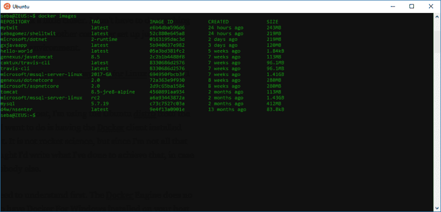
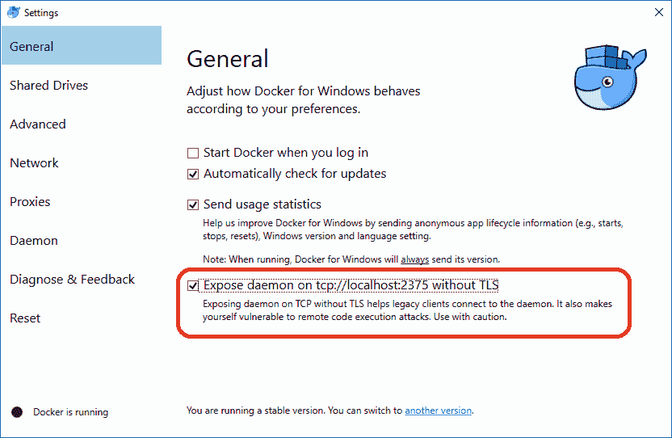

# 在 Linux (Ubuntu)的 Windows 子系统上安装 Docker 客户端

> 原文：<https://dev.to/sebagomez/installing-the-docker-client-on-windows-subsystem-for-linux-ubuntu-3cgd>

[T2】](https://res.cloudinary.com/practicaldev/image/fetch/s--Z3HDxL0n--/c_limit%2Cf_auto%2Cfl_progressive%2Cq_auto%2Cw_880/https://cdn-images-1.medium.com/max/1024/1%2ABR7gFwL2DV4mw1r1pGVQaQ.png)

我是个电脑迷，一直都是。在大学时代，我玩过一点 Linux，但仅此而已。

但是现在，Windows 让 Linux 更近了一步。我不需要做任何复杂的事情，比如双重引导或者安装另一台计算机来体验 Linux(非 GUI)环境。

作为一名 Windows 内部人员，我从第一天起就尝试了 Linux 的 Windows 子系统，我真的很喜欢它。

现在 Falls Creators 更新出来了，我正在使用商店里的 Ubuntu 发行版，我想做的第一件事就是安装 Docker 客户端..这不是火箭科学，但我在路上确实遇到了一些困难(因为我对 Linux 的了解很少)，所以我想我应该写下我为实现这一目标所做的事情，以防对其他人有用。

有些事你需要先明白。Docker 引擎不能在 WSL 上运行，您必须在您的主机上安装 Docker For Windows。在本文的最后，我们将看到运行在 Linux (WSL)上的 Docker 客户端向安装在 Windows 上的 Docker 引擎后台程序发送命令。

所以，打开你的 Ubuntu bash 控制台，第一件事就是安装客户端。为了做到这一点，你必须使用 apt-get，这是 Ubuntu 的软件包管理器(更多关于 apt [的信息请点击](https://en.wikipedia.org/wiki/APT_(Debian)))。

*   更新 apt 包索引:

`$ sudo apt-get update`

*   安装软件包以允许 apt 通过 HTTPS 使用存储库:

`$ sudo apt-get install apt-transport-https ca-certificates curl software-properties-common`

*   添加 Docker 官方 GPG 键:

`$ curl -fsSL https://download.docker.com/linux/ubuntu/gpg | sudo apt-key add -`

> 通过搜索指纹的最后 8 个字符，验证您现在拥有指纹为*9dc 8 5822 9fc 7 DD 38 854 a e2d 8 8d 81 803 c 0 ebf CD88*的钥匙。

`$ sudo apt-key fingerprint 0EBFCD88`

```
pub 4096R/0EBFCD88 2017–02–22
 Key fingerprint = 9DC8 5822 9FC7 DD38 854A E2D8 8D81 803C 0EBF CD88
uid Docker Release (CE deb) <docker@docker.com>
sub 4096R/F273FCD8 2017–02–22 
```

Enter fullscreen mode Exit fullscreen mode

*   使用以下命令来设置稳定的存储库。您总是需要稳定的存储库，即使您想要从边缘或者测试存储库安装构建。要添加 edge 或 test 存储库，请在下面命令中的单词 stable 后面添加单词 edge 或 test(或两者都有)。

`$ sudo add-apt-repository “deb [arch=amd64] https://download.docker.com/linux/ubuntu $(lsb\_release -cs) stable”`

现在我们准备安装 Docker 社区版

*   再次更新 apt 包索引

`$ sudo apt-get update`

*   并安装 Docker CE

`$ sudo apt-get install docker-ce`

完成后，您将最终在 Linux 中安装所有东西，但正如我之前提到的，Docker 引擎不在 WSL 中运行，因此如果您编写任何命令，如 *docker images* ，您将会看到如下消息:

> 无法连接到 unix:///var/run/docker.sock 上的 docker 守护程序。Docker 守护程序是否正在运行？

不，它没有运行，而且永远不会运行，至少现在不会。

您需要告诉 Docker 客户机 Docker 主机在哪里，您可以通过使用-H 选项来完成，如下所示:

`$ docker -H localhost:2375 images`

如果不想每次都键入主机，可以设置一个名为 DOCKER_HOST 的环境变量到 localhost:2375

`$ export DOCKER\_HOST=localhost:2375`

现在只需运行`docker images`就会显示您的主机环境中的映像。
但是，该环境变量将只在会话期间有效。您必须在每次打开 bash 时设置它。因此，为了避免这种情况，您在一个名为。bash_profile，就像这样:

`$ echo “export DOCKER\_HOST=localhost:2375” \>\> ~/.bash\_profile`

重启 bash 控制台，DOCKER_HOST 变量应该在那里，只需输入

检查所有的东西。

我希望这篇文章能帮助到其他人，如果有，请告诉我。

编辑:确保你在 Windows 上公开了守护进程，否则它将无法工作。

[T2】](https://res.cloudinary.com/practicaldev/image/fetch/s--nvQ2BAFg--/c_limit%2Cf_auto%2Cfl_progressive%2Cq_auto%2Cw_880/https://cdn-images-1.medium.com/max/832/1%2A6XwT-oT7cbw63UFHLjQPzA.png)

参考资料:[获取 Ubuntu 的 Docker CE](https://docs.docker.com/engine/installation/linux/docker-ce/ubuntu/)

特别感谢里奇·特纳的善良和耐心。

**编辑**:我最近了解到有一种官方的、更复杂但更安全的方法可以实现这一点，所以我想在这里分享一下: [WSL 与 Docker 的互操作性](https://blogs.msdn.microsoft.com/commandline/2017/12/08/cross-post-wsl-interoperability-with-docker/)