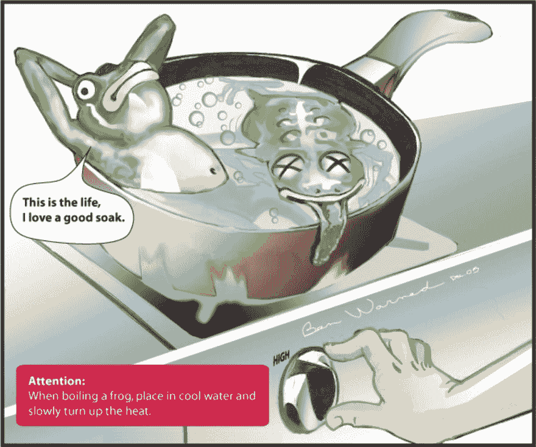
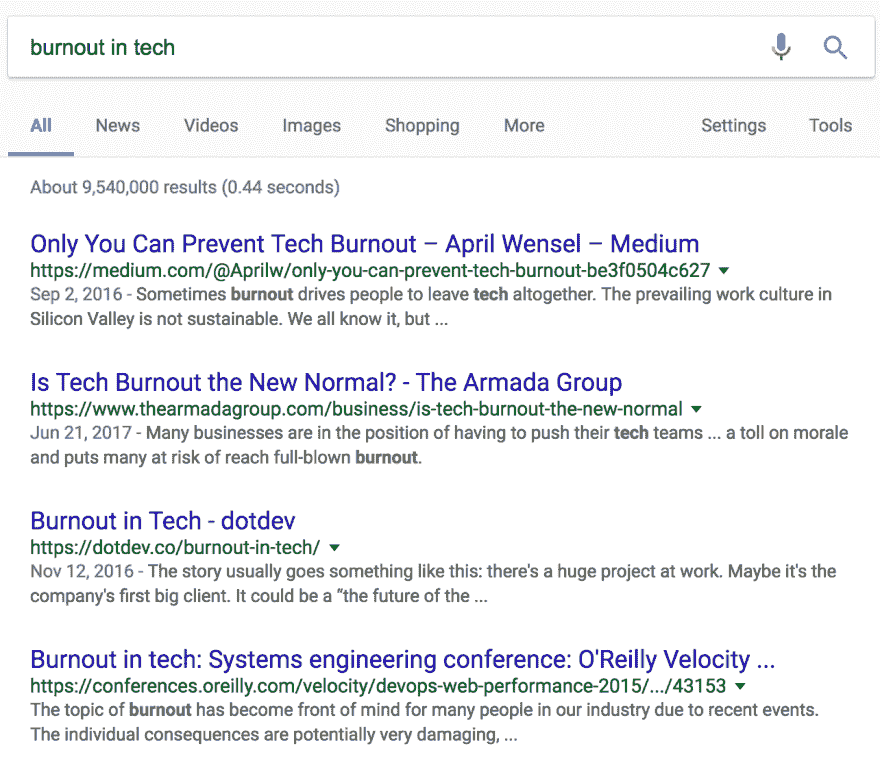

# 倦怠:当你承担太多时会发生什么

> 原文:[https://dev . to/Mary _ grace/burnout-what-happen-when-when-you-take-over-much-74d](https://dev.to/mary_grace/burnout-what-happens-when-you-take-on-too-much-74d)

你听说过煮青蛙的正确方法吧？前提是，如果把青蛙直接放入一锅沸水中，它会跳出来，但如果把青蛙放入温水中，然后慢慢加热至沸腾，它会适应温度而不感觉到危险，并会逐渐煮死。

[T2】](https://res.cloudinary.com/practicaldev/image/fetch/s--2mtJs5wG--/c_limit%2Cf_auto%2Cfl_progressive%2Cq_auto%2Cw_880/https://media.sparkpost.com/uploads/2017/10/boil-the-frog.jpg)

“慢慢煮死”很好的解释了倦怠。“被一千张剪纸杀死”是另一个适用的短语。挑出一个让你精疲力尽的特定细节并不总是容易的；这通常是试图一次做太多事情(即使它们都是好事情)或不得不做太多事情的副作用，这些事情会带走你的能量，而不是给你能量。

我最近在东南 Ruby 大会上做了一个关于这个话题的演讲(见下面我的演讲幻灯片和视频)。对于那些想知道为什么在技术会议上谈论倦怠是相关的人来说，首先…你真幸运！你要么有一份完美的工作，有一个出色的经理(呆在那里，永远不要离开！)或者([悲伤长号)](https://sadtrombone.com/)你在否认。说真的，职业倦怠是科技行业的一个大问题。如果你有任何疑问，可以在谷歌上快速搜索一下“科技行业的[倦怠期](https://www.google.com/search?q=burnout+in+tech&oq=burnout+in+tech)”去吧…我等着。

[T2】](https://res.cloudinary.com/practicaldev/image/fetch/s--uRSQawoy--/c_limit%2Cf_auto%2Cfl_progressive%2Cq_auto%2Cw_880/https://media.sparkpost.com/uploads/2017/10/Screenshot-2017-10-17-16.39.32.png)

有 954 万个结果的事实应该是有问题的第一个迹象。那我们该怎么办？我将在下面给出一些基本要点，但是如果你想更深入地了解，我在下面链接了一个我演讲的视频，以及更多关于倦怠的资源。

### 为那些精疲力竭的人

如果你已经知道自己筋疲力尽了，我推荐几件事:

**计划休假(并实际断开)**

这是你能做的最好也是最重要的事情。抽出时间脱离工作，喘口气，有时足以给你继续前进的能量。设置您的电子邮件自动回复；在 Slack 上标注自己“不在”，开启“勿扰”；禁用手机上的通知功能；做任何你需要做的事情来防止工作成为你休息时间的首要任务。

**列出你的“氧气”清单**

几年前，当我筋疲力尽的时候，这在让我恢复“正常”的过程中起到了很大的作用。我列出了不仅仅是“净能量”，而是“纯能量”的东西这意味着，如果和朋友聚会让你充满活力，但也需要大量的能量来汇集，这不是纯粹的能量。选择你知道的事情，毫无疑问会让你充满活力。对我来说，这包括去海滩，读一本好书，看一部最喜欢的电影，大声听音乐并跟着唱，探索旧金山的一个新社区，和我的狗一起散步。

**首先，戴上氧气面罩**

航空公司不断提醒我们先带上自己的氧气面罩。这并不是因为航空公司希望儿童或残疾人更长时间没有氧气，而是因为如果我们没有氧气，我们就不能指望帮助别人。所以先戴上我们自己的氧气罩(也就是照顾好我们自己，为我们自己留出时间，有时自私一点(提示:这不是一件坏事！))必不可少。

### 为管理者

如果你是经理，确保团队的成功是你的责任。虽然你显然无法控制团队中的个人生活，但密切关注团队中每个成员的表现是你工作中极其重要的一部分。你怎么能这样做？

**安排双月 1:1**

*   这些会议不应该是检查日常工作或当前项目状态的时间。相反，他们应该检查你的员工对他们工作的感觉。
*   他们的盘子里有太多吗？他们对当前的任务感到力不从心吗？
*   有什么事情是他们想继续工作以推进职业生涯的吗？
*   他们希望参与哪些项目？
*   他们对团队结构感觉如何？公司？

定期问这些问题可以确保没有什么让你措手不及，也可以帮助你的员工知道他们可以表达自己的感受而不会引起反响，这将导致一个更加诚实和开放的关系。

**鼓励休假/休假**

在之前的一份工作中，我的一位经理会记录我们每个人休假的频率。不是以一种微观管理的方式，而是简单地确保我们有规律地从工作中抽出时间，为了我们自己和团队的健康。如果他注意到我们那个月没有休假(个人或假期)，他会要求我们下周休假一天，并鼓励我们计划下个月的假期。他知道，很简单，如果我们抽出时间来放松一下，我们会在工作中做得更好。

### 耗尽资源

随着越来越多的人开始谈论职业倦怠，越来越多的资源浮出水面。我在下面列出了我的最爱。如果你知道其他人，请在推特上告诉我——我很乐意听到他们的消息！

**书籍:**
[不堪重负](https://www.amazon.com/dp/1250062381)

[关于倦怠的真相](https://osmihelp.org/)

**网址:**
[倦怠. io](http://burnout.io/en/latest/)

[开源精神疾病](https://osmihelp.org/)

**博文:**
[躲避倦怠，一次 4 小时](https://medium.com/@jpaulreed/dodging-burnout-4-hours-at-a-time-965f1921e6a2)

**会谈:**
[倦怠:社区问题&社区解决方案——贾森·易](https://www.youtube.com/watch?v=hu4FV_f93D8&feature=youtu.be)

[我们正在学习什么是倦怠以及 DevOps 文化如何能有所帮助——Ken mu grage](https://www.youtube.com/watch?v=qN4Mj7B1IV0)