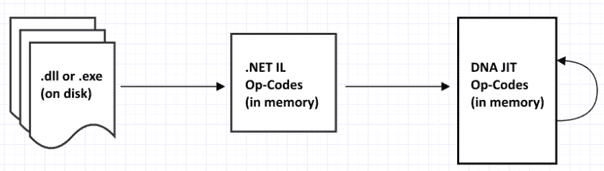
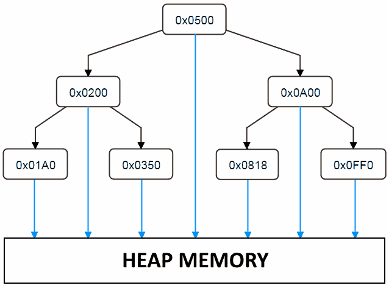

# DotNetAnywhere:一个替代方案。NET 运行时

> 原文：<https://dev.to/mattwarren/dotnetanywhere-an-alternative-net-runtime-726>

*本帖最初[出现在我的博客](http://mattwarren.org/2017/10/19/DotNetAnywhere-an-Alternative-.NET-Runtime/)上*

* * *

最近我在听优秀的 [DotNetRocks 播客](https://www.dotnetrocks.com/)，他们让[史蒂文桑德森](https://twitter.com/stevensanderson)(来自 [Knockout.js fame](http://knockoutjs.com/) )谈论[‘web assembly and Blazor’](https://www.dotnetrocks.com/?show=1455)。

如果你还没听说过的话， [Blazor](https://github.com/SteveSanderson/Blazor) 是一个尝试。NET 到浏览器，使用 [WebAssembly](https://developer.mozilla.org/en-US/docs/WebAssembly) 的魔力。如果你想了解更多信息，斯科特·汉瑟尔门已经做了一个[很好的关于各种。NET/WebAssembly 项目](https://www.hanselman.com/blog/NETAndWebAssemblyIsThisTheFutureOfTheFrontend.aspx)。

然而，尽管提到 WebAssembly 很酷，但让我更感兴趣的是 Blazor 如何使用 [DotNetAnywhere](https://github.com/chrisdunelm/DotNetAnywhere) 作为底层。NET 运行时。这篇文章将探讨什么是 DotNetAnywhere，你可以用它做什么，以及它与完整版相比如何。NET 框架。

* * *

# DotNetAnywhere

首先，值得指出的是，DotNetAnywhere (DNA)是完全兼容的。NET 运行库，这意味着它可以运行。已编译为针对完整框架运行的. NET dll/exe。最重要的是(至少在理论上)，它**支持**下面所有的[。NET 运行时特性](https://github.com/chrisdunelm/DotNetAnywhere#supported-net-runtime-features)，这是一个相当令人印象深刻的列表！

> *   Generics
> *   Garbage collection and termination
> *   weak reference
> *   Complete exception handling-try/catch/finally
> *   平沃克
> *   joggle/interface
> *   entrust
> *   event
> *   Nullable type
> *   One-dimensional array
> *   multithreading

此外还有一些**对[反思](https://docs.microsoft.com/en-us/dotnet/framework/reflection-and-codedom/reflection)的部分支持**

> *   Very limited read-only reflection
>     *   typeof()，。 GetType (), type. Name, type. Namespace, type. IsEnum()， 。 ToString() only

最后，还有一些功能目前**不支持**:

> *   attribute
> *   Maximum reflection
> *   multidimensional array
> *   Unsafe code

有[个各种各样的错误或缺失的功能](https://github.com/chrisdunelm/DotNetAnywhere/issues?q=is%3Aissue+is%3Aclosed)可能会阻止你的代码在 DotNetAnywhere 下运行，然而自从 Blazor 出现以来，其中几个已经[修复，所以对照 Blazor 版本的 DotNetAnywhere 进行检查是值得的。](https://github.com/SteveSanderson/Blazor/pulls?utf8=%E2%9C%93&q=is%3Apr)

**在这个时间点上，最初的 DotNetAnywhere 回购协议[不再活跃](https://github.com/chrisdunelm/DotNetAnywhere#this-project-is-inactive-no-issues-or-prs-will-be-dealt-with)(最近一次持续的活动是在 2012 年 1 月)，因此看起来任何未来的开发或错误修复都可能发生在 Blazor 回购协议中。如果你曾经在 DotNetAnywhere 中修复过某个东西，可以考虑派一个公关人员去那里帮忙。**

**更新:**除此之外，还有其他一些包含各种错误修复和增强功能的分支:

*   [https://github.com/ncave/dotnet-js](https://github.com/ncave/dotnet-js)
*   [https://github.com/memsom/dna](https://github.com/memsom/dna)

## 源代码布局

我对 DotNetAnywhere 运行时印象最深刻的是，它是由一个人开发的**，并且**不到 40，000 行代码**！！作为比较。NET 框架垃圾收集器是[几乎 37，000 行代码(更多信息可以在我之前的文章](https://github.com/dotnet/coreclr/blob/master/src/gc/gc.cpp)[core clr 源代码指南](http://mattwarren.org/2017/03/23/Hitchhikers-Guide-to-the-CoreCLR-Source-Code/#overall-stats)中找到)。**

这使得 DotNetAnywhere 成为理想的学习资源！

首先，让我们看看前 10 个最大的源文件，看看复杂性在哪里:

### 原生代码- **共 17710**行

| 通信线路（LinesofCommunication） | 文件 |
| --- | --- |
| Three thousand one hundred and sixty-four | [JIT_Execute.c](https://github.com/chrisdunelm/DotNetAnywhere/tree/master/dna/JIT_Execute.c) |
| One thousand seven hundred and seventy-eight | [JIT.c](https://github.com/chrisdunelm/DotNetAnywhere/tree/master/dna/JIT.c) |
| One thousand one hundred and nine | [PInvoke_CaseCode.h](https://github.com/chrisdunelm/DotNetAnywhere/tree/master/dna/PInvoke_CaseCode.h) |
| Six hundred and thirty | [Heap.c](https://github.com/chrisdunelm/DotNetAnywhere/tree/master/dna/Heap.c) |
| Six hundred and eighteen | [MetaData.c](https://github.com/chrisdunelm/DotNetAnywhere/tree/master/dna/MetaData.c) |
| Five hundred and sixty-three | [元数据表格. h](https://github.com/chrisdunelm/DotNetAnywhere/tree/master/dna/MetaDataTables.h) |
| Five hundred and seventeen | [c 型](https://github.com/chrisdunelm/DotNetAnywhere/tree/master/dna/Type.c) |
| Four hundred and ninety-one | [MetaData_Fill.c](https://github.com/chrisdunelm/DotNetAnywhere/tree/master/dna/MetaData_Fill.c) |
| Four hundred and sixty-seven | [MetaData_Search.c](https://github.com/chrisdunelm/DotNetAnywhere/tree/master/dna/MetaData_Search.c) |
| Four hundred and fifty-two | [JIT_OpCodes.h](https://github.com/chrisdunelm/DotNetAnywhere/tree/master/dna/JIT_OpCodes.h) |

### 托管代码- **共 28783**行

| 通信线路（LinesofCommunication） | 文件 |
| --- | --- |
| Two thousand three hundred and ninety-three | [corlib/System。全球化/calendar calculation . cs](https://github.com/chrisdunelm/DotNetAnywhere/blob/master/corlib/System.Globalization/CalendricalCalculations.cs) |
| Two thousand three hundred and fourteen | [corlib/System/number formatter . cs](https://github.com/chrisdunelm/DotNetAnywhere/blob/master/corlib/System/NumberFormatter.cs) |
| One thousand five hundred and eighty-two | [System.Drawing/System.Drawing/Pens.cs](https://github.com/chrisdunelm/DotNetAnywhere/blob/master/System.Drawing/System.Drawing/Pens.cs) |
| One thousand four hundred and forty-three | [System.Drawing/System.Drawing/Brushes.cs](https://github.com/chrisdunelm/DotNetAnywhere/blob/master/System.Drawing/System.Drawing/Brushes.cs) |
| One thousand four hundred and five | [系统。核心/系统。Linq/Enumerable.cs](https://github.com/chrisdunelm/DotNetAnywhere/blob/master/System.Core/System.Linq/Enumerable.cs) |
| Seven hundred and forty-five | [corlib/System/datetime . cs](https://github.com/chrisdunelm/DotNetAnywhere/blob/master/corlib/System/DateTime.cs) |
| Six hundred and ninety-three | [corlib/System。IO/Path.cs](https://github.com/chrisdunelm/DotNetAnywhere/blob/master/corlib/System.IO/Path.cs) |
| Six hundred and thirty-two | [corlib/System。Collections.Generic/Dictionary.cs](https://github.com/chrisdunelm/DotNetAnywhere/blob/master/corlib/System.Collections.Generic/Dictionary.cs) |
| Five hundred and ninety-eight | [corlib/System/String.cs](https://github.com/chrisdunelm/DotNetAnywhere/blob/master/corlib/System/String.cs) |
| Four hundred and sixty-seven | [corlib/System。Text/StringBuilder.cs](https://github.com/chrisdunelm/DotNetAnywhere/blob/master/corlib/System.Text/StringBuilder.cs) |

* * *

## 主要功能领域

接下来，让我们看看 DotNetAnywhere 中的关键组件，因为这让我们很好地了解了实现. NET 兼容的运行时需要什么。在这个过程中，我们还将看到它们与微软的实现有什么不同。NET 框架。

### 读书。网络动态链接库

DotNetAnywhere 要做的第一件事是读取/理解/解析。NET *元数据和包含在. dll/.exe 中的代码*，这些都发生在 [MetaData.c](https://github.com/chrisdunelm/DotNetAnywhere/blob/master/dna/MetaData.c) 中，主要在 [LoadSingleTable(..)](https://github.com/chrisdunelm/DotNetAnywhere/blob/master/dna/MetaData.c#L302-L484)功能。通过添加一些调试代码，我能够获得所有不同类型的*元数据*的摘要。NET dll，这是一个相当有趣的列表:

```
MetaData contains     1 Assemblies (MD_TABLE_ASSEMBLY)
MetaData contains     1 Assembly References (MD_TABLE_ASSEMBLYREF)
MetaData contains     0 Module References (MD_TABLE_MODULEREF)

MetaData contains    40 Type References (MD_TABLE_TYPEREF)
MetaData contains    13 Type Definitions (MD_TABLE_TYPEDEF)
MetaData contains    14 Type Specifications (MD_TABLE_TYPESPEC)
MetaData contains     5 Nested Classes (MD_TABLE_NESTEDCLASS)

MetaData contains    11 Field Definitions (MD_TABLE_FIELDDEF)
MetaData contains     0 Field RVA's (MD_TABLE_FIELDRVA)
MetaData contains     2 Propeties (MD_TABLE_PROPERTY)
MetaData contains    59 Member References (MD_TABLE_MEMBERREF)
MetaData contains     2 Constants (MD_TABLE_CONSTANT)

MetaData contains    35 Method Definitions (MD_TABLE_METHODDEF)
MetaData contains     5 Method Specifications (MD_TABLE_METHODSPEC)
MetaData contains     4 Method Semantics (MD_TABLE_PROPERTY)
MetaData contains     0 Method Implementations (MD_TABLE_METHODIMPL)
MetaData contains    22 Parameters (MD_TABLE_PARAM)

MetaData contains     2 Interface Implementations (MD_TABLE_INTERFACEIMPL)
MetaData contains     0 Implementation Maps? (MD_TABLE_IMPLMAP)

MetaData contains     2 Generic Parameters (MD_TABLE_GENERICPARAM)
MetaData contains     1 Generic Parameter Constraints (MD_TABLE_GENERICPARAMCONSTRAINT)

MetaData contains    22 Custom Attributes (MD_TABLE_CUSTOMATTRIBUTE)
MetaData contains     0 Security Info Items? (MD_TABLE_DECLSECURITY) 
```

有关*元数据*的更多信息，请参见[CLR 元数据简介](https://iobservable.net/blog/2013/05/12/introduction-to-clr-metadata/)、[剖析. NET 汇编–PE 头文件](https://www.red-gate.com/simple-talk/blogs/anatomy-of-a-net-assembly-pe-headers/)和 [ECMA 规范本身](https://www.visualstudio.com/license-terms/ecma-c-common-language-infrastructure-standards/)。

* * *

### 正在执行。净 IL

DotNetAnywhere 中的另一大块功能是“实时”编译器(JIT)，即负责执行 IL 的代码，这最初发生在 [JIT_Execute.c](https://github.com/chrisdunelm/DotNetAnywhere/blob/master/dna/JIT_Execute.c) 中，然后发生在 [JIT.c](https://github.com/chrisdunelm/DotNetAnywhere/blob/master/dna/JIT.c) 中。主“执行循环”在 [JITit(..)函数](https://github.com/chrisdunelm/DotNetAnywhere/blob/master/dna/JIT.c#L232-L1606)，它在一个`switch`中包含了令人印象深刻的 1374 行代码和超过 200 个`case`语句！！

从更高的层面来看，它所经历的整个过程如下所示:

[T2】](http://mattwarren.oimg/2017/10/NET%20IL%20-%20DNA%20JIT%20Op-Codes.png)

在哪里？NET IL 操作码(`CIL_XXX`)在[CIL _ 操作码. h](https://github.com/chrisdunelm/DotNetAnywhere/blob/master/dna/CIL_OpCodes.h) 中定义，而. NetAnywhere JIT 操作码(`JIT_XXX`)在[JIT _ 操作码. h](https://github.com/chrisdunelm/DotNetAnywhere/blob/master/dna/JIT_OpCodes.h) 中定义

有趣的是，JIT 是 DotNetAnywhere 中唯一一个[使用汇编代码](https://github.com/chrisdunelm/DotNetAnywhere/blob/master/dna/JIT_Execute.c#L184-L204)的地方，即使这样，它也只适用于`win32`。它用于允许“跳转”或`goto`到 C 源代码中的标签，因此当执行 IL 指令时，它实际上永远不会离开`JITit(..)`函数，控制只是四处移动，而不必进行完整的方法调用。

```
#ifdef __GNUC__ 
#define GET_LABEL(var, label) var = &&label 
#define GO_NEXT() goto **(void**)(pCurOp++) 
#else
#ifdef WIN32 
#define GET_LABEL(var, label) \
    { __asm mov edi, label \
    __asm mov var, edi } 
#define GO_NEXT() \
    { __asm mov edi, pCurOp \
    __asm add edi, 4 \
    __asm mov pCurOp, edi \
    __asm jmp DWORD PTR [edi - 4] } 
#endif 
```

**与…的差异。NET 框架**

全部。NET framework 所有的 IL 代码在被 CPU 执行之前都由[实时编译器(JIT)](https://github.com/dotnet/coreclr/blob/master/Documentation/botr/ryujit-tutorial.md) 转化为机器码。

然而，正如我们已经看到的，DotNetAnywhere“解释”IL，一条指令接一条指令，即使它是在一个名为 [JIT.c](https://github.com/chrisdunelm/DotNetAnywhere/blob/master/dna/JIT.c) **的文件中完成的，也不会发出机器码**，所以这个命名看起来很奇怪！？

也许这只是视角的不同，但我不清楚你在什么时候从“解释”代码转向“JIT”它，即使在阅读了下面的链接后我也不确定！！(有人能开导一下吗？)

*   即时编译器和解释器之间有什么区别？
*   [了解区别:传统解释器、JIT 编译器、JIT 解释器和 AOT 编译器](https://softwareengineering.stackexchange.com/questions/246094/understanding-the-differences-traditional-interpreter-jit-compiler-jit-interp)
*   [JIT vs 解释器](https://stackoverflow.com/questions/3718024/jit-vs-interpreters)
*   [为什么我们称之为“JIT 编译器”而不是“JIT 解释器”来指代将 Java 字节码转换成机器码的东西？](https://www.quora.com/Why-do-we-call-it-JIT-compiler-and-not-JIT-interpreter-to-refer-to-the-thing-that-converts-the-Java-bytecode-to-the-machine-code)
*   [了解 JIT 编译和优化](https://docs.oracle.com/cd/E13150_01/jrockit_jvm/jrockit/geninfo/diagnos/underst_jit.html)

* * *

### 垃圾收集器

DotNetAnywhere 垃圾收集器(GC)的所有代码都包含在 [Heap.c](https://github.com/chrisdunelm/DotNetAnywhere/blob/master/dna/Heap.c) 中，这是一段非常易读的 600 行代码。为了让您大致了解它的功能，下面列出了它公开的功能:

```
void Heap_Init();
void Heap_SetRoots(tHeapRoots *pHeapRoots, void *pRoots, U32 sizeInBytes);
void Heap_UnmarkFinalizer(HEAP_PTR heapPtr);
void Heap_GarbageCollect();
U32 Heap_NumCollections();
U32 Heap_GetTotalMemory();

HEAP_PTR Heap_Alloc(tMD_TypeDef *pTypeDef, U32 size);
HEAP_PTR Heap_AllocType(tMD_TypeDef *pTypeDef);
void Heap_MakeUndeletable(HEAP_PTR heapEntry);
void Heap_MakeDeletable(HEAP_PTR heapEntry);

tMD_TypeDef* Heap_GetType(HEAP_PTR heapEntry);

HEAP_PTR Heap_Box(tMD_TypeDef *pType, PTR pMem);
HEAP_PTR Heap_Clone(HEAP_PTR obj);

U32 Heap_SyncTryEnter(HEAP_PTR obj);
U32 Heap_SyncExit(HEAP_PTR obj);

HEAP_PTR Heap_SetWeakRefTarget(HEAP_PTR target, HEAP_PTR weakRef);
HEAP_PTR* Heap_GetWeakRefAddress(HEAP_PTR target);
void Heap_RemovedWeakRefTarget(HEAP_PTR target); 
```

**与…的差异。NET 框架**

然而，与 JIT/解释器一样，GC 与。NET 框架

#### **保守的垃圾收集**

首先，DotNetAnywhere 实现了所谓的 [*保守的* GC](https://stackoverflow.com/questions/7629446/conservative-garbage-collector) 。简单地说，这意味着它不知道(确切地说)哪些内存区域实际上是对象的引用/指针，哪些只是一个随机数(看起来像内存地址)。在微软。JIT 计算这个信息，并把它存储在 [GCInfo 结构](https://github.com/dotnet/coreclr/blob/master/src/inc/gcinfo.h)中，这样 GC 就可以利用它了。但是 DotNetAnywhere 不这么做。

相反，在`Mark`阶段，GC [获得所有可用的‘根’](https://github.com/chrisdunelm/DotNetAnywhere/blob/master/dna/Heap.c#L278-L345)，但它会将一个对象内的所有内存地址视为‘潜在’引用(因此它是’*保守的*)。然后它必须查找每一个可能的引用，看看它是否真的指向一个“对象引用”。它通过在[平衡二叉查找树](http://www.eternallyconfuzzled.com/tuts/datastructures/jsw_tut_andersson.aspx)(按内存地址排序)中跟踪所有内存/堆引用来实现这一点，如下所示:

[T2】](http://mattwarren.oimg/2017/10/Binary%20Tree%20with%20Pointers%20into%20the%20Heap.png)

然而，这意味着所有对象引用在分配时都必须存储在二叉树中，这增加了分配的一些开销。此外，还需要额外的内存，每个堆条目 20 个字节。我们可以通过查看 [`tHeapEntry`数据结构](https://github.com/chrisdunelm/DotNetAnywhere/blob/master/dna/Heap.c#L58-L83)(所有指针都是 4 个字节，`U8` = 1 个字节，`padding`被忽略)，`tHeapEntry *pLink[2]`是启用二叉树查找所需的额外数据。

```
struct tHeapEntry_ {
    // Left/right links in the heap binary tree
    tHeapEntry *pLink[2];
    // The 'level' of this node. Leaf nodes have lowest level
    U8 level;
    // Used to mark that this node is still in use.
    // If this is set to 0xff, then this heap entry is undeletable.
    U8 marked;
    // Set to 1 if the Finalizer needs to be run.
    // Set to 2 if this has been added to the Finalizer queue
    // Set to 0 when the Finalizer has been run (or there is no Finalizer in the first place)
    // Only set on types that have a Finalizer
    U8 needToFinalize;

    // unused
    U8 padding;

    // The type in this heap entry
    tMD_TypeDef *pTypeDef;

    // Used for locking sync, and tracking WeakReference that point to this object
    tSync *pSync;

    // The user memory
    U8 memory[0];
}; 
```

但是为什么 DotNetAnywhere 是这样工作的呢？幸运的是，[网站的作者克里斯·培根](https://github.com/SteveSanderson/Blazor/pull/7#discussion_r136719427)解释道

> 请注意，整个堆代码确实需要重写，以减少每个对象的内存开销，并消除对分配二叉树的需要。没有真正考虑分代 GC，这可能会增加很多代码。这是我隐约想做的事，但从未抽出时间去做。当前的堆代码只是让 GC 快速工作的最简单的东西。最初的实现根本没有 GC。它运行得非常快，但是很快就耗尽了内存。

有关“保守”和“精确”GC 的更多信息，请参见:

*   [精确指针与保守指针和内部指针](https://en.wikipedia.org/wiki/Tracing_garbage_collection#Precise_vs._conservative_and_internal_pointers)
*   [如何。NET CLR 如何区分托管指针和非托管指针？](https://stackoverflow.com/questions/5096088/how-does-the-net-clr-distinguish-between-managed-from-unmanaged-pointers/5096824#5096824)

#### **GC 只做‘标记-清除’，它不压缩**

GC 行为不同的另一个方面是，它在清理内存后不会对内存进行任何压缩，正如史蒂夫·桑德森在[开发 Blazor](https://github.com/SteveSanderson/Blazor/blob/master/src/Blazor.Runtime/Interop/ManagedGCHandle.cs#L40-L43) 时发现的那样

> ..在服务器端执行期间，我们实际上不需要固定任何东西，因为在. NET 之外没有互操作。在客户端执行期间，所有东西(实际上)都是固定的，因为 DNA 的 GC 只做标记-清除-它没有任何压缩阶段。

此外，当一个对象被分配时，DotNetAnywhere 只是对 [malloc()](http://www.cplusplus.com/reference/cstdlib/malloc/) 进行一次调用，参见在 [Heap_Alloc(..)功能](https://github.com/chrisdunelm/DotNetAnywhere/blob/master/dna/Heap.c#L468)。因此，你在书中没有[【代】或【段】的概念。NET Framework GC，即没有“第 0 代”、“第 1 代”或“大型对象堆”。](https://github.com/dotnet/coreclr/blob/master/Documentation/botr/garbage-collection.md#physical-representation-of-the-managed-heap)

* * *

### 线程模式

最后，让我们看看线程模型，它与。NET 框架。

**与…的差异。NET 框架**

虽然 DotNetAnywhere 会很乐意为您创建新线程并执行它们，但它只是提供了真正多线程的假象。实际上，它只在一个线程上运行**，但是**上下文在你的程序创建的不同线程之间切换**:**

[T2】](http://mattwarren.oimg/2017/10/Thread%20Usage%20Explanation.png)

你可以在下面的代码中看到这一点，(从 [Thread_Execute()函数](https://github.com/chrisdunelm/DotNetAnywhere/blob/master/dna/Thread.c#L112-L236)，注意对`JIT_Execute(..)`的调用，其中`numInst`设置为`100`:

```
for (;;) {
    U32 minSleepTime = 0xffffffff;
    I32 threadExitValue;

    status = JIT_Execute(pThread, 100);
    switch (status) {
        ....
    }
} 
```

一个有趣的副作用是 DotNetAnywhere `corlib`实现中的线程代码非常简单。例如， [`Interlocked.CompareExchange()`函数](https://github.com/chrisdunelm/DotNetAnywhere/blob/master/corlib/System.Threading/Interlocked.cs#L28)的[内部实现](https://github.com/chrisdunelm/DotNetAnywhere/blob/master/dna/System.Threading.Interlocked.c#L26-L37)如下所示，注意缺少您通常预期的同步:

```
tAsyncCall* System_Threading_Interlocked_CompareExchange_Int32(
            PTR pThis_, PTR pParams, PTR pReturnValue) {
    U32 *pLoc = INTERNALCALL_PARAM(0, U32*);
    U32 value = INTERNALCALL_PARAM(4, U32);
    U32 comparand = INTERNALCALL_PARAM(8, U32);

    *(U32*)pReturnValue = *pLoc;
    if (*pLoc == comparand) {
        *pLoc = value;
    }

    return NULL;
} 
```

* * *

## 基准

作为一个简单的测试，我使用[最简单的 C#版本](http://benchmarksgame.alioth.debian.org/u64q/program.php?test=binarytrees&lang=csharpcore&id=1)运行了来自[计算机语言基准测试游戏——二叉树](http://benchmarksgame.alioth.debian.org/u64q/binarytrees.html)的一些基准测试

**注意:DotNetAnywhere 是为在低内存设备上运行而设计的，因此它的性能并不等同于完整版。NET 框架。请在查看结果时记住这一点！！**

### [T1。NET 框架，4.6.1 - 0.36 秒](#net-framework-461-036-seconds)

```
Invoked=TestApp.exe 15
stretch tree of depth 16         check: 131071
32768    trees of depth 4        check: 1015808
8192     trees of depth 6        check: 1040384
2048     trees of depth 8        check: 1046528
512      trees of depth 10       check: 1048064
128      trees of depth 12       check: 1048448
32       trees of depth 14       check: 1048544
long lived tree of depth 15      check: 65535

Exit code      : 0
Elapsed time   : 0.36
Kernel time    : 0.06 (17.2%)
User time      : 0.16 (43.1%)
page fault #   : 6604
Working set    : 25720 KB
Paged pool     : 187 KB
Non-paged pool : 24 KB
Page file size : 31160 KB 
```

### DotNetAnywhere - 54.39 秒

```
Invoked=dna TestApp.exe 15
stretch tree of depth 16         check: 131071
32768    trees of depth 4        check: 1015808
8192     trees of depth 6        check: 1040384
2048     trees of depth 8        check: 1046528
512      trees of depth 10       check: 1048064
128      trees of depth 12       check: 1048448
32       trees of depth 14       check: 1048544
long lived tree of depth 15      check: 65535

Total execution time = 54288.33 ms
Total GC time = 36857.03 ms
Exit code      : 0
Elapsed time   : 54.39
Kernel time    : 0.02 (0.0%)
User time      : 54.15 (99.6%)
page fault #   : 5699
Working set    : 15548 KB
Paged pool     : 105 KB
Non-paged pool : 8 KB
Page file size : 13144 KB 
```

所以很明显 DotNetAnywhere 在这个基准测试中没有这么快(0.36 秒对 54 秒)。然而，如果我们看看来自同一网站的其他基准，它的表现要好得多。似乎 DotNetAnywhere 在分配对象(a `class`)时开销很大，在使用`structs`时不太明显。

|  | [基准 1](http://benchmarksgame.alioth.debian.org/u64q/program.php?test=binarytrees&lang=csharpcore&id=1) (使用`classes`) | [基准 2](http://benchmarksgame.alioth.debian.org/u64q/program.php?test=binarytrees&lang=csharpcore&id=2) (使用`structs`) |
| --- | --- | --- |
| 经过的时间(秒) | Three point one | Two |
| GC 集合 | Ninety-six | Sixty-seven |
| 总 GC 时间(毫秒) | Nine hundred and eighty-three point five nine | Four hundred and thirty-nine point seven three |

* * *

**最后，我真的要感谢[克里斯·培根](https://github.com/chrisdunelm)，DotNetAnywhere 是一个很棒的代码库，它让我们对. NET 运行时需要做什么有了很好的了解。**