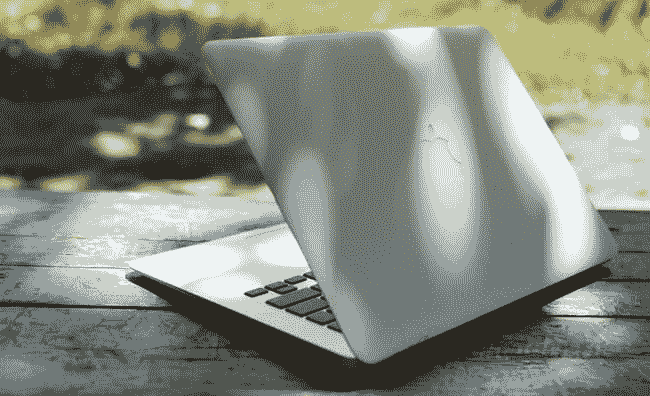
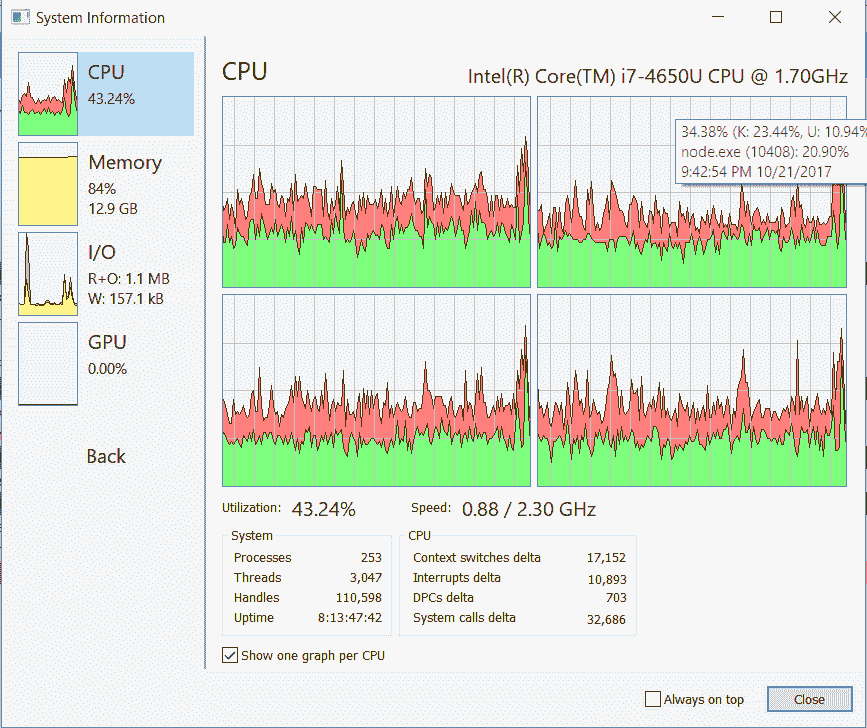
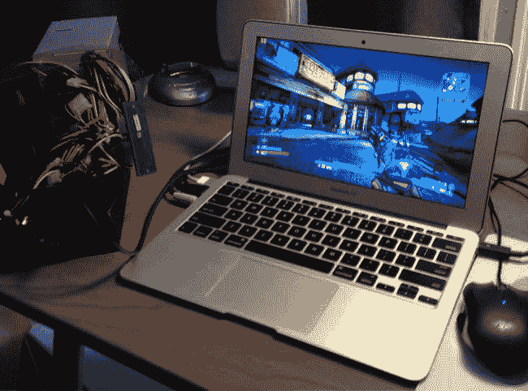

# 作为一名全栈软件开发人员，我为什么选择 MacBook Air？

> 原文:[https://dev . to/obender/why-did-I-choose-the-macbook-air-as-a-full-stack-software-developer-4cm](https://dev.to/obender/why-did-i-choose-the-macbook-air-as-a-full-stack-software-developer-4cm)

很多年前，当我选择我的第一台笔记本电脑时，销售顾问几乎对我口吐白沫，向我展示笔记本电脑拥有更多内存、大容量硬盘和 15 英寸屏幕是多么重要。对于我的异议“等等，我需要一台笔记本电脑，而不是台式电脑”，他们只是耸耸肩，不能提供这样一个适合我的需求的设备。它根本就不在那里，我也不想把笨重的戴尔 Latitude 放在包里。
  

当时我对 Mac OS 的操作系统毫无经验，所以我还是把选择停在了其中一款 Windows 系统的笔记本上，这款笔记本为我服务了快五年。2010 年，我已经听说了轻便而功能强大的 MacBook Air，但我不敢为了一个全新而陌生的操作系统而放弃通常的 Windows。2013 年，这一时刻到来了。

在我的下一次美国之行中，我购买了一台 13 英寸的 MacBook Air，配有 512 GB 固态硬盘 8GB 内存和 i7，4 核 1.7GHz 处理器。

【 

我在寻找世界上最小巧的笔记本电脑，它的设计很棒，放在我的旅行包里几乎感觉不到。而且当时的学妹空气明显超出了竞争对手。没有一台 Windows 笔记本电脑能给我提供 MacBook Air 所具备的功能。有了 OS X，我切换得相当快——这个系统比微软的操作系统容易学得多。在使用 MacBook Air 的过程中，每天我都确信自己的选择没有错，问题只停留在它自主工作的时候，从每一百个充电周期开始减少。今年，苹果通过为 Air 配备 Haswell 处理器解决了这个问题，这款 13 英寸的笔记本电脑一次充电可以工作长达 13 个小时。

#### 那么我为什么会停在半空中呢？

为什么不在 MacBook Pro 上(当时还没有 Retina 机型)？我清楚地知道它将用于什么任务。
写代码，上网，许多小时的工作与邮件——这不一定要考虑 Pro 的版本。
此外，我还得到了一台电脑，重量刚刚超过一公斤，看起来棒极了。

事实是，我对我的 13 英寸 MacBook Air 完全满意。四年了，我已经非常习惯了，不能用其他电脑工作。
过了一会儿，我买了一台 Mac mini 放在家里，但我每周最多用一次。所有开发都发生在 MacBook Air 上。

在我看来，配备视网膜屏幕的“砖头”更适合那些真正需要一台好“机”加上一个现代又令人愉悦的设计的用户。然而，即使在最大负载下，Air 也没有让我失望:多亏了固态驱动器，该系统像时钟一样工作。这是 8g 的内存！

#### 编译时间和打字超级流畅！

至于在 MacBook 和 iMac 或 Mac Pro 之间的选择，这里一切都简单得多。做决定的最佳标准是你在家的时间(除了睡觉)。六个/七个以上？那你肯定需要一个文具

#### 游戏

不要忘记 Mac 不是一台游戏电脑——为此，最好使用 Windows 上的控制台或设备。更糟糕的是，MacBook Air 并不适合这款电脑，尽管我会定期从苹果应用商店里推出几款不太贪玩的游戏。

【  

笔记本电脑已经成为工作流程和休闲时间不可或缺的一部分。例如，我正在最近的星巴克等待下一次会议，写这篇文章。

如果你不习惯整天坐在一个地方，也不想提着沉重的包回家时肩膀掉下来，那么你的选择就是 MacBook Air。