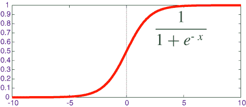
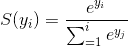

# 我从 Udacity 深度学习课程中学到了什么(Sigmoid 函数与 SoftMax 函数)

> 原文:[https://dev . to/espoir/what-ive-learn-from-my-uda city-deep-learning-course-sigmoid-function-vs-soft max-function-CFO](https://dev.to/espoir/what-ive-learned-from-my-udacity-deep-learning-course-sigmoid-function-vs-softmax-function-cfo)

一周前，我决定更深入地研究深度学习，从那以后，我收集了一些有用的资源，并开始从中学习。第一个是谷歌的 Udacity 深度学习，因为它是免费的，所以我就用了它。

我的第一课是从*机器学习到深度学习*。
在那一课中，我发现了许多有用的话题，我想在这一系列文章中总结一下:

以下是我将要谈论的内容:

**1。Sigmoid 函数 Vs SoftMax 函数(本文)**
**2 .RMSE(均方根误差)Vs 交叉熵(下一个)** *

先说第一个:
**乙状结肠函数 Vs SoftMax 函数**
**乙状结肠函数**:

对于那些熟悉大学数学和一些机器学习课程的人来说，我相信你听说过 sigmoid 函数。其定义如下:

***sigmoid 函数接受任意范围的实数，并返回 0 到 1 范围内的输出值。*T3】**

你可以在下面的图片中找到他的表述和他的定义:

[T2】](https://res.cloudinary.com/practicaldev/image/fetch/s--v6jYIlgO--/c_limit%2Cf_auto%2Cfl_progressive%2Cq_66%2Cw_880/https://cdn-images-1.medium.com/max/800/1%2ABe3Bhz0BA-NgZIYqRVZtug.gif)

它通常用于二元分类的逻辑回归中，也用作神经网络中的激活函数。

sigmoid 函数的输出可以解释为概率。这个功能可以用于现实生活中的许多任务:分类垃圾邮件、分类银行交易等。

你可以在这个 [quora](https://www.quora.com/What-is-the-sigmoid-function-and-what-is-its-use-in-machine-learnings-neural-networks-How-about-the-sigmoid-derivative-function) 问题中找到更多关于 sigmoid 函数的信息。
在我的深度学习课程中，我听说过 softmax 函数，它与 sigmoid 函数相同吗？

**Softmax 功能**

我以前没有听说过 softmax 功能，第一次听说时我有点困惑:

什么是 softmax 函数？

****Softmax 函数(或多项 logistic 回归)是 sigmoid 函数推广到我们要处理多类(多类分类)的情况。**T3】**

下面是 softmax 函数的数学公式:

[T2】](https://res.cloudinary.com/practicaldev/image/fetch/s--NzdTzErW--/c_limit%2Cf_auto%2Cfl_progressive%2Cq_66%2Cw_880/https://cdn-images-1.medium.com/max/800/1%2AdT7wbe9fsXykv6i_YwNMjA.gif)

Softmax 函数可以接受任何类型的分数(数组或向量)并返回适当的概率，当分数很大时，它会很大。softmax 函数返回值的总和始终等于 1。

证明了 sigmoid 是 i=2 的 softmax 的一个特例

当我们与神经网络一起工作时，Softmax 函数经常用于深度学习，它可以用于对图像进行分类。

今天到此为止，希望你能从这篇文章中学到一些东西，明天我会带来一些我所学到的东西。

老实说，我不擅长写作，但我不得不这样做，因为我想掌握英语，提高我的写作能力。

请随时提供反馈。

您可以在下面的链接中找到有关上述主题的更多信息:

*   [http://data aspirant . com/2017/03/07/difference-between-soft max-function-and-sigmoid-function/](http://dataaspirant.com/2017/03/07/difference-between-softmax-function-and-sigmoid-function/)
*   [https://www . quora . com/What-is-the-sigmoid-function-and-What-is-its-use-in-machine learning-neural-networks-How-about-the-sigmoid-derivative-function](https://www.quora.com/What-is-the-sigmoid-function-and-what-is-its-use-in-machine-learnings-neural-networks-How-about-the-sigmoid-derivative-function)
*   [https://www . kdnugges . com/2016/07/soft max-regression-related-logistic-regression . html](https://www.kdnuggets.com/2016/07/softmax-regression-related-logistic-regression.html)