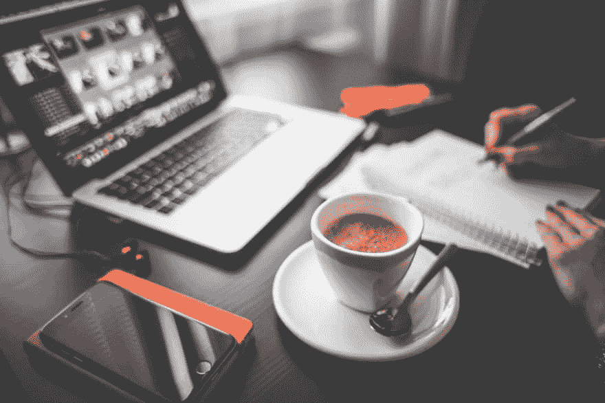
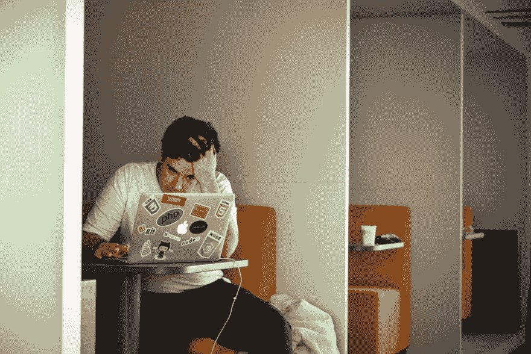

# 为什么程序员喝那么多咖啡？

> 原文：<https://dev.to/bakedbird/why-do-programmers-drink-so-much-coffee-287b>

[T2】](https://res.cloudinary.com/practicaldev/image/fetch/s--ioTJrTrz--/c_limit%2Cf_auto%2Cfl_progressive%2Cq_auto%2Cw_880/https://www.thanpa.com/wp-content/uploads/2017/10/pexels-photo-273222.jpeg)

> 我的一个习惯是熬夜，阅读关于技术世界的故事，开发者的故事等等。最近，我偶然发现了一篇有趣的文章，篡改了发展世界传播最广的疾病之一；程序员编码的时候戴耳机！

这篇文章让我思考，我也是其中之一，但我们圈子里的另一个刻板印象是什么？戴耳机的开发者的典型形象是怎样的？喝咖啡；一大堆咖啡！

这背后有什么原因吗？或者我们这么做只是因为它是 kawl？我不知道，也许两者兼而有之才是正确的答案，但为什么不把它分解开来，找一些好的理由，给下一个要说“咖啡对你不好”的人做一个很好的借口。

## 它让你更聪明、更有活力

我不是说你会在下一次智商测试中达到 200，但科学证明，当咖啡因通过血液循环进入大脑时，它会阻止一种叫做腺苷的抑制性神经递质。当这种情况发生时，就有足够的空间让多巴胺和去甲肾上腺素等其他神经递质增加。这导致神经元放电增强。

咖啡因改善许多影响情绪、认知功能、注意力、反应时间和精力的大脑功能。

[T2】](https://res.cloudinary.com/practicaldev/image/fetch/s--Dnwm5OrY--/c_limit%2Cf_auto%2Cfl_progressive%2Cq_auto%2Cw_880/http://www.thanpa.com/wp-content/uploads/2017/10/pexels-photo-52608.jpeg)

## 它有助于减轻疼痛

编程就是让成千上万行完美编写和组织的代码被一个丢失的分号毁掉。你有多少次只是因为这个？早在 2007 年，科学家发现咖啡有助于减轻 48%的疼痛

## 防止视网膜损伤

尽管大多数开发人员都戴眼镜(因为我们首先是潮人)，但研究表明，喝咖啡可以防止视网膜损伤。这次的主角不是咖啡因，而是绿原酸，它是咖啡豆中含有的另一种强抗氧化剂。

## 它只会让你开心

这是另一件咖啡因不是罪魁祸首的事情。国家健康研究所发现喝咖啡的人患抑郁症的可能性降低了 10%。正如我所说，这不是因为咖啡因，因为可乐也含有大量的咖啡因，但它与抑郁症有关。科学家认为，咖啡的这种好处来自于它所含的抗氧化剂。

[T2】](https://res.cloudinary.com/practicaldev/image/fetch/s--EZ9TxOZL--/c_limit%2Cf_auto%2Cfl_progressive%2Cq_auto%2Cw_880/http://www.thanpa.com/wp-content/uploads/2017/10/pexels-photo-544117.jpeg)

## 甚至它的气味也有奇效

另一个有趣的发现是，咖啡的香味刺激大脑产生蛋白质，已知这些蛋白质可以保护神经细胞免受睡眠剥夺引起的压力相关损伤。记住，下一次你彻夜不眠做下一个项目的时候！

喝咖啡是我们小众最常见的习惯之一。然而，引领潮流的不是我们。几乎每一个需要注意力集中、头脑清晰的职业都可以找到一杯咖啡，看看小说作家就知道了。

不，不是我们引领潮流而是我们被贴上了潮流的“标签”，仅仅是因为编程在我们这个时代是一件很平常的事情。毕竟，一杯咖啡是很好的享受。

请在评论区告诉我你的想法！你还有什么要补充吗？