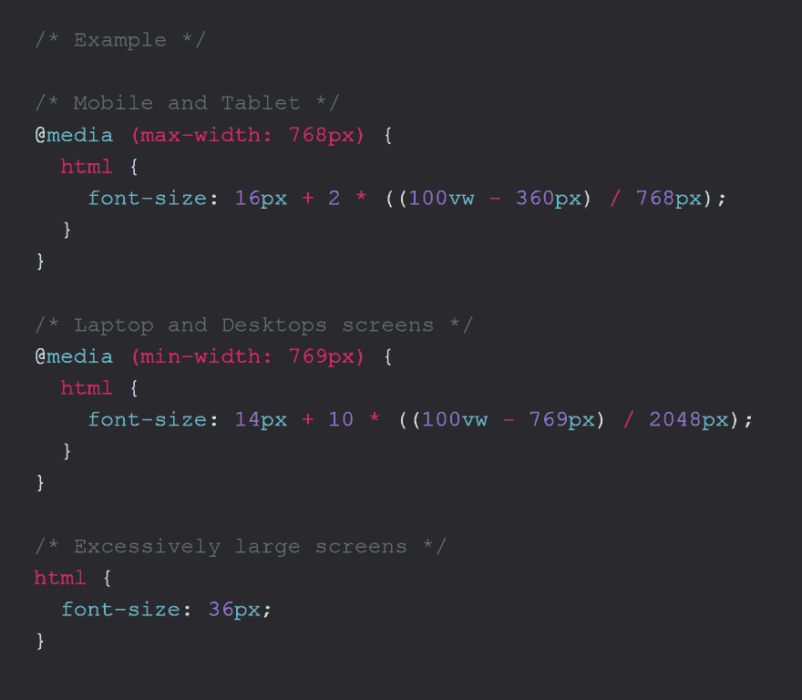

# 完全响应的 CSS 值，不仅仅是媒体查询

> 原文:[https://dev . to/promise tochi/completely-responsive-CSS-values-no-not-media-queries-d4l](https://dev.to/promisetochi/completely-responsive-css-values-no-not-media-queries-d4l)

[T2】](https://res.cloudinary.com/practicaldev/image/fetch/s--pS6V4klD--/c_limit%2Cf_auto%2Cfl_progressive%2Cq_auto%2Cw_880/https://thepracticaldev.s3.amazonaws.com/i/ix4sjoncr3e32koekywf.PNG)

本文的目标是实现一个字体大小值，它可以在浏览器窗口宽度为`769px`时从`14px`流畅地过渡到浏览器窗口宽度为`2048px`时的`24px`。

首先，让我们弄清楚响应式 DOM 元素的定义。响应式元素应该对视窗大小的变化做出响应，例如，当我缩小或增大浏览器窗口时，响应式 DOM 元素应该以某种预定义的方式做出响应。

使用 CSS3 媒体查询，我们能够在 CSS 中响应屏幕大小调整。大多数时候，这些都是在`480px`、`768px`和`769px`的断点。这些适合大多数 web 应用程序，但是如果我们能比 3、4、5 个断点更进一步呢？如果我们能够响应从超过`2048px`到`1px`的每一个 1px 浏览器的大小调整，会怎么样呢？这意味着我们可以创建 CSS 声明来响应我将浏览器窗口从`2048px`缩小到`2047px`，响应每一个`1px`到`0px`的变化。

多亏了 CSS3 `calc`函数和视口单元(vh，vw)，我们才能实现这个功能。

> calc 函数允许您在指定 CSS 属性值时执行计算
> 
> 视口单位表示为网页可见区域的百分比。这是整个浏览器窗口，不包括地址栏、滚动条、标签等。

幸运的是，从 IE9 开始，calc 和 viewport 都支持浏览器。

```
html {
  font-size: 1vh;
} 
```

<svg width="20px" height="20px" viewBox="0 0 24 24" class="highlight-action crayons-icon highlight-action--fullscreen-on"><title>Enter fullscreen mode</title></svg> <svg width="20px" height="20px" viewBox="0 0 24 24" class="highlight-action crayons-icon highlight-action--fullscreen-off"><title>Exit fullscreen mode</title></svg>

在上面的代码片段中，如果浏览器宽度减去滚动条是`1800px`，字体大小将是`18px`，也就是 1800 的 1%。没关系，但是在`800px`屏幕上，字体大小会是`8px`😮。这不是我们想要的。

多亏了`calc`函数的一些巧妙计算，我们可以克服这个问题。

如果你写过 Javascript 或者其他合适的编程语言，你很有可能会遇到下面的数学表达式，如果你没有，我试着在下面解释一下。

```
(Math.random() * (769 - 2048) + 769) 
```

<svg width="20px" height="20px" viewBox="0 0 24 24" class="highlight-action crayons-icon highlight-action--fullscreen-on"><title>Enter fullscreen mode</title></svg> <svg width="20px" height="20px" viewBox="0 0 24 24" class="highlight-action crayons-icon highlight-action--fullscreen-off"><title>Exit fullscreen mode</title></svg>

这是一段 Javascript 代码，它生成一个范围在 769 到 2048 之间的随机数。`Math.random()`生成一个 0 到 0.999999999999999 之间的随机数。我们得到这个数字，然后乘以 2048 和 769 之差，也就是 1279。这确保了`random number*(1279+769)`，总是返回一个介于 769 和 2048 之间的值。你可以自己试试，`0*(1279)+769`是 769，`0.99*(1279)+769`给你 2035.21。

所以我们有了进一步计算的基础。

* * *

在我们的例子中，我们希望字体大小在范围`14px`到`24px`内，所以我们的范围是 10px，14px 是我们的基数。我们要的是生成一个 0 到 0.99999999999 之间的随机数，乘以 10 再加到 14。因此，`0*10+14`是 14，`0.9999*10+14`是 23.9999，但是我们无法在 CSS 中访问 Javascript 的 Math.random。那么我们如何生成我们需要的随机数呢？

让我们看看我们有什么。有了 VW 视口单元，我们可以用`100vw`动态访问窗口的宽度。所以在`1366px`屏幕上的`100vw`是`1366px`，在`1560px`屏幕上也是`1560px`，不需要我们硬编码具体的像素值。

有了我们的目标最小屏幕宽度(769px)、最大屏幕宽度(2048px)和动态计算的屏幕宽度(100vw)，我们就有了生成从 0 到 0.9999999999 的随机数所需的工具。通过简单地做`(100vw — 769px)/2048px`，我们可以根据 100vw 的值生成从 0 向上的任何值。因此，如果用户的视窗宽度为 1800 像素，浏览器会将`(100vw — 769px)/2048px`计算为`(1800px — 769px)/2048px`，结果为 0.50341796875。耶，我们有随机数了。我们现在可以将 0.50341796875 乘以 10(还记得我们的范围吗？)，结果就是 5.0341796875。最后一步是将 5.0341796875 加到 14px `5.0341796875`上，这将为具有`1800px`视窗宽度的用户产生一个`19.0341796875px`字体大小。

最终公式可以写成，

```
html {
  font-size: minimumPixel + range * ((viewportWidth - minScreenWidth) / maxScreenWidth)
}

/* Example */

html {
  font-size: calc(14px + 10 * ((100vw - 769px) / 2048));
} 
```

<svg width="20px" height="20px" viewBox="0 0 24 24" class="highlight-action crayons-icon highlight-action--fullscreen-on"><title>Enter fullscreen mode</title></svg> <svg width="20px" height="20px" viewBox="0 0 24 24" class="highlight-action crayons-icon highlight-action--fullscreen-off"><title>Exit fullscreen mode</title></svg>

因此，我们可以动态地为用户提供从`14px`到`24px`的更合适的范围，而不是为`769px`到`2048px`之间的所有视窗宽度提供相同的字体宽度，通常是`18px`。

这可以与媒体查询相结合，以实现尽可能高的响应度

```
/* Example */

/* Mobile and Tablet */
@media (max-width: 768px) { 
  html {
    font-size: calc(16px + 2 * ((100vw - 360px) / 768));
  }
}

/* Laptop and Desktops screens */
@media (min-width: 769px) {
  html {
    font-size: calc(14px + 10 * ((100vw - 769px) / 2048));
  }
}

/* Excessively large screens */
html {
  font-size: 36px;
} 
```

<svg width="20px" height="20px" viewBox="0 0 24 24" class="highlight-action crayons-icon highlight-action--fullscreen-on"><title>Enter fullscreen mode</title></svg> <svg width="20px" height="20px" viewBox="0 0 24 24" class="highlight-action crayons-icon highlight-action--fullscreen-off"><title>Exit fullscreen mode</title></svg>

这不仅可以应用于字体大小，它还可以用于创建填充、边距、宽度，随着视口宽度的增加和减少而拉伸和挤压。

我希望你喜欢这篇文章，希望你会在你的项目中更多地使用这种技术。